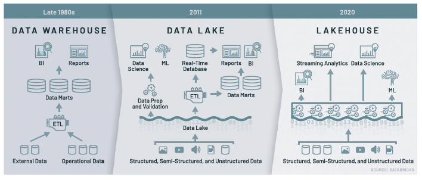

# Chapter 2: Explaining the Concept of a Lakehouse

- New systems are beginning to emerge in the industry that address the limitations with and complexity of the two different stacks for business intelligence (BI) (data warehouses) and machine learning (ML) (data lakes). A lakehouse is a new architecture that combines the best elements of data lakes and data warehouses.

## Sorting Out the Concept of a Lakehouse

- A lakehouse is a new DM architecture that enables users to do everything from BI, SQL analytics, data science, and ML on a single platform.

#### Challenges of data lakes

1. **_Appending data is hard_**: Users want their changes to appear all at once. However, appending new data into the data lake while also trying to read it causes data consistency issues.

2. **_Modification of existing data is difficult_**: You need to be able to modify and delete specific records, especially with GDPR and CCPA. Unfortunately, it takes a rewrite of petabytes on the data lake to make specific changes.

3. **_Jobs failing mid-way_**: Job failures usually go undetected for weeks or months and aren’t discovered until later when you’re trying to access the data and find that some of it’s missing.

4. **_Real-time operations are hard_**: Combining real-time operations and batch leads to inconsistencies because data lakes don’t support transactions.

5. **_It’s costly to keep historical data versions_**: Regulated organizations need to keep many versions of their data fo auditing and governance reasons. They manually make a lot of copies of the data, which is time intensive and costly.

6. **_Data lakes make it difficult to handle large metadata_**: If you have petabytes of data in the data lake, then the metadata itself becomes gigabytes and most data catalogs can’t support those sizes.

7. **_You have “too many files” problems_**: Because data lakes are file-based, you can end up with millions of tiny files or a few gigantic files. In either case, this impacts performance negatively.

8. **_Data lakes perform poorly_**: It’s hard to get great performance with big data. You have to use a number of manual techniques like partitioning that are error-prone.

9. **_You may have data quality issues_**: All the challenges eventually lead to data quality issues. It becomes harder to ensure that your data is correct and clean.

#### Lakehouse Attributes

- The lakehouse takes an opinionated approach to building data
lakes by adding data warehousing attributes

1. **_ACID transactions_**:
    
    - Every operation is transactional. This means that every operation either fully succeeds or aborts. When aborted, it’s logged, and any residue is cleaned so you can retry later.

    - Modification of existing data is possible because transactions allow you to do **_fine-grained updates_**.

    - Real-time operations are consistent, and the historical data versions are automatically stored.

    - The lakehouse also provides snapshots of data to allow developers to easily access and revert to earlier versions for audits, rollbacks, or experiment reproductions.

2. **_Handling large metadata_**:
    - Lakehouse architecture treats metadata just like data, leveraging Apache Spark’s distributed processing power to handle all its metadata. 
    - As a result, it can handle petabyte-scale tables with billions of partitions and files with ease.

3. **_Indexing_**: 
    - Along with data partitioning, lakehouse architecture includes various statistical techniques like bloom filters and data skipping to avoid reading big portions of the data altogether, and therefore deliver massive speed ups.

4. **_Schema validation_**: 
    - All your data that goes into a table must adhere strictly to a defined schema. If data doesn’t satisfy the schema, it’s moved into a quarantine where you can examine it later and resolve the issues.

- 