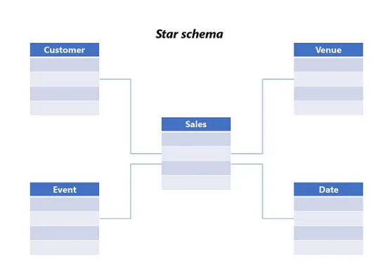
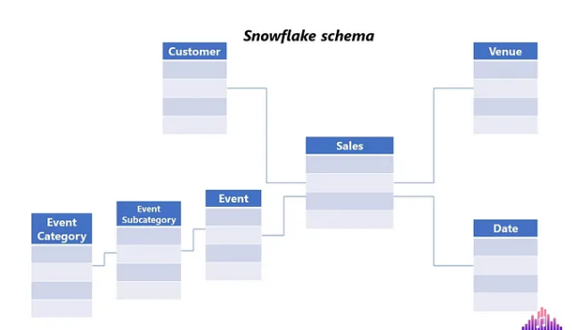

# Dimensional Data Modeling

#### History Lessons — Ralph Kimball

- The Data Warehouse Toolkit: Kimball introduced a completely new approach to modeling data for analytical workloads, the so-called “bottom-up” approach. The focus is on identifying **_key business processes_** within the organization and modeling these first, before introducing additional business processes.

## 4-Step Dimensional Design Process

#### 1. Selecting the business process

#### 2. Declare the grain

- Grain refers to the lowest level of detail captured by the business process

#### 3. Identify the dimensions

- Dimension tables usually answer the questions starting with “W”: Who, What, When, Where, Why.

#### 4. Identifying the facts

- How many tickets did we sell? How much revenue did we make?

## Why Dimensional Modeling

- User-friendly data navigation 
- Performance 
- Flexibility: slowly changing dimension

## Star Schema and Snowflake Schema

#### Star Schema

- a well-designed dimensional model, you should have a central table containing all the measurements and events — this is a fact table — surrounded by lookup tables, which we refer to as dimensions. The fact table and dimension tables are connected via relationships established between the primary key from the dimension table and the foreign key from the fact table. 

- 

- Star schema is a de-facto standard for modeling data in enterprise data warehousing systems

#### Snowflake Schema

- Dimensions are normalized and broken down into sub-dimensions

- 

- normalizing dimensions comes with some serious considerations

    1. The overall data model structure becomes more complex
    2. Performance may suffer, because of the joins between normalized dimension tables

- Star schema should always be a default choice

## Fact Tables

#### Fact table structure

- a fact table will consist of the numeric values produced by measuring the event from the real world, and a bunch of foreign keys of related dimension tables. 

- Fact tables are usually narrow and long (huge number of rows and less number of columns)

#### Additive, Semi-additive and Non-additive measures 

- Additive measures are the most flexible and can be summed across any of the dimensions associated with the fact table. 

- Semi-additive measures can be summed across some dimensions, but not all. A typical example is balance amounts which are additive across all dimensions except time.

- Non-additive,some measures are completely non-additive, like ratios for example

#### NULLs in fact tables

- Using NULLs as foreign keys in the fact table should be avoided at all costs, because this will cause referential integrity violation

## Dimmension Tables

#### Dimension table structure

- Dimension tables are usually wide and short (many columns, less number of rows, although there are dimensions with multimillion rows)

- Dimension tables are denormalized, containing usually text attributes and descriptions

#### Slowly changing dimension (SCD) 

- Kimball lists no less than 8 different SCD types! However, the most commonly used type is Type 2, where you’d add a new row in the dimension table and update the row validity attribute

#### Role-playing dimensions

