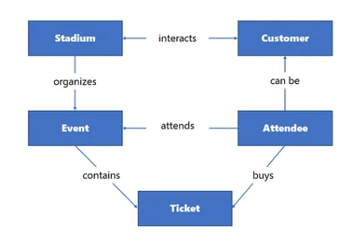
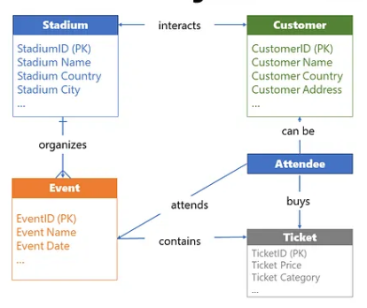

# Relational Data Modeling

## Entity, Attribute, and Relationship

#### Entity

- In data modeling, an entity is a real-world object or concept that can be uniquely identified and described.

- An entity is typically represented by a table in a relational database, and each instance of the entity is represented by a row in the table.

#### Attribute

- An attribute is a characteristic or property of an entity, such as a name, age, address, or color. 

- Attributes are represented by columns in the table that represents the entity.

#### Relationship

- A relationship is a connection or association between two or more entities.

- Relationships can be one-to-one, one-to-many, or many-to-many.

    1. one-to-one relationship: each instance of an entity is associated with exactly one instance of another entity, and vice versa.

    2. one-to-many relationship: an instance of an entity is associated with one or more instances of another entity, but each instance of the other entity is associated with only one instance of the first entity.

    3. many-to-many relationship: each instance of an entity can be associated with one or more instances of another entity, and vice versas

## Types of Data Models

#### Conceptual Data Model

- The conceptual data model is a **_high-level representation_** of the data entities and their relationships. 

- This type of data model is focused on business concepts and is independent of any specific database technology.

- The main purpose of a conceptual data model is to simplify business processes and entities important in day-to-day business workflow.

- the big picture: what are the key entities in our business workflow? How do they correlate with each other? 

- 

#### Logical Data Model

-  In this stage, you should identify all the attributes of interest for the specific entity, as well as relationship cardinality.

- Steps to envolve conceptual data model to logical data model

    1. Identify entity attributes
    2. Identify candidates keys: find out which attribute, or set of attributes, uniquely identify a specific entity
    3. Choose primary keys: based on the findings from the previous step, set the primary key of the entity
    4. Apply normalization/denormalization to the data model. Normalization should eliminate data redundancy and is typical for OLTP systems. Denormalization is predominantly used in analytical systems, or OLAP, to minimize the impact of JOIN operations and speed up data reading
    5. Set relationships between entities
    6. Identify the relationship cardinality: Relationship cardinality defines how many instances of one entity are related to instances of another entity. There are three main cardinality types: one-to-one (1:1) one-to-many (1:M) and many-to-many (M:M)
    7. Iterate and fine-tune: always ask for feedback from business stakeholders and, based on the feedback received, fine-tune the logical data model, before materializing it in physical form

- 

- The logical data model serves as the **_best quality assurance test_**, because it can enclose gaps and issues in understanding the business workflow. 

- One of the key characteristics of a good logical data model is that iteration and fine-tuning are continuous processes. Building a logical data model can be considered part of the agile data modeling cycle, which ensures more robust, scalable, and future-proof models.

- It serves as a blueprint for the final implementation of the business logic through the physical data model

#### Physical Data Model

- A physical data model represents that final touch — how the data model will be implemented in the specific database.

- Physical implementation requires defining low-level detail that may be specific for the certain database provider

- Steps

    1. Choose the platform 
    2. Translate logical entities into physical tables
    3. Establish relationships
    4. Apply normalization/denormalization
    5. Define table constraints: data integrity, logical checks
    6. Create indexes and/or partitions
    7. Extend with programmatic objects: programmatic objects, such as stored procedures, functions, or triggers
