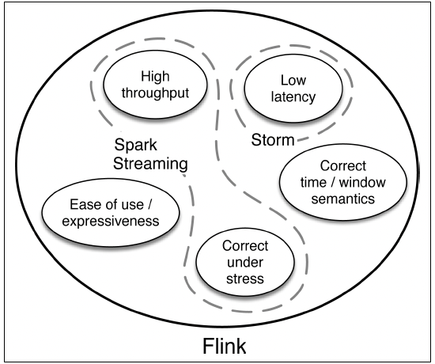
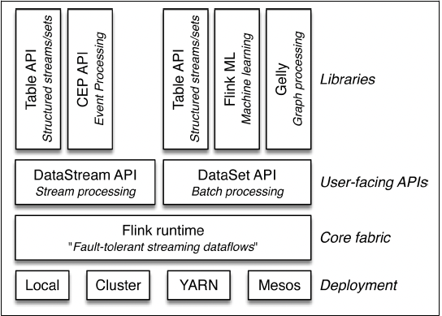

# Chapter 1: Why Apache Flink

- Flink provides stream processing for large volume data, and it also lets yoy handle batch analytics,
with one technology.

## Consequences of Not Doing Streaming Well

#### Retail and Marketing:

- sales are often represented by clicks from a website. this data may arrive at large scale, continuously but not evenly. building batch systems to handle this dataflows is challenging. the result can be dropped data, delays, or misaggregated results.
- airline passengers services face the challenge of handling huge amounts of data from many sources that must be quickly and accurately coordinated.
- building real-time recommendation systems to react to what people are buying right now.

#### The Internet of Things

- the internet of things is an area where streaming data is common and where low-latency data delivery and processing, along accuracy of data analysis, is critical. sensors in various types of equipment take frequent measurements and stream those to data centers where real-time or near real-time processing applications will update dashboards, run machine learning models, issue alerts, and provide feedback for many different services.

#### Bank and Financial Sector

- transactions and reporting must happen quickly and accurately. fraud detection for credit card transactions requires timely monotoring and response.

## Goals for Processing Continuous Event Data

- a wishlist for stream processing not only includes **high throughput** with **low latency**, but the processing system also needs to be able to deal with interruptions. A great streaming technology should be able to restart after a failure in a manner that produces accurate results. In other words, there is an advantage of being **fault-tolerant with exactly-once guarantees**.

- the method used to achieve this level of fault tolerance **should not carry a lot of overhead cost** in the absense of failure.

- it is important for such a system to be **easy for developers to use**, both in writing code and in fixing bugs.

- these systems should produce correct results with respect to **the time that events happend in the real world**. For example, being able to handle streams of events that arrive out of order, and being able to deterministically **replace streams** (for auditing and debugging purposes).

## Evolution of Stream Processing Technologies

- Apache Storm: Storm brought the possibility for stream processing with very low latency, but this real-time processing involved trade off: high throughput was hard to achieve, and storm did not provide the level of correctedness that is often needed. it did not have exactly-once guarantees for maintaining accurate state.  

- To compute values that depends on multiple streaming events, it is necessary to retain data from one event to another. The retained data is known as the state of computation. Accurate handling od state is essential for consistency in computation. The ability to accurately update state after a failure or interruption is a key to fault tolerance.

- Apache Spark Streaming: with micro-batching, you can achiebe exactly-once guarantees of state consistency. If a micro-batch job fails, it can be rerun. However, the time that a periodic batch job takes to finish is tightly coupled with the timing of data arrival, and any delays can cause inconsistent results.

- 

## First Look at Apache Flink

- Apache Flink is an open source platform for distributed stream and batch data processing. flink not only provides real-time streaming with high throughput and exactly-once guarantee, but it is also a engine for batch data processing. flink means fast and agile in German

#### Batch and Stream Processing

- the core computational fabric of Flink, labeled 'flink runtime', is a distributed system that accepts streaming dataflow programs and executes them in a fault-tolerant manner in one or more machines. This runtime can run in a cluster, as an application of YARN or within a single machine.

- 

- the diagram depicts the key components of the flink stack. the user-interface layer includes APIs for both stream and batch processing. libraries include machine learning (flinkml), complex event processing (cep), and graph processing (gelly), as well as table api for stream and batch mode.

- datastream api for stream processing. it is a fluent api for defining analytics on possibly infinite data streams. dataset api is for batch processing.

- flink is distributed in the sense that it can run on hundreds or thousands of machines, distributing a large computation in small chunks, with each machine executing one chunk. 

- flink handles many issues of concern, such exactly-once guarantees and data windows based on event time, developers no longer need to accommodate these in the application layer.