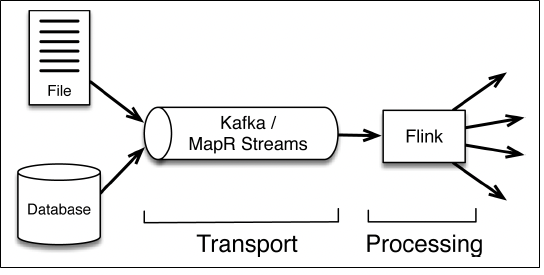
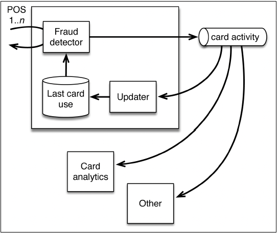

# Chapter 2: Stream-First Architecture

- there is a revolution underway in how people design their data architecture, not just for real-time or near real-time projects, but in a larger sense as well. The change is to think of **_stream-based data flow_** as the heart of the overall design, rather than the basis just for specialized work.

## Traditional Architecture versus Streaming Architecture

- the typical architecture of a data backend has employed a centralized database system to hold the transactional data of the business. some of the main problems that companies have observed are:

    1. the pipeline from data ingestion to analytics is too complex and slow for many projects.
    2. the traditional architecture is too monolithic: the database backend acts as a single source of truth. all applications need to access this backend for their data needs.
    3. system built this way have very complex failure modes that can make it hard to keep them running well.
    4. tying to main the current 'state of the world" consistently across a large, distributed system becomes harder and harder. stream-first architectures allow us to relax the requirements so that we only need to maintain much more localized consistency.

- streaming architecture solves many problems that the enterprises face when working with large-scale systems. In a stream-based design, we take this a step further and let data records continuously flow from data sources to applications and between applications.

- in this stream-first architecture, applications themselves build their local views of the world, stored in local databases, distributed files, or search documents, for instance.

## Message Transport and Message Processing

- two main kinds of components to implement an effective stream-first architecture.

    1. a **_message transport_**: to collect and deliver data from continuous events from a variety of sources (producers) and make this data available to applications and services that subscribe to it (consumers)
    2. a **s_tream processing system_**: to (1) consistently move data between applications and systems. (2) aggregate and process events. (3) maintain local application state.

        

## The Transport Layer: Ideal Capabilities

#### Performance with Persistence

- one of the roles of the transport layer is to serve as a safty qeueue upstream from the processing step - a buffer to hold event data as  a kind of short-term insurance against an interruption in processing as data is ingested. until recently, message-passing technologies were limited by a tradeoff between performance and persistence. as a result, people tended to think of streaming data going from the transport layer to processing and then being discarded: a use it and lose it approach.

- it is importance to have a message transport that delivers **_high throughput with persistence_**. a key benefit of a persistent transport layer is that messages are **_replayable_**. this key capability allows a data processor like Flink to replay and recompute a specified part of the stream of events.

- for now, the key is to recognize it is the interplay of transport and processing that allows a system like flink to provide guarantees about correct processing and to do "time travel", which refer to the ability to reprocess data.

#### Decoupling of Multiple Producers from Multiple Consumers

-  data soures push data to the message queue, and consumers pull data. event data can only be read forward from a given offset in the message queue. Producers do not broadcast to all consumers automatically.

    

- with message-transport tools such as kafka and mapR streams, data producers and data consumers are decoupled. messages arrive ready for immediate use or to be consumed later. 

- consumers subscribing to their topics of interest means that message arrive immediately, but they do not need to be processed immediately.

- having a message-transport system that decouples producers from consumers is powerful because it can support a **_microservices approach_** and allows processing steps to hide their implementations. 

## Streaming Data for a Microservices Architecture

- a microservices approach refers to breaking functions in large systems into simple, generally single-purpose services that can be built and maintained easily by small teams.

#### Data Stream as the Centralized Source of Data

- the stream processor subscribes to data from the message transport queue and processes it. the output can go to another message transport queue. the output can go to another message transport queue.

    

- in a stream-first architecture, the message stream (represented here as blank horizontal cylinder) connects applications and serves as the new shared source of truth, taking the role that a huge centralized database used to do. In our example, flink is used for various applications. localized views can be stored in files or databases as needed for the requirements of microservices-based projects.

- in the streaming architecture, there need not be a centralized database. the message queues serve as a shared information source for a variety of different consumers.

#### Fraud Detection Use Case: Better Design with Stream-First Architecture

- many point-of-sale terminals ask the fraud detector to make fraud decision. these requests from the point-of-sale terminals need to be answered immediately and form a call-and-response kind of interaction with the fraud detector. 

- 

- fraud detection can benefit from a stream-based microservice approach. flink would be useful in several components of this data flow: the fraud-detector application, the updator, and even the card analytics could all use flink.

## Beyond Real-Time Appications

- other users could take advantage of the fact that the persisted messages can be replayed. the message stream acts as an auditable log or long-term history of events. 

- having a replayable history is useful. for example, for security analytics, as a part of the input data for predictive maintenance models in industrial settings, or for retrospective studies as in medical or environmental research.

- for other uses, the data queue is tapped for applications that update a local database or search document.

## Geo-Distributed Replication of Streams

- a wide variety of these critical business uses depend on consistency across data centers, they not only require a high effective stream processor, but also message transport with reliable geo-distributed replication.

- replication between data centers needs to preserve message offsets to allow updates from any of the data centers to be propagated to any of the other data centers and allow bidirectional and cyclic replicaiton of data.

- in ad-tech, the real-time application might involve up-to-date inventory control, the current-state view in a database might be cookie profile, and replaying the stream would be useful in models to detect clickstream fraud.

- in addition to keeping the different parts of the business up to date with regard to shared inventory, the ability to replicate data streams across data centers has other advantages. having more than one data center helps spread the load for high volume and decreases propagation delay by moving computation close to end users during bidding and ad placement. multiple data centers also serve as back-ups in case of disaster.