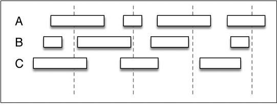
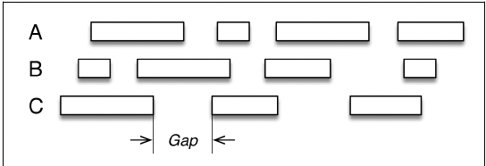

# Chapter 3 What Flink Does

## Different Types of Correctness

#### Natural Fit for Sessions

- one way in which streaming in general and flink in particular offers correctness is through a more natural fit between the way computational windows are defined and how data naturally occurs.

- what is the match between naturally occuring web sessions and your computational window?

- 

- with micro-batching, it is difficult to define computation window (marked by dashed lines) such that they do not overlap naturally occuring sessions of activities for users a, b, c.

- the micro-batching window is an externally defined interval that may make it difficult to align with actual sessions of activity.

- 

- flink's stream processing let you define windows such that they have a better fit to how sessions naturally occur.

#### Event Time

- event time versus processing time: **_event time_** is the time clock that is based on when an event actually happened. **_processing time_** reflects an internal clock in the system and denotes a particular point at which a streaming event is handled by the program.

- the separation of different types of time in Flink is part of what makes it able to do more than older streaming systems.

#### Accuracy Under Failure: Keeping Track of State

- to maintain accuracy, a computation must keep track of state. if it is not done by the computational framework, the task falls to the developer and application to do it. To do this is especially hard with continuous stream processing, there is no end point at which you stop and tally up.

- the underlying technology that flink uses to address this challenge is called **_checkpoints_**. checkpoints enable fault tolerance by keeping track of intermediate conditions of state such that the system can be accurately reset if there is a failure.

- checkpoints are also what support flink's ability to reprocess data when you choose to do so, not just in the case of a failure.