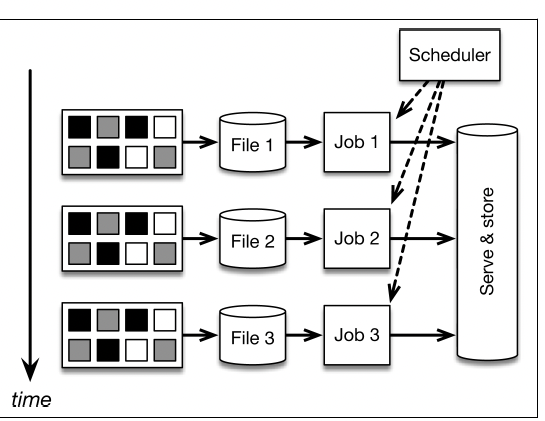
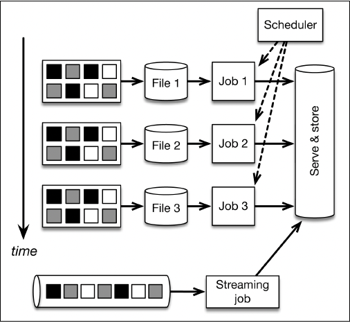
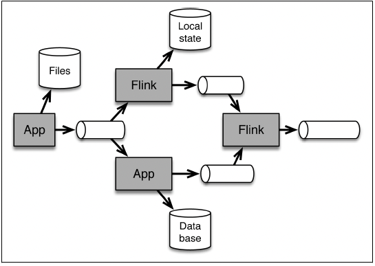
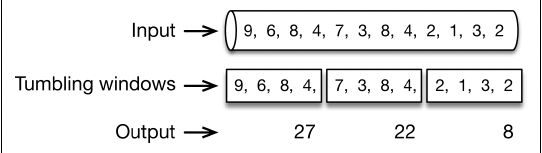
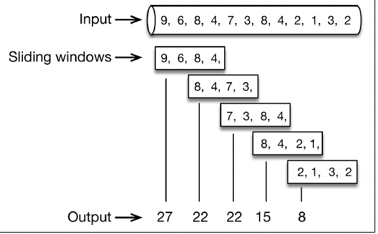

# Chapter 4: Handeling Time

- one crucial difference between programming applications for a stream processor and a batch processor is the need to **_explicitly handle time_**.

## Counting with Batch and Lambda Architectures

- 

- implementing continuous applications using periodic batch jobs. Data is continuously sliced into files, possibly on an hourly basis. and batch jobs are run with these files as input, giving an impression of a continuous processing of incoming data.

- in this architecture, a continuous data ingestion pipeline creates files (typically stored on hdfs) every hour. This can be done by using a tool like Apache Flume. A batch job is scheduled by a scheduler to analyze the last file produced - grouping the events in the file by key, and counting distinct events by key  - to output the last counts.

- there are several problems with this architecture:
    1. too many moving parts: we are using a lot of systems to count events in our incoming data.
    2. implicit treatment of time:
    3. early alerts: suppose we want to get early count alerts as soon as possible in addition to counting every one hour. we can use Storm to ingest the message stream in addition to the periodic batch jobs. 
    
    
        implementing continuous applications using periodic batch jobs and early results using a stream processor (Lambda architecture). the stream processor is used to provide approximate but real-time results, which are eventually corrected by the batch layer. 

    4. out of order events: in most real-world streams, the order that the events occur is different from the order in which the events are observed in the data center.

    5. unclear batch boundaries: assume that we would like to produce aggregates, not for simple hourly batches, but instead for sessions of activity. there is no straightforward way to do this with the architecture. 

## Counting with Streaming Architectures

- 
- implementing continuous applications using a streaming architecture. the message transport is shown here as a horizontal cylinder. it supplies streaming data to the stream processor that is used for all data processing, providing both real-time results and correct results. 
- slowdowns in the flink job or throughput spikes simply pile up in the message-transport tool. The logic to divide events into timely batches (called windows) is embedded entirely in the application logic of the flink program. **_grouping by session instead of a fixed time means simply changing the window definition in the flink program._**
- additionally, **_replaying the application with changed code means simply replaying the kafka topic_**.
- by adopting a streaming architecture, we have vastly reduced the number of systems to learn, administer, and create code in. 

```Scala

DataStream<LogEvent> stream = env
    // create stream from Kafka
    .addSource(new FlinkKafkaConsumer(...))
    // group by country
    .keyBy("country")
    // window of size 1 hour
    .timeWindow(Time.minutes(60))
    // do operations per window
    .apply(new CountPerWindowFunction());

```
- two main differences:
    1. we are treating the never-ending stream of incoming events as what it actually is - a stream - rather than trying to artificially cut it into files.
    2. we are explicitely encoding the definition of time (to divide the stream into groups) in the application code (the time window above) instead of implicitly spreading its definition to ingestion, computation, and scheduling.

#### Batching in Stream Processing Systems

- batching should be used only as a mechanism to improve performance. the larger the batches, the larger the throughput a system can scale to.

- batching for performance should be completely independent of buffering for defining windows, or commits for fault tolerance, and should not be part of the API. 

- as a user of data processing systems, you should worry about whether the system can handle out-of-order streams and sessions and other misaligned windows, whether it can provide early alerts in addition to accurate aggregates, and whether it can deterministically replay past data, as well as the performance characteristics of the system (latency and throughput) and the guarantees of the system in cases of failures.

#### Notion of Time

- **_event time_**: time that an event actually happened in the real world. each event is usually associated with a timestamp that is part of the data record itself.

- **_processing time_**: time that the event is observed by the machine that is processing it. 

- **_ingestion time_**: time that the event enters the stream processing framework. data that lacks a true event time may be assigned a time, but these timestamps are simply assigned by the steam processor when it first see the event.

- event time skew: event time and processing time have a time-varying  lag.

- both notions of time are useful depending on the application. Some applications need results as fast as possible and are happy if these results are slightly inaccurate. In such cases, it is not necessary to wait for late events, and processing time semantics is a great choice. other applications need accuracy: an event should be accounted for in the time window that it actually happened. for these applications, event time semantics is usually the right choice.

- flink allows user to define windows in processing time, ingestion time, or event time, depending on the desired semantics and accuracy needs of the application.

#### Windows 

- **_windows_** are the mechanism to group and collect a bunch of events by time or some other characteristics in order to do some analysis on these events as a whole.

- **_time windows_**: time windows can be **_tumbling_** or **_sliding_**.

- 

- tumbling window of 1 minute collects the values of the last minute, and emits their sum at the end of the minute.

```Scala
stream.timeWindow(Time.minutes(1))
```

- 

- sliding window of 1 minute that slides every half minute counts the values of the last minute, emitting the count every half minute.

```Scala
stream.timeWindow(Time.minutes(1), Time.seconds(30))
```

- **_count window_**: we are grouping elements based on their counts instead of timestamps. above tumbling and sliding windows can be defined as

```Scala
stream.countWindow(4)
stream.countWindow(4, 2)
```

- **_session window_**: a session is a period of activity that is preceded and followed by a period of inactivity. session windows in flink are specified using a **_timeout_**. this basically specifies how long we want to wait until we believe that a session has ended.

```Scala
stream.window(SessionWindows.withGap(Time.minutes(5)))
```

- **_triggers_** control when the results are made available. in other words, when the content of a window will be aggregated and returned to the user.

- **_implementation of windows_**:

    1. the window mechanism is completely separate from the checkpointing mechanism. one can define windows without a duration.

    2. advanced users can directly use the underlying mechanism to define more elaborate forms of windows. for instance, time windows that also produce an intermediate results based on count.

#### Time Travel

- an aspect central to the streaming architecture is **_time travel_**. time travel means rewinding the stream to some time in the past and restarting the processing from there, eventually catching up with the present. 

- To be able to travel back in time and reprocess the data correctly, the stream processsor needs to support event time. 

- event time makes processing deterministic by guaranteeing that running the same application on the same stream will yield the same results. 

#### Watermarks

- when computation is based on event time, how do we know that all events have arrived? in other words, how do we keep track of event time and know that a certain event time has been reached in the input stream?

- consider the 1 minute tumbling window. assume that the first window starts at 10:00 and needs to sum up all values from 10:00 to 10:01. how do we know that the time is 10:01 when time is part of the records themselves? in other words, how do we know that an element with timestamp 10:00:59 will not arrive?

- flink achieves this via watermarks, a mechanism to advance event time. watermarks are regular records embedded in the stream that, based on event time, inform computations that a certain time has been reached.

- when the window received a watermark with a time marker greater than 10:01:00, it knows that no further records with a timestamp greater than the marker will occur. all events with time less than or equal to the timestamp have already occurred.

- how watermarks are generated:

    1. **_a perfect watermark_**: no event will ever arrive after a watermark with an event time from before the watermark.

    2. **_a heuristic watermark_**: an estimate of the time progress, but can sometimes be wrong, meaning that some late events can come after the watermark that promised they would not come.

    3. domain knowledge is used to specify a watermark. we may know that our events might be late, but cannot possibly be more than five seconds late, which means that we can emit a watermark the largest timestamp seen, minus five seconds. a different flink job may monitor the stream and construct a model for generating watermarks, learning from lateness of the events as they arrive.

- watermarks are the only mechanism that requires us to deal with out-of-order data and to bound the correctness of our results.


