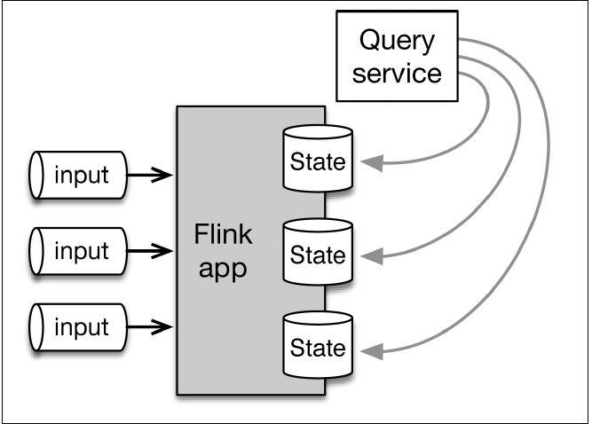
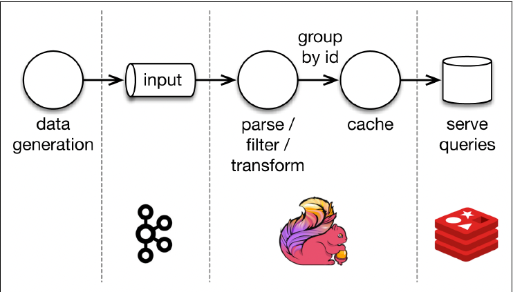
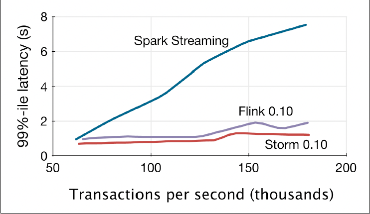
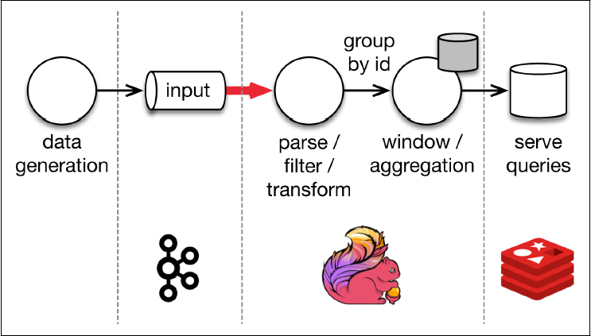
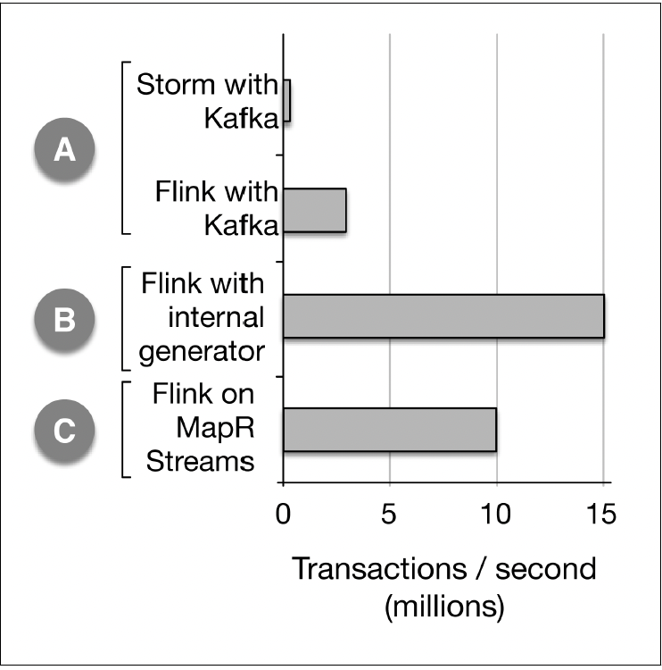
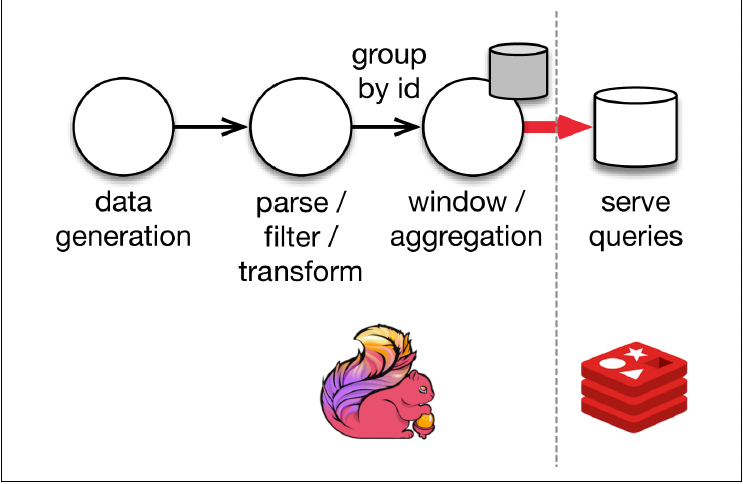
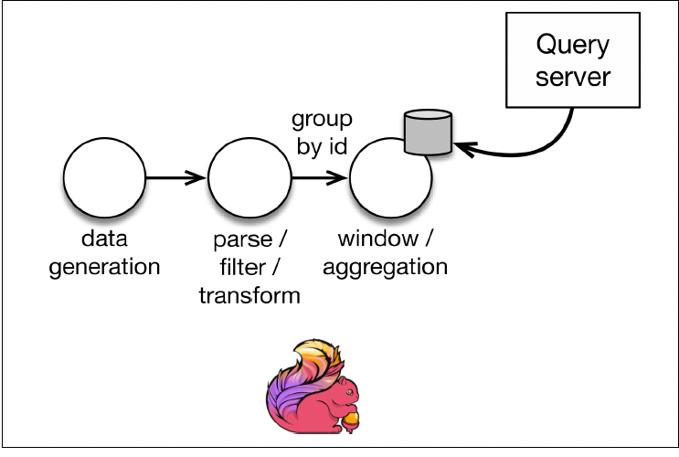

# Chapter 5: Stateful Computation

#### Stateful & Stateless

- a stateless program looks at each individual event and creates some output based on the last event. for example, a streaming program might receive temperature readings from a sensor and raise an alert if the temperature goes beyond 90 degrees. 

- a stateful program maintains state that is updated based on every input and produces output based on the last input and the current value of the state.

- 

## Notion of Consistency

- consistency is a different word for **_"level of correctness"_**. how correct are my results after a failure and a successful recovery compared to what I would have gotten without any failure.

    1. **_at most once_**: no correctness guarantees. the count may be lost after a failure.
    2. **_at least once_**: the count value may be bigger than but never smaller than the correct ouput.
    3. **_exactly once_**: exactly once means that the system guarantees that the count will be exactly the same as it would be in the failure-free scenario.

- the first solutions that provided exactly once came at a substantial cost in terms of performance and expresiveness. in order to guarantee exactly once beahvaior, these systems do not apply the application logic to each record separately, but instead process several (a batch of) records at a time, guaranteeing that either the processing of each batch will succeed as a whole or not at all. For this reason, users were often left having to use two stream processing frameworks together (one for exactly once and one for per-element, low-latency processing), resulting in even more complexity in the infrastructure.

- one significant value that flink has brought to the industry is that it is able to provide exactly once guarantees, low-latency processing, and high throughput all at once.

## Flink Checkpoints: Guaranteeing Exactly Once

- flink makes use of a feature known as "checkpoint". the role of flink checkpoints is to guarantee correct state, even after a program interruption.

```scala
val stream: DataStream[(String, Int)] = ...
val count: DataStream[(String, Int)] = stream
    .keyBy(record => record._1)
    .mapWithState((in: (String, Int), count: Option[Int])=>
    count match {
        case Some(c) => ((in._1, c + in._2), some(c + in._2))
        case None => ((in._1, in._2, some(in._2)))
    })
```

- there are two operations in the program: the **_keyBy_** operator groups the incoming records by the first element (a string), repartitions the data based on that key, and forwards the records to the next operator: the **_stateful map_** operator. The map operator receives each element, advances the count by adding up the second field of the input record to the current count.

- 

- starting condition for the program. Note that initial state for record groups a, b, and c is zero in each case, shown as values on the three cylinders. Checkpoint barriers are shown as black 'ckpt' records. each record is strictly before or after a checkpoint in sequence of processsing.

- 

- when a flink data source encounters a checkpoint barrier, it records the position of the barrier in the input stream to stable storage. This will allow flink to later restart the input from that position.

- 

- at this point, the positions of the checkpoint barriers in the input stream have already been backed up in stable storage. the map operators are now processing the checkpoint barriers, triggering an asynchronous backup of their state in stable storage.

- 

- consider the situation, with the checkpoint having successfully completed and a failure occurring right after the checkpoint.

- 

- flink will restart the topology (possibly acquiring new execution resources), rewind the input stream to the positions registered in the last checkpoint, and restore the state values and continue execution from there. in the example, it means that records ("a", 2), ("a", 2), ("c", 2) will be replayed.

- 

- the algorithm used for checkpointing in flink is formally called **_Asynchronous Barrier Snapshotting_**.

## Savepoints: Versioning State

- flink users also have a way to consciously manage versions of state through a feature called **_savepoints_**.

- a savepoint is taken in exactly the same way as a checkpoint but is triggered manually by the user. you can think of savepoints as snapshots of a job at a certain time.

- another way to think about savepoints is saving versions of the application state at well-defined times.

- 
- here we have a running version of an application (version 0) and took a savepoint of our application at time t1 and a savepoint at t2.

- we are able to start a modified version of a program from a savepoint.

- 

- we have both version 0 and version 0.1 of the programs running at the same time while taking subsequent savepoints to both versions at later times.

- savepoints used to solve a variety of production issues

    1. application code upgrades
    2. flink version upgrades
    3. maintenance and migration
    4. what-if simulations
    5. a/b testing

## End-to-End Consistency and the Stream Processor as a Database
 

- 

- application architecture consisting of a stateful flink application consuming data from a message queue and writing data to an output system used for querying. the callout shows what goes on inside the flink application.

- a partitioned storage system (eg. a message queue such Kafka or MapR streams) serves as the data input. the flink topology consists of three operators: the data source reads data from the input, partitions it by key, and routes records to instances of the stateful operations, which can be a mapWithState as we saw in the previous section, a window aggregation. This operator writes the contents of the state or some derivative results to a sink, which transfers these to a **_partitioned storage system that serves as output storage_**. a query service then allows users to query the state.

 - how can we transfer the contents of the state to the output with exactly once guarantee? (end-to-end exactly once)

    1. the first way is to buffer all output at the sink and commit this atomically when the sink receives a checkpoint record. this method ensures that the output storage system **_only contains results that are guaranteed to be consistent and that duplicates will never be visible_**. for this to work, the output storage system needs to provide the ability to atomically commit.

    2. the second way is to eagerly write data into the output,keeping in mind that some of this data might be dirty and replayed after a failure. if there is a failure, then we need to roll back the output, in addition to the input and the flink job, thus **_overwriting the dirty data and effecitvely deleting dirty data that has already been written to the output._**

    - note that these two alternatives correspond exactly to two well-known levels of isolation in relationship database systems: **_read committed_** and **_read uncommitted_**. read committed guarantees that all reads will read committed data and no intermediate, in-flight, or dirty data. read uncommitted does allow dirty reads; in other words, the queries always see the latest version of data as it is being processed.

- flink together with the corresponding connector can provide exactly once guarantees end-to-end with a variety of isolation levels.

- one reason for the output storage system here is that the state inside flink is not accessible to the outside world in this example. however, if we would be able to query the state in the **_stateful operator_**, we might not even need to have an output system in certain situations where the state contains all the information needed for the query.

- 

- simplified application architecture using flink's **_queryable state_**. for those cases when the state is all the information that is needed, querying the state directly can improve performance.

## Flink Performance: the Yahoo! Streaming Benchmark

#### Original Application with the Yahoo! Streaming Benchmark

- in 2015, Yahoo! benchmarking Apache Storm, Apache Flink, and Apache Spark. the application consumes ad impressions from Apache Kafka, looks up which ad campaign the ad correspond to from redis, and computes the number of ad views in each 10-second window, grouped by campaign. The final results of the 10-second windows are written to Redis for storage, and the statuses of those windows are also written to redis every second in order for uses to able to query them in real time.

- because storm was a stateless stream processor, the flink job was also written in a stateless fasion, with all state being stored in redis.

- 

- 
- x-axis is throughput in thousands of events per second, and the y-axis is the 99% end-to-end latency.

- spark streaming suffered from a throughput-latency tradeoff. as batch increases in size, latency also increases. storm and flink can both sustain low latency as throughput increases.

#### First Modification: Using Flink State

- the original benchmark focused on measuring end-to-end latency at relatively low throughput, and did not focus on implementing these applications in a fault-tolerant manner.

- the first change was to implement the flink application with state fault tolerance.

- 

- with this change, the application can sustain a throughput of 3 million events per second and has exactly once guarantees. the application is now bottlenecked on the connection between the flink cluster and the kafka cluster.

#### Second Modification: Increase Volume Through Improved Data Generator

- the second step in extending the benchmark to test velocity was to scale up the volume of the input stream by writing a data generator that can produce millions of events per second.

- 

#### Third Modification: Dealing with Network Bottleneck

- eliminating the network bottleneck by making the data generator part of the flink program makes the system able to sustain a throughput of 15 million events per second.

- 

#### Fourth Modification: Using MapR Streams

- with MapR, streaming is integrated into the platform, which allows flink to run colocated with the data generator tasks and with all data transport and thus avoiding most of the issue of network connectivity between a kafka cluster and a flink cluster.

#### Fifth Modification: Increased Cardinality and Direct Query

- the final extension of the benchmark was to increase the key cardinality (number of ad campaigns). the original benchmark had only 100 distinct keys, which were flushed every second to redis so that they could be made queryable. when the key cardinality is increased to 1 million, the overall system throughput reduces to 280,000 events per second, as the bottleneck becomes the transfer of data to redis. using an early prototype of flink's queryable state, this bottleneck disappears.

- 

-  **_overall, by avoiding streaming bottlenecks and by using flink's stateful stream processing abilities, we were able to get almost a 30x increase in throughput compared to storm while still guaranteeing exactly once processing with high availability._**

- in this chapter, we see how stateful stream processing change the rules of the game. by having checkpointed state inside stream processor, we can get correct results after failures, very high thoughput, and low latency all at the same time.

- another pros of flink is the ability to handle streaming and batch using a single technology, eliminating the need for a dedicated batch layer.
