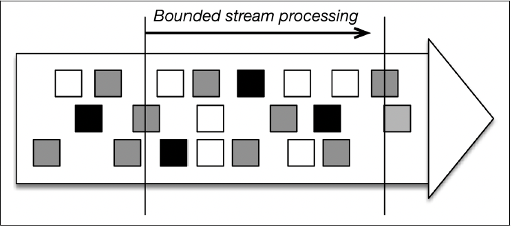
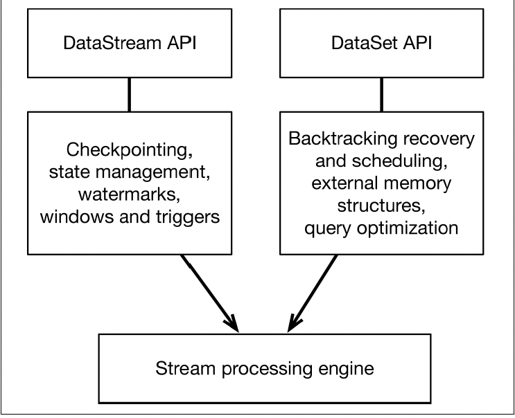
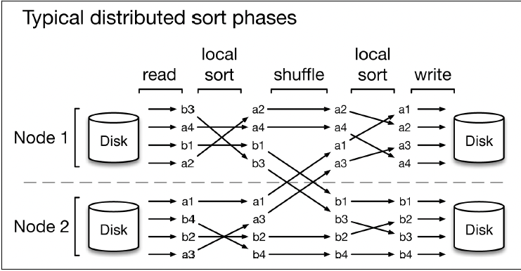

# Chapter 6: Batch Is a Special Case of Streaming

- a different style of processing is **_bounded stream processing_**, or processing data from some starting time until some end time.

- 

- batch processing: instead of defining a sliding or tumbling window over the data and producing results every time the window slides, we define a global window, with all records belonging to the same window.

- a simple flink program that counts visitors in a website every hour, grouped by region continuously:

``` scala
val counts = visits
    .keyBy('region')
    .timeWindow(Time.hours(1))
    .sum('visit')
```

- if we know that our input dataset was already bounded, we can get the equivalent of 'batch' program by writing:

```scala
val counts = visits
    .keyBy("region")
    .timeWindow(GlobalWindows.create)
    .trigger(EndOfTimeTrigger.create)
    .sum("visit")
```

- with flink, you process bounded data streams by using flink dataset api. the above program using the dataset api would look like this:

```scala
val counts = visits
    .groupBy('region')
    .sum('visits')
```

## Batch Processing Technology

- 

- the same backend is used for both bounded and unbounded data processsing.

- on top of the stream processing engine, flink overlays the following mechanisms:

    1. a checkpoint mechanism and state mechanism to ensure **_fault-tolerant, stateful processing_**.
    2. the watermark mechanism to ensure **_event-time clock_**.
    3. available windows and triggers to **_bound the computation_** and define **_when to make results available_**.

- a different code path in flink overlays different mechanisms on top of the same stream processing engine to ensure efficient batch processsing.
    1. backtracking for scheduling and recovery.
    2. special memory data structures for hashing and sorting that can partially spill data from memory to disk when needed.
    3. an optimizer that tries to trasnform the user program to an equivalent one that minimizes the time to result.

## Case Study: Flink as a Batch Processor

- in 2015, a benchmarking study comparing MapReduce, Tez, Spark, Flink at pure batch processing tasks: TeraSort and a distributed hash join.

- the first task, TeraSort, which measures the elapsed time to sort 1 terabyte of data.

- 

    1. a read phase reads the data partitions from files on HDFS.
    2. a local sort partially sorts these partitions.
    3. a shuffle phase redistributes the data by key to the processing nodes.
    4. a final sort phase produces the sorted output.
    5. a write phase writes out the sorted partitions to files HDFS.

- the second task was a distributed join between a large data set and a small data set.

- in both tasks, flink is the fastest one. the overall reason for these results is stream based, which means that the processing stage that we described above overlap more, and shuffling is piplined, which leads to **_much fewer disk accesses_**.

- in contrast, execution with mapreduce, tez, and spark is batch-based, which means that data is written to disk before it is sent over the network. in the end, this means less idle time and fewer disk accesses when using flink.