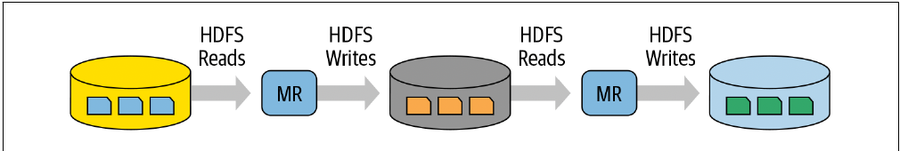
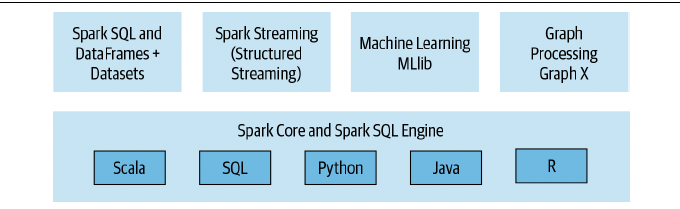
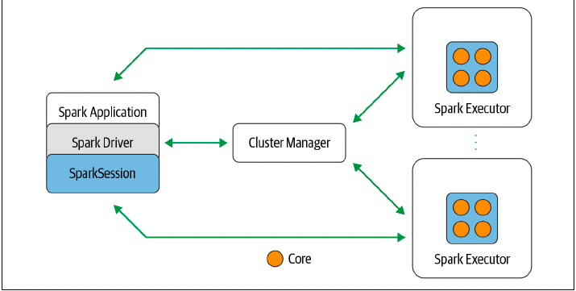
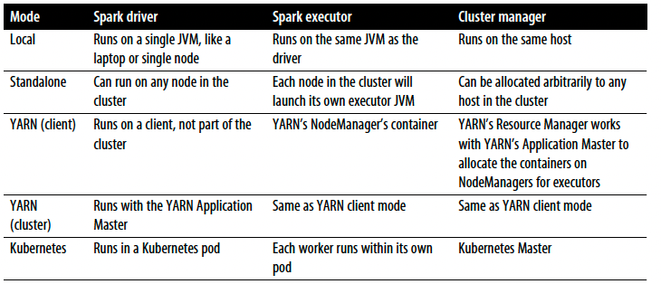
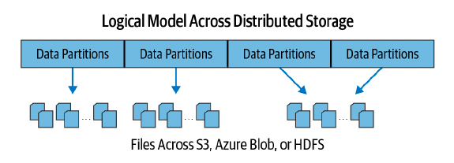
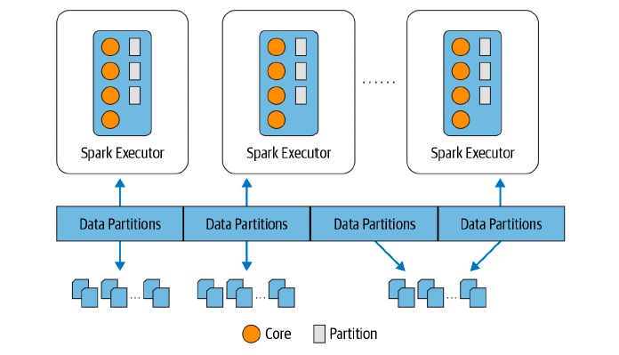

# Chapter 1: Introduction to Apache Spark: A Unified Analytics Engine

## The Genesis of Spark

#### Big Data and Distributed Computing at Google

- the name Google is synonymous with scale.

- the creation of Google File System (GFS), MapReduce (MR), and Bigtable.

    1. gfs provided a fault-tolerant and distributed filesystem across many commodity hardware servers in a cluster farm.
    2. bigtable offered scalable storage of structured data across gfs.
    3. mr introduced a new parallel programming paradigm, based on functional programming.

- the workers in the cluster aggregate and reduce the intermediate computations and produce a final appended output from the reduce function, which is then written to a distributed storage where it is accessible to your application. this approach significantly reduces network traffic and keeps most of the input/output local to disk rather than distributing it over the network.


#### Hadoop at Yahoo!

- Google's GFS paper provided a blueprint for the Hadoop File System (HDFS)

- the mapreduce framework on HDFS had a few shortcomings.

    1. it was hard to manage and administer, with cumbersome  operational complexity.
    2. its general batch-processing mapreduce api was verbose and required a lot of boilerplate setup code, with brittle fault tolerance.
    3. with large batches of data jobs with many pairs of MR tasks, each pair's intermediate computed result is written to the local disk for the subsequent stage of its operation.
    4. it fell short for combining other workloads such as machine learning, streaming, or interactive sql-like queries.

- 

#### Spark's Early Years at AMP Lab

- to enhance the system: make it highly fault-tolerant and embarrassingly parallel, support in-memory storage for intermediate results between iterative and interactive map and reduce computations, offer easy and composable APIs in multiple languages as a programming model, and support other workloads in a unified manner.

## What is Apache Spark

- Apache Spark is a unified engine designed for **_large-scale distributed data processing_**, on premises in data centers or in the cloud.

- spark provides **_in-memory storage for intermediate computations_**, making it much faster than hadoop mapreduce.

- it incorporates libraries with composable apis for machine learning (mlib), sql for iterative queries (spark sql), stream processing (structured streaming) for interacting with real-time data, and graph processing (graphx).

- Four Key Characteristics of Spark's Design Philosophy: speed, ease of use, modularity, extensibility.

#### Speed

- price and performance of cpus and memory. take advantages of efficient multithreading and parallel processing.

- spark builds its query computations as a **_directed acyclic graph (DAG)_**. its dag scheduler and query optimizer construct an efficient computation graph that can usually be decomposed into tasks that are executed in parallel across workers on the cluster.

- its physical execution engine, Tungsten, uses whole-stage code generation to generate compact code for execution.

- with all intermediate results retained in memory and its limited disk i/o, this gives it a huge performance boost.

#### Ease of Use

- spark achieves simplicity by providing a fundamental abstraction of a simple logical data structure called a **_resilient distributed dataset (RDD)_** upon which all other higher-level structured data abstractions such as dataframes and datasets are constructed. spark also provides a set of transformations and actions as operations.

#### Modularity

- spark operations can be applied across many types of workloads and expressed in many programming languages: scale, java, python, r, sql.

#### Extensibility

- unlike hadoop, which included both storage and compute, spark decouples the two. this means that you could use spark to read data stored in myriad sources - hadoop, cassandra, hbase, mongodb, hive, rdbms - and process it all in memory.

## Unified Analytics

- "unified engine for big data processing"

#### Apache Spark Components as a Unified Stack

- spark offers four distinct components as libraries for diverse workloads: spark sql, spark mllib, spark structured streaming, and graphx. each of these components is separate from spark's core fault-tolerant engine, in that you use apis to write your spark application and spark converts this into a DAG that is executed by the core engine.

- 

#### Spark SQL

- this module works well with structured data. You can read data stored in an RDBMS table or from file formats with structured data (csv, text, json, orc, parquet) and then construct permanent or temporary tables in spark.

``` Scala
// read data off Amazon s3 bucket into a spark dataframe
spark.read.json("s3://apache_spark/data/committers.json")  
    .createOrReplaceTempView("committers")

// issue a sql query and return the result as a spark dataframe
val results = spark.sql(
    """ select name, org, module, release, num_commits
        from committers 
        where module = "mllib" and num_commits > 10
        order by num_commits desc
    """
)
```

#### Spark MLlib

- spark.mllib and spark.ml: the dataframe-based api is the latter while the former contains the rdd-based apis.

- these apis allow you to extract or transfrom features, build pipelines (for training and evaluating), and persist models (for saving and reloading them) during deployment.

```python
from pyspark.ml.classification import LogisticRegression

training = spark.read.csv("s3://...")
test = spark.read.csv("s3://...")

#loading training data
lr = LogisticRegression(maxIter = 10, regParam = 0.3, elasticNetParam = 0.8)

# fit the model
lrModel = lr.fit(training)

# predict
lrModel.transform(test)
```

#### Spark Structured Streaming

- typical anatomy of a structured streaming application. it reads from a localhost socket and writes the word count results to an apache kafka topic.

```python
# read a stream from a local host
from pyspark.sql.functions import explode, split

lines = (spark
        .readStream
        .format("socket")
        .option("host", "localhost")
        .option("port", 9999)
        .load()
    )

# perform transformation
# split the lines into words
words = lines.select(explode(split(lines.value, " ")).alias("word"))

# generate running word count
word_counts = words.groupBy("word").count()

# write out to the stream to kafka
query = (word_counts
    .writeStream
    .format("kafka")
    .option("topic", "output"))
```

#### GraphX

- GraphX is a library for manipulating graphs. join two graphs using the graphx api.

```scala
val graph = Graph(vertices, edges)
messages = spark.textFile("hdft://...")
val graph2 = graph.joinVertices(messages) {
    (id, vertex, msg) => ...
}
```

## Apache Spark's Distributed Execution

- at a high level in the spark architecture, a spark application consists of a driver program that is responsible for orchestrating parallel operations on the spark cluster. the driver access the distributed components in the cluster - the spark executors and cluster manager through a spark session.

- 

#### Spark Driver

- as the part of the spark application responsible for instantiating a SparkSession, the spark driver has multiple roles:
    1. it communicates with the cluster manager; 
    2. it requests resources (cpu, memory, etc) from the cluster manager for spark's executors (JVM);
    3. it transforms all the spark operations into DAG computations, schedule them, and distributes their execution as tasks across the spark executors. Once the resources are allocated, it communicates directly with the executors.

#### Spark Session

- in Spark2.0, the SparkSession became a unified conduit to all spark operations and data. not only did it subsume previous entry points to spark like the SparkContext, SQLContext, HiveContext, SparkConf, and StreamingContext, but it also made working with Spark simplier and easier.

- sparksession provides a single unified entry point to all of spark's functionalities.

- in a standalone spark application, you can create a sparksession using one of the high-level apis in the programming language of your choice.

```scala
import org.apache.spark.sql.SparkSession

val spark = SparkSession
    .builder
    .appName("learn_spark")
    .config("spark.sql.shuffle.partitions", 6)
    .getOrCreate()

val people = spark.read.json("...")

val resultDF = spark.sql("select city, pop, state, zip from table_name")
```

#### Cluster Manager

- the cluster manager is responsible for managing and allocating resources for the cluster of nodes on which your spark application runs.

- currently, spark supports four cluster managers: the built-in standalone cluster manager, apache hadoop yarn, apache mesos, and kubernetes. 

#### Spark Executor

- a spark executor runs on each worker node in the cluster. the executors communicate with the driver program and are responsible for executing tasks on the workers.

#### Deployment Modes

- an attractive feature of spark is its support for myriad deployment modes, enabling spark to run in different configurations and environments. the cluster manager is agnostic to where it runs (as long as it can manage spark's executors and fulfill resource requests.)

- 

#### Distributed Data and Partitions

- while the data is distributed as partitions across the physical cluster, spark treats each partition as a high-level logical data abstraction - as a dataframe in memory. 

- each spark executor is preferably allocated a task that requires it to read the partition closest to it in the network, observing data locality.

- 

- partitioning allows for efficient parallelism. A distributed scheme of breaking up data into chunks or partitions allows spark executors to process any data that is close to them, minimize network bandwidth.

- 

- the following code snippet will break up the physical data stored across clusters into 8 partitions, and each executor will get one or more partitions to read into its memory.

```python
log_df = spark.read.text("path_to_large_text_file").repartition(8)
print(log_df.rdd.getNumPartitions())
```

- the following code will create a dataframe of 10,000 integers distributed over eight partitions in memory

```python
df = spark.range(0, 10000, 1, 8)
print(df.rdd.getNumPartitions())
```
## Who Uses Spark, and for What?

#### Data Science Tasks

#### Data Engineering Tasks

- after building models, data scientists often need to work with other team members, who may be responsible for deploying the models. for instance, a classification or clustering model does not exist in isolation. it works in conjunction with other components like a web application or a streaming engine such as apache kafka, or as part of a large data pipeline. 

- data pipelines enable end-to-end transformations of raw data coming from myriad sources - data is cleansed so that it can be consumed downstream by developers, stored in the cloud or in NoSQL or RDBMSs for report generation, or made accessible to data analysis via business intelligence tools. 

- data engineers use spark because it provides a simple way to parallelize computations and hides all the complexity of distribution and fault tolerance.

#### Popular Spark Use Cases

- processing in parallel large data sets distributed across a cluster
- performing ad hoc or interactive queries to explore and visualize data sets
- building, training, and evaluating machine learning models using MLlib
- implementing end-to-end data pipelines from myriad streams of data
- analyzing graph data sets and social networks