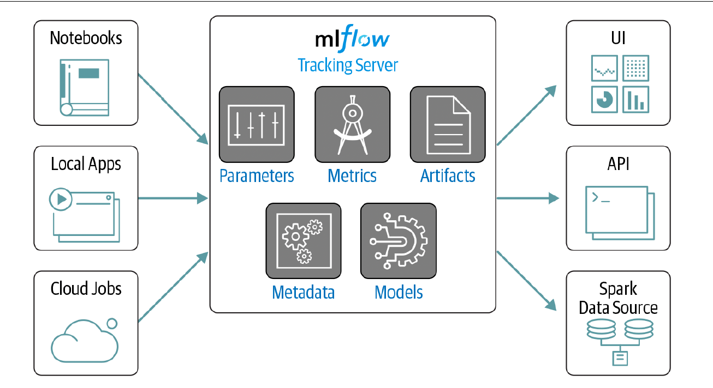
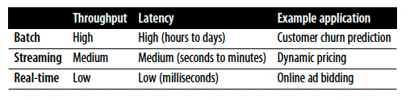
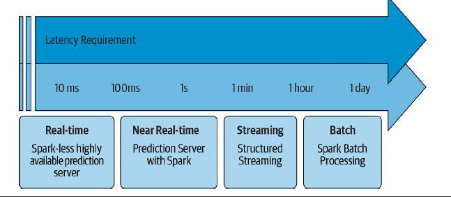
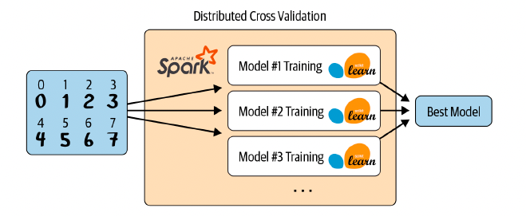

# Chapter 11. Managing, Deploying, and Scaling Machine Learning Pipelines with Apache Spark

## Model Management

- Before you deploy your machine learning model, you should ensure that you can reproduce and track the model’s performance. For us, end-to-end reproducibility of machine learning solutions means that we need to be able to reproduce the code that generated a model, the environment used in training, the data it was trained on, and the model itself.

- However, there are many more aspects that contribute to reproducibility than just setting seeds, and some of them are much more subtle. Here are a few examples:

    1. Library versioning

        When a data scientist hands you their code, they may or may not mention the dependent libraries. While you are able to figure out which libraries are required by going through the error messages, you won’t be certain which library versions they used, so you’ll likely install the latest ones.
    
    2. Data evolution

        Suppose you build a model on June 1, 2020, and keep track of all your hyperparameters, libraries, etc. You then try to reproduce the same model on July 1, 2020— but the pipeline breaks or the results differ because the underlying data has changed, which could happen if someone added an extra column or an order of magnitude more data after the initial build

    3. Order of execution

        If a data scientist hands you their code, you should be able to run it top-tobottom without error. 
    
    4. Parallel operations

        To maximize throughput, GPUs will run many operations in parallel. However, the order of execution is not always guaranteed, which can lead to nondeterministic outputs.
    
- This section will focus on MLflow, as it has the tightest integration with MLlib of the currently available open source model management tools.

#### MLflow

- MLflow is an open source platform that helps developers reproduce and share experiments, manage models, and much more.

- MLflow has four main components:

    1. Tracking

        Provides APIs to record parameters, metrics, code versions, models, and artifacts such as plots, and text.

        MLflow Tracking is a logging API that is agnostic to the libraries and environments that actually do the training. It is organized around the concept of runs, which are executions of data science code. Runs are aggregated into experiments, such that many runs can be part of a given experiment

        

        - Parameters

            Key/value inputs to your code—e.g. hyperparameters like num_trees or max_depth in your random forest
        
        - Metrics

            Numeric values (can update over time)—e.g., RMSE or accuracy values
        
        - Artifacts

            Files, data, and models—e.g., matplotlib images, or Parquet files
        
        - Metadata

            Information about the run, such as the source code that executed the run or the version of the code (e.g., the Git commit hash string for the code version)

        - Models

            The model(s) you trained
    
    2. Projects

        A standardized format to package your data science projects and their dependencies to run on other platforms. It helps you manage the model training process.

    3. Models

        A standardized format to package models to deploy to diverse execution environments. It provides a consistent API for loading and applying models, regardless of the algorithm or library used to build the model.
    
    4. Registry
        A repository to keep track of model lineage, model versions, stage transitions, and annotations.

- python example

## Model Deployment Options with MLib

- 

- Batch processing generates predictions on a regular schedule and writes the results out to persistent storage to be served elsewhere. It is typically the cheapest and easiest deployment option as you only need to pay for compute during your scheduled run

- However, its main drawback is latency, as it is typically scheduled with a period of hours or days to generate the next batch of predictions.

- Streaming provides a nice trade-off between throughput and latency. You will continuously make predictions on micro-batches of data and get your predictions in seconds to minutes.

- Real-time deployment prioritizes latency over throughput and generates predictions in a few milliseconds. Your infrastructure will need to support load balancing and be able to scale to many concurrent requests if there is a large spike in demand (e.g., for online retailers around the holidays).

- here we’re referring to generating model predictions in real time. Real-time deployment is the only option that Spark cannot meet the latency requirements for, so to use it you will need to export your model outside of Spark

- 

#### Batch

- Batch deployments represent the majority of use cases for deploying machine learning models, and this is arguably the easiest option to implement. You will run a regular job to generate predictions, and save the results to a table, database, data lake, etc. for downstream consumption.

```python
# In Python
# Load saved model with MLflow
import mlflow.spark
pipelineModel = mlflow.spark.load_model(f"runs:/{run_id}/model")

# Generate predictions
inputDF = spark.read.parquet("/databricks-datasets/learning-spark-v2/sf-airbnb/sf-airbnb-clean.parquet")
predDF = pipelineModel.transform(inputDF)
```

- How frequently will you generate predictions?

    - There is a trade-off between latency and throughput.

- How often will you retrain the model?

    - Unlike libraries like sklearn or TensorFlow, MLlib does not support online updates or warm starts. If you’d like to retrain your model to incorporate the latest data, you’ll have to retrain the entire model from scratch, rather than getting to leverage the existing parameters.

- How will you version the model?

    - You can use the MLflow Model Registry to keep track of the models you are using and control how they are transitioned to/from staging, production, and archived

#### Streaming

- Structured Streaming can continuously perform inference on incoming data. While this approach is more costly than a batch solution as you have to continually pay for compute time (and get lower throughput), you get the added benefit of generating predictions more frequently so you can act on them sooner

- However, depending on the latency demands of your task, MLlib may not be the best choice. With Spark there is significant overhead involved in generating the query plan and communicating the task and results between the driver and the worker

## Leveraging Spark for Non-MLib Models

- While MLlib is fantastic for distributed training of models, you are not limited to just using MLlib for making batch or streaming predictions with Spark—you can create custom functions to apply your pretrained models at scale, known as user-defined
functions (UDFs)

#### Spark for Distributed Hyperparameter Tuning

- Joblib

    - Joblib is “a set of tools to provide lightweight pipelining in Python.” It has a Spark backend to distribute tasks on a Spark cluster. Joblib can be used for hyperparameter tuning as it automatically broadcasts a copy of your data to all of your workers, which then create their own models with different hyperparameters on their copies of the data. This allows you to train and evaluate multiple models in parallel. You still have the fundamental limitation that a single model and all the data have to fit on a single machine, but you can trivially parallelize the hyperparameter search

    - 

    ```python
    from sklearn.utils import parallel_backend
    from sklearn.ensemble import RandomForestRegressor
    from sklearn.model_selection import train_test_split
    from sklearn.model_selection import GridSearchCV
    import pandas as pd
    from joblibspark import register_spark

    register_spark()

    df = pd.read_csv("/dbfs/databricks-datasets/learning-spark-v2/sf-airbnb/sf-airbnb-numeric.csv")
    X_train, X_test, y_train, y_test = train_test_split(df.drop(["price"], axis = 1), df[["prices"]].values().ravel(), random_state = 42) 

    rf = RandomForestRegressor(random_state = 42)
    param_grid = {"max_depth": [2, 5, 10],
                "n_estimators": [20, 50, 100]}   

    gscv = GridSearchCV(rf, param_grid, cv = 3)

    with parallel_backend("spark", n_jobs = 3):
        gscv.fit(X_train, y_train) 

    print(gscv.cv_results_)
    ```

#### Koalas

- Pandas is a very popular data analysis and manipulation library in Python, but it is limited to running on a single machine. Koalas is an open source library that implements the Pandas DataFrame API on top of Apache Spark, easing the transition from Pandas to Spark

```python
import pandas as pd

pdf = pd.read_csv(csv_path, header = 0, sep = ";", quotechar = '"')
pdf["duration_new"] = pdf["duration"] + 100

# in koalas

import databricks.koalas as ks
kdf = ks.read_csv(csv_path, header = 0, sep = ";", quotechar = '"')
kdf["duration_new"] = kdf["duration"] + 100
```