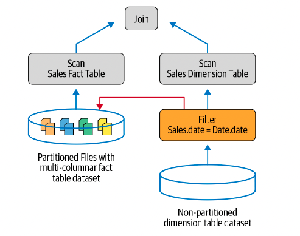
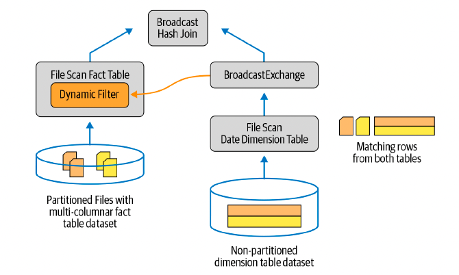

# Chapter 12: Epilogue: Apache Spark 3.0

## Spark Core and Spark SQL

- A number of changes have been introduced in Spark Core and the Spark SQL engine to help speed up queries. One way to expedite queries is to read less data using dynamic partition pruning. Another is to adapt and optimize query plans during execution.

- **_Dynamic Partition Pruninng_**

    The idea behind dynamic partition pruning (DPP) is to skip over the data you don’t need in a query’s results. The typical scenario where DPP is optimal is when you are joining two tables: a fact table (partitioned over multiple columns) and a dimension table (nonpartitioned)

    

    

- **_The AQE framework_**

    - Spark operations in a query are pipelined and executed in parallel processes, but a shuffle or broadcast exchange breaks this pipeline, because the output of one stage is needed as input to the next stage

    - These breaking points are called materialization points in a query stage, and they present an opportunity to reoptimize and reexamine the query.

    - AQE Framework Conceptual Steps

        1. All the leaf nodes, such as scan operations, of each stage are executed.

        2. Once the materialization point finishes executing, it’s marked as complete, and all the relevant statistics garnered during execution are updated in its logical plan.

        3. Based on these statistics, such as number of partitions read, bytes of data read, etc., the framework runs the Catalyst optimizer again to understand whether it can:

            - Coalesce the number of partitions to reduce the number of reducers to read shuffle data. 

            - Replace a sort merge join, based on the size of tables read, with a broadcast join.

            - Try to remedy a skew join.
            
            - Create a new optimized logical plan, followed by a new optimized physical plan.
    
    - This process is repeated until all the stages of the query plan are executed

    - In short, this reoptimization is done dynamically. the objective is to dynamically coalesce the shuffle partitions, decrease the number of reducers needed to read the shuffle output data, switch join strategies if appropriate, and remedy any skew joins.

    - SQL configurations dictate how AQE will reduce the number of reducers

        - spark.sql.adaptive.coalescePartitions.enabled (set to true)
        
        - spark.sql.adaptive.skewJoin.enabled (set to true)

#### SQL Join Hints

- Spark 3.0 adds join hints for all Spark join strategies

- Shuffle sort merge join (SMJ)

    With these new hints, you can suggest to Spark that it perform a SortMergeJoin when joining tables a and b

    You can add one or more hints to a SELECT statement inside /*+ ... */ comment blocks:

    SELECT /*+ MERGE(a, b) */ id FROM a JOIN b ON a.key = b.key

- Broadcast hash join (BHJ)

    SELECT /*+ BROADCAST(a) */ id FROM a JOIN b ON a.key = b.key

- Shuffle hash join (SHJ)

    SELECT /*+ SHUFFLE_HASH(a, b) */ id FROM a JOIN b ON a.key = b.key

- Shuffle-and-replicate nested loop join (SNLJ)

    SELECT /*+ SHUFFLE_REPLICATE_NL(a, b) */ id FROM a JOIN b

## Structured Streaming

## PySpark, Pandas UDFs, and Pandas Function APIs

#### Redesigned Pandas UDFs with Python Type Hints

- The Pandas UDFs in Spark 3.0 were redesigned by leveraging Python type hints. This enables you to naturally express UDFs without requiring the evaluation type. Pandas UDFs are now more “Pythonic” and can themselves define what the UDF is supposed to input and output.

```python
import pandas as pd
from pyspark.sql.functions import pandas_udf

@pandas_udf("long")
def pandas_plus_one(v: pd.Series) -> pd.Series:
    return v+1
```

#### Iterator Support in Pandas UDFs

- Pandas UDFs are very commonly used to load a model and perform distributed inference for single-node machine learning and deep learning models.

- In Spark 3.0, Pandas UDFs can accept an iterator of pandas.Series or pandas.DataFrame, as shown here:

```python
from typing import Iterator

@pandas_udf('long')
def pandas_plus_one(iterator: Iterator[pd.Series]) -> Iterator[pd.Series]:
    return map(lambda s: s + 1, iterator)

df.withColumn("plus_one", pandas_plue_one("id")).show()
```

- With this support, you can load the model only once instead of loading it for every series in the iterator.

```python
@pandas_udf()
def predict(iterator):
    model = ...
    for features in iterator:
        yield model.predict(features)
```
