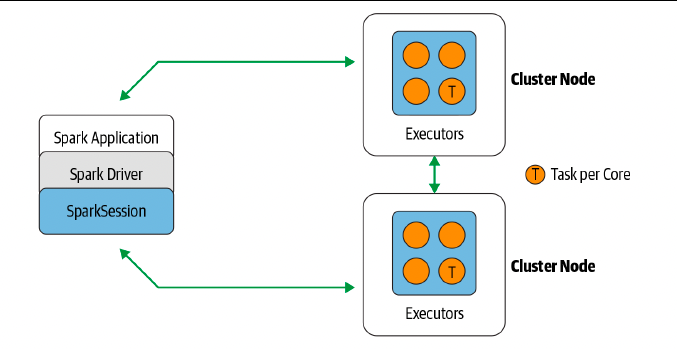
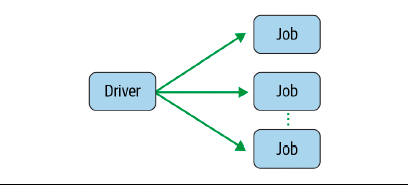
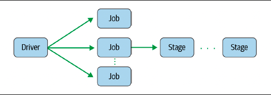
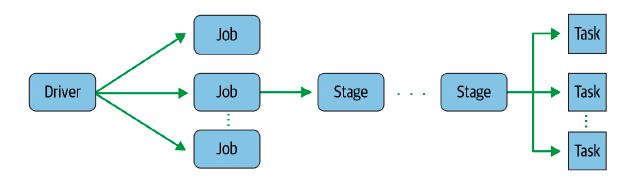
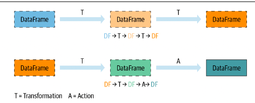
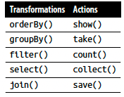
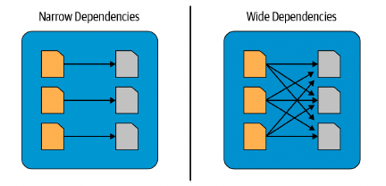

# Chapter 2: Downloading Apache Spark and Getting Started

- Spark computations are expressed as operations. these operations are then converted into low-level rdd-based bytecode as tasks, which are distributed to spark's executors for execution.

- Every computation expressed in high-level Structured APIs is
decomposed into low-level optimized and generated RDD opera
tions and then converted into Scala bytecode for the executors’
JVMs.

## Important Terms

- **_Application_**: A user program built on Spark using its APIs. **_It consists of a driver program and executors on the cluster_**.

- **_SparkSession_**: An object that provides **_a point of entry_** to interact with underlying Spark functionality and allows programming Spark with its APIs. In an interactive Spark
shell, the Spark driver instantiates a SparkSession for you, while in a Spark application, you create a SparkSession object yourself.

- **_Job_**: A parallel computation consisting of multiple tasks that gets spawned in response to a Spark action (e.g., save(), collect()).

- **_Stage_**: Each job gets divided into smaller sets of tasks called stages that depend on each other.

- **_Task_**: A single unit of work or execution that will be sent to a spark executor.

#### Spark Application and SparkSession

- At the core of every Spark application is the Spark driver program, which creates a SparkSession object. When you’re working with a Spark shell, the driver is part of the shell and the object (accessible via the variable spark) is created for you.

- 

- Once we have a spark session, we can use program spark using the APIs to perform spark operations.

#### Spark Job

- During interactive sessions with spark shells, the driver converts your application into one or more spark jobs. it then transform each job into a DAG.

- This, in essence, is Spark's execution plan, where each node within a DAG could be a single or multiple Spark stages.

- 

#### Spark Stages

- Stages are created based on what operations can be performed **_serially or in parallel_**.

- Not all Spark operations can happen in a single stage, so they may be divided into multiple stages.

- Often stages are delineated on the operator’s computation boundaries, where they dictate data transfer among Spark executors.

- 

#### Spark Tasks

- Each stage is comprised of Spark tasks (a unit of execution), which are then federated across each spark executor. 

- each task maps to a single core and works on a single par
tition of data

- an executor with 16 cores can have 16 or more tasks working on 16 or more partitions in parallel, making the execution of Spark’ tasks exceedingly parallel!

- 


## Transformations, Actions, and Lazy Evaluation

- Spark operations on distributed data can be classified into two types: **_transformations_** and **_actions_**.

#### Transformation

- transformations, as the name suggests, transform a Spark DataFrame into a new DataFrame without altering the original data, giving it the property of immutability. 

- an operation such as select() or filter() will not change the original DataFrame; instead, it will return the transformed results of the operation as a new DataFrame.

- All transformations are evaluated lazily. their results are not computed immediately, but they are recorded or remembered as a **_lineage_**.

- A recorded lineage allows Spark, at a later time in its execution plan, **_to rearrange certain transformations, coalesce them, or optimize transformations into stages_** for more efficient execution.

- Lazy evaluation is Spark’s strategy for delaying execution until an action is invoked or data is “touched” (read from or written to disk).

- 

- While lazy evaluation allows Spark to optimize your queries by peeking into your chained transformations, lineage and data immutability provide **_fault tolerance_**. it can reproduce its original state by simply replaying the recorded lineage, giving it resiliency in the event of failures.

- 

- The actions and transformations contribute to a Spark query plan.Nothing in a query plan is executed until an action is invoked.

``` python
strings = spark.read.text("../README.md")
filtered = strings.filter(strings.value.contains("Spark"))
filtered.count()

# nothing happens until is executed in the filtered.count() is executed in the shell.
```

## Narrow and Wide Transformation

- A huge advantage of the lazy evaluation scheme is that Spark can inspect your computational query and ascertain how it can optimize it. This optimization can be done by either joining or pipelining some operations and assigning them to a stage, or breaking them into stages by determining which operations require a shuffle or exchange of data across clusters.

- Transformations can be classified as having either narrow dependencies or wide dependencies.

#### Narrow Dependencies

- Any transformation where a single output partition can be computed
from **_a single input partition_** is a narrow transformation.

- in the previous code snippet, filter() and contains() represent narrow transformations because they can operate on a single partition and produce the resulting output partition without any exchange of data.

#### Wide Dependencies

- However, groupBy() or orderBy() instruct Spark to perform wide transformations, where data from other partitions is read in, combined, and written to disk

- In this transformation, orderBy() requires output from other partitions to compute the final aggregation.

- 

``` python 


```