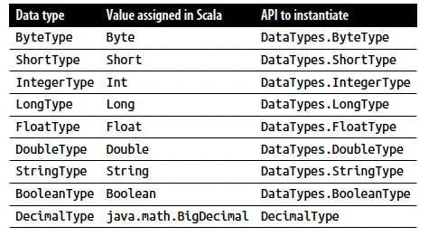
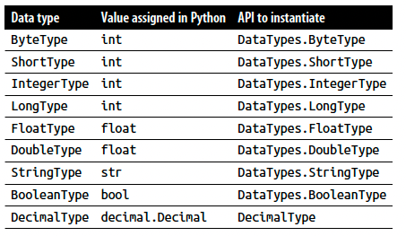
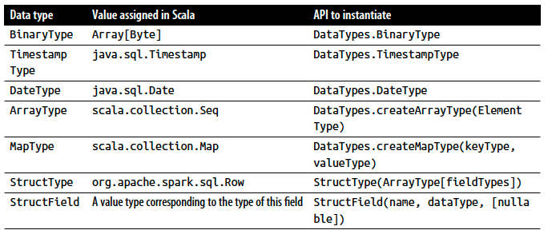
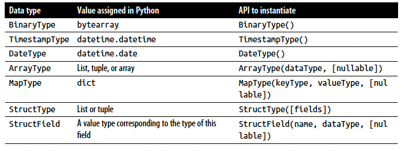
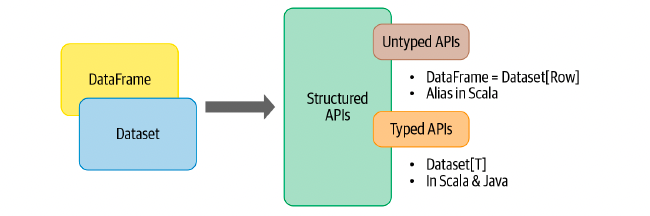
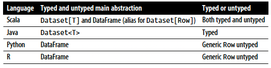
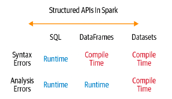
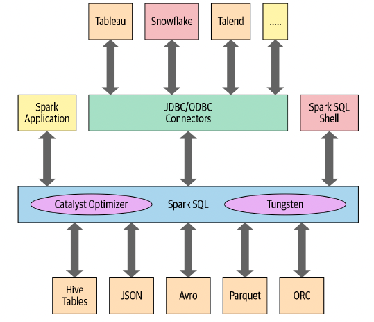
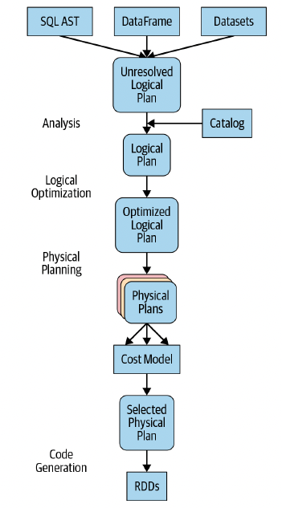
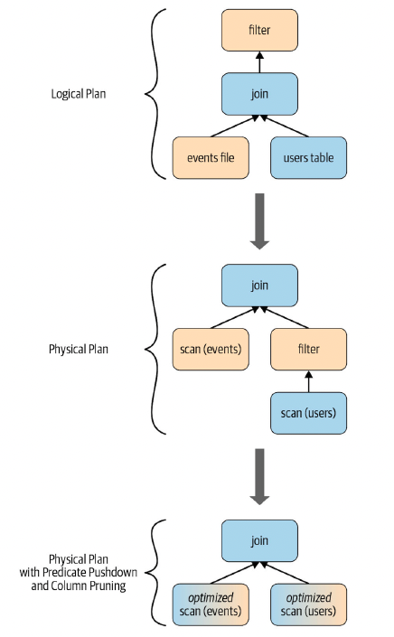

# Chapter 3: Apache Spark's Structured APIs

## Spark: What’s Underneath an RDD?

- The RDD is the most basic abstraction in Spark. There are three vital characteristics associated with an RDD:

    - Dependencies: 
        
        a list of dependencies that instructs Spark how an RDD is constructed with its inputs is required

        When necessary to reproduce results, Spark can recreate an RDD from these dependencies and replicate operations on it. This characteristic gives RDDs resiliency.

    - Partitions (with some locality information):

        partitions provide Spark the ability to split the work to parallelize computation on partitions across executors.

        Spark will use locality information to send work to executors close to the data. That way less data is transmitted over the network.

    - Compute function: Partition => Iterator[T]:

        an RDD has a compute function that produces an Iterator[T] for the data that will be stored in the RDD.

- Couple of problems with this original model

    - For one, the compute function (or computation) is opaque to Spark. Spark does not know what you are doing in the compute function. Whether you are performing a join, filter, select, or aggregation, Spark only sees it as a lambda expression.

    - because it’s unable to inspect the computation or expression in the function, Spark has no way to optimize the expression—it has no comprehension of its intention

    - Another problem is that the Iterator[T] data type is also opaque for Python RDDs;

    - it has no idea if you are accessing a column of a certain type within an object. Therefore, all Spark can do is serialize the opaque object as a series of bytes, without using any data compression techniques.

## Structuring Spark

- One is to express computations by using common patterns found in data analysis. These patterns are expressed as high-level operations such as filtering, selecting, counting, aggregating, averaging, and grouping.

- This specificity is further narrowed through the use of a set of common operators in a DSL. Through a set of operations in DSL, available as APIs in Spark’s supported languages (Java, Python, Spark, R, and SQL), these operators let you tell Spark what you wish to compute with your data, and as a result, it can construct an efficient query plan for execution.

- And the final scheme of order and structure is to allow you to arrange your data in a tabular format, like a SQL table or spreadsheet, with supported structured data types

#### Key Merits and Benefits

- Structure yields a number of benefits, including better performance and space efficiency across Spark components

- expressivity, simplicity, composability, and uniformity.

- Demonstrate expressivity and composability: 

    If we were to use the low-level RDD API for this, the code would look as follows:

```PYTHON
# In python
# create an rdd of tuples (name, age)

dataRDD = sc.parallelize([("Brooke", 20), ("Denny", 31), ("Jules", 30), ("TD", 35), ("Brooke", 25)])

# Use map and reduceByKey transformations with their lambda
# expressions to aggregate and then compute average

agesRDD = (dataRDD
    .map(lambda x : (x[0], (x[1], 1)))
    .reduceByKey(lambda x, y: (x[0] + y[0], x[1], y[1]))
    .map(lambda x: (x[0], x[1][0]/x[1][1])))
```

- No one would dispute that this code, which tells Spark how to aggregate keys and compute averages with a string of lambda functions, is cryptic and hard to read. It’s completely opaque to Spark, because it doesn’t communicate the intention.

- By contrast, what if we were to express the same query with high-level DSL operators and the DataFrame API, thereby instructing Spark what to do?

```python
# in python

from pyspark.sql import SparkSession
from pyspark.sql.functions import avg

spark = (SparkSession
    .builder
    .appName("AuthorAges")
    .getOrCreate())

data_df = spark.createDataFrame([("Brooke", 20), ("Denny", 31), ("Jules", 30),("TD", 35), ("Brooke", 25)], ["name", "age"])

avg_df = data_df.groupBy('name').agg(avg("age"))

avg_df.show()
```
- we are using high-level DSL operators and APIs to tell Spark what to do. because Spark can inspect or parse this query and understand our intention, it can optimize or arrange the operations for efficient execution. Spark knows exactly what we wish to do

- Rest assured that you are not confined to these structured patterns; you can switch back at any time to the unstructured lowlevel RDD API.

- All of this simplicity and expressivity that we developers cherish is possible because of the Spark SQL engine upon which the high-level Structured APIs are built.

## The DataFrame API

- Inspired by pandas DataFrames in structure, format, and a few specific operations, Spark DataFrames are like distributed in-memory tables with named columns and schemas, where each column has a specific data type: integer, string, array, map, real, date, timestamp, etc. To a human’s eye, a Spark DataFrame is like a table

- DataFrames are immutable and Spark keeps a lineage of all transformations. You can add or change the names and data types of the columns, creating new DataFrames while the previous versions are preserved. A named column in a DataFrame and its associated Spark data type can be declared in the schema.

## Spark’s Basic Data Types

- Scala Data Type in Spark
- 

- Python Data Type in Spark
- 

## Spark’s Structured and Complex Data Types

- Scala structured data types in Spark

- 

- Python structured data types in Spark

- 

## Schemas and Creating DataFrames

- A schema in Spark defines the column names and associated data types for a DataFrame.

- Defining a schema up front as opposed to taking a schema-on-read approach offers three benefits:

    - You relieve Spark from the onus of inferring data types.
    - You prevent Spark from creating a separate job just to read a large portion of your file to ascertain the schema, which for a large data file can be expensive and time-consuming.
    - You can detect errors early if data doesn’t match the schema

#### Two ways to define a schema

- One is to define it programmatically
``` scala
// In Scala
Import org.apache.spark.sql.types._

val schema = StructType(Array(
    StructField("author", StringType, false),
    StructField("title", StringType, false),
    StructField("pages", IntegerType, false)
))
```

```python
# In Python
from pyspark.sql.types import *

schema = StructType([
    StructField("author", StringType(), False),
    StructField("title", StringType(), False),
    StructField("pages", IntegerType(), False),
])
```

- The other is to employ a Data Definition Language (DDL) string, which is much simpler and easier to read.

```scala
// In scala
val schema = "author STRING, title STRING, pages INT"
```

```python
# In Python
schema = "author STRING, title STRING, pages INT"
```

- Example: create_scheme.py

#### Columns and Expressions

- In Spark’s supported languages, columns are objects with public methods (represented by the Column type).

```scala
blogsDF.withColumn("big hitters", (expr("Hits > 10000"))).show()
blogsDF.sort(col("Id").desc).show()
```

#### Row

- A row in Spark is a generic Row object, containing one or more columns.

```scala
import org.apache.spark.sql.Row

val blogRow = Row(6, "Reynold", "Xin", "https://tinyurl.6", 255568, "3/2/2015", Array("twitter", "LinkedIn"))

blogRow(1)
```

```python
from pyspark.sql import Row
blog_row  = Row(6, "Reynold", "Xin", "https://tinyurl.6", 255568, "3/2/2015", Array("twitter", "LinkedIn"))

blog_row[1]
```

- Row objects can be used to create DataFrames

```scala
val rows = Seq(("Matei Zaharia", "CA"), ("Reynold Xin", "CA"))
val authorsDF = rows.toDF("author", "state")
authorsDF.show()
```

```python
rows = [Row("Matei Zaharia", "CA"), Row("Reynold Xin", "CA")]
authors_df = spark.createDataFrame(rows, ["author", "state"])
authors_df.show()
```

## Common DataFrame Operations

- Spark provides an interface,**_DataFrameReader_**, that enables you to read data into a DataFrame from myriad data sources in formats such as JSON, CSV, Parquet, Text, Avro, ORC, etc

- Likewise, to write a DataFrame back to a data source in a particular format, Spark uses **_DataFrameWriter_**. 

#### Using DataFrameReader and DataFrameWriter

- If you don’t want to specify the schema, Spark can infer schema
from a sample at a lesser cost.

```scala
val sampleDF = spark
    .read
    .option("samplingRatio", 0.001)
    .option("header", true)
    .csv("""./data/sf-fire-calls.csv""")
```

- Example: define_scheme.py

- To write the DataFrame into an external data source in your format of choice, you can use the DataFrameWriter interface. Like DataFrameReader, it supports multiple data sources. Parquet, a popular columnar format, is the default format; it uses snappy compression to compress the data. If the DataFrame is written as Parquet, the schema is preserved as part of the Parquet metadata

- Saving a DataFrame as a Parquet file or SQL table: A common data operation is to explore and transform your data, and then persist the DataFrame in Parquet format or save it as a SQL table.

```scala
val parquetPath = ...
fireDF.write.format("parquet").save(parquetPath)

val parquetTable = ...
fireDF.write.format("parquet").saveAsTable(parquetTable)

```

```python
parquet_path = ...
fire_df.write.format("parquet").save(parquet_path)

parquet_table = ...
fire_df.write.format("parquet").saveAsTable(parquet_table) 
```

#### Transformations and actions

1. Projections and Filters

```scala
val few_fire_df = fire_df
            .select("IncidentNumber", "AvailableDtTm", "CallType")
            .where($"CallType" =!= "Medical Incident")

few_fire_df.show(5, false)
```

```python
few_fire_df = (fire_df
        .select("IncidentNumber", "AvailableDtTm", "CallType")
        .where(col("CallType") != "Medical Incident"))
```

- List distinct call types

```scala
fire_df.select("CallType")
        .where(col("CallType").isNotNull)
        .agg(countDistinct("CallType") as "DistinctCallTypes")
        .show()
```

```python
(fire_df.select("CallType")
        .where(col("CallType").isNotNull())
        .distinct()
        .show(10, False))
```

2. Renaming, adding, and dropping columns

```scala
val newFireDF = fire_df.withColumnRenamed("Delay", "ResponseDelayedinMins")

newFireDF.select("ResponseDelayedinMins")
        .where(col("ResponseDelayedinMins") > 5)
        .show(5, false)
```

```python
newFireDF = fire_df.withColumnRenamed("Delay", "ResponseDelayedinMins")

newFireDF.select("ResponseDelayedinMins")
        .where(col("ResponseDelayedinMins") > 5)
        .show(5, false)
```

- Modifying the contents of a column or its type are common operations during data exploration.

```scala
val fireTsDF = newFireDF
    .withColumn("IncidentDate", to_timestamp(col("CallDate"), "MM/dd/yyyy"))
    .drop("CallDate")
    .withColumn("OnWatchDate", to_timestamp(col("WatchDate"), "MM/dd/yyyy"))
    .drop("WatchDate")
    .withColumn("AvailableDtTS", to_timestamp(col("AvailableDtTm"), "MM/dd/yyyy hh:mm:ss a"))
    .drop("AvailableDtTm")

fireTsDF
    .select("IncidentDate","OnWatchDate", "AvailableDtTS")
    .show(5, false)


fireTsDF
    .select(year($"IncidentDate"))
    .distinct()
    .orderBy(year($"IncidentDate"))
    .show()
```

3. Aggregations

- The DataFrame API also offers the collect() method, but for
extremely large DataFrames this is resource-heavy (expensive) and
dangerous, as it can cause out-of-memory (OOM) exceptions.
Unlike count(), which returns a single number to the driver, col
lect() returns a collection of all the Row objects in the entire Data‐
Frame or Dataset. If you want to take a peek at some Row records
you’re better off with take(n), which will return only the first n
Row objects of the DataFrame 


```scala
fireTsDF
    .select("CallType")
    .where(col("CallType").isNotNull) 
    .groupBy("CallType")
    .count()
    .orderBy(desc("count"))
    .show(10, false)

import org.apache.spark.sql.{functions => f}

fireTsDF
    .select(f.sum("NumAlarms"), f.avg("ResponseDelayedinMins"),
            f.min("ResponseDelayedinMins"), f.max("ResponseDelayedinMins")).show()
```

- So far we have extensively discussed the DataFrame API. Next, we’ll shift our focus to the Dataset API and explore how the two APIs provide a
unified, structured interface to developers for programming Spark.

## The Dataset API

- Spark 2.0 unified the DataFrame and Dataset APIs as Structured APIs with similar interfaces so that developers would only have to learn a single set of APIs.Datasets take on two characteristics: typed and untyped APIs

- 

- you can think of a DataFrame in Scala as an alias for a collection of generic objects, Dataset[Row], where a Row is a generic untyped JVM object that may hold different types of fields

- Dataset, by contrast, is a collection of strongly typed JVM objects in Scala or a class in Java

- Dataset is a strongly typed collection of domain-specific objects that can be transformed in parallel using functional or relational operations. Each Dataset [in Scala] also has an untyped view called a DataFrame, which is a Dataset of Row.

#### Typed Objects, Untyped Objects, and Generic Rows

- In Spark’s supported languages, Datasets make sense only in Java and Scala, whereas in Python and R only DataFrames make sense. This is because Python and R are not compile-time type-safe; types are dynamically inferred or assigned during execution, not during compile time.

- The reverse is true in Scala and Java: types are bound to variables and objects at compile time.

- 

- Row is a generic object type in Spark, holding a collection of mixed types that can be accessed using an index. Internally, Spark manipulates objects, converting them to the equivalent types. For example, an Int as one of your fields in a row will be mapped or converted to IntegerType or  IntegerType() respectively for Scala or Java and Python

```scala
import org.apache.spark.sql.Row

val row = Row(350, true, "learning spark 2e", null)

row.getInt(0)

row.getBoolean(1)

row.getString(2)
```

```python
from pyspark.sql import Row

row = Row(350, True, "learing spark 2e", None)

row[0]
row[1]
row[2]
```

- By contrast, typed objects are actual Java or Scala class objects in the JVM. Each element in a Dataset maps to a JVM object.

#### Creating Datasets

- when creating a Dataset you have to know the schema. In other words, you need to know the data types

- Although with JSON and CSV data it’s possible to infer the schema, for large data sets this is resource-intensive (expensive). When creating a Dataset in Scala, the easiest way to specify the schema for the resulting Dataset is to use a case class. In Java, JavaBean classes are used

1. Scala: Case Classes
    
    When you wish to instantiate your own domain-specific object as a Dataset, you can do so by defining a case class in Scala. As an example, let’s look at a collection of readings from Internet of Things (IoT) devices in a JSON file

```scala
case class DeviceIoTData (battery_level: Long, c02_level: Long,
cca2: String, cca3: String, cn: String, device_id: Long,
device_name: String, humidity: Long, ip: String, latitude: Double,
lcd: String, longitude: Double, scale:String, temp: Long,
timestamp: Long)

val ds = spark.read
        .json("./data/iot_devices.json")
        .as[DeviceIoTData]

ds.show(5, false)   
```

#### Dataset Operations

```scala

val filterTempDS = ds.filter({d => {d.temp > 30 && d.humidity > 70}})
filterTempDS.show(5, false)


case class DeviceTempByCountry(temp: Long, device_name: String, device_id: Long, cca3: String)

val dsTemp = ds
    .filter(d => {d.temp > 25})
    .map(d => (d.temp, d.device_name, d.device_id, d.cca3))
    .toDF("temp", "device_name", "device_id", "cca3")
    .as[DeviceTempByCountry]

dsTemp.show(3, false)

val device = dsTemp.first()
print(device)

val dsTemp2 = ds
    .select($"temp", $"device_name", $"device_id", $"cca3")
    .where("temp > 25")
    .as[DeviceTempByCountry]
```

- In a way, Datasets are similar to RDDs in that they provide a similar interface to its aforementioned methods and compile-time safety but with a much easier to read and an object-oriented programming interface.

- When we use Datasets, the underlying Spark SQL engine handles the cretion, con version, serialization, and deserialization of the JVM objects. It also takes care of off-Java heap memory management with the help of Dataset encoders.

- IoT_example.scala

## DataFrames Versus Datasets

- If you want to tell Spark what to do, not how to do it, use DataFrames or Datasets.

- If you want rich semantics, high-level abstractions, and DSL operators, use DataFrames or Datasets.

- If you want strict compile-time type safety and don’t mind creating multiple case classes for a specific Dataset[T], use Datasets.

- If your processing demands high-level expressions, filters, maps, aggregations, computing averages or sums, SQL queries, columnar access, or use of relational operators on semi-structured data, use DataFrames or Datasets.

- If you want strict compile-time type safety and don’t mind creating multiple case classes for a specific Dataset[T], use Datasets.

- If your processing demands high-level expressions, filters, maps, aggregations, computing averages or sums, SQL queries, columnar access, or use of relational operators on semi-structured data, use DataFrames or Datasets.

- If your processing dictates relational transformations similar to SQL-like queries,use DataFrames.

- If you want to take advantage of and benefit from Tungsten’s efficient serialization with Encoders, , use Datasets.

- If you want unification, code optimization, and simplification of APIs across Spark components, use DataFrames.

- If you are a Python user, use DataFrames and drop down to RDDs if you need
more control.

- If you want space and speed efficiency, use DataFrames.

- 

## When to Use RDDs

- There are some scenarios where you’ll want to consider using RDDs, such as when you:

    - Are using a third-party package that’s written using RDDs
    - Can forgo the code optimization, efficient space utilization, and performance benefits available with DataFrames and Datasets
    - Want to precisely instruct Spark how to do a query

- After all, DataFrames and Datasets are built on top of RDDs, and they get decomposed to compact RDD code during whole stage code generation.

- In other words, you tell Spark what to do, not how to do it, using high-level operations, and it ascertains the most efficient way to build a query and generates compact code for you.

- This process of building efficient queries and generating compact code is the job of the Spark SQL engine.

## Spark SQL and the Underlying Engine

- Apart from allowing you to issue SQL-like queries on your data, the Spark SQL engine:
    - Unifies Spark components and permits abstraction to DataFrames/Datasets in Java, Scala, Python, and R, which simplifies working with structured data sets.
    - Connects to the Apache Hive metastore and tables.
    - Reads and writes structured data with a specific schema from structured file formats (JSON, CSV, Text, Avro, Parquet, ORC, etc.) and converts data into temporary tables.
    - Offers an interactive Spark SQL shell for quick data exploration.
    - Provides a bridge to (and from) external tools via standard database JDBC/ODBC connectors.
    - Generates optimized query plans and compact code for the JVM, for final execution.

    - 
    - At the core of the Spark SQL engine are the Catalyst optimizer and Project Tungsten.

#### The Catalyst Optimizer

- The Catalyst optimizer takes a computational query and converts it into an execution plan. It goes through four transformational phases, as shown in Figure 3-4:
    - Analysis
    - Logical optimization
    - Physical planning
    - Code generation

- 

- regardless of the language you use, your computation undergoes the same journey and the resulting bytecode is likely the same:

```python
count_mnm_df = (mnm_df
    .select("State", "Color", "Count")
    .groupBy("State", "Color")
    .agg(count("Count"))
    .alias("Total")
    .orderBy("Total", ascending = False)
)
```

```sql
select
    state, color, count, sum(count) as total
from
    mnm_table_name
group by
    state, color, count
order by
    total desc
```

- To see the different stages the Python code goes through, you can use the **_count_mnm_df.explain(True)_** method on the DataFrame. Or, to get a look at the different logical and physical plans, in Scala you can call **_df.queryExecution.logical_** or **_df.queryExecution.optimizedPlan_**.

- The following Scala code undergoes a similar journey as the underlying engine optimizes its logical and physical plans:

```scala
val user_df = ...
val event_df = ...

val join_df = user_df 
        .join(event_df, user_df("id") == event_df("uid"))
        .filter(event_df("date") > "2015-01-01")
```

- 

#### Phase 1: Analysis

- The Spark SQL engine begins by generating an **_abstract syntax tree (AST)_** for the SQL or DataFrame query. In this initial phase, any columns or table names will be resolved by consulting an internal **_Catalog, a programmatic interface to Spark SQL that holds a list of names of columns, data types, functions, tables, databases, etc._** Once they’ve all been successfully resolved, the query proceeds to the next phase.

#### Phase 2: Logical optimization

- this phase comprises two internal stages. Applying a standardrule based optimization approach, the Catalyst optimizer will first construct a set of multiple plans and then, using its cost-based optimizer (CBO), assign costs to each plan. These plans are laid out as operator trees (like in Figure 3-5); they may include, for example, the process of constant folding, predicate pushdown, projection pruning, Boolean expression simplification, etc.

#### Phase 3: Physical planning

- In this phase, Spark SQL generates an optimal physical plan for the selected logical plan, using physical operators that match those available in the Spark execution engine.

#### Phase 4: Code generation

- The final phase of query optimization involves generating efficient Java bytecode to run on each machine. Because Spark SQL can operate on data sets loaded in memory, Spark can use state-of-the-art compiler technology for code generation to speed up execution. In other words, it acts as a compiler. Project Tungsten, which facilitates whole-stage code generation, plays a role here.

- Just what is whole-stage code generation? It’s a physical query optimization phase that collapses the whole query into a single function, getting rid of virtual function calls and employing CPU registers for intermediate data. This streamlined strategy significantly improves CPU efficiency and performance.

## Summary

- In this chapter, we took a deep dive into Spark’s Structured APIs, beginning with a look at the history and merits of structure in Spark.

- we demonstrated that the high-level DataFrame and Dataset APIs are far more expressive and intuitive than the low-level RDD API.

- And finally, we took a look under the hood to see how the Spark SQL engine’s main components—the Catalyst optimizer and Project Tungsten—support structured highlevel APIs and DSL operators. As you saw, no matter which of the Spark-supported languages you use, a Spark query undergoes the same optimization journey, from logical and physical plan construction to final compact code generation.