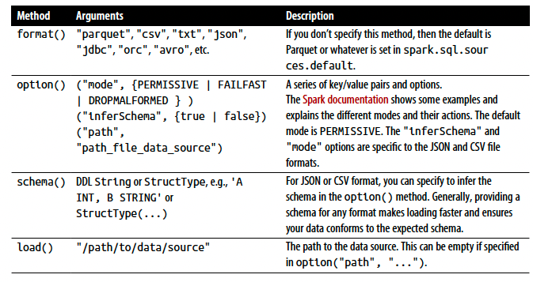
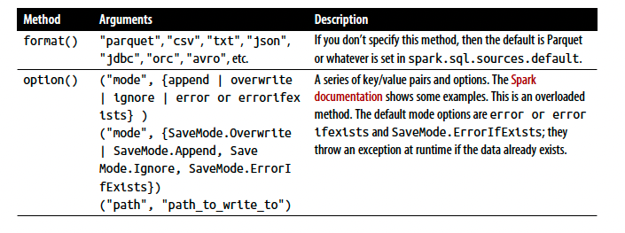
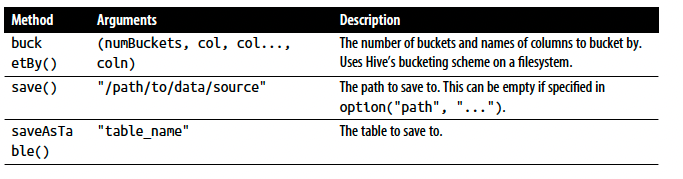
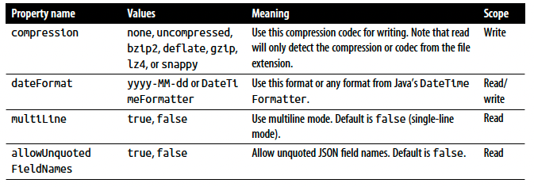
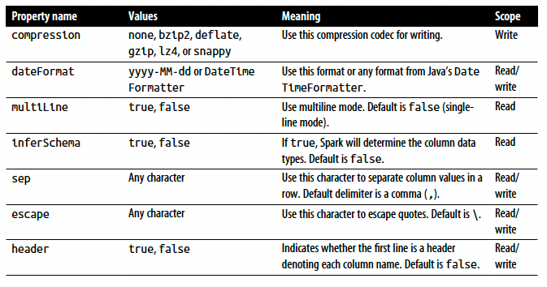

# Chapter 4: Spark SQL and DataFrames: Introduction to Built-in Data Sources

## Using Spark SQL in Spark Applications

- The SparkSession, introduced in Spark 2.0, provides a unified entry point for programming Spark with the Structured APIs. You can use a SparkSession to access Spark functionality: just import the class and create an instance in your code.

- To issue any SQL query, use the sql() method on the SparkSession instance, spark, such as spark.sql("SELECT * FROM myTableName"). All spark.sql queries executed in this manner return a DataFrame on which you may perform further Spark operations if you desire

#### Basic Query Examples

```scala
import org.apache.spark.sql.SparkSession

val spark = SparkSession
    .builder
    .appName("spark_sql_example")
    .getOrCreate()

val csv_file = "./data/departuredelays.csv"

val df = spark.read.format("csv")
    .option("inferSchema", true)
    .option("header", true)
    .load(csv_file)

df.createOrReplaceTempView("us_delay_flights_tbl")

```

```python
from pyspark.sql import SparkSession

spark = (SparkSession
    .builder
    .appName("spark_sql_example")
    .getOrCreate())

csv_file = "./data/departuredelays.csv"

df = (spark.read.format("csv")
    .option("inferSchema", True)
    .option("header", True)
    .load(csv_file))

df.createOrReplaceTempView("us_delay_flights_tbl")

```
- Now that we have a temporary view, we can issue SQL queries using Spark SQL.

```scala
spark.sql("""
select distance, origin, destination
from us_delay_flights_tbl
where distance > 1000
order by distance desc
""").show(10)

spark.sql("""SELECT date, delay, origin, destination
FROM us_delay_flights_tbl
WHERE delay > 120 AND ORIGIN = 'SFO' AND DESTINATION = 'ORD'
ORDER by delay DESC""").show(10)

spark.sql(
"""
select
    delay, origin, destination,
    case
        when delay > 360 then 'very long delays'
        when delay > 120 and delay < 360 then 'long delays'
        when delay > 60 and delay < 120 then 'short delays'
        when delay > 0 and delay < 60 then 'tolerable delays'
        when delay == 0 then 'no delays'
        else 'early'
    end as flight_delays
from us_delay_flights_tbl
order by origin, delay desc
"""
).show(10)
```

- To enable you to query structured data as shown in the preceding examples, Spark manages all the complexities of creating and managing views and tables, both in memory and on disk.

## SQL Tables and Views

- Tables hold data. Associated with each table in Spark is its relevant metadata, which is information about the table and its data: the schema, description, table name, database name, column names, partitions, physical location where the actual data resides, etc. All of this is stored in a central metastore.

- Instead of having a separate metastore for Spark tables, Spark by default uses the Apache Hive metastore, located at /user/hive/warehouse, to persist all the metadata about your tables.

#### Managed Versus UnmanagedTables

- Spark allows you to create two types of tables: managed and unmanaged. 

- For a managed table, Spark manages both the metadata and the data in the file store. This could be a local filesystem, HDFS, or an object store such as Amazon S3 or Azure Blob

- For an unmanaged table, Spark only manages the metadata, while you manage the data yourself in an external data source such as Cassandra.

- With a managed table, because Spark manages everything, a SQL command such as DROP TABLE table_name deletes both the metadata and the data. With an unmanaged table, the same command will delete only the metadata, not the actual data

#### Creating SQL Databases and Tables

- Tables reside within a database. By default, Spark creates tables under the default database. To create your own database name, you can issue a SQL command from your Spark application or notebook.

```scala
spark.sql("CREATE DATABASE learn_spark_db")
spark.sql("USE learn_spark_db")

// creating a managed table
spark.sql("CREATE TABLE managed_us_delay_flights_tbl (date STRING,
    delay INT, distance INT, origin STRING, destination STRING)")

// creating an unmanaged table
spark.sql("""
create table us_delay_flights_tbl(data string, delay int,
distance int, origin string, destination string)
using csv options(path "./data/departuredelays.csv")
""")
```

#### Creating Views

- In addition to creating tables, Spark can create views on top of existing tables.

- Views can be global (visible across all SparkSessions on a given cluster) or session-scoped (visible only to a single SparkSession), and they are temporary: they disappear after your Spark application terminates

- Creating views has a similar syntax to creating tables within a database. The difference between a view and a table is that views don’t actually hold the data; tables persist after your Spark application terminates, but views disappear.

- You can create a view from an existing table using SQL.

```sql
create or replace global temp view us_origin_airport_sfo_global_tmp_view 
as
select date, delay, origin, destination
from us_delay_flights_tbl 
where origin = 'SFO'
```

```python
df_sfo = spark.sql("
select date, delay, origin, destination
from us_delay_flights_tbl 
where origin = 'SFO'
")

df_sfo.createOrReplaceGlobalTempView("us_origin_airport_sfo_global_tmp_view")
df_sfo.createOrReplaceTempView("us_origin_airport_sfo_tmp_view")
```
- Once you’ve created these views, you can issue queries against them just as you would against a table. Keep in mind that when accessing a global temporary view you must use the prefix global_temp.<view_name>, because Spark creates global temporary views in a global temporary database called global_temp.

```scala
spark.sql("""
select * from global_temp.us_origin_airport_sfo_global_tmp_view
""").show(10)

// drop view
spark.catalog.dropGlobalTempView("us_origin_airport_sfo_global_tmp_view")
```
-  Temporary views versus global temporary views

    The difference between temporary and global temporary views being subtle, it can be a source of mild confusion among developers new to Spark. A temporary view is tied to a single SparkSession within a Spark application. In contrast, a global temporary view is visible across multiple SparkSessions within a Spark application. Yes, you can create multiple SparkSessions within a single Spark application—this can be handy.

#### Viewing the Metadata

- Spark manages the metadata associated with each managed or unmanaged table. This is captured in the Catalog, a high-level abstraction in Spark SQL for storing metadata.

```scala
spark.catalog.listDatabases().show()
spark.catalog.listTables().show()
spark.catalog.listColumns("us_delay_flights_tbl").show()
```

#### Caching SQL Tables

- it’s worth mentioning here that, like DataFrames, you can cache and uncache SQL tables and views. In Spark 3.0, in addition to other options, you can specify a table as LAZY, meaning that it should only be cached when it is first used instead of immediately:

```sql
cache lazy table <table-name>
uncache table <table-name>
```

#### Reading Tables into DataFrames

```scala
val us_fligths_df = spark.sql("select * from us_delay_flights_tbl")
val us_flights_df2 = spark.table("us_delay_flights_tbl")
```

## Data Sources for DataFrames and SQL Tables

- Spark SQL provides an interface to a variety of data sources. It also provides a set of common methods for reading and writing data to and from these data sources using the Data Sources API

#### DataFrameReader

- DataFrameReader is the core construct for reading data from a data source into a DataFrame. It has a defined format and a recommended pattern for usage:

    **_DataFrameReader.format(args).option("key", "value").schema(args).load()_**

- Note that you can only access a DataFrameReader through a SparkSession instance. That is, you cannot create an instance of DataFrameReader.

- SparkSession.read / SparkSession.readStream: While read returns a handle to DataFrameReader to read into a DataFrame from a static data source, readStream returns an instance to read from a streaming source.

- 

```scala
val file = """./data/summary-data/parquet/2010-summary.parquet"""
val df = spark.read.format("parquet").load(file)
// Use Parquet; you can omit format("parquet") if you wish as it's the default
val df2 = spark.read.load(file)
// Use CSV
val df3 = spark.read.format("csv")
.option("inferSchema", "true")
.option("header", "true")
.option("mode", "PERMISSIVE")
.load("/databricks-datasets/learning-spark-v2/flights/summary-data/csv/*")
// Use JSON
val df4 = spark.read.format("json")
.load("/databricks-datasets/learning-spark-v2/flights/summary-data/json/*")

```

- In general, no schema is needed when reading from a static Parquet data source—the Parquet metadata usually contains the schema. so it’s inferred. However, for streaming data sources you will have to provide a schema.

- Parquet is the default and preferred data source for Spark because it’s efficient, uses columnar storage, and employs a fast compression algorithm.

#### DataFrameWriter

- it saves or writes data to a specified built-in data source. Unlike with DataFrameReader, you access its instance not from a SparkSession but from the DataFrame you wish to save.

```scala
DataFrameWriter.format(args)
    .option(args)
    .bucketBy(args)
    .partitionBy(args)
    .save(path)

DataFrameWriter.format(args).option(args).sortBy(args).saveAsTable(table)

// To get an instance handle, use:
DataFrame.write
// or
DataFrame.writeStream
```

- 
- 

``` scala
val loc = ...
df.write.format("json").mode("overwrite").save(loc)
```

#### Parquet

- Supported and widely used by many big data processing frameworks
and platforms, Parquet is an open source columnar file format that offers many I/O optimizations (such as compression, which saves storage space and allows for quick access to data columns).

- Reading Parquet files into a DataFrame: 

    Parquet files are stored in a directory structure that contains the data files, metadata, a number of compressed files, and some status files.

```scala
val file = """./data/summary-data/parquet/2010-summary.parquet"""
val df = spark.read.format("parquet").load(file)
```

- Reading Parquet files into a Spark SQL table

```SQL
create or replace temporary view us_delay_flights_tbl
    using parquet
    options (
        path """./data/summary-data/parquet/2010-summary.parquet"""
    )
```

- Writing DataFrames to Parquet files

```scala
df.write.format("parquet")
    .mode("overwrite")
    .option("compression", "snappy")
    .save("/tmp/data/parquet/df_parquet")
```

This will create a set of compact and compressed Parquet files at the specified path

#### JSON

- JavaScript Object Notation (JSON) is also a popular data format. It has two representational formats: single-line mode and multiline mode. Both modes are supported in Spark.

- In single-line mode each line denotes a single JSON object, whereas in multiline mode the entire multiline object constitutes a single JSON object. To read in this mode, set multiLine to true in the option() method.

- Reading a JSON file into a DataFrame

```scala
val json_file = """./data/summary-data/json/*"""
val df = spark.read.format("json").load(json_file)
```

- Reading a JSON file into a Spark SQL tabele

```SQL
CREATE OR REPLACE TEMPORARY VIEW us_delay_flights_tbl
    USING json
    OPTIONS (
        path """./data/summary-data/json/*"""
    )
```

- Writing DataFrames to JSON files

```scala
df.write.format("json")
    .mode("overwrite")
    .option("compression", "snappy")
    .save("/tmp/data/json/df_json")
```
- 

#### CSV

- Reading a CSV file into a DataFrame

```scala
val csv_file = """./data/summary-data/csv/*"""
val schema = "dest_country_name string, origin_country_name string, count int"
val df = spark.read.format("csv")
        .schema(schema)
        .option("header", "true")
        .option("mode", "FAILFAST")
        .option("nullValue", "")
        .load(csv_file)
```

- Reading a CSV file into a Spark SQL table

``` sql
create or replace temporary  view us_delay_flights_tbl
    using csv
    options (
        path """./data/summary-data/csv/*""",
        header "true",
        inferSchema "true",
        mode "FAILFAST"
    )

```

- Writing DataFrames to CSV files

```scala
df.write.format("csv").mode("overwrite").save("tmp/data/csv/df_csv")
```

- CSV data source options

- 

#### Avro

- Introduced in Spark 2.4 as a built-in data source, the Avro format is used, for example, by Apache Kafka for message serializing and deserializing. It offers many benefits, including direct mapping to JSON, speed and efficiency, and bindings available for many programming languages.

- Reading an Avro file into a DataFrame

```scala
val df = spark.read.format("avro")
.load("/databricks-datasets/learning-spark-v2/flights/summary-data/avro/*")
df.show(false)

```

#### ORC

- As an additional optimized columnar file format, Spark 2.x supports a vectorized ORC reader. Two Spark configurations dictate which ORC implementation to use. When spark.sql.orc.impl is set to native and spark.sql.orc.enableVectorizedReader is set to true, Spark uses the vectorized ORC reader

- A vectorized reader reads blocks of rows (often 1,024 per block) instead of one row at a time, streamlining operations and reducing CPU usage for intensive operations like scans, filters, aggregations, and joins.

- Reading an ORC file into a DataFrame

```scala
val orc_file = """./data/summary-data/orc/*"""
val df = spark.read.format("orc")
    .load(orc_file)
```

#### Images

- Reading an image file into a DataFrame

```scala
import org.apache.spark.ml.source.image

val image_dir = "/databricks-datasets/learning-spark-v2/cctvVideos/train_images/"
val image_df = spark.read.format("image").load(image_dir)

image_df.printSchema

imagesDF.select("image.height", "image.width", "image.nChannels", "image.mode",
"label").show(5, false)

```

#### Binary Files

- Reading a binary file into a DataFrame

```scala
// In Scala
val path = "/databricks-datasets/learning-spark-v2/cctvVideos/train_images/"
val binaryFilesDF = spark.read.format("binaryFile")
.option("pathGlobFilter", "*.jpg")
.load(path)
binaryFilesDF.show(5)
```

## Summary

- In particular, you got a flavor of how to use Spark SQL to:

    -  Create managed and unmanaged tables using Spark SQL and the DataFrame API.
    
    - Read from and write to various built-in data sources and file formats.
    
    - Employ the spark.sql programmatic interface to issue SQL queries on structured data stored as Spark SQL tables or views.
    
    - Peruse the Spark Catalog to inspect metadata associated with tables and views.

    - Use the DataFrameWriter and DataFrameReader APIs.