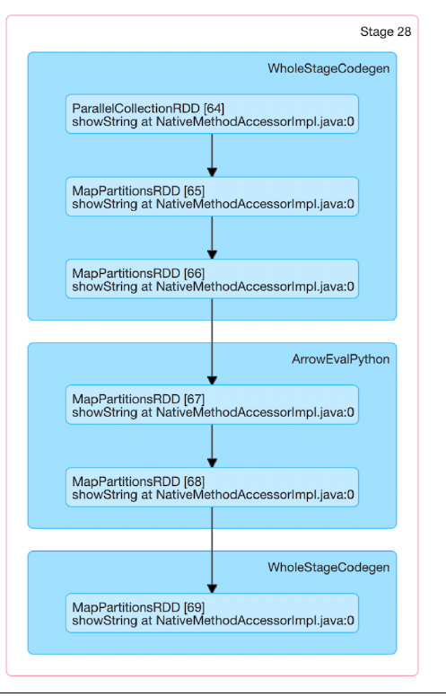
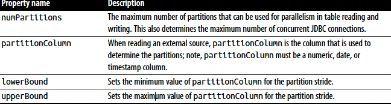
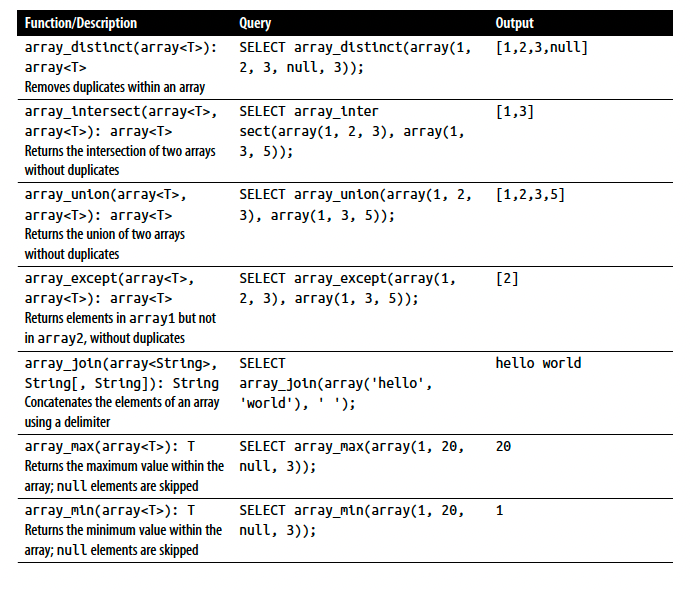
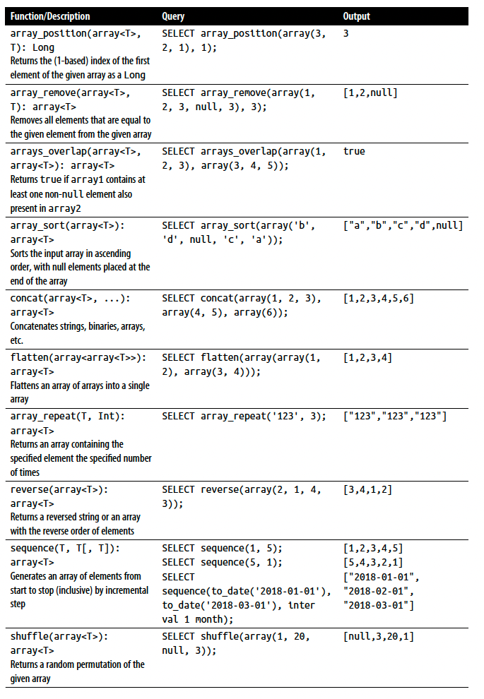
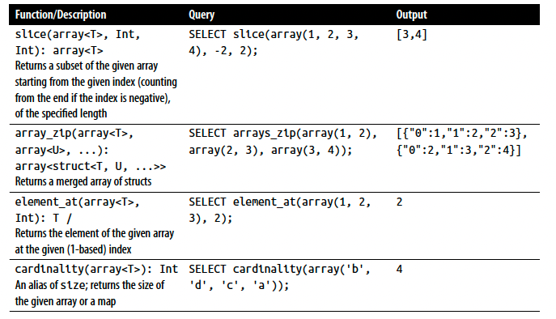
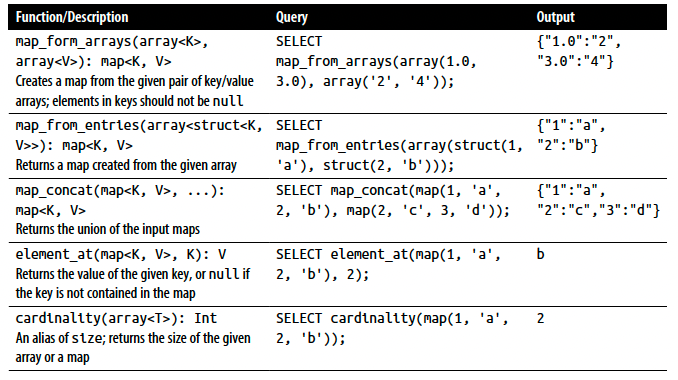
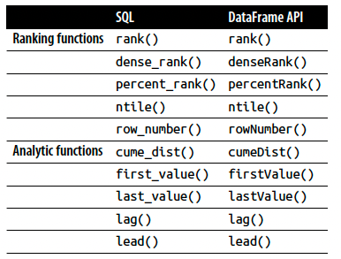

# Chapter 5: Spark SQL and DataFrames: Interacting with External Data Sources

- In this chapter, we will focus on how Spark SQL interfaces with external components. Specifically, we discuss how Spark SQL allows you to:

    -  Use user-defined functions for both Apache Hive and Apache Spark.
    
    - Connect with external data sources such as JDBC and SQL databases, PostgreSQL, MySQL, Tableau, Azure Cosmos DB, and MS SQL Server.
    
    - Work with simple and complex types, higher-order functions, and common relational operators.


## Spark SQL and Apache Hive


#### User-Defined Functions

- The benefit of creating your own PySpark or Scala UDFs is that you (and others) will be able to make use of them within Spark SQL itself

```scala
val cubed = (s: Long) => {
    s * s * s
}

spark.udf.register("cubed", cubed)

spark.range(1, 9).createOrReplaceTempView("udf_test")

spark.sql("""
select
    id,
    cubed(id) as id_cubed
    from udf_test
""").show()
```

#### Speeding up and distributing PySpark UDFs with Pandas UDFs

- One of the previous prevailing issues with using PySpark UDFs was that they had slower performance than Scala UDFs. This was because the PySpark UDFs required data movement between the JVM and Python, which was quite expensive

- To resolve this problem, Pandas UDFs (also known as vectorized UDFs) were introduced as part of Apache Spark 2.3. A Pandas UDF uses Apache Arrow to transfer data and Pandas to work with the data. You define a Pandas UDF using the keyword pandas_udf as the decorator, or to wrap the function itself. Once the data is in Apache Arrow format, there is no longer the need to serialize/pickle the data as it is already in a format consumable by the Python process.

```python
import pandas as pd
from pyspark.sql.functions import col, pandas_udf
from pyspark.sql.types import LongType

def cubed(a: pd.Series) -> pd.Series:
    return a*a*a

x = pd.Series([1, 2, 3])
print(cubed(x))

# The preceding code snippet declares a function called cubed() that performs a cubed operation.

cubed_udf = pandas_udf(cubed, returnType = LongType())

# Create a Spark DataFrame, 'spark' is an existing SparkSession
df = spark.range(1, 4)

# Execute function as a Spark vectorized UDF
df.select("id", cubed_udf(col("id"))).show()
```

- As opposed to a local function, using a vectorized UDF will result in the execution of Spark jobs; the previous local function is a Pandas function executed only on the Spark driver.

- 

- Like many Spark jobs, the job starts with parallelize() to send local data (Arrow binary batches) to executors and calls mapPartitions() to convert the Arrow binary batches to Spark’s internal data format, which can be distributed to the Spark workers.

- There are a number of steps, which represent a fundamental WholeStageCodegen step up in performance. But it is the ArrowEvalPython step that identifies that (in this case) a Pandas UDF is being executed.

## Querying with the Spark SQL Shell, Beeline, and Tableau

- To start the Spark SQL CLI, execute the following command in the $SPARK_HOME folder: **_./bin/spark-sql_**


```sql
CREATE TABLE people (name STRING, age int);

INSERT INTO people VALUES ("Michael", NULL);
INSERT INTO people VALUES ("Andy", 30);
INSERT INTO people VALUES ("Samantha", 19);

SHOW TABLES;
SELECT * FROM people WHERE age < 20;
SELECT name FROM people WHERE age IS NULL;
```

## External Data Sources

- Spark SQL includes a data source API that can read data from other databases using JDBC.

#### The importance of partitioning

- When transferring large amounts of data between Spark SQL and a JDBC external source, it is important to partition your data source. All of your data is going through one driver connection, which can saturate and significantly slow down the performance of your extraction, as well as potentially saturate the resources of your source system.

- 

- A good starting point for is to use a multiple of the number of numPartitions Spark workers. For example, if you have four Spark worker nodes, then perhaps start with 4 or 8 partitions.

- calculate the lowerBound and upperBound based on the minimum and
maximum partitionColumn actual values.
 
- Choose a partitionColumn that can be uniformly distributed to avoid data skew.

## Higher-Order Functions in DataFrames and Spark SQL

- Because complex data types are amalgamations of simple data types, it is tempting to manipulate them directly. There are two typical solutions for manipulating complex data types:

    - Exploding the nested structure into individual rows, applying some function, and then re-creating the nested structure
    - Building a user-defined function


#### Option 1: Explode and Collect

``` SQL
select
    id,
    collect_list(value+1) as values
from (
    select
        id, explode(values) as value
    from table
) x
group by id
```

- In this nested SQL statement, we first explode(values), which creates a new row (with the id) for each element (value) within values

- the GROUP BY statemnt requires shuffle operations, meaning the order of the re-collected array isn’t necessarily the same as that of the original array.

#### Option 2: User-Defined Function

- To perform the same task (adding 1 to each element in values), we can also create a UDF that uses map() to iterate through each element (value) and perform the addition operation

```scala
spark.sql("SELECT id, plusOneInt(values) AS values FROM table").show()
```

- While this is better than using explode() and collect_list() as there won’t be any ordering issues, the serialization and deserialization process itself may be expensive.

#### Built-in Functions for Complex Data Types

- 

- 

- 

- 

#### Higher-Order Functions

- **_transform()_**

    - The transform() function takes an array (values) and anonymous function (lambda expression) as input. The function transparently creates a new array by applying the anonymous function to each element, and then assigning the result to the output array (similar to the UDF approach, but more efficiently).

    - transform(array<T>, function<T, U>): array<U>

```scala
val t1 = Array(35, 36, 32, 30, 40, 42, 38)
val t2 = Array(31, 32, 34, 55, 56)
val tc = Seq(t1, t2).toDF("celsius")

tc.createOrReplaceTempView("tc")

tc.show()

spark.sql(
"""
select
    celsius,
    transform(celsius, t -> ((t*9) div 5) + 32) as fahrenheit
from tc
"""
).show()
```
- **_filter()_**

    - The filter() function produces an array consisting of only the elements of the input array for which the Boolean function is true

    - filter(array<T>, function<T, Boolean>): array<T>

```scala
spark.sql(
"""
select
     celsius,
     filter(celsius, t -> t > 38) as high
from tc
"""
).show()
```

- **_exists()_**

    - The exists() function returns true if the Boolean function holds for any element in the input array

    - exists(array<T>, function<T, V, Boolean>): Boolean

```scala
spark.sql(
"""
select
    celsius,
    exists(celsius, t -> t = 38) as threshold
from tc
"""
).show()
```

- **_reduce()_**

    - The reduce() function reduces the elements of the array to a single value by merging the elements into a buffer B using function<B, T, B> and applying a finishing function<B, R> on the final buffer

    - reduce(array<T>, B, function<B, T, B>, function<B, R>)

```scala
spark.sql(
"""
select
    celsius,
    reduce(celsius, 0, (t, acc) -> acc + t, acc -> (acc div size(celsius) * 9 div 5) + 32) as avgFahrenheit
from tc
"""
).show()
```

## Common DataFrames and Spark SQL Operations

-  Aggregate functions
-  Collection functions
-  Datetime functions
-  Math functions
-  Miscellaneous functions
-  Non-aggregate functions
-  Sorting functions
-  String functions
-  UDF functions
-  Window functions

#### Example

```scala
val delay_path = "./data/departuredelays.csv"
val airport_path = "./data/airport-codes-na.txt"

val airport = spark.read
    .option("header", "true")
    .option("inferSchema", "true")
    .option("delimiter", "\t")
    .csv(airport_path)

airport.createOrReplaceTempView("airports_na")

val delay = spark.read
    .option("header", "true")
    .csv(delay_path)
    .withColumn("delay", expr("CAST(delay as INT) as delay"))
    .withColumn("distance", expr("CAST(distance as int) as distance"))

delay.createOrReplaceTempView("departureDelays")

val foo = delay.filter(
    expr("""origin == 'SEA' AND destination == 'SFO'
    AND date like '01010%' AND delay > 0 """)
)

foo.createOrReplaceTempView("foo")

spark.sql(
    """
    select 
    *
    from airports_na
    limit 10
    """
).show()

spark.sql(
    """
    select 
    *
    from departureDelays
    limit 10
    """
).show()

spark.sql(
    """
    select 
    *
    from foo
    limit 10
    """
).show()
```

- **_Union_**

```scala
val bar = delay.union(foo)

bar.createOrReplaceTempView("bar")

bar.filter(expr("""origin == 'SEA' AND destination == 'SFO' 
AND date like '01010%' AND delay > 0
""")).show()
```

- **_Joins_**

- By default, a Spark SQL join is an inner join, with the options being inner, cross, outer, full, full_outer, left, left_outer, right, right_outer, left_semi, and left_anti.

```scala
foo.join(
    airport.as("air"),
    $"air.IATA" === $"origin"
).select("City","State", "date", "delay", "distance", "destination").show()
```

- **_Windowing_**

- A window function uses values from the rows in a window (a range of input rows) to return a set of values, typically in the form of another row

- 

```sql
drop table if exists departureDelaysWindow

create table departureDelaysWindow as
select origin, destination, sum(delay) as total_delays
from departureDelays
where origin in ("SEA", "SFO", "JFK")
and destination in ("SEA", "SFO", "JFK", "DEN", 
    "ORD", "LAX", "ATL")
group by origin, destination

select * from departureDelaysWindow
```

- What if for each of these origin airports you wanted to find the three destinations that experienced the most delays?

```sql
select
    origin,
    destination,
    TotalDelays,
    rank
from (
    select
        origin,
        destination,
        TotalDelays,
        dense_rank() over (partition by origin order by TotalDelays desc) as rank
    from departureDelaysWindow
) t
where rank <= 3
```

- **_Modification_**

- Another common operation is to perform modifications to the DataFrame. While DataFrames themselves are immutable, you can modify them through operations that create new, different DataFrames, with different columns. for example, (Recall from earlier chapters that the underlying RDDs are immutable to ensure there is data lineage for Spark operations) 

```scala
// adding new columns
val foo2 = foo.withColumn(
    "status",
    expr("case when delay <= 10 then 'on-time'
    else 'delayed' end")
)

// dropping columns
val foo3 = foo.drop("delay")

// renaming columns
val foo4 = foo.withColumnRenamed("status", "flight_status")
```

```sql
-- pivoting data
select
    destination,
    cast(substring(date, 0, 2) as int) as month,
    delay
from departureDelays
where origin = 'SEA'


select * from (
    select
        destination,
        cast(substring(date, 0, 2) as int) as month,
        delay
    from departureDelays
    where origin = 'SEA'
) pivot (
    cast(avg(delay) as decimal(4, 2)) as avgDelay,
    max(delay) as maxDelay
    for month in (1 JAN, 2 FEB)
)
order by destination
```