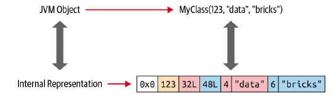
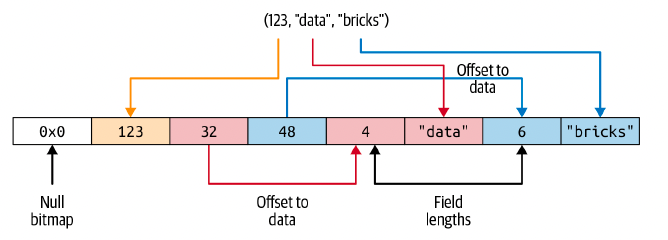
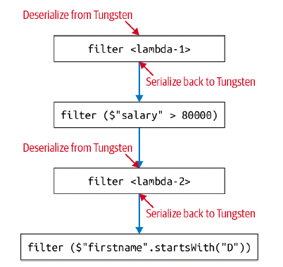

# Chapter 6: Spark SQL and Datasets

- In Chapters 4 and 5, we covered Spark SQL and the DataFrame API. We looked at how to connect to built-in and external data sources, took a peek at the Spark SQL engine, and explored topics such as the interoperability between SQL and DataFrames, creating and managing views and tables, and advanced DataFrame and SQL transformations.

- In this chapter, we go under the hood to understand Datasets: we’ll explore working with Datasets in Java and Scala, how Spark manages memory to accommodate Dataset constructs as part of the high-level API, and the costs associated with using Datasets.

## Single API for Java and Scala

- Datasets are domain-specific typed objects that can be operated on in parallel using functional programming or the DSL operators you’re familiar with from the DataFrame API.

## Scala Case Classes and JavaBeans for Datasets

- Spark has internal data types, such as StringType, BinaryType, IntegerType, BooleanType, and MapType, that it uses to map seamlessly to the language-specific data types in Scala and Java during Spark operations.

- In order to create Dataset[T], where T is your typed object in Scala, you need a case class that defines the object.

- Using our example data from Chapter 3 (Table 3-1), say we have a JSON file with millions of entries about bloggers writing about Apache Spark in the following format:

    {id: 1, first: "Jules", last: "Damji", url: "https://tinyurl.1", date:"1/4/2016", hits: 4535, campaigns: {"twitter", "LinkedIn"}}

- To create a distributed Dataset[Bloggers], we must first define a Scala case class that defines each individual field that comprises a Scala object. This case class serves as a blueprint or schema for the typed object Bloggers

```scala
case class Bloggers(id: Int, first: String, last: String, url: String, date: String, hits: Int, campaigns: Array[String])

val bloggers = "./data/blogs.json"

val bloggersDS = spark
    .read 
    .format("json")
    .option("path", bloggers)
    .load()
    .as[Bloggers]
```

```java
import org.apache.spark.sql.Encoders;
import java.io.Serializable;

public class Bloggers implements Serializable {
    private int id;
    private String first;
    private String last;
    private String url;
    private String date;
    private int hits;
    private Array[String] campaigns;

    int getID(){return id;}
    void setID(int i) { id = i; }
    String getFirst() { return first; }
    void setFirst(String f) { first = f; }
    String getLast() { return last; }
    void setLast(String l) { last = l; }
    String getURL() { return url; }
    void setURL (String u) { url = u; }
    String getDate() { return date; }
    Void setDate(String d) { date = d; }
    int getHits() { return hits; }
    void setHits(int h) { hits = h; }
    Array[String] getCampaigns() { return campaigns; }
    void setCampaigns(Array[String] c) { campaigns = c; }
}

Encoder<Bloggers> BloggerEncoder = Encoders.bean(Bloggers.class);
String bloggers = "../blogger.json"
Dataset<Bloggers> bloggersDS = spark
    .read
    .format("json")
    .option("path", bloggers)
    .load()
    .as(BloggerEncoder)
```

## Working with Datasets

#### Creating sample data

``` scala
import scala.util.Random._

case class Usage(uid: Int, uname: String, usage: Int)

val r = new scala.util.Random(42)
val data = for (i <- 0 to 1000)
    yield(Usage(i, "user-" + r.alphanumeric.take(5).mkString(""),
               r.nextInt(1000)))

val dsUsage = spark.createDataset(data)
dsUsage.show(10)
```

#### Transforming sample data

- Recall that Datasets are strongly typed collections of domain-specific objects. These objects can be transformed in parallel using functional or relational operations. Examples of these transformations include map(), reduce(), filter(), select(), and aggregate(). As examples of higher-order functions, these methods can take lambdas, closures, or functions as arguments and return the results. As such, they lend themselves well to functional programming.

- Higher-order functions and functional programming

```scala
dsUsage
    .filter(d => d.usage > 900)
    .orderBy(desc("usage"))
    .show(5, false)

def filter_with_usage(u: Usage) = u.usage > 900

dsUsage
    .filter(filter_with_usage(_))
    .orderBy(desc("usage")).show(5)
```

- In the first case we used a lambda expression, {d.usage > 900}, as an argument to the filter() method, whereas in the second case we defined a Scala function, def filterWithUsage(u: Usage) = u.usage > 900

- the method filter() iterates over each row of the Usage object in the distributed Dataset and applies the  expression or executes the function, returning a new Dataset of type Usage for rows where the value of the expression or function is true.

- Not all lambdas or functional arguments must evaluate to Boolean; they can return computed values too. Consider this example using the higher-order function map(), where our aim is to find out the usage cost for each user whose usage value is over a certain threshold so we can offer those users a special price per minute.

```scala
dsUsage.map(u => {if (u.usage > 750) u.usage * 0.15 else u.usage * 0.5})
        .show(5, false)

def computeCostUsage(usage: Int): Double = {
    if (usage > 750) usage * 0.15
    else usage*0.5
}

dsUsage.map(u => {computeCostUsage(u.usage)}).show(5, false)
```

```scala
case class UsageCost(uid: Int, uname: String, usage: Int, cost: Double)

def computeUserCostUsage(u: Usage): UsageCost = {
    val v = if (u.usage > 750) u.usage * 0.15 else u.usage * 0.5
    UsageCost(u.uid, u.uname, u.usage, v)
}

dsUsage.map(u => {computUserCostUsage(u)}).show(5)
```

- We are using typed JVM objects as arguments to functions.
- We are using dot notation (from object-oriented programming) to access individual fields within the typed JVM object, making it easier to read.
- Some of our functions and lambda signatures can be type-safe, ensuring compiletime error detection and instructing Spark what data types to work on, what operations to perform, etc.
- Our code is readable, expressive, and concise, using Java or Scala language features in lambda expressions.
- Spark provides the equivalent of map() and filter() without higher-order functional constructs in both Java and Scala, so you are not forced to use functional programming with Datasets or DataFrames.
- For Datasets we use encoders, a mechanism to efficiently convert data between JVM and Spark’s internal binary format for its data types

#### Converting DataFrames to Datasets

- For strong type checking of queries and constructs, you can convert DataFrames to Datasets. To convert an existing DataFrame df to a Dataset of type SomeCaseClass, simply use the df.as[SomeCaseClass] notation

## Memory Management for Datasets and DataFrames

- Spark is an intensive in-memory distributed big data engine, so its efficient use of memory is crucial to its execution speed.1 Throughout its release history, Spark’s usage of memory has significantly evolved:

    - Spark 1.0 used RDD-based Java objects for memory storage, serialization, and deserialization, which was expensive in terms of resources and slow. Also, storage was allocated on the Java heap, so you were at the mercy of the JVM’s garbage collection (GC) for large data sets.

    - Spark 1.x introduced Project Tungsten. One of its prominent features was a new internal row-based format to lay out Datasets and DataFrames in off-heap memory, using offsets and pointers. Spark uses an efficient mechanism called encoders to serialize and deserialize between the JVM and its internal Tungsten format.Allocating memory off-heap means that Spark is less encumbered by GC.

    - Spark 2.x introduced the second-generation Tungsten engine, featuring wholestage code generation and vectorized column-based memory layout. Built on ideas and techniques from modern compilers, this new version also capitalized on modern CPU and cache architectures for fast parallel data access with the “single instruction, multiple data” (SIMD) approach.


## Dataset Encoders

- Encoders convert data in off-heap memory from Spark’s internal Tungsten format to JVM Java objects. In other words, they serialize and deserialize Dataset objects from Spark’s internal format to JVM objects, including primitive data types.including primitive data types. For example, an Encoder[T] will convert from Spark’s internal Tungsten format to Dataset[T].

- Spark has built-in support for automatically generating encoders for primitive types (e.g., string, integer, long), Scala case classes, and JavaBeans. Compared to Java and Kryo serialization and deserialization, Spark encoders are significantly faster.

- Encoder<UsageCost> usageCostEncoder = Encoders.bean(UsageCost.class);

## Spark’s Internal Format Versus Java Object Format

- Java objects have large overheads—header info, hashcode, Unicode info, etc. Even a simple Java string such as “abcd” takes 48 bytes of storage, instead of the 4 bytes you might expect. Imagine the overhead to create, for example, a MyClass(Int, String, String) object.

- Instead of creating JVM-based objects for Datasets or DataFrames, Spark allocates off-heap Java memory to lay out their data and employs encoders to convert the data from in-memory representation to JVM object. For example, Figure 6-1 shows how the JVM object MyClass(Int, String, String) would be stored internally.

- 

- When data is stored in this contiguous manner and accessible through pointer arithmetic and offets, encoders can quickly serialize or deserialize that data

## Serialization and Deserialization (SerDe)

- A concept not new in distributed computing, where data frequently travels over the network among computer nodes in a cluster, serialization and deserialization is the process by which a typed object is encoded (serialized) into a binary presentation or format by the sender and decoded (deserialized) from binary format into its respective data-typed object by the receiver.

- For example, if the JVM object MyClass in Figure 6-1 had to be shared among nodes in a Spark cluster, the sender would serialize it into an array of bytes, and the receiver would deserialize it back into a JVM object of type MyClass.

- The JVM has its own built-in Java serializer and deserializer, but it’s inefficient because (as we saw in the previous section) the Java objects created by the JVM in the heap memory are bloated. Hence, the process is slow.This is where the Dataset encoders come to the rescue, for a few reasons:

    - spark’s internal Tungsten binary format (see Figures 6-1 and 6-2) stores objects off the Java heap memory, and it’s compact so those objects occupy less space.
    - Encoders can quickly serialize by traversing across the memory using simple pointer arithmetic with memory addresses and offsets (Figure 6-2).
    - On the receiving end, encoders can quickly deserialize the binary representation into Spark’s internal representation. Encoders are not hindered by the JVM’s garbage collection pauses.

- 

## Costs of Using Datasets

- when Datasets are passed to higher-order functions such as filter(), map(), or flatMap() that take lambdas and functional arguments, there is a cost associated with deserializing from Spark’s internal Tungsten format into the JVM object.

#### Strategies to Mitigate Costs

- One strategy to mitigate excessive serialization and deserialization is to use DSL expressions in your queries and avoid excessive use of lambdas as anonymous functions as arguments to higher-order functions. Because lambdas are anonymous and opaque to the Catalyst optimizer until runtime, when you use them it cannot efficiently discern what you’re doing (you’re not telling Spark what to do) and thus cannot optimize your queries

- The second strategy is to chain your queries together in such a way that serialization and deserialization is minimized. Chaining queries together is a common practice in Spark.

- Let’s examine a case where we compose a query inefficiently, in such a way that we unwittingly incur the cost of repeated serialization and deserialization:

```scala

Person(id: Integer, firstName: String, middleName: String, lastName: String,
gender: String, birthDate: String, ssn: String, salary: String)

import java.util.Calendar

val earliestYear = Calendar.getInstance.get(Calendar.YEAR) - 40

personDS
// Everyone above 40: lambda-1
.filter(x => x.birthDate.split("-")(0).toInt > earliestYear)
// Everyone earning more than 80K
.filter($"salary" > 80000)
// Last name starts with J: lambda-2
.filter(x => x.lastName.startsWith("J"))
// First name starts with D
.filter($"firstName".startsWith("D"))
.count()

```
- each time we move from lambda to DSL (filter($"salary" > 8000)) we incur the cost of serializing and deserializing the Person JVM object.

- 

- By contrast, the following query uses only DSL and no lambdas. As a result, it’s much more efficient—no serialization/deserialization is required for the entire composed and chained query:

```scala
personDS
    .filter(year($"birthDate") > earliestYear) // Everyone above 40
    .filter($"salary" > 80000) // Everyone earning more than 80K
    .filter($"lastName".startsWith("J")) // Last name starts with J
    .filter($"firstName".startsWith("D")) // First name starts with D
    .count()
```