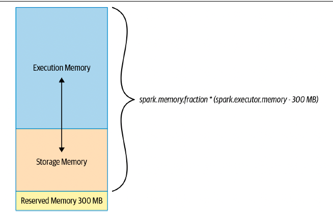
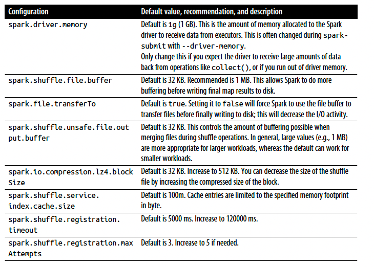
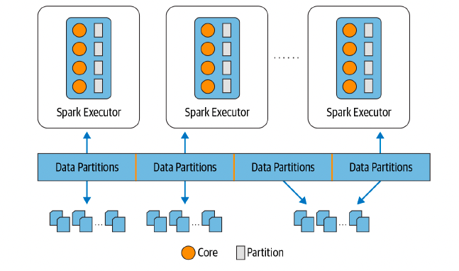
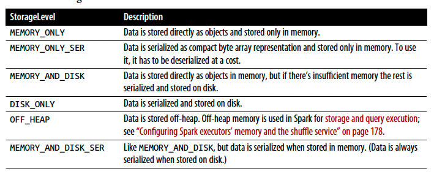
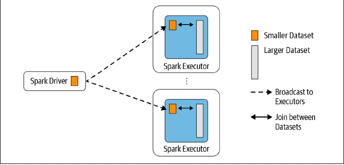
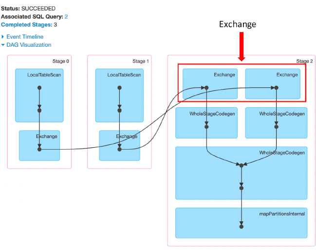
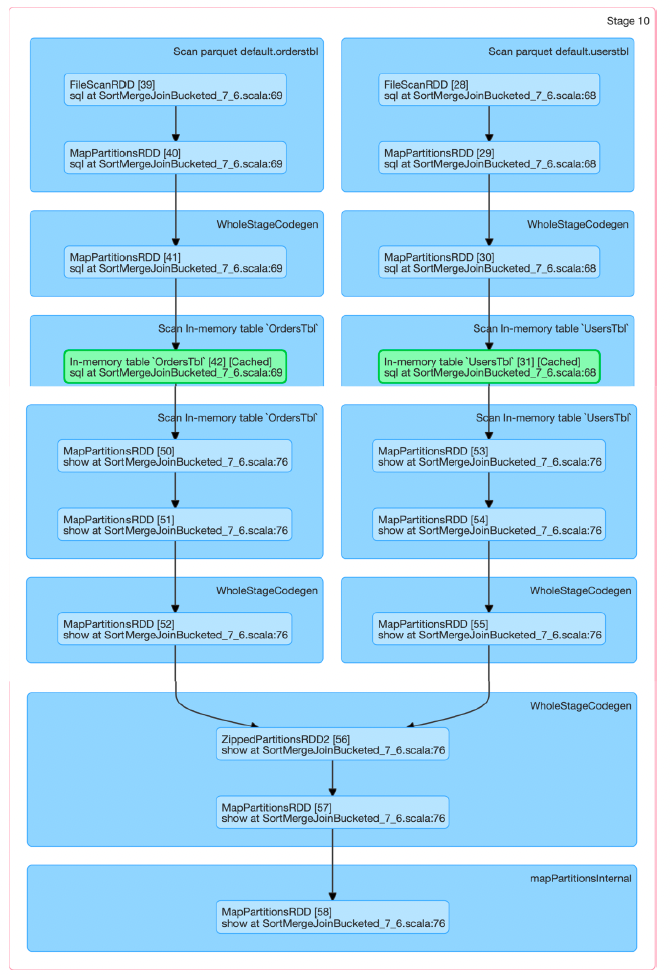

# Chapter 7: Optimizing and Tuning Spark Applications

- In this chapter, we will discuss a set of Spark configurations that enable optimizations, look at Spark’s family of join strategies, and inspect the Spark UI, looking for clues to bad behavior.

## Optimizing and Tuning Spark for Efficiency

#### Viewing and Setting Apache Spark Configurations

- There are three ways you can get and set Spark properties

    - The first is through a set of configuration files. In your deployment’ $SPARK_HOME directory. there are a number of config files: conf/spark-defaults.conf.template, conf/log4j.properties.template, and conf/spark-env.sh.template.

    - The second way is to specify Spark configurations directly in your Spark application or on the command line when submitting the application with spark-submit, using the --conf flag.

        spark-submit --conf spark.sql.shuffle.partitions=5 --conf "spark.executor.memory=2g" --class main.scala.chapter7.SparkConfig_7_1 jars/mainscala-chapter7_2.12-1.0.jar

    ```scala
    import org.apache.spark.sql.SparkSession

    def printConfigs(session: SparkSession) = {
        val mconf = session.conf.getAll
        for (k <- mconf.keySet) {
            println(s"${k} -> ${mconf(k)}\n")
        }
    }

    def main(args: Array[String]) {
        val spark = SparkSession.builder
            .config("spark.sql.shuffle.partitions", 5)
            .config("spark.executor.memor", 2g)
            .master("local[*]")
            .appName("SparkConfig")
            .getOrCreate()
        
        printConfigs(spark)
        spark.conf.set(spark.sql.shuffle.partitions, 
        spark.sparkContext.defaultParallelism)

        println("****** setting shuffle partitions to default parallelism")
        printConfigs(spark)
    }
    ```

    - The third option is through a programmatic interface via the Spark shell. 

    - Alternatively, you can access Spark’s current configuration through the Spark UI’s Environment tab.

    - To set or modify an existing configuration programmatically, first check if the property is modifiable. spark.conf.isModifiable("<config_name>") will return true or false.

    ```scala
    spark.conf.get("spark.sql.shuffle.partitions")
    spark.conf.set("spark.sql.shuffle.partitions", 5)

    ```

    - an order of precedence determines which values are honored. Any values or flags defined in spark-defaults.conf will be read first, followed by those supplied on the command line with spark submit, and finally those set via SparkSession in the Spark application. Likewise, values supplied on the command line will supersede settings in the configuration file, provided they are not overwritten in the application itself.

#### Scaling Spark for Large Workloads

- Large Spark workloads are often batch jobs—some run on a nightly basis, while some are scheduled at regular intervals during the day. In either case, these jobs may process tens of terabytes of data or more. To avoid job failures due to resource starvation or gradual performance degradation, there are a handful of Spark configurations that you can enable or alter. These configurations affect three Spark components: the Spark driver, the executor, and the shuffle service running on the executor.

- Static versus dynamic resource allocation

    When you specify compute resources as command-line arguments to spark-submit, as we did earlier, you cap the limit. This means that if more resources are needed later as tasks queue up in the driver due to a larger than anticipated workload, Spark can not accommodate or allocate extra resources.

    If instead you use Spark’s dynamic resource allocation configuration, the Spark driver can request more or fewer compute resources as the demand of large workloads flows and ebbs. In scenarios where your workloads are dynamic—that is, they vary in their demand for compute capacity—using dynamic allocation helps to accommodate sudden peaks.

    One use case where this can be helpful is streaming, where the data flow volume maybe uneven. Another is on-demand data analytics, where you might have a high volume of SQL queries during peak hours. Enabling dynamic resource allocation allows Spark to achieve better utilization of resources, freeing executors when not in use and acquiring new ones when needed.

    As well as when working with large or varying workloads, dynamic allocation is also useful in a multitenant environment, where Spark may be deployed alongside other applications or services in YARN, Mesos, or Kubernetes.

    To enable and configure dynamic allocation, you can use settings like the following.

    ```scala
    spark.dynamicAllocation.enabled true
    spark.dynamicAllocation.minExecutors 2
    spark.dynamicAllocation.schedulerBacklogTimeout 1m
    spark.dynamicAllocation.maxExecutors 20
    spark.dynamicAllocation.executorIdleTimeout 2min
    ```

    By default spark.dynamicAllocation.enabled is set to false. When enabled with the settings shown here, the Spark driver will request that the cluster manager create two executors to start with, as a minimum (spark.dynamicAllocation.minExecutors). As the task queue backlog increases, new executors will be requested each time the backlog timeout (spark.dynamicAllocation.schedulerBacklogTimeout) is exceeded. In this case, whenever there are pending tasks that have not been scheduled for over 1 minute, the driver will request that a new executor be launched to schedule backlogged tasks, up to a maximum of 20 (spark.dynamicAllocation.maxExecutors). By contrast, if an executor finishes a task and is idle for 2 minutes (spark.dynamicAllocation.executorIdleTimeout), the Spark driver will terminate it.

- Configuring Spark executors’ memory and the shuffle service

    Simply enabling dynamic resource allocation is not sufficient. You also have to understand how executor memory is laid out and used by Spark so that executors are not starved of memory or troubled by JVM garbage collection.

    The amount of memory available to each executor is controlled by spark.executor.memory. This is divided into three sections: **_execution memory, storage memory, and reserved memory_**. The default division is 60% for execution memory and 40% for storage, after allowing for 300 MB for reserved memory, to safeguard against OOM errors.

    -

    Execution memory is used for Spark shuffles, joins, sorts, and aggregations. Since different queries may require different amounts of memory, the fraction (spark.memory.fraction is 0.6 by default) of the available memory to dedicate to this can be tricky to tune but it’s easy to adjust. By contrast, storage memory is primarily used for caching user data structures and partitions derived from DataFrames.

    During map and shuffle operations, Spark writes to and reads from the local disk’s shuffle files, so there is heavy I/O activity. This can result in a bottleneck, because the default configurations are suboptimal for large-scale Spark jobs. Knowing what configurations to tweak can mitigate this risk during this phase of a Spark job.

    -

 - Maximizing Spark parallelism
    
    Much of Spark’s efficiency is due to its ability to run multiple tasks in parallel at scale. To understand how you can maximize parallelism—i.e., read and process as much data in parallel as possible, you have to look into how Spark reads data into memory from storage and what partitions mean to Spark.

    In data management parlance, a partition is a way to arrange data into a subset of configurable and readable chunks or blocks of contiguous data on disk. Spark is embarrassingly efficient at processing its tasks in parallel.

    Spark is embarrassingly efficient at processing its tasks in parallel. for large-scale workloads a Spark job will have many stages, and within each stage there will be many tasks. Spark will at best schedule a thread per task per core, and each task will process a distinct partition. To optimize resource utilization and maximize parallelism, the ideal is at least as many partitions as there are cores on the executor, You can think of partitions as atomic units of parallelism: a single thread running on a single core can work on a single partition.

    -

- How partitions are created

    As mentioned previously, Spark’s tasks process data as partitions read from disk into memory. Data on disk is laid out in chunks or contiguous file blocks, depending on the store. By default, file blocks on data stores range in size from 64 MB to 128 MB. For example, on HDFS and S3 the default size is 128 MB (this is configurable). A contiguous collection of these blocks constitutes a partition.

    The size of a partition in Spark is dictated by spark.sql.files.maxPartitionBytes.The default is 128 MB. You can decrease the size, but that may result in what’s known as the “small file problem”—many small partition files, introducing an inordinate amount of disk I/O and performance degradation

    while creating a large DataFrame or reading a large file from disk, you can explicitly instruct Spark to create a certain number of partitions:

    ```scala
    val ds = spark.read.textFile("../README.md").repartition(16)
    ```

    - Finally, shuffle partitions are created during the shuffle stage. By default, the number of shuffle partitions is set to 200 in spark.sql.shuffle.partitions. You can adjust this number depending on the size of the data set you have, to reduce the amount of small partitions being sent across the network to executors’ tasks.

    - Created during operations like groupBy() or join(), also known as wide transformations, shuffle partitions consume both network and disk I/O resources. During these operations, the shuffle will spill results to executors’ local disks at the location specified in spark.local.directory. Having performant SSD disks for this operation will boost the performance. There is no magic formula for the number of shuffle partitions to set for the shuffle stage; the number may vary depending on your use case, data set, number of cores, and the amount of executor memory available—it’s a trial-and-error approach.

## Caching and Persistence of Data

- What is the difference between caching and persistence? In Spark they are synonymous. Two API calls, cache() and persist(), offer these capabilities. The latter provides more control over how and where your data is stored—in memory and on disk, serialized and unserialized.

#### DataFrame.cache()

- cache() will store as many of the partitions read in memory across Spark executors as memory allows (see Figure 7-2). While a DataFrame may be fractionally cached, partitions cannot be fractionally cached (e.g., if you have 8 partitions but only 4.5 partitions can fit in memory, only 4 will be cached).

```scala
// In Scala
// Create a DataFrame with 10M records
val df = spark.range(1 * 10000000).toDF("id").withColumn("square", $"id" * $"id")
df.cache() // Cache the data
df.count() // Materialize the cache
// res3: Long = 10000000
// Command took 5.11 seconds
df.count() // Now get it from the cache
// res4: Long = 10000000
// Command took 0.44 seconds
```
- When you use cache() or persist(), the DataFrame is not fully cached until you invoke an action that goes through every record (e.g., count()).

#### DataFrame.persist()

- persist(StorageLevel.LEVEL) is nuanced, providing control over how your data is
cached via StorageLevel. Data on disk is always serialized using either Java or Kryo serialization.

- 

```scala
// In Scala
import org.apache.spark.storage.StorageLevel
// Create a DataFrame with 10M records
val df = spark.range(1 * 10000000).toDF("id").withColumn("square", $"id" * $"id")
df.persist(StorageLevel.DISK_ONLY) // Serialize the data and cache it on disk
df.count() // Materialize the cache
// res2: Long = 10000000
// Command took 2.08 seconds
df.count() // Now get it from the cache
// res3: Long = 10000000
// Command took 0.38 seconds
```

- To unpersist your cached data, just call DataFrame.unpersist().

- not only can you cache DataFrames, but you can also cache the tables or views derived from DataFrames.

```scala
// In Scala
df.createOrReplaceTempView("dfTable")
spark.sql("CACHE TABLE dfTable")
spark.sql("SELECT count(*) FROM dfTable").show()
```

#### When to Cache and Persist

- DataFrames commonly used during iterative machine learning training
- DataFrames accessed commonly for doing frequent transformations during ETL
or building data pipelines

#### When Not to Cache and Persist

- DataFrames that are too big to fit in memory
- An inexpensive transformation on a DataFrame not requiring frequent use, regardless of size

## A Family of Spark Joins

- At the heart of these transformations is how Spark computes what data to produce, what keys and associated data to write to the disk, and how to transfer those keys and data to nodes as part of operations like groupBy(), join(), agg(), sortBy(), and reduceByKey(). This movement is commonly referred to as the shuff

- Spark has five distinct join strategies by which it exchanges, moves, sorts, groups, and merges data across executors: the broadcast hash join (BHJ), shuffle hash join (SHJ), shuffle sort merge join (SMJ), broadcast nested loop join (BNLJ), and shuffle-and replicated nested loop join (a.k.a. Cartesian product join).

#### Broadcast Hash Join

- Also known as a map-side-only join, the broadcast hash join is employed when two data sets, one small (fitting in the driver’s and executor’s memory) and another large enough to ideally be spared from movement, need to be joined over certain conditions or columns. Using a Spark broadcast variable, the smaller data set is broadcasted by the driver to all Spark executors and subsequently joined with the larger data set on each executor.

- 

- By default Spark will use a broadcast join if the smaller data set is less than 10 MB. This configuration is set in spark.sql.autoBroadcastJoinThreshold; you can decrease or increase the size depending on how much memory you have on each executor and in the driver. If you are confident that you have enough memory you can use a broadcast join with DataFrames larger than 10 MB (even up to 100 MB).

```scala
improt org.apache.spark.sql.functions.broadcast

val joinDF = playerDF.join(broadcast(clubsDF), "key1 === key2")

```

- The BHJ is the easiest and fastest join Spark offers, since it does not involve any shuffle of the data set; all the data is available locally to the executor after a broadcast. You just have to be sure that you have enough memory both on the Spark driver’s and the executors’ side to hold the smaller data set in memory.

- When to use a broadcast hash join

    - When each key within the smaller and larger data sets is hashed to the same partition by Spark
    - When one data set is much smaller than the other (and within the default config of 10 MB, or more if you have sufficient memory)
    - When you only want to perform an equi-join, to combine two data sets based on matching unsorted keys
    - When you are not worried by excessive network bandwidth usage or OOM errors, because the smaller data set will be broadcast to all Spark executors

#### Shuffle Sort Merge Join

- The sort-merge algorithm is an efficient way to merge two large data sets over a common key that is sortable, unique, and can be assigned to or stored in the same partition— that is, two data sets with a common hashable key that end up being on the same partition.

- this means that all rows within each data set with the same key are hashed on the same partition on the same executor. Obviously, this means data has to be colocated or exchanged between executors.

- As the name indicates, this join scheme has two phases: a sort phase followed by a merge phase. The sort phase sorts each data set by its desired join key; the merge phase iterates over each key in the row from each data set and merges the rows if the two keys match.

- By default, the SortMergeJoin is enabled via spark.sql.join.preferSortMerge Join.

```scala

import scala.util.Random

spark.conf.set("spark.sql.autoBroadcastJoinThreshold", "-1")

val states = scala.collection.mutable.Map[Int, String]()
val items = scala.collection.mutable.Map[Int, String]()
val rnd = new scala.util.Random(42)

states += (0 -> "AZ", 1 -> "CO", 2 -> "CA", 3 -> "TX", 4 -> "NY", 5 -> "MI")
items += (0 -> "SKU-0", 1 -> "SKU-1", 2 -> "SKU-2", 3 -> "SKU-3", 4 -> "SKU-4",
         5 -> "SLU-5")

val userDF = (0 to 1000000).map(id => (id, s"user_${id}",
                                      s"user_${id}@databricks.com",
                                      states(rnd.nextInt(5))))
                            .toDF("uid", "login","email", "user_state")

val ordersDF = (0 to 100000).map(r => (r, r, rnd.nextInt(10000), 10 * r * 0.2d,
                                      states(rnd.nextInt(5)), items(rnd.nextInt(5))))
                            .toDF("transaction_id", "quantity", "user_id", "amount", "state", "items")

val usersOrdersDF = ordersDF.join(userDF, $"user_id" === $"uid")

usersOrdersDF.show(false)
usersOrdersDF.explain()

```

- the Spark UI (which we will discuss in the next section) shows three stages for the entire job: the Exchange and Sort operations happen in the final stage, followed by merging of the results, as depicted in Figures 7-7 and 7-8. The Exchange is expensive and requires partitions to be shuffled across the network between executors.

- 

- Optimizing the shuffle sort merge join

- We can eliminate the Exchange step from this scheme if we create partitioned buckets for common sorted keys or columns on which we want to perform frequent equi joins. That is, we can create an explicit number of buckets to store specific sorted columns(one key per bucket). Presorting and reorganizing data in this way boosts performance, as it allows us to skip the expensive Exchange operation and go straight to WholeStageCodegen.

- we sort and bucket by the users_id and uid columns on which we’ll join, and save the buckets as Spark managed tables in Parquet format:

```scala
import org.apache.spark.sql.SaveMode

usersDF.orderBy(asc("uid"))
    .write.format("parquet")
    .bucketBy(8, "uid")
    .mode(SaveMode.OverWrite)
    .saveAsTable("UsersTbl")

ordersDF.orderBy(asc("user_id"))
    .write.format("parquet")
    .bucketBy(8, "user_id")
    .mode(SaveMode.Overwrite)
    .saveAsTable("OrdersTbl")

spark.sql("CACHE TABLE UsersTbl")
spark.sql("CACHE TABLE OrdersTbl")

val joinUsersOrdersBucketDF = ordersBucketDF
    .join(usersBucketDF, $"users_id" === $"uid")

joinUsersOrdersBucketDF.show(false)
joinUsersOrdersBucketDF.explain()
```

- The joined output is sorted by uid and users_id, because we saved the tables sorted in ascending order. As such, there’s no need to sort during the SortMergeJoin.

- 

- When to use a shuffle sort merge join

    Use this type of join under the following conditions for maximum benefit:
    - When each key within two large data sets can be sorted and hashed to the same partition by Spark
    - When you want to perform only equi-joins to combine two data sets based on matching sorted keys
    - When you want to prevent Exchange and Sort operations to save large shuffles across the network


## Inspecting the Spark UI

#### Jobs and Stages

As you learned in Chapter 2, Spark breaks an application down into jobs, stages, and tasks. The Jobs and Stages tabs allow you to navigate through these and drill down to a granular level to examine the details of individual tasks. You can view their completion status and review metrics related to I/O, memory consumption, duration of execution,

As well as some other optional statistics, you can see the average duration of each task, time spent in garbage collection (GC), and number of shuffle bytes/records read. If shuffle data is being read from remote executors, a high Shuffle Read Blocked Time can signal I/O issues. A high GC time signals too many objects on the heap (your executors may be memory-starved). If a stage’ max task time is much larger than the median, then you probably have data skew caused by uneven data distribution in your partitions.

#### Executors

The Executors tab provides information on the executors created for the application. As you can see in Figure 7-13, you can drill down into the minutiae of details about resource usage (disk, memory, cores), time spent in GC, amount of data written and read during shuffle

#### Storage

- The Storage tab, shown in Figure 7-14, provides information on any tables or DataFrames cached by the application as a result of the cache() or persist() method.

#### SQL

The effects of Spark SQL queries that are executed as part of your Spark application are traceable and viewable through the SQL tab. You can see when the queries were executed and by which jobs, and their duration. Under each physical operator of the plan—here, Scan In-memory table, HashAggregate, and Exchange—are SQL metrics.

#### Environment

The Environment tab, shown in Figure 7-18, is just as important as the others. Knowing about the environment in which your Spark application is running reveals many clues that are useful for troubleshooting. In fact, it’s imperative to know what environment variables are set, what jars are included, what Spark properties are set (and their respective values, especially if you tweaked some of the configs mentioned in “Optimizing and Tuning Spark for Efficiency” on page 173), what system properties are set, what runtime environment (such as JVM or Java version) is used, etc. All these read-only details are a gold mine of information supplementing your investigative efforts should you notice any abnormal behavior in your Spark application.

## Summary

In this chapter we have discussed a number of optimization techniques for tuning your Spark applications. As you saw, by adjusting some of the default Spark configurations, you can improve scaling for large workloads, enhance parallelism, and minimize memory starvation among Spark executors.