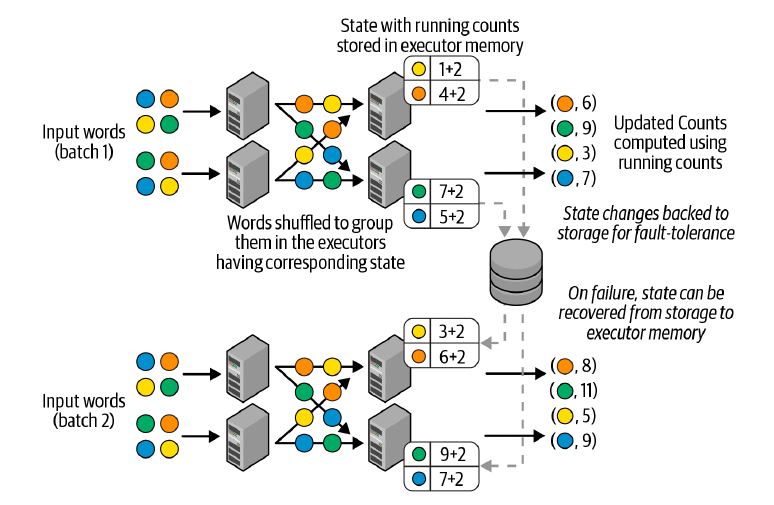
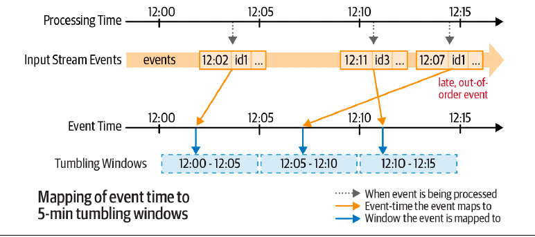
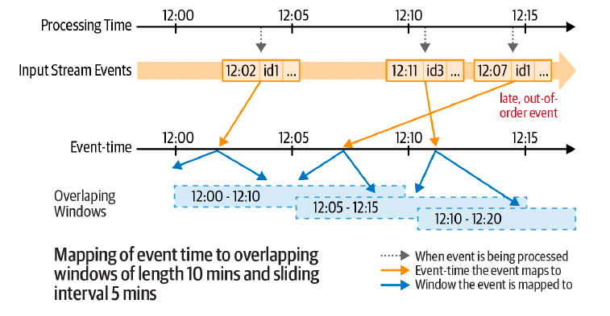
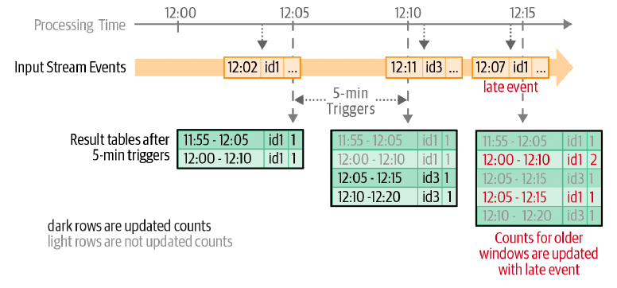
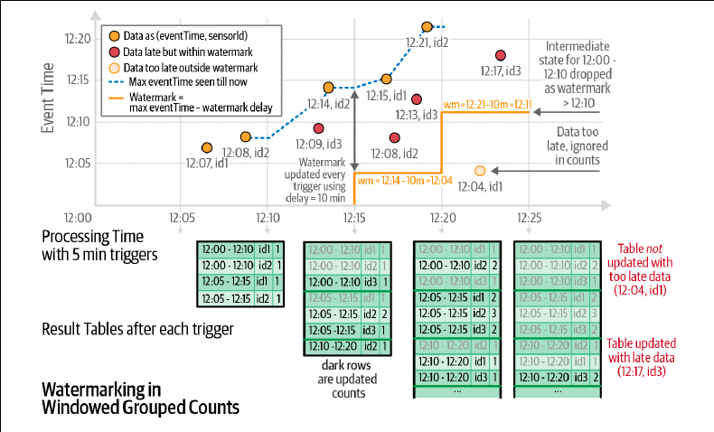
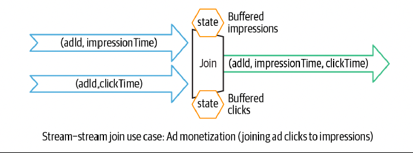
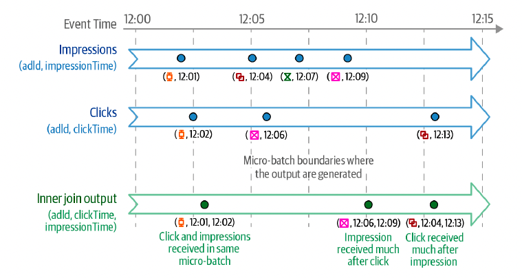
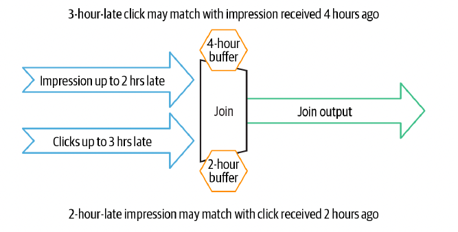

# Chapter 8: Structured Streaming

## Evolution of the Apache Spark Stream Processing Engine

- Stream processing is defined as the continuous processing of endless streams of data. With the advent of big data, stream processing systems transitioned from single-node processing engines to multiple-node, distributed processing engines

- record-at-a-time processing model

- 

- The processing pipeline is composed of a directed graph of nodes, as shown in Figure 8-1; each node continuously receives one record at a time, processes it, and then forwards the generated record(s) to the next node in the graph. This processing model can achieve very low latencies—that is, an input record can be processed by the pipeline and the resulting output can be generated within milliseconds. However, this model is not very efficient at recovering from node failures and straggler nodes (i.e., nodes that are slower than others); it can either recover from a failure very fast with a lot of extra failover resources, or use minimal extra resources but recover slowly.

#### Micro-Batch Stream Processing

- micro-batch stream processing, where the streaming computation is modeled as a continuous series of small, map/reduce-style batch processing jobs (hence, “micro-batches”) on small chunks of the stream data.

- 

- Each batch is processed in the Spark cluster in a distributed manner with small deterministic tasks that generate the output in micro-batches. Breaking down the streaming computation into these small tasks gives us two advantages over the traditional, continuous-operator model.

- Spark’s agile task scheduling can very quickly and efficiently recover from failures and straggler executors by rescheduling one or more copies of the tasks on any of the other executors.

- The deterministic nature of the tasks ensures that the output data is the same no matter how many times the task is reexecuted. This crucial characteristic enables Spark Streaming to provide end-to-end exactly-once processing guarantees, that is, the generated output results will be such that every input record was processed exactly once.

- This efficient fault tolerance does come at the cost of latency—the micro-batch model cannot achieve millisecond-level latencies; it usually achieves latencies of a few seconds (as low as half a second in some cases). we have observed that for an overwhelming majority of stream processing use cases, the benefits of micro-batch processing outweigh the drawback of second-scale latencies. This is because most streaming pipelines have at least one of the following characteristics:
    - The pipeline does not need latencies lower than a few seconds
    - There are larger delays in other parts of the pipeline

- the DStream API was built upon Spark’s batch RDD API. Spark Streaming thus proved that it is possible for a single, unified processing engine to provide consistent APIs and semantics for batch, interactive, and streaming work loads.

- Despite all the advantages, the DStream API was not without its flaws. Here are a few key areas for improvement that were identified:

    - Lack of a single API for batch and stream processing
    - Lack of separation between logical and physical plans: Since developers effectively specify the exact physical plan, there is no scope for automatic optimizations, and developers have to hand-optimize their code to get the best performance.
    - Lack of native support for event-time windows: DStreams define window operations based only on the time when each record is received by Spark Streaming (known as processing time). However, many use cases need to calculate windowed aggregates based on the time when the records were generated (known as event time) instead of when they were received or processed

#### The Philosophy of Structured Streaming

- A single, unified programming model and interface for batch and stream processing

- A broader definition of stream processing

## The Programming Model of Structured Streaming

- Structured Streaming extends this concept to streaming applications by treating a stream as an unbounded, continuously appended table,

- 

- Structured Streaming will not actually retain all the input, but the output produced by Structured Streaming until time T will be equivalent to having all of the input until T in a static, bounded table and running a batch job on the table.

- This is called incrementalization: Structured Streaming figures out what state needs to be maintained to update the result each time a record arrives. Finally, developers specify triggering policies to control when to update the results. Each time a trigger fires, Structured Streaming checks for new data (i.e., a new row in the input table) and incrementally updates the result.

- 

## The Fundamentals of a Structured Streaming Query

#### Five Steps to Define a Streaming Query

- Step 1: Define input sources

    As with batch queries, the first step is to define a DataFrame from a streaming source. However, when reading batch data sources, we need spark.read to create a DataFrameReader, whereas with streaming sources we need spark.readStream to create a DataStreamReader.

    ```scala
    val spark = SparkSession...
    val lines = spark
        .readStream.format("socket")
        .option("host", "localhost")
        .option("port", 9999)
        .load()
    ```

    - This code generates the lines DataFrame as an unbounded table of newline separated text data read from localhost:9999

    - Furthermore, a streaming query can define multiple input sources, both streaming and batch, which can be combined using DataFrame operations like unions and joins.

- Step 2: Transform data

    ```scala
    import org.apache.spark.sql.functions._
    val words = lines.select(split(col("value"), "\\s").as("words"))
    val counts = words.groupBy("words").count()
    ```

    - counts is a streaming DataFrame (that is, a DataFrame on unbounded, streaming data) that represents the running word counts that will be computed once the streaming query is started and the streaming input data is being continuously processed.

    - To understand which operations are supported in Structured Streaming, you have to recognize the two broad classes of data transformations:

        1. Stateless transformations: Operations like select(), filter(), map(), etc. do not require any information from previous rows to process the next row; each row can be processed by itself. The lack of previous “state” in these operations make them stateless. Stateless operations can be applied to both batch and streaming DataFrames.

        2. Stateful transformations: an aggregation operation like count() requires maintaining state to combine data across multiple rows. More specifically, any DataFrame operations involving grouping, joining, or aggregating are stateful transformations.
    
- Step 3: Define output sink and output mode

    - After transforming the data, we can define how to write the processed output data with DataFrame.writeStream (instead of DataFrame.write, used for batch data). This creates a DataStreamWriter which, similar to DataFrameWriter, has additional methods to specify the following:

        1. Output writing details (where and how to write the output)
        2. Processing details (how to process data and how to recover from failures)

        ```scala
        val writer = counts.writeStream.format("console").outputMode("complete")
        ```

    - Here we have specified "console" as the output streaming sink and "complete" as the output mode. The output mode of a streaming query specifies what part of the updated output to write out after processing new input data.

        1. Append Mode: This is the default mode, where only the new rows added to the result table/DataFrame (for example, the counts table) since the last trigger will be output to the sink. this mode guarantees that any row that is output is never going to be changed or updated by the query in the future.

        2. Complete Mode: In this mode, all the rows of the result table/DataFrame will be output at the end of every trigger. This is supported by queries where the result table is likely to be much smaller than the input data and therefore can feasibly be retained in memory. For example, our word count query supports complete mode because the counts data is likely to be far smaller than the input data.

        3. Update Mode: In this mode, only the rows of the result table/DataFrame that were updated since the last trigger will be output at the end of every trigger. This is in contrast to append mode, as the output rows may be modified by the query and output again in the future. Most queries support update mode.
    
    - Besides writing the output to the console, Structured Streaming natively supports streaming writes to files and Apache Kafka

- Step 4: Specify processing details

    ```scala
    import org.apache.spark.sql.streaming._
    val check_point_dir = "..."
    val writer2 = writer
        .trigger(Trigger.ProcessingTime("1 second"))
        .option("checkpointLocation", check_point_dir)
    ```

    - Here we have specified two types of details using the DataStreamWriter that we created with DataFrame.writeStream:

    1. Triggering details: This indicates when to trigger the discovery and processing of newly available streaming data.
    
        - Default: by default, the streaming query executes data in micro-batches where the next micro-batch is triggered as soon as the previous micro-batch has completed.

        - Processing time with trigger interval: You can explicitly specify the ProcessingTime trigger with an interval, and the query will trigger micro-batches at that fixed interval.

        - Once: In this mode, the streaming query will execute exactly one micro-batch—it processes all the new data available in a single batch and then stops itself.

        - Continuous: This is an experimental mode (as of Spark 3.0) where the streaming query will process data continuously instead of in micro-batches. While only a small subset of DataFrame operations allow this mode to be used, it can provide much lower latency (as low as milliseconds) than the micro-batch trigger modes.
    
    2. Checkpoint location: This is a directory in any HDFS-compatible filesystem where a streaming query saves its progress information—that is, what data has been successfully processed. Upon failure, this metadata is used to restart the failed query exactly where it left off. Therefore, setting this option is necessary for failure recovery with exactly-once guarantees.

- Step 5: Start the query

    Once everything has been specified, the final step is to start the query, which you can do with the following:

    ```scala
    val streamingQuery = writer2.start()
    ```
    - Note that start() is a nonblocking method, so it will return as soon as the query has started in the background. You can wait up to a timeout duration using awaitTermination(timeoutMillis), and you can explicitly stop the query with streamingQuery.stop().

- putting it all together

```python
from python.sql.functions import *
spark = SparkSession...
lines = (spark
    .readStream.format("socket")
    .option("host", "localhost")
    .option("port", 9999)
    .load()
)

words = lines.select(split(col("value"), "\\s").alias("word"))
counts = words.groupBy("word").count()
check_point_dir = "..."
streamQuery = (counts
    .writeStream
    .format("console")
    .outputMode("complete")
    .trigger(processingTime = "1 second")
    .option("checkpointLocation", check_point_dir)
    .start()
)
streamingQuery.awaitTermination()

```
- After the query has started, a background thread continuously reads new data from the streaming source, processes it, and writes it to the streaming sinks

## Under the Hood of an Active Streaming Query

- Once the query starts, the following sequence of steps transpires in the engine,

    - Spark SQL analyzes and optimizes this logical plan to ensure that it can be executed incrementally and efficiently on streaming data.
    - Spark SQL starts a background thread that continuously executes the following loop.
        - Based on the configured trigger interval, the thread checks the streaming sources for the availability of new data.
        - If avaliable, the new data is executed by running a micro-batch. From the optimized logical plan, an optimized Spark execution plan is generated that reads the new data from the source, incrementally computes the updated result, and writes the output to the sink according to the configured output mode.
        - For every micro-batch, the exact range of data processed (e.g., the set of files or the range of Apache Kafka offsets) and any associated state are saved in the configured checkpoint location so that the query can deterministically reprocess the exact range if needed.
    - This loop continues until the query is terminated, which can occur for one of the following reasons:
        - A failure has occurred in the query (either a processing error or a failure in the cluster).
        - The query is explicitly stopped using streamingQuery.stop().
        - If the trigger is set to Once, then the query will stop on its own after executing a single micro-batch containing all the available data.
    
    - 

#### Recovering from Failures with Exactly-Once Guarantees

- To restart a terminated query in a completely new process, you have to create a new SparkSession, redefine all the DataFrames, and start the streaming query on the final result using the same checkpoint location as the one used when the query was started the first time.

- The checkpoint location must be the same across restarts because this directory contains the unique identity of a streaming query and determines the life cycle of the query.

- Structured Streaming can ensure end-to-end exactly-once guarantees when the following conditions have been satisfied:

    - Replayable streaming sources: The data range of the last incomplete micro-batch can be reread from the source.
    - Deterministic computations: All data transformations deterministically produce the same result when given the same input data.
    - Idempotent streaming sink: The sink can identify reexecuted micro-batches and ignore duplicate writes that may be caused by restarts.

- Note that our word count example does not provide exactly-once guarantees because the socket source is not replayable and the console sink is not idempotent.

- it is possible to make minor modifications to a query between restarts. Here are a few ways you can modify the query:

    - DataFrame transformations: You can make minor modifications to the transformations between restarts. For example, in our streaming word count example, if you want to ignore lines that have corrupted byte

    ```scala
    val filteredLines = lines.filter("isCorruptedUdf(value) = false")
    val words = filteredLines.select(split(col("value"), "\\s").as("word"))
    
    ```

    - Source and sink options: Whether a readStream or writeStream option can be changed between restarts depends on the semantics of the specific source or sink. For example, you should not change the host and port options for the socket source if data is going to be sent to that host and port. But you can add an option to the console sink to print up to one hundred changed counts after every trigger:
    ```scala
    writeStream.format("console").option("numRows", "100")
    ```

    - Processing details: As discussed earlier, the checkpoint location must not be changed between restarts. However, other details like trigger interval can be changed without breaking fault-tolerance guarantees.

#### Monitoring an Active Query

- An important part of running a streaming pipeline in production is tracking its health. Structured Streaming provides several ways to track the status and processing metrics of an active query.

- Get current metrics using StreamingQuery

    lastProgress() returns information on the last completed micro-batch. printing the returned object (StreamingQueryProgress in Scala/Java or a dictionary in Python) will produce something like this:

    ```scala
    // In Scala/Python
    {
        "id" : "ce011fdc-8762-4dcb-84eb-a77333e28109",
        // id: unique identifier tied to a checkpoint location. this stays the same throughput the lifetime of a query.

        "runId" : "88e2ff94-ede0-45a8-b687-6316fbef529a",
        // runId: unique identifier for the current (re)started instance of the query. This changes with every restart.

        "name" : "MyQuery",
        "timestamp" : "2016-12-14T18:45:24.873Z",
        "numInputRows" : 10,
        // number of input rows that were processed in the last micro-batch.

        "inputRowsPerSecond" : 120.0,
        "processedRowsPerSecond" : 200.0,
        "durationMs" : {
            "triggerExecution" : 3,
            "getOffset" : 2
        },
        "stateOperators" : [ ],
        "sources" : [ {
            "description" : "KafkaSource[Subscribe[topic-0]]",
            "startOffset" : {
                "topic-0" : {
                    "2" : 0,
                    "1" : 1,
                    "0" : 1
                }
            },
            "endOffset" : {
                "topic-0" : {
                    "2" : 0,
                    "1" : 134,
                    "0" : 534
                }
            },
            "numInputRows" : 10,
            "inputRowsPerSecond" : 120.0,
            // Current rate at which input rows are being generated at the source (average over the last micro-batch duration
            "processedRowsPerSecond" : 200.0
            //Current rate at which rows are being processed and written out by the sink (average over the last micro-batch duration). If this rate is consistently lower than the input rate, then the query is unable to process data as fast as it is being generated by the source. This is a key indicator of the health of the query.
        } ],
        "sink" : {
        // Provides source/sink-specific details of the data processed in the last batch.
        "description" : "MemorySink"
        }
    }
    
    ```

- Get current status using StreamingQuery.status().

    This provides information on what the background query thread is doing at this moment

```scala
// In Scala/Python
{
    "message" : "Waiting for data to arrive",
    "isDataAvailable" : false,
    "isTriggerActive" : false
}
```

- Publishing metrics using Dropwizard Metrics

    These metrics are by default not enabled for Structured Streaming queries due to their high volume of reported data. To enable them, apart from configuring Dropwizard Metrics for Spark, you have to explicitly set the SparkSession configuration spark.sql.streaming.metricsEnabled to true before starting your query

    Note that only a subset of the information available through StreamingQuery.lastProgress() is published through Dropwizard Metrics. If you want to continuously publish more progress information to arbitrary locations, you have to write custom listeners, as discussed next

- Publishing metrics using custom StreamingQueryListeners

    StreamingQueryListener is an event listener interface with which you can inject arbitrary logic to continuously publish metrics. This developer API is available only in Scala/Java. There are two steps to using custom listeners:

    1. Define your custom listener: The StreamingQueryListener interface provides three methods that can be defined by your implementation to get three types of events related to a streaming query: start, progress (i.e., a trigger was executed), and termination.

    ```scala
    import org.apache.spark.sql.streaming._

    val myListener = new StreamingQueryListener() {
        override def onQueryStarted(event: QueryStartedEvent): Unit = {
            println("Query started: " + event.id)
        }

        override def onQueryTerminated(event: QueryTerminatedEvent): Unit = {
            println("Query terminated: " + event.id)
        }

        override def onQueryProgress(event: QueryProgressEvent): Unit = {
            println("Query made progress: " + event.id)
        }
    }

    ```

    2. Add your listener to the SparkSession before starting the query:

    ```scala
    spark.streams.addListener(myListener)
    ```

## Streaming Data Sources and Sinks

- As a reminder, you can create DataFrames from streaming sources using SparkSession.readStream() and write the output from a result DataFrame using  DataFrame.writeStream().

#### Files

- Structured Streaming supports reading and writing data streams to and from files in the same formats as the ones supported in batch processing: plain text, CSV, JSON, Parquet, ORC, etc

- Reading from files

    ```scala
    import org.apache.spark.sql.types._

    val inputDirectoryOfJsonFiles = ...

    val fileSchema = new StructType()
        .add("key", IntegerType())
        .add("value", IntegerType())

    val inputDF = spark.readStream
        .format("json")
        .schema(fileSchema)
        .load(inputDirectoryOfJsonFiles)
    ```

    - All the files must be of the same format and are expected to have the same schema. For example, if the format is "json", all the files must be in the JSON format with one JSON record per line.

    - Each file must appear in the directory listing atomically—that is, the whole file must be available at once for reading, and once it is available, the file cannot be updated or modified.

    - When there are multiple new files to process but it can only pick some of them in the next micro-batch (e.g., because of rate limits), it will select the files with the earliest timestamps.

- Writing to files

    - Structured Streaming supports writing streaming query output to files in the same formats as reads. However, it only supports append mode, because while it is easy to write new files in the output directory (i.e., append data to a directory), it is hard to modify existing data files (as would be expected with update and complete modes). It also supports partitioning

    ```scala
    val outputDir = ...
    val checkpointDir = ...
    val resultDF = ...

    val streamingQuery = resultDF
        .writeStream
        .format("parquet")
        .option("path", outputDir)
        .option("checkpointLocation", checkpointDir)
        .start()
    ```
    - Structured Streaming achieves end-to-end exactly-once guarantees when writing to files by maintaining a log of the data files that have been written to the directory. This log is maintained in the subdirectory _spark_metadata. Any Spark query on the directory (not its subdirectories) will automatically use the log to read the correct set of data files so that the exactly-once guarantee is maintained. 

    - If you change the schema of the result DataFrame between restarts, then the output directory will have data in multiple schemas. These schemas have to be reconciled when querying the directory

#### Apache Kafka

- Apache Kafka is a popular publish/subscribe system that is widely used for storage of data streams. Structured Streaming has built-in support for reading from and writing to Apache Kafka.

- Reading from Kafka

    To perform distributed reads from Kafka, you have to use options to specify how to connect to the source. Say you want to subscribe to data from the topic "events".

    ```SCALA
    val inputDF = spark
        .readStream
        .format("kafka")
        .option("kafka.bootstrap.servers", "host1:port1, host2:port2")
        .option("subscribe", "event")
        .load()
    ```

- 

    - schema of the dataframe generate by the kafka source

    - You can also choose to subscribe to multiple topics, a pattern of topics, or even a specific partition of a topic

- Writing to Kafka

    - For writing to Kafka, Structured Streaming expects the result DataFrame to have a few columns of specific names and types

- 

    - You can write to Kafka in all three output modes, though complete mode is not recommended as it will repeatedly output the same records

    ```scala
    val counts = ... // dataframe
    val streamingQuery = counts
        .selectExpr(
            "cast(word as string) as key",
            "cast(count as string) as value")
        .writeStream
        .format("kafka")
        .option("kafka.bootstrap.servers", "host1: port1, host2: port2")
        .option("topic", "wordCounts")
        .outputMode("update")
        .option("checkpointLocation", checkpointDir)
        .start()
    ```

#### Custom Streaming Sources and Sinks

- In particular, you’ll see how to use the foreachBatch() and foreach() methods to implement custom logic to write to your storage.

- Writing to any storage system

    - while foreach() allows custom write logic on every row, foreachBatch() allows arbitrary operations and custom logic on the output of each micro batch.

    - foreachBatch() allows you to specify a function that is executed on the output of every micro-batch of a streaming query. It takes two parameters: a DataFrame or Dataset that has the output of a micro-batch, and the unique identifier of the micro-batch.

    ```scala
    import org.apache.spark.sql.DataFrame

    val hostAddr = "<ip address>"
    val keyspaceName = "<keyspace>"
    val tableName = "<tableName>"

    spark.conf.set("spark.cassandra.connection.host", hostAddr)

    def writeCountsToCassandra(updatedCountsDF: DataFrame, batchId: Long) {
        updatedCountsDF
            .write
            .format("org.apache.spark.sql.cassandra")
            .options(Map("table" -> tableName, "keyspace" -> keyspaceName))
            .mode("append")
            .save()
    }

    val streamingQuery = counts
        .writeStream
        .foreachBatch(writeCountsToCassandra _)
        .outputMode("update")
        .option("checkpointLocation",  checkpointDir)
        .start()
    ```

    - With foreachBatch(), you can do the following:
        
        - Reuse existing batch data sources

        - Write to multiple locations: To avoid recomputations, you should cache the batchOutputDataFrame, write it to multiple locations, and then uncache it: 

        ```scala
        def writeCountsToMultipleLocations(
            updatedCountsDF: DataFrame, batchId: Long) {
                updatedCountsDF.persist()
                updatedCountsDF.write.formate(...).save()
                updatedCountsDF.write.formate(...).save()
                updatedCountsDF.unpersist()
            }
        ```
    
- Using foreach()

    Specifically, you can express the data-writing logic by dividing it into three methods: open(), process(), and close(). Structured Streaming will use these methods to write each partition of the output records.

    ```python
        # In Python
    # Variation 1: Using function
    def process_row(row):
    # Write row to storage
    pass

    query = streamingDF.writeStream.foreach(process_row).start()
    # Variation 2: Using the ForeachWriter class
    class ForeachWriter:
        def open(self, partitionId, epochId):
        # Open connection to data store
        # Return True if write should continue
        # This method is optional in Python
        # If not specified, the write will continue automatically
        return True
        def process(self, row):
        # Write string to data store using opened connection
        # This method is NOT optional in Python
        pass
        def close(self, error):
        # Close the connection. This method is optional in Python
        pass

    resultDF.writeStream.foreach(ForeachWriter()).start()

    ```

## Data Transformations

- only the DataFrame operations that can be executed incrementally are supported in Structured Streaming. These operations are broadly classified into stateless and stateful operations.

#### Incremental Execution and Streaming State

- Accordingly, instead of converting the logical plan to a one-time physical execution plan, the planner generates a continuous sequence of execution plans. Each execution plan updates the final result DataFrame incrementally—that is, the plan processes only a chunk of new data from the input streams and possibly some intermediate, partial result computed by the previous execution plan.

- Each execution is considered as a micro-batch, and the partial intermediate result that is communicated between the executions is called the streaming “state".

- DataFrame operations can be broadly classified into stateless and stateful operations based on whether executing the operation incrementally requires maintaining a state

- Stateless Transformations

    - All projection operations (e.g., select(), explode(), map(), flatMap()) and selection operations (e.g., filter(), where()) process each input record individually without needing any information from previous rows.

    - A streaming query having only stateless operations supports the append and update output modes, but not complete mode. since any processed output row of such a query cannot be modified by any future data, it can be written out to all streaming sinks in append mode (including append-only ones, like files of any format). On the other hand, such queries naturally do not combine information across input records, and therefore may not reduce the volume of the data in the result. Complete mode is not supported because storing the ever-growing result data is usually costly.

- Stateful Transformations

    - The simplest example of a stateful transformation is count(), DataFrame.groupBy(). which generates a running count of the number of records received since the beginning of the query

    - This state is maintained in the memory of the Spark executors and is checkpointed to the configured location in order to tolerate failures.

    - Distributed and fault-tolerant state management

        a Spark application running in a cluster has a driver and one or more executors. Spark’s scheduler running in the driver breaks down your high-level operations into smaller tasks and puts them in task queues, and as resources become available, the executors pull the tasks from the queues to execute them.

        Each micro-batch in a streaming query essentially performs one such set of tasks that read new data from streaming sources and write updated output to streaming sinks. For stateful stream processing queries, besides writing to sinks, each micro-batch of tasks generates intermediate state data which will be consumed by the
        next micro-batch.

        This state data generation is completely partitioned and distributed (as all reading, writing, and processing is in Spark), and it is cached in the executor memory for efficient consumption.

    - 

        However, it is not sufficient to just keep this state in memory, as any failure (either of an executor or of the entire application) will cause the in-memory state to be lost. To avoid loss, we synchronously save the key/value state update as change logs in the checkpoint location provided by the user.

        In case of any failure, Structured Streaming is able to re-execute the failed micro-batch by reprocessing the same input data along with the same state that it had before that micro-batch.

        To summarize, for all stateful operations, Structured Streaming ensures the correctness of the operation by automatically saving and restoring the state in a distributed manner. Depending on the stateful operation, all you may have to do is tune the state cleanup policy such that old keys and values can be automatically dropped from the cached state.
    
    - Types of stateful operations

        The essence of streaming state is to retain summaries of past data. Sometimes old summaries need to be cleaned up from the state to make room for new summaries. Based on how this is done, we can distinguish two types of stateful operations:

        1. Managed stateful operations
            These automatically identify and clean up old state, based on an operation-specific definition of “old.” The operations that fall into this category are those for:
                - Streaming aggregations
                - Stream–stream joins
                - Streaming deduplication
    
        2. Unmanaged stateful operations
            These operations let you define your own custom state cleanup logic. The operations in this category are:
                - MapGroupsWithState
                - FlatMapGroupsWithState

## Stateful Streaming Aggregations

#### Aggregations Not Based on Time

- Aggregations not involving time can be broadly classified into two categories:

- Global aggregations

    Aggregations across all the data in the stream. For example, say you have a stream of sensor readings as a streaming DataFrame named sensorReadings. You can calculate the running count of the total number of readings received with the following query:

    ```scala
    val running_count = sensorReadings.groupBy().count()
    ```

    You cannot use direct aggregation operations like Frame.count() and Dataset.reduce() on streaming DataFrames. This is because, for static DataFrames, these operations immediately return the final computed aggregates, whereas for streaming DataFrames the aggregates have to be continuously updated. Therefore, you have to always use DataFrame.groupBy() or Dataset.groupByKey() for aggregations on streaming DataFrames.

- Grouped aggregations

    Aggregations within each group or key present in the data stream. For example, if sensorReadings contains data from multiple sensors, you can calculate the running
    average reading of each sensor

    ```scala
    val baselineValues = sensorReadings.groupBy("sensorId").mean("value")
    ```

    Besides counts and averages, streaming DataFrames support the following types of aggregations (similar to batch DataFrames):

    - All built-in aggregation functions

        sum(), mean(), stddev(), countDistinct(), collect_set(),approx_count_distinct()

    - Multiple aggregations computed together

    ```scala
    import org.apache.spark.sql.functions.*

    val multipleAggs = sensorReadings
        .groupBy("sensorId")
        .agg(
            count("*"), mean("value").alias("baselineValue"),
            collect_set("errorCode").alias("allErrorCodes")
        )
    ```

    - User-defined aggregation functions

        All user-defined aggregation functions are supported.

#### Aggregations with Event-Time Windows

- In many cases, rather than running aggregations over the whole stream, you want aggregations over data bucketed by time windows.

- Continuing with our sensor example, say each sensor is expected to send at most one reading per minute and we want to detect if any sensor is reporting an unusually high number of times

- for robustness, we should be computing the time interval based on when the data was generated at the sensor and not based on when the data was received, as any transit delay would skew the results. we want to use the event time—that is, the timestamp in the record representing when the reading was generated

```scala
import org.apache.spark.sql.functions.*

sensorReadings
    .groupBy("sensorId", window("eventTime", "5 minute"))
    .count()
```

- The key thing to note here is the window() function, which allows us to express the five-minute windows as a dynamically computed grouping column.

    - Use the eventTime value to compute the five-minute time window the sensor reading falls into.
    - Group the reading based on the composite group (<computed window>, SensorId).
    - Update the count of the composite group.

- 

- if you want to compute counts corresponding to 10-minute windows sliding every 5 minutes, then you can do the following:

```scala
sensorReadings
    .groupBy("sensorId", window("eventTime", "10 minute", "5 minute"))
    .count()
```

- 

- As the event time moves forward, new groups are automatically created and their aggregates are automatically updated. Late and out-of-order events get handled automatically, as they simply update older groups.

- 

- However, from the point of view of resource usage, this poses a different problem—indefinitely growing state size. As new groups are created corresponding to the latest time windows, the older groups continue to occupy the state memory, waiting for any late data to update them. To provide a lateness bound to a query (and prevent unbounded state), you can specify watermarks

- Handling late data with watermarks

    - A watermark is defined as a moving threshold in event time that trails behind the maximum event time seen by the query in the processed data. The trailing gap, known as the watermark delay, defines how long the engine will wait for late data to arrive.

    - For example, suppose you know that your sensor data will not be late by more than 10 minutes.

    ```scala
    sensorReadings
        .withWatermark("eventTime", "10 minutes")
        .groupBy("sensorId", window("eventTime", "10 minutes", "5 minutes"))
        .mean("value")
    ```

    - Note that you must call withWatermark() before the groupBy() and on the same timestamp column as that used to define windows. When this query is executed, Structured Streaming will continuously track the maximum observed value of the eventTime column and accordingly update the watermark, filter the “too late” data, and clear old state.

    - That is, any data late by more than 10 minutes will be ignored, and all time windows that are more than 10 minutes older than the latest (by event time) input data will be cleaned up from the state. To clarify how this query will be executed.

- 

- Semantic guarantees with watermarks.

    - A watermark of 10 minutes guarantees that the engine will never drop any data that is delayed by less than 10 minutes compared to the latest event time seen in the input data.

- Supported output modes

    - Update mode

    In this mode, every micro-batch will output only the rows where the aggregate got updated. This mode can be used with all types of aggregations. Specifically for time window aggregations, watermarking will ensure that the state will get cleaned up regularly. This is the most useful and efficient mode to run queries with streaming aggregations.

    However, you cannot use this mode to write aggregates to append-only streaming sinks, such as any file-based formats like Parquet and ORC (unless you use Delta Lake, which we will discuss in the next chapter).

    - Complete mode

    In this mode, every micro-batch will output all the updated aggregates, irrespective of their age or whether they contain changes. While this mode can be used on all types of aggregations, for time window aggregations, using complete mode means state will not be cleaned up even if a watermark is specified.

    - Append mode

    This mode can be used only with aggregations on event-time windows and with watermarking enabled.

    Recall that append mode does not allow previously output results to change.

    Instead of outputting the updated rows, append mode outputs each key and its final aggregate value only when the watermark ensures that the aggregate is not going to be updated again.

    The advantage of this mode is that it allows you to write aggregates to append-only streaming sinks (e.g., files). The disadvantage is that the output will be delayed by the watermark duration—the query has to wait for the trailing watermark to exceed the time window of a key before its aggregate can be finalized.

## Streaming Joins

- Structured Streaming supports joining a streaming Dataset with another static or streaming Dataset.

#### Stream-Static Joins

- Many use cases require joining a data stream with a static Dataset

- For example, let’ consider the case of ad monetization. Suppose you are an advertisement company that shows ads on websites and you make money when users click on them. Let’ assume that you have a static Dataset of all the ads to be shown. and another stream of events for each time users click on the displayed ads. To calculate the click revenue, you have to match each click in the event stream to the corresponding ad impression in the table.

```scala
// Static DataFrame [adId: String, impressionTime: Timestamp, ...]
// reading from your static data source
val impressionsStatic = spark.read....

// Streaming DataFrame [adId: String, clickTime: Timestamp, ...]
// reading from your streaming source
val clicksStream = spark.readStream...

val matched = clicksStream.join(impressionsStatic, "adId")
```

- When this code is executed, every micro-batch of clicks is inner-joined against the static impression table to generate the output stream of matched events.

- Besides inner joins, Structured Streaming also supports two types of stream–static outer joins:

    - Left outer join when the left side is a streaming DataFrame
    - Right outer join when the right side is a streaming DataFrame

    ```scala
    val matched = clicksStream.join(impressionsStatic, Seq("adId"), "leftOuter")
    ```
- Stream–static joins are stateless operations, and therefore do not require any kind of watermarking.

- The static DataFrame is read repeatedly while joining with the streaming data of every micro-batch, so you can cache the static DataFrame to speed up the reads.

- If the underlying data in the data source on which the static DataFrame was defined changes, whether those changes are seen by the streaming query depends on the specific behavior of the data source.

#### Stream-Stream Joins

- The challenge of generating joins between two data streams is that, at any point in time, the view of either Dataset is incomplete, making it much harder to find matches between inputs. The matching events from the two streams may arrive in any order and may be arbitrarily delayed. For example, in our advertising use case an impression event and its corresponding click event may arrive out of order, with arbitrary delays between them. Structured Streaming accounts for such delays by buffering the input data from both sides as the streaming state, and continuously checking for matches as new data is received

-  

#### Inner joins with optional watermarking

```scala
val impressions = spark.readStream...
val clicks = spark.readStream...

val matched = impressions.join(clicks, "adId")
```

- When this query is executed, the processing engine will recognize it to be a stream–stream join instead of a stream–static join. The engine will buffer all clicks and impressions as state, and will generate a matching impression-and-click as soon as a received click matches a buffered impression (or vice versa, depending on which was received first).

- 

- we have not given any indication of how long the engine should buffer an event to find a match. Therefore, the engine may buffer an event forever and accumulate an unbounded amount of streaming state. To limit the streaming state maintained by stream.stream joins, you need to know the following information about your use case:

    - **_What is the maximum time range between the generation of the two events at their respective sources?_** 

    In the context of our use case, let’s assume that a click can occur within zero seconds to one hour after the corresponding impression. 
    
    - **_What is the maximum duration an event can be delayed in transit between the source and the processing engine?_**

    For example, ad clicks from a browser may get delayed due to intermittent connectivity and arrive much later than expected, and out of order. Let’s say that impressions and clicks can be delayed by at most two and three hours, respectively.

- These delay limits and event-time constraints can be encoded in the DataFrame operations using watermarks and time range conditions

    1. Define watermark delays on both inputs, such that the engine knows how delayed the input can be (similar to with streaming aggregations).

    2. Define a constraint on event time across the two inputs, such that the engine can figure out when old rows of one input are not going to be required (i.e., will not satisfy the time constraint) for matches with the other input. This constraint can be defined in one of the following ways:

        a. Time range join conditions (e.g., join condition = "leftTime BETWEEN rightTime AND rightTime + INTERVAL 1 HOUR")

        b. Join on event-time windows (e.g., join condition =
        "leftTimeWindow=rightTimeWindow")
    
    ```scala
    val impressionsWithWatermark = impressions
        .selectExpr("adId as impressionAdId", "impressionTime")
        .withWatermark("impressionTime", "2 hours")
    
    val clicksWithWatermark = clicks
        .selectExpr("adId as clickAdId", "clickTime")
        .withWatermark("clickTime", "3 hours")
    
    impressionWithWatermark.join(clicksWithWatermark, 
    expr("""
        clickAdId = impressionAdId and
        clickTime between impressionTime and impressionTime + interval 1 hour"""))
    ```

- With these time constraints for each event, the processing engine can automatically calculate how long events need to be buffered to generate correct results, and when the events can be dropped from the state

- Impressions need to be buffered for at most four hours (in event time), as a three-hour-late click may match with an impression made four hours ago (i.e., three hours late + up to one-hour delay between the impression and click).

- Conversely, clicks need to be buffered for at most two hours (in event time), as a two-hour-late impression may match with a click received two hours ago.

- 

- For inner joins, specifying watermarking and event-time constraints are both optional. In other words, at the risk of potentially unbounded state, you may choose not to specify them. Only when both are specified will you get state cleanup.

- Similar to the guarantees provided by watermarking on aggregations, a watermark delay of two hours guarantees that the engine will never drop or not match any data that is less than two hours delayed, but data delayed by more than two hours may or may not get processed.

#### Outer joins with watermarking

- In other words, ads that received no clicks will not be reported at all. Instead, you may want all ad impressions to be reported, with or without the associated click data, to enable additional analysis later (e.g., click-through rates). This brings us to stream–stream outer joins.

```scala
impressionsWithWatermark.join(clicksWithWatermark,
    expr("""
    clickAdId = impressionAdId and
    clickTime between impressionTime and impressionTime + interval 1 hour"""), "leftOuter"
)
```

- Unlike with inner joins, the watermark delay and event-time constraints are not optional for outer joins. This is because for generating the NULL results, the engine must know when an event is not going to match with anything else in the future. For correct outer join results and state cleanup, the watermarking and event-time constraints must be specified.

## Arbitrary Stateful Computations

- Many use cases require more complicated logic than the SQL operations we have discussed up to now. For example, say you want to track the statuses (e.g., signed in,busy, idle) of users by tracking their activities (e.g., clicks) in real time. To build this stream processing pipeline, you will have to track each user’s activity history as a state with arbitrary data structure, and continuously apply arbitrarily complex changes on the data structure based on the user’s actions

- we will start with a simple example with mapGroupsWithState() to illustrate the four key steps to modeling custom state data and defining custom operations on it.


#### Modeling Arbitrary Stateful Operations with mapGroupsWithState()

- State with an arbitrary schema and arbitrary transformations on the state is modeled as a user-defined function that takes the previous version of the state value and new data as inputs, and generates the updated state and computed result as outputs

```scala
def arbitraryStateUpdateFunction ( 
    key: K,
    newDataForKey: Iterator[V],
    previousStateForKey: GroupState[S]
): U

val inputDataset: Dataset[V]

inputDataset
    .groupByKey(keyFunction) // keyFunction generates key from input
    .mapGroupsWithState(arbitraryStateUpdateFunction)
```
- key: K

    K is the data type of the common keys defined in the state and the input. Spark will call this function for each unique key in the data.

- newDataForKey: Iterator[V]

    V is the data type of the input Dataset. When Spark calls this function for a key, this parameter will have all the new input data corresponding to that key. Note that the order in which the input data objects will be present in the iterator is not defined.

- previousStateForKey: GroupState[S]

    S is the data type of the arbitrary state you are going to maintain, and Group State[S] is a typed wrapper object that provides methods to access and manage the state value. When Spark calls this function for a key, this object will provide the state value set the previous time Spark called this function for that key (i.e., for one of the previous micro-batches).

- in every micro-batch, for each active user, we will use the new actions taken by the user and update the user’s “status.”

    1. Define the data types. 
    
        We need to define the exact types of K, V, S, and U. 
        In this case, we’ll use the following:

        - Input data (V) = case class UserAction(userId: String, action: String)
        - Keys (K) = String (that is, the userId)
        - State (S) = case class UserStatus(userId: String, active: Boolean)
        - Output (U) = UserStatus, as we want to output the latest user status
    
    2. Define the function. 
    
        Based on the chosen types, let’s translate the conceptual idea into code. When this function is called with new user actions, there are two main situations we need to handle: whether a previous state (i.e., previous user status) exists for that key (i.e., userId) or not. Accordingly, we will initialize the user’s status, or update the existing status with the new actions.

    ```scala
    import org.apache.spark.sql.streaming._

    def updateUserStatus (
        userId: String,
        newActions: Iterator[UserAction],
        state: GroupState[UserStatus]: UserStatus = {
            
            val userStatus = state.getOption.getOrElse {
                new UserStatus(userId, false)
            }
            newActions.foreach{ action =>
                userStatus.updateWith(action)
            }
            state.update(userStatus)
            return userStatus
        }
    )
    ```

    3. Apply the function on the actions. 
    
        We will group the input actions Dataset using groupByKey() and then apply the updateUserStatus function using mapGroupsWithState():
    
    ```scala
    val userActions = Dataset[UserAction] = ...
    val latestStatues = userActions
        .groupByKey(userAction => userAction.userId)
        .mapGroupsWithState(updateUserStatus_)
    ```

- When the function is called, there is no well-defined order for the input records in the new data iterator (e.g., newActions).

- In a micro-batch, the function is called on a key once only if the micro-batch has data for that key.

- The output of is assumed by the incremental processing mapGroupsWithState() engine to be continuously updated key/value records, similar to the output of aggregations.


#### Using Timeouts to Manage Inactive Groups

- Now, in a real-world scenario, users are likely not going to stay active all the time. It may not be very useful to keep the status of inactive users in the state, as it is not going to change again until those users become active again. Hence, we may want to explicitly drop all information for inactive users. However, a user may not explicitly take any action to become inactive (e.g., explicitly logging off), and we may have to define inactivity as lack of any action for a threshold duration.

- To encode time-based inactivity, mapGroupsWithState() supports timeouts that are defined as follows:

    - Each time the function is called on a key, a timeout can be set on the key based on a duration or a threshold timestamp.

    - If that key does not receive any data, such that the timeout condition is met, the key is marked as “timed out.” The next micro-batch will call the function on this timed-out key even if there is no data for that key in that micro-batch. In this special function call, the new input data iterator will be empty (since there is no new data) and GroupState.hasTimedOut() will return true. This is the best way to identify inside the function whether the call was due to new data or a timeout.

- There are two types of timeouts, based on our two notions of time: processing time and event time

    - Processing-time timeouts

        Processing-time timeouts are based on the system time (also known as the wall clock time) of the machine running the streaming query and are defined as follows: if a key last received data at system timestamp T, and the current timestamp is more than (T + <timeout duration>), then the function will be called again with a new empty data iterator.

        - In mapGroupsWithState(), we will specify the timeout as GroupStateTimeout.ProcessingTimeTimeout.

        - In the state update function, before updating the state with new data, we have to check whether the state has timed out or not. Accordingly, we will update or remove the state.

        - In addition, every time we update the state with new data, we will set the timeout duration.

    ```scala
    def updateUserState(
        userId: String,
        newActions: Iterator[UserAction],
        state: GroupState[UserStatus]): UserStatus = {
            
            if (!state.hasTimeOut) {
                val userStatus = state.getOption.getOrElse{
                    new UserStatus(userId, false)
                }
                newActions.foreach {action => userStatus.updateWith(action)}
                state.update(userStatus)
                state.setTimeoutDuration("1 hour")
                return userStatus
            } else {
                val userStatus = state.get() 
                state.remove()
                return userStatus.asInactive()
            }
        }
        
        val latestStatuses = userActions
            .groupByKey(userAction => userActions.userId)
            .mapGroupsWithState(
                GroupStateTimeout.ProcessingTimeTimeout)(
                    updateUserStatus_
            )
    ```

    - The timeout set by the last call to the function is automatically cancelled when the function is called again, either for the new received data or for the timeout

    - Since the timeouts are processed during the micro-batches, the timing of their execution is imprecise and depends heavily on the trigger interval and micro-batch processing times. Therefore, it is not advised to use timeouts for precise timing control.

    - While processing-time timeouts are simple to reason about, they are not robust to slowdowns and downtimes.

- Event-time timeouts

    - Define watermarks on the input Dataset (assume that the class UserAction has an eventTimestamp field). Recall that the watermark threshold represents the acceptable amount of time by which input data can be late and out of order.

    - Update mapGroupsWithState() to use EventTimeTimeout.
    
    - Update the function to set the threshold timestamp at which the timeout will occur. Note that event-time timeouts do not allow setting a timeout duration, like processing-time timeouts.

    ```scala
    // In Scala
    def updateUserStatus(
        userId: String,
        newActions: Iterator[UserAction],
        state: GroupState[UserStatus]):UserStatus = {

        if (!state.hasTimedOut) { // Was not called due to timeout
            val userStatus = if (state.getOption.getOrElse {
                new UserStatus()
            }
            newActions.foreach { action => userStatus.updateWith(action) }
            state.update(userStatus)

            // Set the timeout timestamp to the current watermark + 1 hour
            state.setTimeoutTimestamp(state.getCurrentWatermarkMs, "1 hour")
            return userStatus
        } else {
            val userStatus = state.get()
            state.remove()
            return userStatus.asInactive() }
    }

    val latestStatuses = userActions
        .withWatermark("eventTimestamp", "10 minutes")
        .groupByKey(userAction => userAction.userId)
        .mapGroupsWithState(
        GroupStateTimeout.EventTimeTimeout)(
        updateUserStatus _)
    
    ```

    - Unlike in the previous example with processing-time timeouts, we have used GroupState.setTimeoutTimestamp() instead of GroupState.setTimeoutDuration().

    - The timeout timestamp must be set to a value larger than the current watermark. This is because the timeout is expected to happen when the timestamp crosses the watermark.


#### Generalization with flatMapGroupsWithState()

- There are two key limitations with mapGroupsWithState() that may limit the flexibility that we want to implement more complex use cases (e.g., chained sessionizations):

    - Every time mapGroupsWithState() is called, you have to return one and only one record. For some applications, in some triggers, you may not want to output any thing at all.

    - With mapGroupsWithState(), due to the lack of more information about the opaque state update function, the engine assumes that generated records are updated key/value data pairs. For example, the DataFrame generated using mapGroupsWithState() cannot be written out in append mode to files.

- flatMapGroupsWithState() overcomes these limitations, at the cost of slightly more complex syntax. It has two differences from mapGroupsWithState():
    - The return type is an iterator, instead of a single object. This allows the function to return any number of records, or, if needed, no records at all.
    - It takes another parameter, called the operator output mode (not to be confused with the query output modes we discussed earlier in the chapter), that defines whether the output records are new records that can be appended (Output Mode.Append) or updated key/value records (OutputMode.Update).

- if we want to generate alerts only for certain user changes and we want to write the output alerts to files

```scala
def getUserAlerts(
    userId: String,
    newActions: Iterator[UserAction],
    state: GroupState[UserStatus]): Iterator[UserAlert] = {
    
    val userStatus = state.getOption.getOrElse {
        new UserStatus(userId, false)
    }
    newActions.foreach { action =>
        userStatus.updateWith(action)
    }
    state.update(userStatus)

    // Generate any number of alerts
    return userStatus.generateAlerts().toIterator
}

    val userAlerts = userActions
        .groupByKey(userAction => userAction.userId)
        .flatMapGroupsWithState(
            OutputMode.Append,
            GroupStateTimeout.NoTimeout)(
        getUserAlerts)
```

## Performance Tuning

#### Cluster resource provisioning

- Underprovisoning the resources can cause the streaming queries to fall behind (with micro-batches taking longer and longer), while overprovisioning (e.g., allocated but unused cores) can cause unnecessary costs.

- stateless queries usually need more cores, and stateful queries usually need more memory.

#### Number of partitions for shuffl

- the number of shuffle partitions usually needs to be set much lower than for most batch queries—dividing the computation too much increases overheads and reduces throughput. shuffles due to stateful operations have significantly higher task overheads due to checkpointing.

- it is recommended to tune the number of shuffle partitions from the default value of 200 to at most two to three times the number of allocated cores


#### Setting source rate limits for stability

- Besides the costly approach of overprovisioning, you can safeguard against instability using source rate limits

- Setting limits in supported sources (e.g., Kafka and files) prevents a query from consuming too much data in a single micro-batch.

#### Multiple streaming queries in the same Spark application

- Executing each query continuously uses resources in the Spark driver (i.e., the JVM where it is running). This limits the number of queries that the driver can execute simultaneously.

- You can ensure fairer resource allocation between queries in the same context by setting them to run in separate scheduler pools

```scala
spark.sparkContext.setLocalProperty("spark.scheduler.pool", "pool1")
df.writeStream.queryName("query1").format("parquet").start(path1)

spark.sparkContext.setLocalProperty("spark.scheduler.pool", "pool2")
df.writeStream.queryName("query2").format("parquet").start(path2)
```

## Summary
This chapter explored writing Structured Streaming queries using the DataFrame API. Specifically, we discussed:

- The central philosophy of Structured Streaming and the processing model of treating input data streams as unbounded tables

- The key steps to define, start, restart, and monitor streaming queries

- How to use various built-in streaming sources and sinks and write custom streaming sinks

- How to use and tune managed stateful operations like streaming aggregations and stream–stream joins

- Techniques for expressing custom stateful computations