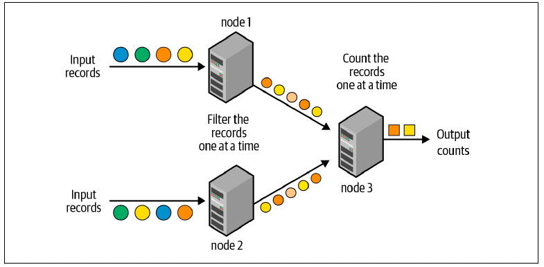
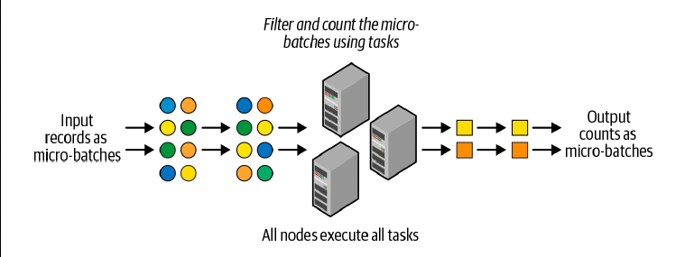
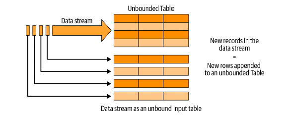
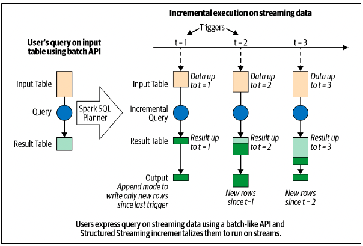
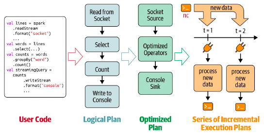
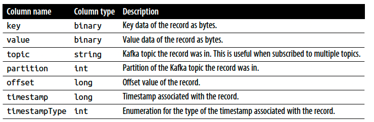
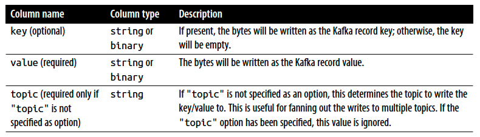

# Chapter 8: Structured Streaming

## Evolution of the Apache Spark Stream Processing Engine

- Stream processing is defined as the continuous processing of endless streams of data. With the advent of big data, stream processing systems transitioned from single-node processing engines to multiple-node, distributed processing engines

- record-at-a-time processing model

- 

- The processing pipeline is composed of a directed graph of nodes, as shown in Figure 8-1; each node continuously receives one record at a time, processes it, and then forwards the generated record(s) to the next node in the graph. This processing model can achieve very low latencies—that is, an input record can be processed by the pipeline and the resulting output can be generated within milliseconds. However, this model is not very efficient at recovering from node failures and straggler nodes (i.e., nodes that are slower than others); it can either recover from a failure very fast with a lot of extra failover resources, or use minimal extra resources but recover slowly.

#### Micro-Batch Stream Processing

- micro-batch stream processing, where the streaming computation is modeled as a continuous series of small, map/reduce-style batch processing jobs (hence, “micro-batches”) on small chunks of the stream data.

- 

- Each batch is processed in the Spark cluster in a distributed manner with small deterministic tasks that generate the output in micro-batches. Breaking down the streaming computation into these small tasks gives us two advantages over the traditional, continuous-operator model.

- Spark’s agile task scheduling can very quickly and efficiently recover from failures and straggler executors by rescheduling one or more copies of the tasks on any of the other executors.

- The deterministic nature of the tasks ensures that the output data is the same no matter how many times the task is reexecuted. This crucial characteristic enables Spark Streaming to provide end-to-end exactly-once processing guarantees, that is, the generated output results will be such that every input record was processed exactly once.

- This efficient fault tolerance does come at the cost of latency—the micro-batch model cannot achieve millisecond-level latencies; it usually achieves latencies of a few seconds (as low as half a second in some cases). we have observed that for an overwhelming majority of stream processing use cases, the benefits of micro-batch processing outweigh the drawback of second-scale latencies. This is because most streaming pipelines have at least one of the following characteristics:
    - The pipeline does not need latencies lower than a few seconds
    - There are larger delays in other parts of the pipeline

- the DStream API was built upon Spark’s batch RDD API. Spark Streaming thus proved that it is possible for a single, unified processing engine to provide consistent APIs and semantics for batch, interactive, and streaming work loads.

- Despite all the advantages, the DStream API was not without its flaws. Here are a few key areas for improvement that were identified:

    - Lack of a single API for batch and stream processing
    - Lack of separation between logical and physical plans: Since developers effectively specify the exact physical plan, there is no scope for automatic optimizations, and developers have to hand-optimize their code to get the best performance.
    - Lack of native support for event-time windows: DStreams define window operations based only on the time when each record is received by Spark Streaming (known as processing time). However, many use cases need to calculate windowed aggregates based on the time when the records were generated (known as event time) instead of when they were received or processed

#### The Philosophy of Structured Streaming

- A single, unified programming model and interface for batch and stream processing

- A broader definition of stream processing

## The Programming Model of Structured Streaming

- Structured Streaming extends this concept to streaming applications by treating a stream as an unbounded, continuously appended table,

- 

- Structured Streaming will not actually retain all the input, but the output produced by Structured Streaming until time T will be equivalent to having all of the input until T in a static, bounded table and running a batch job on the table.

- This is called incrementalization: Structured Streaming figures out what state needs to be maintained to update the result each time a record arrives. Finally, developers specify triggering policies to control when to update the results. Each time a trigger fires, Structured Streaming checks for new data (i.e., a new row in the input table) and incrementally updates the result.

- 

## The Fundamentals of a Structured Streaming Query

#### Five Steps to Define a Streaming Query

- Step 1: Define input sources

    As with batch queries, the first step is to define a DataFrame from a streaming source. However, when reading batch data sources, we need spark.read to create a DataFrameReader, whereas with streaming sources we need spark.readStream to create a DataStreamReader.

    ```scala
    val spark = SparkSession...
    val lines = spark
        .readStream.format("socket")
        .option("host", "localhost")
        .option("port", 9999)
        .load()
    ```

    - This code generates the lines DataFrame as an unbounded table of newline separated text data read from localhost:9999

    - Furthermore, a streaming query can define multiple input sources, both streaming and batch, which can be combined using DataFrame operations like unions and joins.

- Step 2: Transform data

    ```scala
    import org.apache.spark.sql.functions._
    val words = lines.select(split(col("value"), "\\s").as("words"))
    val counts = words.groupBy("words").count()
    ```

    - counts is a streaming DataFrame (that is, a DataFrame on unbounded, streaming data) that represents the running word counts that will be computed once the streaming query is started and the streaming input data is being continuously processed.

    - To understand which operations are supported in Structured Streaming, you have to recognize the two broad classes of data transformations:

        1. Stateless transformations: Operations like select(), filter(), map(), etc. do not require any information from previous rows to process the next row; each row can be processed by itself. The lack of previous “state” in these operations make them stateless. Stateless operations can be applied to both batch and streaming DataFrames.

        2. Stateful transformations: an aggregation operation like count() requires maintaining state to combine data across multiple rows. More specifically, any DataFrame operations involving grouping, joining, or aggregating are stateful transformations.
    
- Step 3: Define output sink and output mode

    - After transforming the data, we can define how to write the processed output data with DataFrame.writeStream (instead of DataFrame.write, used for batch data). This creates a DataStreamWriter which, similar to DataFrameWriter, has additional methods to specify the following:

        1. Output writing details (where and how to write the output)
        2. Processing details (how to process data and how to recover from failures)

        ```scala
        val writer = counts.writeStream.format("console").outputMode("complete")
        ```

    - Here we have specified "console" as the output streaming sink and "complete" as the output mode. The output mode of a streaming query specifies what part of the updated output to write out after processing new input data.

        1. Append Mode: This is the default mode, where only the new rows added to the result table/DataFrame (for example, the counts table) since the last trigger will be output to the sink. this mode guarantees that any row that is output is never going to be changed or updated by the query in the future.

        2. Complete Mode: In this mode, all the rows of the result table/DataFrame will be output at the end of every trigger. This is supported by queries where the result table is likely to be much smaller than the input data and therefore can feasibly be retained in memory. For example, our word count query supports complete mode because the counts data is likely to be far smaller than the input data.

        3. Update Mode: In this mode, only the rows of the result table/DataFrame that were updated since the last trigger will be output at the end of every trigger. This is in contrast to append mode, as the output rows may be modified by the query and output again in the future. Most queries support update mode.
    
    - Besides writing the output to the console, Structured Streaming natively supports streaming writes to files and Apache Kafka

- Step 4: Specify processing details

    ```scala
    import org.apache.spark.sql.streaming._
    val check_point_dir = "..."
    val writer2 = writer
        .trigger(Trigger.ProcessingTime("1 second"))
        .option("checkpointLocation", check_point_dir)
    ```

    - Here we have specified two types of details using the DataStreamWriter that we created with DataFrame.writeStream:

    1. Triggering details: This indicates when to trigger the discovery and processing of newly available streaming data.
    
        - Default: by default, the streaming query executes data in micro-batches where the next micro-batch is triggered as soon as the previous micro-batch has completed.

        - Processing time with trigger interval: You can explicitly specify the ProcessingTime trigger with an interval, and the query will trigger micro-batches at that fixed interval.

        - Once: In this mode, the streaming query will execute exactly one micro-batch—it processes all the new data available in a single batch and then stops itself.

        - Continuous: This is an experimental mode (as of Spark 3.0) where the streaming query will process data continuously instead of in micro-batches. While only a small subset of DataFrame operations allow this mode to be used, it can provide much lower latency (as low as milliseconds) than the micro-batch trigger modes.
    
    2. Checkpoint location: This is a directory in any HDFS-compatible filesystem where a streaming query saves its progress information—that is, what data has been successfully processed. Upon failure, this metadata is used to restart the failed query exactly where it left off. Therefore, setting this option is necessary for failure recovery with exactly-once guarantees.

- Step 5: Start the query

    Once everything has been specified, the final step is to start the query, which you can do with the following:

    ```scala
    val streamingQuery = writer2.start()
    ```
    - Note that start() is a nonblocking method, so it will return as soon as the query has started in the background. You can wait up to a timeout duration using awaitTermination(timeoutMillis), and you can explicitly stop the query with streamingQuery.stop().

- putting it all together

```python
from python.sql.functions import *
spark = SparkSession...
lines = (spark
    .readStream.format("socket")
    .option("host", "localhost")
    .option("port", 9999)
    .load()
)

words = lines.select(split(col("value"), "\\s").alias("word"))
counts = words.groupBy("word").count()
check_point_dir = "..."
streamQuery = (counts
    .writeStream
    .format("console")
    .outputMode("complete")
    .trigger(processingTime = "1 second")
    .option("checkpointLocation", check_point_dir)
    .start()
)
streamingQuery.awaitTermination()

```
- After the query has started, a background thread continuously reads new data from the streaming source, processes it, and writes it to the streaming sinks

## Under the Hood of an Active Streaming Query

- Once the query starts, the following sequence of steps transpires in the engine,

    - Spark SQL analyzes and optimizes this logical plan to ensure that it can be executed incrementally and efficiently on streaming data.
    - Spark SQL starts a background thread that continuously executes the following loop.
        - Based on the configured trigger interval, the thread checks the streaming sources for the availability of new data.
        - If avaliable, the new data is executed by running a micro-batch. From the optimized logical plan, an optimized Spark execution plan is generated that reads the new data from the source, incrementally computes the updated result, and writes the output to the sink according to the configured output mode.
        - For every micro-batch, the exact range of data processed (e.g., the set of files or the range of Apache Kafka offsets) and any associated state are saved in the configured checkpoint location so that the query can deterministically reprocess the exact range if needed.
    - This loop continues until the query is terminated, which can occur for one of the following reasons:
        - A failure has occurred in the query (either a processing error or a failure in the cluster).
        - The query is explicitly stopped using streamingQuery.stop().
        - If the trigger is set to Once, then the query will stop on its own after executing a single micro-batch containing all the available data.
    
    - 

#### Recovering from Failures with Exactly-Once Guarantees

- To restart a terminated query in a completely new process, you have to create a new SparkSession, redefine all the DataFrames, and start the streaming query on the final result using the same checkpoint location as the one used when the query was started the first time.

- The checkpoint location must be the same across restarts because this directory contains the unique identity of a streaming query and determines the life cycle of the query.

- Structured Streaming can ensure end-to-end exactly-once guarantees when the following conditions have been satisfied:

    - Replayable streaming sources: The data range of the last incomplete micro-batch can be reread from the source.
    - Deterministic computations: All data transformations deterministically produce the same result when given the same input data.
    - Idempotent streaming sink: The sink can identify reexecuted micro-batches and ignore duplicate writes that may be caused by restarts.

- Note that our word count example does not provide exactly-once guarantees because the socket source is not replayable and the console sink is not idempotent.

- it is possible to make minor modifications to a query between restarts. Here are a few ways you can modify the query:

    - DataFrame transformations: You can make minor modifications to the transformations between restarts. For example, in our streaming word count example, if you want to ignore lines that have corrupted byte

    ```scala
    val filteredLines = lines.filter("isCorruptedUdf(value) = false")
    val words = filteredLines.select(split(col("value"), "\\s").as("word"))
    
    ```

    - Source and sink options: Whether a readStream or writeStream option can be changed between restarts depends on the semantics of the specific source or sink. For example, you should not change the host and port options for the socket source if data is going to be sent to that host and port. But you can add an option to the console sink to print up to one hundred changed counts after every trigger:
    ```scala
    writeStream.format("console").option("numRows", "100")
    ```

    - Processing details: As discussed earlier, the checkpoint location must not be changed between restarts. However, other details like trigger interval can be changed without breaking fault-tolerance guarantees.

#### Monitoring an Active Query

- An important part of running a streaming pipeline in production is tracking its health. Structured Streaming provides several ways to track the status and processing metrics of an active query.

- Get current metrics using StreamingQuery

    lastProgress() returns information on the last completed micro-batch. printing the returned object (StreamingQueryProgress in Scala/Java or a dictionary in Python) will produce something like this:

    ```scala
    // In Scala/Python
    {
        "id" : "ce011fdc-8762-4dcb-84eb-a77333e28109",
        // id: unique identifier tied to a checkpoint location. this stays the same throughput the lifetime of a query.

        "runId" : "88e2ff94-ede0-45a8-b687-6316fbef529a",
        // runId: unique identifier for the current (re)started instance of the query. This changes with every restart.

        "name" : "MyQuery",
        "timestamp" : "2016-12-14T18:45:24.873Z",
        "numInputRows" : 10,
        // number of input rows that were processed in the last micro-batch.

        "inputRowsPerSecond" : 120.0,
        "processedRowsPerSecond" : 200.0,
        "durationMs" : {
            "triggerExecution" : 3,
            "getOffset" : 2
        },
        "stateOperators" : [ ],
        "sources" : [ {
            "description" : "KafkaSource[Subscribe[topic-0]]",
            "startOffset" : {
                "topic-0" : {
                    "2" : 0,
                    "1" : 1,
                    "0" : 1
                }
            },
            "endOffset" : {
                "topic-0" : {
                    "2" : 0,
                    "1" : 134,
                    "0" : 534
                }
            },
            "numInputRows" : 10,
            "inputRowsPerSecond" : 120.0,
            // Current rate at which input rows are being generated at the source (average over the last micro-batch duration
            "processedRowsPerSecond" : 200.0
            //Current rate at which rows are being processed and written out by the sink (average over the last micro-batch duration). If this rate is consistently lower than the input rate, then the query is unable to process data as fast as it is being generated by the source. This is a key indicator of the health of the query.
        } ],
        "sink" : {
        // Provides source/sink-specific details of the data processed in the last batch.
        "description" : "MemorySink"
        }
    }
    
    ```

- Get current status using StreamingQuery.status().

    This provides information on what the background query thread is doing at this moment

```scala
// In Scala/Python
{
    "message" : "Waiting for data to arrive",
    "isDataAvailable" : false,
    "isTriggerActive" : false
}
```

- Publishing metrics using Dropwizard Metrics

    These metrics are by default not enabled for Structured Streaming queries due to their high volume of reported data. To enable them, apart from configuring Dropwizard Metrics for Spark, you have to explicitly set the SparkSession configuration spark.sql.streaming.metricsEnabled to true before starting your query

    Note that only a subset of the information available through StreamingQuery.lastProgress() is published through Dropwizard Metrics. If you want to continuously publish more progress information to arbitrary locations, you have to write custom listeners, as discussed next

- Publishing metrics using custom StreamingQueryListeners

    StreamingQueryListener is an event listener interface with which you can inject arbitrary logic to continuously publish metrics. This developer API is available only in Scala/Java. There are two steps to using custom listeners:

    1. Define your custom listener: The StreamingQueryListener interface provides three methods that can be defined by your implementation to get three types of events related to a streaming query: start, progress (i.e., a trigger was executed), and termination.

    ```scala
    import org.apache.spark.sql.streaming._

    val myListener = new StreamingQueryListener() {
        override def onQueryStarted(event: QueryStartedEvent): Unit = {
            println("Query started: " + event.id)
        }

        override def onQueryTerminated(event: QueryTerminatedEvent): Unit = {
            println("Query terminated: " + event.id)
        }

        override def onQueryProgress(event: QueryProgressEvent): Unit = {
            println("Query made progress: " + event.id)
        }
    }

    ```

    2. Add your listener to the SparkSession before starting the query:

    ```scala
    spark.streams.addListener(myListener)
    ```

## Streaming Data Sources and Sinks

- As a reminder, you can create DataFrames from streaming sources using SparkSession.readStream() and write the output from a result DataFrame using  DataFrame.writeStream().

#### Files

- Structured Streaming supports reading and writing data streams to and from files in the same formats as the ones supported in batch processing: plain text, CSV, JSON, Parquet, ORC, etc

- Reading from files

    ```scala
    import org.apache.spark.sql.types._

    val inputDirectoryOfJsonFiles = ...

    val fileSchema = new StructType()
        .add("key", IntegerType())
        .add("value", IntegerType())

    val inputDF = spark.readStream
        .format("json")
        .schema(fileSchema)
        .load(inputDirectoryOfJsonFiles)
    ```

    - All the files must be of the same format and are expected to have the same schema. For example, if the format is "json", all the files must be in the JSON format with one JSON record per line.

    - Each file must appear in the directory listing atomically—that is, the whole file must be available at once for reading, and once it is available, the file cannot be updated or modified.

    - When there are multiple new files to process but it can only pick some of them in the next micro-batch (e.g., because of rate limits), it will select the files with the earliest timestamps.

- Writing to files

    - Structured Streaming supports writing streaming query output to files in the same formats as reads. However, it only supports append mode, because while it is easy to write new files in the output directory (i.e., append data to a directory), it is hard to modify existing data files (as would be expected with update and complete modes). It also supports partitioning

    ```scala
    val outputDir = ...
    val checkpointDir = ...
    val resultDF = ...

    val streamingQuery = resultDF
        .writeStream
        .format("parquet")
        .option("path", outputDir)
        .option("checkpointLocation", checkpointDir)
        .start()
    ```
    - Structured Streaming achieves end-to-end exactly-once guarantees when writing to files by maintaining a log of the data files that have been written to the directory. This log is maintained in the subdirectory _spark_metadata. Any Spark query on the directory (not its subdirectories) will automatically use the log to read the correct set of data files so that the exactly-once guarantee is maintained. 

    - If you change the schema of the result DataFrame between restarts, then the output directory will have data in multiple schemas. These schemas have to be reconciled when querying the directory

#### Apache Kafka

- Apache Kafka is a popular publish/subscribe system that is widely used for storage of data streams. Structured Streaming has built-in support for reading from and writing to Apache Kafka.

- Reading from Kafka

    To perform distributed reads from Kafka, you have to use options to specify how to connect to the source. Say you want to subscribe to data from the topic "events".

    ```SCALA
    val inputDF = spark
        .readStream
        .format("kafka")
        .option("kafka.bootstrap.servers", "host1:port1, host2:port2")
        .option("subscribe", "event")
        .load()
    ```

- 

    - schema of the dataframe generate by the kafka source

    - You can also choose to subscribe to multiple topics, a pattern of topics, or even a specific partition of a topic

- Writing to Kafka

    - For writing to Kafka, Structured Streaming expects the result DataFrame to have a few columns of specific names and types

- 

    - You can write to Kafka in all three output modes, though complete mode is not recommended as it will repeatedly output the same records

    ```scala
    val counts = ... // dataframe
    val streamingQuery = counts
        .selectExpr(
            "cast(word as string) as key",
            "cast(count as string) as value")
        .writeStream
        .format("kafka")
        .option("kafka.bootstrap.servers", "host1: port1, host2: port2")
        .option("topic", "wordCounts")
        .outputMode("update")
        .option("checkpointLocation", checkpointDir)
        .start()
    ```

#### Custom Streaming Sources and Sinks

- In particular, you’ll see how to use the foreachBatch() and foreach() methods to implement custom logic to write to your storage.

- Writing to any storage system

    - while foreach() allows custom write logic on every row, foreachBatch() allows arbitrary operations and custom logic on the output of each micro batch.

    - foreachBatch() allows you to specify a function that is executed on the output of every micro-batch of a streaming query. It takes two parameters: a DataFrame or Dataset that has the output of a micro-batch, and the unique identifier of the micro-batch.

    ```scala
    import org.apache.spark.sql.DataFrame

    val hostAddr = "<ip address>"
    val keyspaceName = "<keyspace>"
    val tableName = "<tableName>"

    spark.conf.set("spark.cassandra.connection.host", hostAddr)

    def writeCountsToCassandra(updatedCountsDF: DataFrame, batchId: Long) {
        updatedCountsDF
            .write
            .format("org.apache.spark.sql.cassandra")
            .options(Map("table" -> tableName, "keyspace" -> keyspaceName))
            .mode("append")
            .save()
    }

    val streamingQuery = counts
        .writeStream
        .foreachBatch(writeCountsToCassandra _)
        .outputMode("update")
        .option("checkpointLocation",  checkpointDir)
        .start()
    ```

    - With foreachBatch(), you can do the following:
        
        - Reuse existing batch data sources

        - Write to multiple locations: To avoid recomputations, you should cache the batchOutputDataFrame, write it to multiple locations, and then uncache it: 

        ```scala
        def writeCountsToMultipleLocations(
            updatedCountsDF: DataFrame, batchId: Long) {
                updatedCountsDF.persist()
                updatedCountsDF.write.formate(...).save()
                updatedCountsDF.write.formate(...).save()
                updatedCountsDF.unpersist()
            }
        ```
    
- Using foreach()

    Specifically, you can express the data-writing logic by dividing it into three methods: open(), process(), and close(). Structured Streaming will use these methods to write each partition of the output records.

    ```python
        # In Python
    # Variation 1: Using function
    def process_row(row):
    # Write row to storage
    pass

    query = streamingDF.writeStream.foreach(process_row).start()
    # Variation 2: Using the ForeachWriter class
    class ForeachWriter:
        def open(self, partitionId, epochId):
        # Open connection to data store
        # Return True if write should continue
        # This method is optional in Python
        # If not specified, the write will continue automatically
        return True
        def process(self, row):
        # Write string to data store using opened connection
        # This method is NOT optional in Python
        pass
        def close(self, error):
        # Close the connection. This method is optional in Python
        pass

    resultDF.writeStream.foreach(ForeachWriter()).start()

    ```

## Data Transformations

