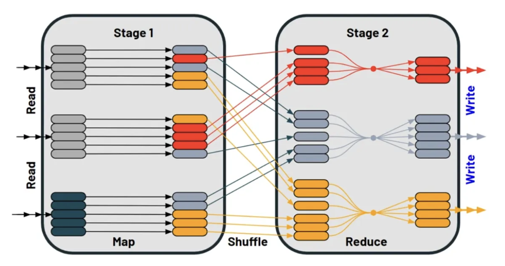

# Spark Optimization: Shuffle

## Shuffle

- shuffling is a process in spark where data is exchanged and repartitioned between worker nodes during computation.

- it often occurs when an action such as **_sorting_**, **_grouping_**, **_joining_** is performed on the data.

- 


## Issues with Shuffle

#### High network utilization

- shuffle can cause high network utilization as large volume of data are exchanged between nodes, which can slow down the overall network speed of the cluster.

#### Network bandwith bottleneck

- the network bandwidth can also become a bottleneck, limiting the speed at which data can be exchanged between nodes, resulting in slower execution time.

#### Uneven data distribution 

- shuffle can result in uneven distribution of data across the cluster after the operation, which can lead to the skew problem.

#### Performance Impacts 

- the shuffle is an expensive operation since it involves disk i/o, data serialization, and network i/o. to organize data for the shuffle, spark generates a set of tasks - map task to organize data, and a set of reduce tasks to aggregate it.

- internally, results from individual map tasks are kept in memory until they cannot fit. these are sorted based on the target partition and written to a single file.

- certain shuffle operations can consume significant amounts of heap memory since they employ in-memory data structures to organize records before or after transferring them. Shuffle also generates a large number of intermediate files on disks. 

## Causes of Shuffle

#### Grouping and aggregation

- when performing an aggregation operation on a large dataset, spark needs to bring together data with the same key onto the same worker node. this requires shuffling the data scross the network to ensure that all data with the same key is located on the same node.

#### Join

- when joining two large datasets on a common key, spark needs to bring together data with the same key from both datasets.

#### Sorting

- when sorting a large dataset, spark needs to partition the data based on the sorting key, sort it within each partition, and then merge the sorted partitions.

#### Repartitioning

- when changing the number of partitions in a dataset, spark needs to shuffle the data to redistribute it across the new set of partitions.

## Solutions to Shuffle Issues

#### Minimizing data exchange over the network

- when performing operations like joins or aggregations, it is important to select only the necessary rows and columns, rather than processing the entire dataset.

#### Broadcasting smaller tables

- broadcasting involves sending the same data to all worker nodes so that every worker node will have a copy of the data.

- this is useful when joining two tables where one is significantly larger than the other, and the smaller table is small enough to be efficiently distributed across the worker nodes.

- if we broadcast the smaller table across the worker nodes so that the join can be performed locally where the larger table resides without shuffling the larger table across the network.

- "spark.sql.autoBroadcastJoinThreshold' is a configuration used to control when a table should be broadcasted during a join operation. it has a default value of 10 mb.

- it is recommended to set the broadcast threshold to 1/10 if the available memory on worker nodes. for instance, if a worder node has an avaiable memory of 20gb, a broadcast threshold of 2gb can be a good starting point.

- we could also manually broadcast a table using the broadcast() function

``` python
from pyspark.sql.functions import broadcast

broadcast_df2 = broadcast(df2)

join_df = df1.join(broadcast_df2, 'join_column')
```

``` python
# example 

# Sample data
products_data = [(101, "Product A", 100), (102, "Product B", 150), (103, "Product C", 200)]
categories_data = [(101, "Category X"), (102, "Category Y"), (103, "Category Z")]

# Create DataFrames
products_df = spark.createDataFrame(products_data, ["product_id", "product_name", "price"])
categories_df = spark.createDataFrame(categories_data, ["category_id", "category_name"])

# bad - shuffling involved due to regular join
result_bad = products_df.join(categories_df, product_df.product_id == categories_df.category_id)

# good - avoids shuffling using broadcast variable
# create a broadcast variable from the categories dataframe.
broadcast_categories = broadcast(categories_df)

result_good = products_df.join(broadcast_categories, product_df.product_id == broadcast_categories.category_id)

```

#### Partition Tuning:

- too few partitions can lead to data skew and uneven processing, while too many partitions can lead to excessive shuffling and network congestion.

- a general guideline, it is recommended to have 2-4 partitions per available cpu core in the cluster. for instance, if the cluster has 16 cpu cores, a good starting point might be to use 32-64 partitions.

- repartition() could be used to reduce or increase the number of partitions, coalesce() could be used to reduce the number of partitions. 

- but repartition involves data shuffling, which could be expensive. coalesce() does not involves data shuffling, but may result in uneven distributed partitions.

- ensure that your data is appropriately partitioned from the begining. If your data is already partitioned based on operation you are performing, spark can avoid shuffling altogether. Use functions like repartition() or coaleace() to control the partitioning of your data.

``` python

data = [(1, "A"), (2, "B"), (3, "C"), (4, "D"), (5, "E")]

df = spark.createDataFrame(data, ['id', 'name'])

# bad - shuffling involved due to default partitioning (200 partitions)
result_bad = df.groupBy("id").count()

# good - avoids shuffling by explicitely repartitioning
df_repartitioned = df.repartition(2, "id")

result_good = df_repartitioned.groupBy("id").count()

```

- shuffle versus repartition: 
    1. shuffle: A shuffle is a process of redistributing data across the nodes in a cluster during certain operations, such as groupByKey or reduceByKey. It is typically necessary when the data needs to be rearranged or grouped differently based on certain keys, and the original data distribution across nodes is no longer suitable for the computation.
    2. Repartition:  Repartitioning is a specific operation that changes the number of partitions in a Resilient Distributed Dataset (RDD) or a DataFrame. The goal of repartitioning is to optimize the distribution of data across the cluster by changing the number of partitions. It allows you to control the parallelism of your computation and can be used to balance the workload across the nodes more evenly.


#### Use Memory and Disk Caching

- caching data that is frequently accessed across multiple stages of a spark application can help avoid re-computation and reduce the number of times that data needs to be exchanged over the network.

- caching intermediate data that will be reused in multiple stages can help avoid recomputation and reduce the need for shuffling.

- df.persist(StorageLevel.MEMORY_AND_DISK) can be used to cache a data frame to memory, and if there is not enough available memory, spark will cache the data to the disk.

- spark.storage.memoryFraction parameter can be used to adjust the storage fraction. by default, spark uses a storage fraction of 0.6, which means 60% of the executor memory is allocated for caching and other storage needs. the remaining 40% of the memory is used for execution and other tasks.

``` python

# Sample data
data = [(1, 10), (2, 20), (1, 5), (3, 15), (2, 25)]

df = spark.createDataFrame(data, ['key', 'value'])

# bad - shuffling involved due to recomputation of the filter condition
result_bad = df.filter("value > 10").groupBy("key").sum("value")

# good - avoids shuffling by caching the filtered data
df_filtered = df.filter("value > 10").cache()
result_good = df_filtered.groupBy('key').sum("value")
```

#### Filter Early

- apply filters or conditions to your data as early as possible in your transformation. this way, you can reduce the amount of data that needs to be shuffled through the subsequent stages.

``` python

sales_data = [(101, "Product A", 100), (102, "Product B", 150), (103, "Product C", 200)]
categories_data = [(101, "Category X"), (102, "Category Y"), (103, "Category Z")]

sales_df = spark.createDataFrame(sales_data, ["product_id", "product_name", "price"])
categories_df = spark.createDataFrame(categories_data, ["product_id", "category"])

# bad - shuffling involved due to regular join
result_bad = sales_df.join(categories_df, on = 'product_id')

# good - avoid shuffling using broadcast variables
# filter the small dataframe early and broadcast it for efficient join
filter_categories_df = categories_df.filter("category = 'Category X'")
result_good = sales_df.join(broadcast(filter_categories_df), on = "product_id")

```

#### Avoid Using groupByKey()

- prefer reduceByKey() or aggregateByKey() instead of groupByKey() as the former performs partial aggregation locally before shuffling the data, leading to better performance.

```python
# Sample data
data = [(1, "click"), (2, "like"), (1, "share"), (3, "click"), (2, "share")]

rdd = sc.parallelize(data)

# bad - shuffling involved due to groupByKey
result_bad = rdd.groupByKey().mapValues(len)

# good - avoid shuffling by using reduceByKey
result_good = rdd.map(lambda x: (x[0], 1)).reduceByKey(lambda a, b: a+b)
```

#### Use Data Locality

- whenever possible, try to process data that is already stored on the same node where the computation is happening. this reduces network communication and shuffling.

```python
# Sample data
data = [(1, 10), (2, 20), (1, 5), (3, 15), (2, 25)]

df = spark.createDataFrame(data, ['key', 'value'])

# bad = shuffling involved due to default data locality
result_bad = df.groupBy("key").max("value")

# good - avoid shuffling by repartitioning and using data locality .
df_repartitioned = df.repartition("key") # repartition to align dat by key
result_good = df_repartitioned.groupBy("key").max("value")
```


#### Optimize Data Serialization

- choose efficient serialization formats like Avro or Kryo to reduce the data size during shuffling.

``` python
spark = SparkSession.builder \
    .appName("AvoidShuffleExample") \
    .config("spark.serializer", "org.apache.spark.serializer.KryoSerializer") \
    .getOrCreate()
```

#### Tune Spark Configuration

- adjust spark configuration parameters like spark.shuffle.partitions, spark.reducer.maxSizeInFlight, and spark.shuffle.file.buffer to fine tune the shuffling behavior.

#### Monitor and Analyze

- use spark ui and spark history server to analyze the performance of your jobs.

- shuffling may still be unavoidable, especially for complex operations or when working with large databases. In such cases, focus on optimizing shuffling rather than completely avoiding it. 


## Conclusion

- to achieve optimal results, testing and experimenting are necessary. 

## References

- https://medium.com/@chenglong.w1/the-5s-optimization-framework-for-spark-shuffle-optimization-f2b905e09bb0
