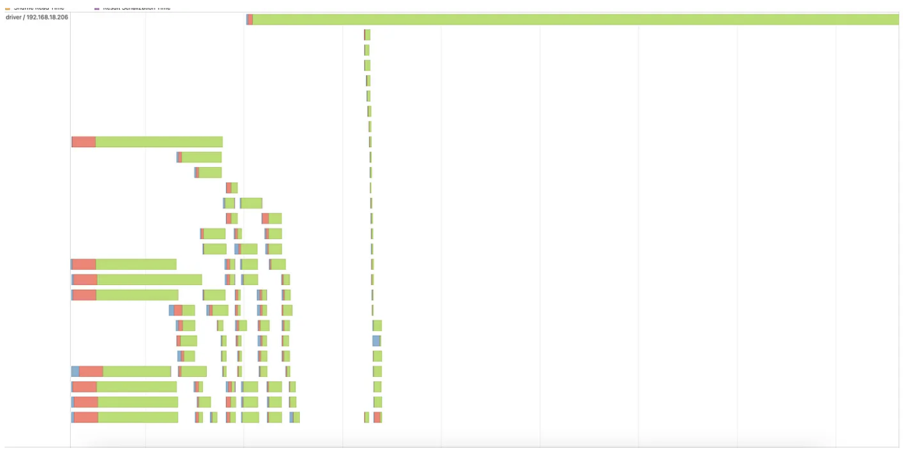
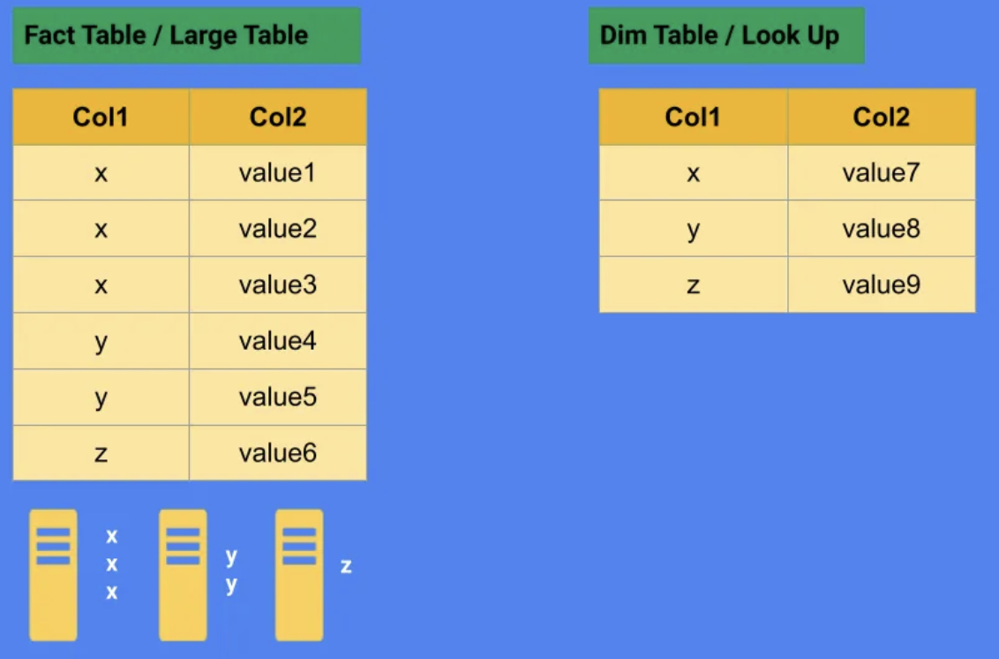
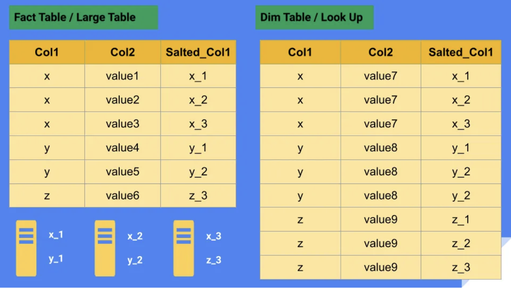
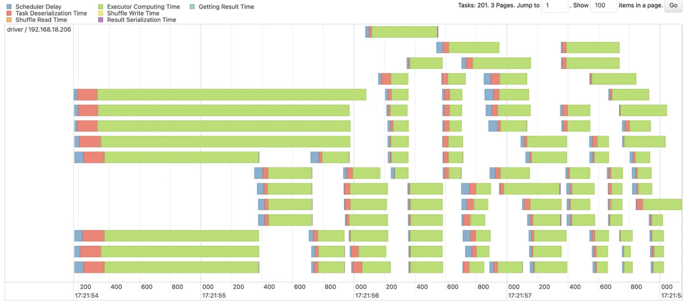

# Spark Optimization: Skew

## Skew

- skew is the result of the imbalance in size between the different partitions. small amounts of skew can be perfectly acceptable but in some circumstances, skew can result in spill and oom errors.

## Problems of Data Skew

- **_Straggling tasks_**: longer execution time.

- **_Spills to disks and out of memory errors_**

- **_Resource wastage_**: some executors may become idle while waiting for other executors to complete the processing of larger partitions. 

## Causes of Data Skew

#### Imbalanced data distribution

- uneven distribution of data across partitions due to the natural characteristics of the data can cause skew. 

- for instance, a dataset with zip code info may have some zip codes with significantly more data than others.

#### Data quality issues

- skew can also occur due to data quality issues like a significant amount of missing or duplicate records, causing null or duplicated values to become much larger than partitions of not null values

#### Data shift

- changes in data distribution over time can result in some partitions becoming significantly larger than others.

#### Aggregation or Join

- when joining two large datasets or grouping a dataset on a skewed key, one partition may contain significantly more data than others.

## Example

- the following code add skew by replacing multiple pickup locations in the data with pickup location 237.

```python
from pyspark.sql import DataFrame, SparkSession
import pyspark.sql.functions as F

def prepare_trips_data(spark: SparkSession) -> DataFrame:

    pu_loc_to_change = [
        236, 132, 161, 186, 142, 141, 48, 239, 170, 162, 230, 163, 79, 234, 263, 140, 238, 107, 68, 138, 229, 249,
        237, 164, 90, 43, 100, 246, 231, 262, 113, 233, 143, 137, 114, 264, 148, 151
    ]
    
    res_df = spark.read\
        .parquet("data/trips/*.parquet")\ 
        .withColumn(
            "PULocationID",
            F.when(F.col("PULocationID").isin(pu_loc_to_change), F.lit(237))
            .otherwise(F.col("PULocationID"))
        )
    return res_df
```

## Detecting Data Skew: Putting the Spark UI to Use

- example calculation: the average distance traveled by pickup zone

```python

def join_on_skewed_data(spark: SparkSession):
    trips_data = prepare_trips_data(spark = spark)
    location_details_data = spark.read.options("header", True).csv("data/taxi+_zone_lookup.csv")

    trips_with_pickup_location_details = trips_data\
        .join(location_detail_data, F.col("PULocationID") == F.col("LocationID"), "inner")
    
    trips_with_pickup_location_details \
        .groupBy("Zone") \
        .agg(F.avg("trip_distance").alias("avg_trip_distance")) \
        .sort(F.col("avg_trip_distance").desc()) \
        .show(truncate = False, n = 1000)
    
    trips_with_pickup_location_details \
        .groupBy("Borough") \
        .agg(F.avg("trip_distance").alias("avg_trip_distance")) \
        .sort(F.col("avg_trip_distance").desc()) \
        .show(truncate = False, n = 1000)
    
```
- to observe the data skew and its consequences, adaptive query execution (AQE) needs to be disabled. additionally, broadcast join should be disabled as well.

```python
def create_spark_session_with_aqe_disabled() -> SparkSession:
    conf = SparkConf() \
        .set("spark.driver.memory" , "4G") \
        .set("spark.sql.autoBroadcastJoinThreshold", "-1") \
        .set("spark.sql.shuffle.partitions", "201") \
        .set("spark.sql.adaptive.enabled", "false")
    
    spark_session = SparkSession\
        .builder\
        .master("local[8]") \
        .config(conf=conf)\
        .appName("read from jdbc tutorial")
        .getOrCreate()
    
    return spark_session

if __name__ == "__main__": 
    start_time = time.time()
    spark = create_spark_session_with_aqe_disabled()
    
    join_on_skewed_data(spark = spark)

    print(f"Elapsed_time: {(time.time() - start_time)} seconds")
    time.sleep(10000)
```
- 
- one task taking significantly more time than all other task. it is in fact taking 7 seconds, wheras the median is 50 ms.
- the number of records processed by this task is significantly higher compared to other tasks. this is a straggling task.

## Solutions to Data Skew

- there are general techniques that can be applied such as using the broadcast join where possible, or breaking up the skewed join column, as well as techniques that depend on the data, such as including another column in the join to better distribute the skewed data.

#### Salting

- salting is a technique used to break up skewed keys into even partitions.

- consider join two tables (a dimmension and a fact table) on a skewed key. before salting, the tables may have uneven data distribution with respect to the key column.

- 

- with salting techniques, we could break up larger partitions with a salt column that separates them into smaller, more evenly sized chunks

- 

``` python
# example code

from pyspark.sql import SparkSession
from pyspark.sql import rand, round, concat, col, lit
import math

# create a spark session
spark = SparkSession.builder.appName("data_skew").getOrCreate()

# turn off AQE
soark.conf.set("spark.sql.adaptive.enable", "False")
spark.conf.set("spark.sql.adaptive.skewedJoin.enabled", False)

# Define the data as a list of tuples
fact_data = [("x", "value1"), ("x", "value2"), ("x", "value3"), ("y", "value4"), ("y", "value5"), ("z", "value6")]
dim_data = [("x", "value7"), ("y", "value8"), ("z", "value9")]

# Create the DataFrame from the list of tuples
df_fact = spark.createDataFrame(fact_data)
df_dim = spark.createDataFrame(dim_data)

# determine the number of partitions
# total size of dataframe / size per partition (128 mb is a good starting point)
# suppose the dataframe size is 350 mb
partitions = math.ceil(350/128)

df_fact = df_fact.repartition(partitions, "_1")
df_dim = df_dim.repartition(partitions, "_1")

# create salted dimension table
df_dim_salted = (df_dim
                .crossJoin(spark.range(partitions).toDF('salt'))
                .withColumn("salted_col1", concat(col('_1'), lit("-"), col("salt")))
                .drop("salt")
        )

# create salted fact table
df_fact_salted = (df_fact.
                .withColumn("salt", (rand() * partitions).cast("int"))
                .withColumn("salted_col1", concat(col("_1"), lit("_"), col("salt")))
                .drop("salt"))

df_join = (df_fact_salted
        .join(df_dim_salted, on = "salted_col", how = "left"))

```


- in the zone lookup data, which is smaller, repeat each row n times with a different value of a new column, which can have values 0 to n-1. This new column is called location_id_alt

- in the rides data, which is bigger, and is the one with data skew, add values 0 to n-1 basd on another column. In this example, I choose the pickup timestamp (tpep_pickup_datetime) column, convert it to day of the year using dayofyear spark sql function, and take a mod n. Now, both sides have an additional column, with values from 1 to n.

- adding this new column in the join will distribute all partitions, including the one with more data, into more partitions. the computation of the new column does not involve anything that would require a shuffle to compute, there is no rank or row number operation on a window.

```python

def join_on_skewed_data_with_subsplit(spark: SparkSession):
    subsplit_partitions = 20
    trips_data = prepare_trips_data(spark = spark)\
        .withColumn("dom_mod", F.dayofyear(F.col("tpep_pickup_datetime")))
        .withColumn("dom_mod", F.col("dom _mod")%subsplit_partitions)
    
    location_details_data = spark\
        .read\ 
        .option("header", True)\
        .csv("data/taxi+_zone_lookup.csv")\
        .withColumn("location_id_alt", F.array([F.lit(num) for num in range(0, subsplit_partitions)])) \
        .withColumn("location_id_alt", F.explode(F.col("location_id_alt")))
    
    trips_with_pickup_location_details = trips_data\
        .join( 
            location_details_data,
            (F.col('PULocationID') == F.col("LocationID")) & (F.col("location_id_alt") == F.col("dom_mod")),
            "inner"
        )
    
    trips_with_pickup_location_details\
        .groupBy("Zone") \
        .agg(F.avg("trip_distance").alias("avg_trip_distance")) \
        .sort(F.col("avg_trip_distance").desc()) \
        .show(truncate = False, n = 1000)
    
    trips_with_pickup_location_details \
        .groupBy("Borough") \
        .agg(F.avg("trip_distacne").alias("avg_trip_distance")) \
        .sort(F.col("avg_trip_distance").desc())\
        .show(truncate = False, n=1000)

```

- 
- the longest task is now 2 seconds, and the median is 0.1 seconds.


#### Using adaptive query execution (AQE)

- AQE uses "statistics to choose the more efficient query execution plan". it handels runtime skew problem by dynamically adjusting the number of partitions and the size of shuffle blocks during runtime based on actual data distribution.

- ADE has a feature to handel skew by splitting long tasks called skewjoin. this can be enabled by setting the property "spark.sql.adaptive.skewjoin.enabled" to True. there are two parameters to tune skew join in AQE:
    1. spark.sql.adaptive.skewJoin.skewedPartitionFactor: this adjusts the factor by which if medium partition size is multiplied, partitions are considered as skewed partitions if they are larger than that. a good starting point: total size of data / size of a partition.
    2. spark.sql.adaptive.skewJoin.skewedPartitionThresholdInBytes: this is the minimum size of skewed partition, and it marks partitions as skewed if they larger than the value set for this parameter.

- there is another feature in AQE called Coalesce Partitions (spark.sql.adaptive.coaleascePartitions.enabled). when enabled, spark will tune the number of shuffle partitions based on statistics of data and processing resources, and it will also merge smaller partitions into larger partitions, reducing shuffle time and data transfer.

``` python

def create_spark_session_with_aqe_skew_join_enabled() -> SparkSession:
    conf = SparkConf() \
        .set("spark.driver.memory", "4G") \
        .set("spark.sql.autoBroadcastJoinThreshold", "-1") \
        .set("spark.sql.shuffle.partitions", "201") \ 
        .set("spark.sql.adaptive.enabled", "true") \
        .set("spark.sql.adaptive.coalescePartitions.enabled", "true")\
        .set("spark.sql.adaptive.skewJoin.enabled", "true") \
        .set("spark.sql.adaptive.skewJoin.skewedPartitionFactor", "3") \
        .set("spark.sql.adaptive.skewJoin.skewedPartitionThresholdInBytes" "256K")
    
    spark_session = SparkSession \
            .builder \
            .master("local[8]") \
            .config(conf = conf) \
            .appName("Read from JDBC Tutorials") \
            .getOrCreate()

    return spark.session
```

#### In-memory Partitioning

- in-memory partitioning is a manual solution for skewed data, which involved using functions such as repartition() and coalesce()

``` python
# sample a target data frame
sample_df = df.sample(fraction = 0.1)

# check sample distribution
sample_df.describe()
sample_df.summary()

# check the number of partitions
df.rdd.getNumPartitions()

# repartition data frame into N partitions
df = df.repartition(N)

# It is recommended to choose a number of partitions (N) that is a multiple (e.g., 4x) of the number of cores available for the Spark job.
```

#### Bucketing

- Bucketing is a technique for organizing data into a fixed number of buckets based on the values of one or more columns. 

- Bucketing can improve the performance of certain types of queries, particularly those that involve joining large datasets on specific columns. By organizing the data into buckets based on the join key, Spark can reduce the amount of data that needs to be shuffled during the join operation,

- Bucketing vs Table Partitioning (partitionBy())
    1. Table partitioning involves dividing data based on one or more columns and organizing them in a **_folder structure_**, while bucketing involves dividing data into **_a fixed number of buckets (files) within a partition_** and organizing data with similar values in the same file based on one or more columns
    2. Partitioning is more useful for dividing data into folders and **_optimizing filtering queries_**, whereas bucketing is more useful for organizing data into files and **_optimizing join queries_**