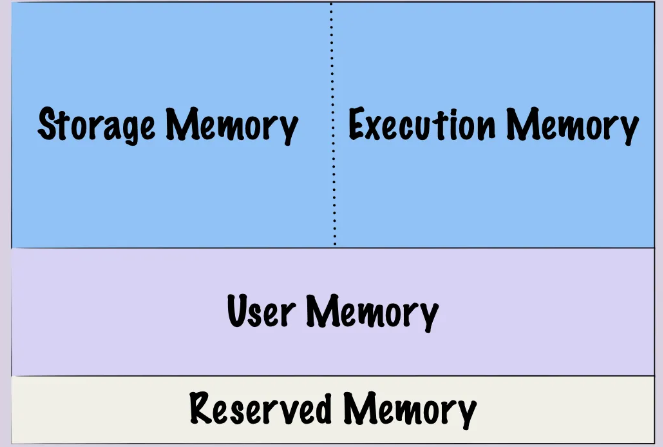
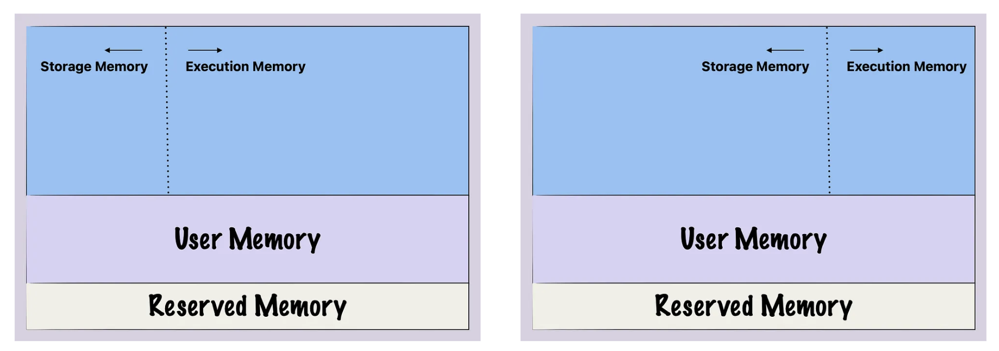
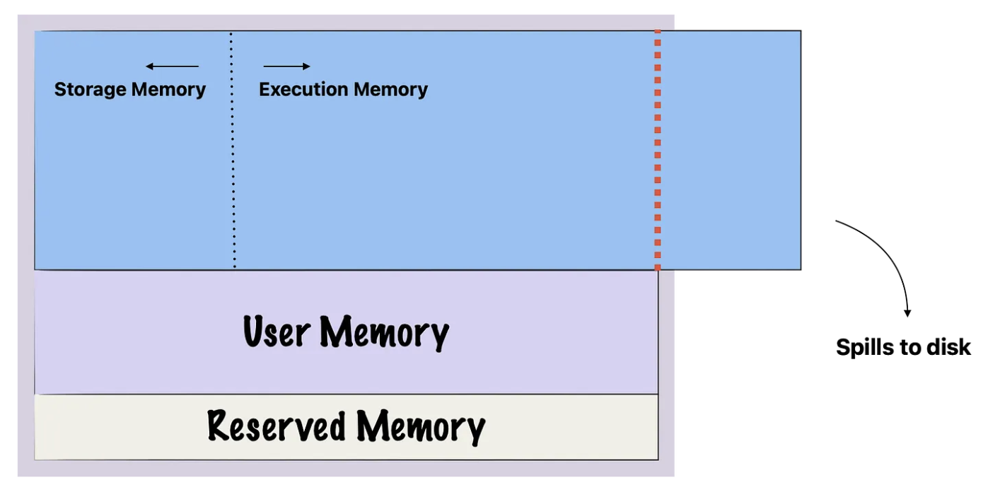
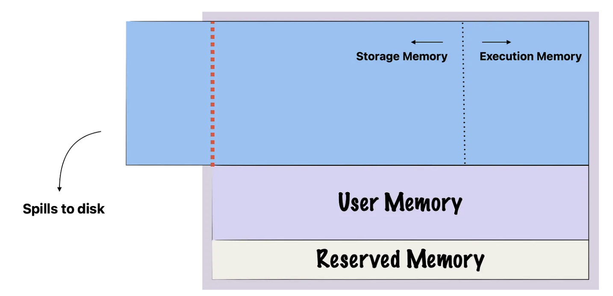

# Spark Optimization: Spill

## Apache Spark Optimization Techniques

- the **_5s (spill, skew, shuffle, storage, serialization)_** are the 5 most common performance problems in spark.

- two key general approaches to increase spark performance
    1. reducing the amount of data ingested
    2. reducing the time spark spends reading data

## Spill

- spill is the term used to refer to the act of moving an rdd from ram to disk, and later back into ram again.

- spill is caused by writing temporary files to disks when running out of memory (a partition is too big to fit in RAM). 

- disk reads and writes can be quite expensive to compute and should therefore be avoided as much as possible.

## Memory management in spark

- spark is designed as an in-memory data processing engine, which means it primarily uses ram to store and manipulate data rather than relying on disk storage. the in-memory computing capability is one of the key features that makes spark fast and efficient.

#### Unified Memory

- 

    1. **_storage memory_**: spark stores data to be reused later, like cached data and broadcast variables. instead of reading the sales data from disk for each separate analysis, you can cache a dataframe in storage memory after the first read.
    2. **_execution memory_**: this part of the memory is what spark uses for computation. when you perform a join or aggregation, spark uses the execution memory. For instance, to calculate the average value of a column in a dataframe. spark would:
        * load the relevant portions of the dataframe into execution memory.
        * perform the aggregation, storing intermediate sums and counts in execution memory.
        * calculate the final average, still using execution memory for the computation.
        * output the final result, freeing up the execution memory used for the operation.
    3. **_user memory_**: this is used for custom data structures or variables that you create but are not directly managed by spark. user memory typically contains metadata, custom hash tables, or other structures you might need. user memory is not managed by spark, it is up to you to ensure that you are not using more user memory than allocated to avoid out of memory (OOM) errors. 
    4. **_reserved memory_**: reserved memory is set aside for system level operations and spark's internal objects. reserved memory is used by spark itself for its own internal operations. the memory is 'reserved' in the sense that it is not available for your data or tasks.

#### Dynamic allocation between storage and execution memory

- in spark, the relationship between storage memory and execution memory is like two people sharing a pie.

- 

- execution memory and storage memory share a unified memory region, where either can occupy the entire region if the other is unused.

- the eviction of data from storage memory is generally governed by a least recently used (LRU) policy. this means that when execution memory needs more space and decides to evict data from storage memory, it will typically remove the data that has been accessed least recently.

## Disk Spill in Spark

- disk spill can come from either storage memory (when the cached dataframes are too big) or execution memory (when operations require significant amounts of intermediate data storage)

- when execution memory needs additional space for tasks like joins and shuffles, it can borrow from storage memory. if the execution memory reached this limit and still needs more space, spark will spill the excess data to disk.

- 

- when execution memory requires more space but hits the limit it can borrow from the storage memory.

- 

- when storage memory requires more space but hits the limit it can borrow from the execution memory.

## The Impact of Partition Size on Disk Spill

- when you load a table into spark, it gets broken down into manageable chunks called partitions which are divided among the worker nodes.

- the unified memory we discussed in the previous section exists on a per-node basis.

- choosing the right number of partitions for your spark job is essential to speedy execution time.

## The Cost of Disk Spill

- **_performance impact_**: disk i/o is significant slower than memory access, which can lead to slower job completion time.

- **_out of memory errors_**: If the spilled data is too large and there is not enough disk space available to store it, Spark may throw an out-of-memory error, which can cause the application to fail. For the driver, out-of-memory issues can occur when the application uses large broadcast variables or when large amounts of data are collected by the driver.

- **_resource utilization_**: disk spill can lead to inefficient use of resources. cpu cycles that could be used for computations are instead spent on read/write operations to disk. 

- **_operational complexity_**: managing a spark application that frequently spills to disk can be more complex. you will need to monitor not just cpu and memory usage, but also disk usage, adding another layer to your operational considerations.

- **_cost implication_**: in cloud-based environment, you are billed for the compute resources you use.

## Causes of Disk Spill

- **_large datasets_**: when the data being processed is larger than the available memory, spark will spill the excess data to disk.

- **_complex operation_**: tasks that require a lot of intermediate data, such as joins, aggregations, and shuffles, can cause disk spill if the execution memory is insufficient.

- **_inappropriate partitioning_**: when you have too few partitions, and the partition sizes are larger than the available memory, spark will spill the parts of the partitions that do not fit to disk.

- **_multiple cached dataframe/rdds_**: if you are caching multiple large dataframs or rdds and the storage memory fills up, the least recently used data will be spilled to disk.

- **_concurrent tasks_**: running multiple tasks that each require a large amount of memory can lead to disk spill as they compete for limited memory resources.

- **_skewed data_**: data skew can cause some partitions to have a lot more data than others. the worker nodes responsible for these heavy partitions can run out of memory. 

- **_inadequate configuration_**: the default or user-defined spark configuration do not allocate enough memory for certain operations, leading to disk spill. 

## Identify Disk Spill

- spill (memory) displays the size of the data in memory before it gets spilled to disks

- spill (disk) displays the size of the spilled data as it exist on disk after being spilled.

- the reason spill(disk) is smaller than spill(memory) is because when the data is written to disk, it is serialized and compressed.

## Mitigating Disk Spill

- **_understand the root cause_**: use the spark ui to identify the operations that causing the spill, looking at metrics like spill(disk) and spill(memory) in the stage tab.

- **_partition your data effectively_**: effective data partitioning is a key strategy to minimize disk spill in spark. shuffling is an expensive operation that redistribute data across partitions and often requires a large amount of intermediate storage. better partitioning of your data can reduce the need for shuffling. the recommended partition size is less than 1gb, any bigger and you may encounter long shuffles and disk spills.

- **_cache your data appropriately_**: caching data in spark is a double-end sword. caching too much data can quickly fill up you storage memory, leaving less room for execution memory and increase likelihood of disk spill.

- **_address data skew_**: strategies like salting can help redistribute data more evenly across partitions, reducing the risk of spill.

- **_resizing you cluster_**: adding more memory to you cluster can helper reduce disk spill since execution memory and storage memory have more room to work in. The most straightforward solution is to allocate more memory to Spark jobs, which can reduce the chances of the data spill. This can be done by adjusting configuration parameters such as spark.driver.memory, spark.executor.memory. 

- **_Adaptive Query Engine (AQE)_**: 
    1. Predicate Push-Down: reduce the amount of data that needs to be processed by filtering out unnecessary rows early in the query pipeline before any heavy operations like aggregate and join.
    2. Dynamic Pruning Optimization: This technique involves dynamically pruning partitions and columns during query execution based on the data distribution and the query plan by pruning unnecessary partitions and columns

- **_Broadcast Join Tuning_**: the data used in the join may be broadcasted to all worker nodes in the cluster if the data is sufficiently small and below a predefined threshold controlled by the spark.sql.autoBroadcastJoinThreshold parameter. To avoid data spill issues, it’s important to only broadcast data that is small enough to fit into the executor’s memory without affecting performance.

- **_Reduce Data Collection to Driver_**: In Spark, the driver is responsible for coordinating the execution of the job and collecting the results. If too much data is collected by the driver, it can overwhelm the driver’s memory and cause the job to fail. One way to minimize the amount of data collected by the driver is to select only the necessary data before collecting it

## Conclusion for Spill

- disk spill in spark is a complex issue that can significantly impact the performance, cost, and operational complexity of your spark applications.

- monitor your applications in spark ui and keep an eye out for spill. when you spot it, diagnose the cause, and from there you can apply the appropriate solution, whether it involved salting for data skew or repartitioning for large shuffle operations. 

- taking a proactive approach to manage disk spill.

## Refereces

- https://towardsdatascience.com/memory-management-in-apache-spark-disk-spill-59385256b68c#:~:text=Large%20Datasets%3A%20When%20the%20data,the%20Execution%20Memory%20is%20insufficient.

- https://medium.com/@chenglong.w1/the-5s-optimization-framework-for-spark-spill-optimization-2584b028c97c

