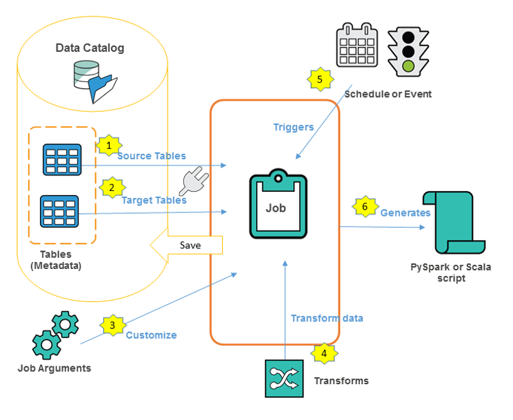
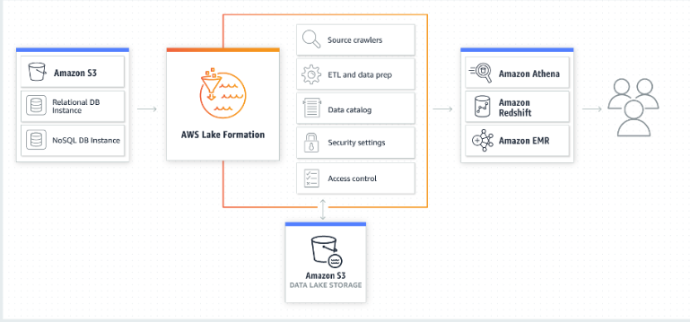
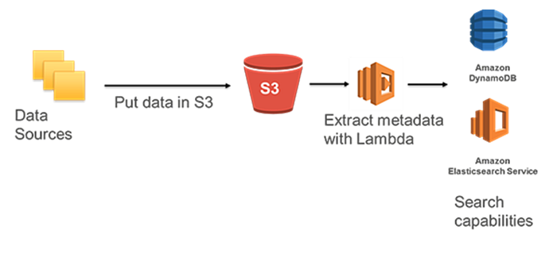

# Introduction to Designing Data Lakes on AWS

## Data Lake Characteristics and Components

#### What is a Data Lake? 

A data lake is a centralized repository that allows you to store all your structured and unstructured data at any scale. You can store your data as-is, without having to first structure the data, and run different types of analytics—from dashboards and visualizations to big data processing, real-time analytics, and machine learning to guide better decisions.

## Data Lakes and Data Warehouses

A data warehouse is a database optimized to analyze relational data coming from transactional systems and line of business applications. The data structure, and schema are defined in advance to optimize for fast SQL queries, where the results are typically used for operational reporting and analysis. Data is cleaned, enriched, and transformed so it can act as the “single source of truth” that users can trust. 

A data lake is different, because it stores relational data from line of business applications, and non-relational data from mobile apps, IoT devices, and social media. The structure of the data or schema is not defined when data is captured. This means you can store all of your data without careful design or the need to know what questions you might need answers for in the future. Different types of analytics on your data like SQL queries, big data analytics, full text search, real-time analytics, and machine learning can be used to uncover insights. 

## Amazon S3 and Glue Data Catalog

#### Amazon S3 Storage Classes

- S3 Standard—The default storage class. If you don't specify the storage class when you upload an object, Amazon S3 assigns the S3 Standard storage class.

- Reduced Redundancy—The Reduced Redundancy Storage (RRS) storage class is designed for noncritical, reproducible data that can be stored with less redundancy than the S3 Standard storage class. 

- The S3 Standard-IA and S3 One Zone-IA storage classes are designed for long-lived and infrequently accessed data. (IA stands for infrequent access.) S3 Standard-IA and S3 One Zone-IA objects are available for millisecond access (same as the S3 Standard storage class). 

- The S3 Glacier and S3 Glacier Deep Archive storage classes are designed for low-cost data archiving. 

- The S3 Intelligent-Tiering storage class is designed to optimize storage costs by automatically moving data to the most cost-effective storage access tier, without performance impact or operational overhead.

#### AWS Glue 

- AWS Glue is a fully managed ETL (extract, transform, and load) service that makes it simple and cost-effective to categorize your data, clean it, enrich it, and move it reliably between various data stores and data streams. AWS Glue consists of a central metadata repository known as the AWS Glue Data Catalog, an ETL engine that automatically generates Python or Scala code, and a flexible scheduler that handles dependency resolution, job monitoring, and retries. AWS Glue is serverless, so there’s no infrastructure to set up or manage.   

- The AWS Glue Data Catalog is your persistent metadata store. It is a managed service that lets you store, annotate, and share metadata in the AWS Cloud in the same way you would in an Apache Hive metastore.    

- AWS Glue also lets you set up crawlers that can scan data in all kinds of repositories, classify it, extract schema information from it, and store the metadata automatically in the AWS Glue Data Catalog. The AWS Glue Data Catalog can then be used to guide ETL operations.   

- Crawlers use classifiers, a classifier reads the data in a data store. If it recognizes the format of the data, it generates a schema. The classifier also returns a certainty number to indicate how certain the format recognition was.   

## Data Movement

#### Amazon Kinesis 

Amazon Kinesis makes it easy to collect, process, and analyze real-time, streaming data so you can get timely insights and react quickly to new information. Amazon Kinesis offers key capabilities to cost-effectively process streaming data at any scale, along with the flexibility to choose the tools that best suit the requirements of your application. With Amazon Kinesis, you can ingest real-time data such as video, audio, application logs, website clickstreams, and IoT telemetry data for machine learning, analytics, and other applications. Amazon Kinesis enables you to process and analyze data as it arrives and respond instantly instead of having to wait until all your data is collected before the processing can begin.     

#### Amazon API Gateway   

Amazon API Gateway is a fully managed service that makes it easy to create, publish, and maintain secure APIs at scale. APIs are the front door to backend applications and services. API Gateway handles all the tasks involved in accepting and processing up to hundreds of thousands of concurrent API calls, including traffic management, CORS support, authorization and access control, throttling, monitoring, and API version management.   

## EMR, Glue Jobs, Lambda, Kinesis Analytics, RedShift

#### Apache Hadoop on AWS   

#### Amazon EMR    

Amazon EMR is a managed cluster platform that simplifies running big data frameworks, such as Apache Hadoop and Apache Spark, on AWS to process and analyze vast amounts of data. By using these frameworks and related open-source projects, such as Apache Hive and Apache Pig, you can process data for analytics purposes and business intelligence workloads. Additionally, you can use Amazon EMR to transform and move large amounts of data into and out of other AWS data stores and databases, such as Amazon Simple Storage Service (Amazon S3) and Amazon DynamoDB.   

#### Amazon EMR Serverless

Amazon EMR Serverless is a serverless option in Amazon EMR that makes it easy for data analysts and engineers to run open-source big data analytics frameworks without configuring, managing, and scaling clusters or servers. You get all the features and benefits of Amazon EMR without the need for experts to plan and manage clusters.

#### AWS Glue DataBrew

AWS Glue DataBrew is a new visual data preparation tool that makes it easy for data analysts and data scientists to clean and normalize data to prepare it for analytics and machine learning. You can choose from over 250 pre-built transformations to automate data preparation tasks, all without the need to write any code. You can automate filtering anomalies, converting data to standard formats, and correcting invalid values, and other tasks. After your data is ready, you can immediately use it for analytics and machine learning projects

#### AWS Glue Jobs 

A job is the business logic that performs the extract, transform, and load (ETL) work in AWS Glue. When you start a job, AWS Glue runs a script that extracts data from sources, transforms the data, and loads it into targets. You can create jobs in the ETL section of the AWS Glue console.    

#### AWS Lambda 

AWS Lambda is a compute service that lets you run code without provisioning or managing servers. AWS Lambda runs your code only when needed and scales automatically, from a few requests per day to thousands per second. You pay only for the compute time you consume - there is no charge when your code is not running. With AWS Lambda, you can run code for virtually any type of application or backend service - all with zero administration. AWS Lambda runs your code on a high-availability compute infrastructure and performs all of the administration of the compute resources, including server and operating system maintenance, capacity provisioning and automatic scaling, code monitoring and logging.   

When using AWS Lambda, you are responsible only for your code. AWS Lambda manages the compute fleet that offers a balance of memory, CPU, network, and other resources. This can be helpful when processing incoming data for your data lake being hosted on AWS.   

#### Amazon Athena  

Amazon Athena is an interactive query service that makes it easy to analyze data directly in Amazon Simple Storage Service (Amazon S3) using standard SQL. With a few actions in the AWS Management Console, you can point Athena at your data stored in Amazon S3 and begin using standard SQL to run ad-hoc queries and get results in seconds. 

#### Amazon RedShift

Amazon Redshift makes it simple and cost effective to run high performance queries on petabytes of structured data so that you can build powerful reports and dashboards using your existing business intelligence tools.   

#### Amazon Kinesis Data Analytics    

With Amazon Kinesis Data Analytics for SQL Applications, you can process and analyze streaming data using standard SQL. The service enables you to quickly author and run powerful SQL code against streaming sources to perform time series analytics, feed real-time dashboards, and create real-time metrics.   

#### Amazon OpenSearch Service  

Please note that Amazon Elasticsearch Service (Amazon ES) has a successor called Amazon OpenSearch Service. 

Amazon OpenSearch Service is an open source, distributed search and analytics suite derived from Elasticsearch. Elasticsearch is a popular open-source search and analytics engine for use cases such as log analytics, real-time application monitoring, and clickstream analysis. 

## AWS Lake Formation

## The Importance of Data Cataloging

#### Data Cataloging

The earliest challenges that inhibited building a data lake were keeping track of all of the raw assets as they were loaded into the data lake, and then tracking all of the new data assets and versions that were created by data transformation, data processing, and analytics. Thus, an essential component of an Amazon S3-based data lake is the data catalog. The data catalog provides a query-able interface of all assets stored in the data lake’s S3 buckets. The data catalog is designed to provide a single source of truth about the contents of the data lake.

There are two general forms of a data catalog: a comprehensive data catalog that contains information about all assets that have been ingested into the S3 data lake, and a Hive Metastore Catalog (HCatalog) that contains information about data assets that have been transformed into formats and table definitions that are usable by analytics tools like Amazon Athena, Amazon Redshift, Amazon Redshift Spectrum, and Amazon EMR. The two catalogs are not mutually exclusive and both may exist. The comprehensive data catalog can be used to search for all assets in the data lake, and the HCatalog can be used to discover and query data assets in the data lake.

#### Comprehensive Data Catalog 

The comprehensive data catalog can be created by using standard AWS services like AWS Lambda, Amazon DynamoDB, and Amazon Elasticsearch Service (Amazon ES). At a high level, Lambda triggers are used to populate DynamoDB tables with object names and metadata when those objects are put into Amazon S3 then Amazon ES is used to search for specific assets, related metadata, and data classifications. 

#### HCatalog with AWS Glue 

AWS Glue can be used to create a Hive-compatible Metastore Catalog of data stored in an Amazon S3-based data lake. To use AWS Glue to build your data catalog, register your data sources with AWS Glue in the AWS Management Console. AWS Glue will then crawl your S3 buckets for data sources and construct a data catalog using pre-built classifiers for many popular source formats and data types, including JSON, CSV, Parquet, and more. You may also add your own classifiers or choose classifiers from the AWS Glue community to add to your crawls to recognize and catalog other data formats. The AWS Glue-generated catalog can be used by Amazon Athena, Amazon Redshift, Amazon Redshift Spectrum, and Amazon EMR, as well as third-party analytics tools that use a standard Hive Metastore Catalog. 

## Columnar Data Formats and Amazon Athena Optimizations

#### Columnar Data Format and Athena Partitioning

Apache Parquet and ORC are columnar storage formats that are optimized for fast retrieval of data and used in AWS analytical applications.Columnar storage formats have the following characteristics that make them suitable for using with Athena:

1. Compression by column, with compression algorithm selected for the column data type to save storage space in Amazon S3 and reduce disk space and I/O during query processing.

2. Predicate pushdown in Parquet and ORC enables Athena queries to fetch only the blocks it needs, improving query performance. When an Athena query obtains specific column values from your data, it uses statistics from data block predicates, such as max/min values, to determine whether to read or skip the block.

3. Splitting of data in Parquet and ORC allows Athena to split the reading of data to multiple readers and increase parallelism during its query processing.

By partitioning your data, you can restrict the amount of data Athena scans by each query, thus improving performance and reducing cost. Athena leverages Hive for partitioning data. You can partition your data by any key. A common practice is to partition the data based on time, often leading to a multi-level partitioning scheme. 

#### AWS Glue Jobs   

An AWS Glue job encapsulates a script that connects to your source data, processes it, and then writes it out to your data target. Typically, a job runs extract, transform, and load (ETL) scripts. Jobs can also run general-purpose Python scripts (Python shell jobs.) AWS Glue triggers can start jobs based on a schedule or event, or on demand. You can monitor job runs to understand runtime metrics such as completion status, duration, and start time. 

AWS Glue provides a set of built-in transforms that you can use to process your data. You can call these transforms from your ETL script. Your data passes from transform to transform in a data structure called a DynamicFrame, which is an extension to an Apache Spark SQL DataFrame. The DynamicFrame contains your data, and you reference its schema to process your data.   

One of the major abstractions in Apache Spark is the SparkSQL DataFrame, which is similar to the DataFrame construct found in R and Pandas. A DataFrame is similar to a table and supports functional-style (map/reduce/filter/etc.) operations and SQL operations (select, project, aggregate).

DataFrames are powerful and widely used, but they have limitations with respect to extract, transform, and load (ETL) operations. Most significantly, they require a schema to be specified before any data is loaded. SparkSQL addresses this by making two passes over the data—the first to infer the schema, and the second to load the data. However, this inference is limited and doesn't address the realities of messy data. 

To address these limitations, AWS Glue introduces the DynamicFrame. A DynamicFrame is similar to a DataFrame, except that each record is self-describing, so no schema is required initially. Instead, AWS Glue computes a schema on-the-fly when required, and explicitly encodes schema inconsistencies using a choice (or union) type. 