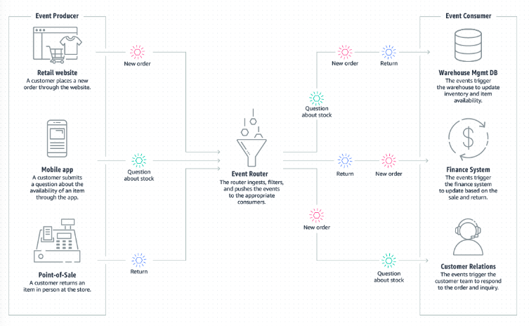
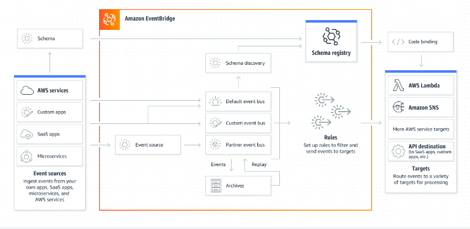
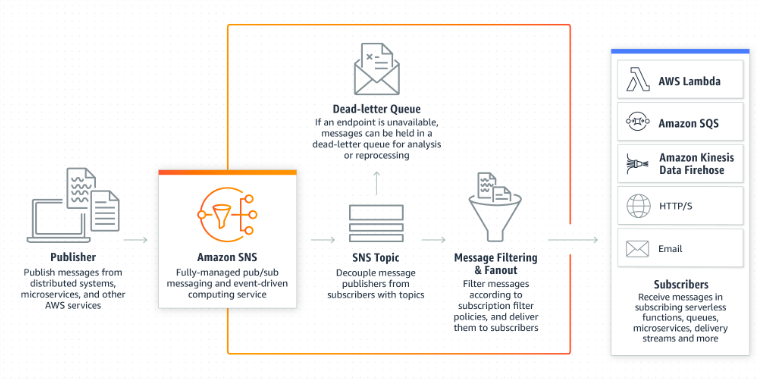
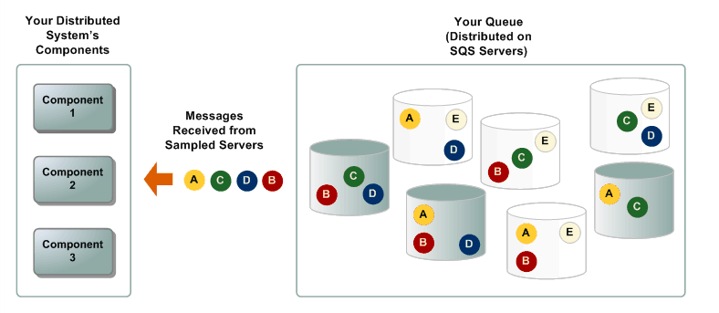
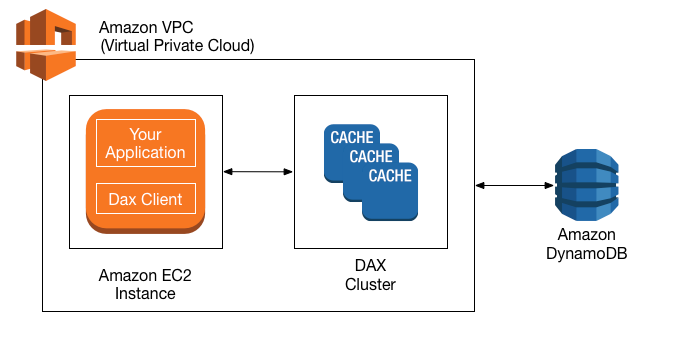

# Architecting Solutions on AWS

## Compute on AWS

#### AWS Lambda

- Lambda is a compute service that provides serverless compute functions that run in response to events or triggers. When an event or trigger is detected, a Lambda function is spun up in its own secure and isolated runtime environment, which is called an execution environment. Lambda functions can run for up to 15 minutes. Any processes that need longer than 15 minutes to run should use other compute services on AWS for hosting.

- When you use Lambda, you are responsible only for your code, which can make it easier to optimize for operational efficiency and low operational overhead. Lambda manages the compute fleet, which offers a balance of memory, CPU, network, and other resources to run your code.

- If you need to manage your own compute resources, AWS has other compute services that can meet your needs. For example:

    1. Amazon Elastic Compute Cloud (Amazon EC2) offers a wide range of EC2 instance types to choose from. With Amazon EC2, you can customize operating systems, settings for network and security, and the entire software stack. 

    2. AWS Elastic Beanstalk is a service that you can use to deploy and scale applications on Amazon EC2. 

- Lambda can be used for virtually any application or backend that requires compute and that runs in under 15 minutes. Common use cases are web backends, Internet of Things (IoT) backends, mobile backends, file or data processing, stream or message processing, and more.

#### Amazon API Gateway

- API Gateway is a fully managed service that makes it easier for developers to create, publish, maintain, monitor, and secure APIs at any scale. APIs act as the front door for applications, so that the applications can access data, business logic, or functionality from your backend services. By using API Gateway, you can create RESTful APIs and WebSocket APIs that enable real-time two-way communication applications. API Gateway supports containerized and serverless workloads, as well as web applications.

#### Amazon EC2

- Amazon EC2 is a service that provides resizable compute capacity in the cloud, which means that it provides virtual machines in the cloud. Amazon EC2 is a flexible service that offers multiple instance types, sizes, and pricing models to meet specific requirements. Because you can choose your operating system and configurations for your instance, you can configure Amazon EC2 to work with virtually any workload.

#### AWS container services

- Container management tools can be divided into three categories: registry, orchestration, and compute. 

1. Amazon ECS:

    Amazon Elastic Container Service (Amazon ECS) is a fully managed container orchestration service that you can use to deploy, manage, and scale containerized applications. 

    - Serverless by default with AWS Fargate: Fargate is built into Amazon ECS, and it reduces the time you need to spend on managing servers, handling capacity planning, or figuring out how to isolate container workloads for security. With Fargate, you define your application’s requirements and select Fargate as your launch type in the console or AWS Command Line Interface (AWS CLI). Then, Fargate takes care of all the scaling and infrastructure management that’s needed to run your containers

    - Security and isolation by design: Amazon ECS natively integrates with the tools you already trust for security, identity, and management and governance. This can help you get to production quickly and successfully. You can assign granular permissions for each of your containers, giving you a high level of isolation when you build your applications.

    - Autonomous control plane operations: Amazon ECS is a fully-managed container orchestration service, with AWS configuration and operational best practices built-in—with no control plane, nodes, or add-ons for you to manage.

2. Amazon EKS

    Amazon Elastic Kubernetes Service (Amazon EKS) is a managed service that you can use to run Kubernetes on AWS without needing to install, operate, and maintain your own Kubernetes control plane or nodes. Kubernetes is an open-source system for automating the deployment, scaling, and management of containerized applications. 

    - It runs and scales the Kubernetes control plane across multiple AWS Availability Zones to ensure high availability.

    - It also automatically scales control plane instances based on load, detects and replaces unhealthy control plane instances, and provides automated version updates and patching for them.

    - It is integrated with many AWS services to provide scalability and security for your applications, including the following capabilities:

        - Amazon Elastic Container Registry (Amazon ECR for container images).

        - Elastic Load Balancing for load distribution.

        - AWS Identity and Access Management (IAM) for authentication.

        - Amazon Virtual Private Cloud (VPC) for isolation.

    - It runs up-to-date versions of Kubernetes, so you can use all of the existing plugins and tooling from the Kubernetes community. 

3. AWS Fargate

    AWS Fargate is a technology that you can use with Amazon ECS to run containers without managing servers or clusters of EC2 instances. 

    AWS Fargate reduces your need to provision, configure, or scale clusters of virtual machines to run containers. Thus, it also minimizes your need to choose server types, decide when to scale your clusters, or optimize cluster packing.

## Databases on AWS

- Databases are purpose-built on AWS, which means that each AWS database service is built for a specific use case or set of use cases. Using a database that is a best fit for the use case can save a lot of time in development hours.

- With AWS, you can run different types of databases more easily without managing the infrastructure yourself. This can lead to making decisions that are more aligned with the use case and aren’t limited to in-house skill for database administration. 

#### Amazon Aurora

- Amazon Aurora is a fully managed relational database engine that's compatible with MySQL and PostgreSQL. You can use the code, tools, and applications for your existing MySQL and PostgreSQL databases with Aurora. 

- An Aurora cluster volume can grow to a maximum size of 128 tebibytes (TiB). Aurora also automates and standardizes database clustering and replication, which are typically among the most challenging aspects of database configuration and administration.

- Aurora is part of the managed database service Amazon Relational Database Service (Amazon RDS). Amazon RDS is a web service that makes it easier to set up, operate, and scale a relational database in the cloud. Aurora Serverless v2is an on-demand, automatic scaling configuration for Aurora. 

- Aurora Serverless v2 helps automate the processes of monitoring the workload and adjusting the capacity for your databases. Capacity is adjusted automatically based on application demand

#### Amazon RDS Proxy

- By using Amazon RDS Proxy, your applications can pool and share database connections to improve their ability to scale. RDS Proxy makes applications more resilient to database failures by automatically connecting to a standby DB instance, while preserving application connections. 

- With RDS Proxy, you can handle unpredictable surges in database traffic that otherwise might cause issues because of oversubscribing connections or creating new connections at a fast rate. RDS Proxy establishes a database connection pool and reuses connections in this pool without the memory and CPU overhead of opening a new database connection each time. To protect the database against oversubscription, you can control the number of database connections that are created.

#### Amazon DynamoDB

- Amazon DynamoDB is a fully managed NoSQL database service that provides fast and predictable performance with seamless scalability. By using DynamoDB, you can offload the administrative burdens of operating and scaling a distributed database so that you can reduce your need to handle hardware provisioning, setup and configuration, replication, software patching, or cluster scaling. DynamoDB also offers encryption at rest, which reduces your operational burden and the complexity involved in protecting sensitive data. 

- NoSQL is a term used to describe nonrelational database systems that are highly available, scalable, and optimized for high performance. Instead of the relational model, NoSQL databases (such as DynamoDB) use alternate models for data management, such as key-value pairs or document storage.

- In DynamoDB, tables, items, and attributes are the core components that you work with. A table is a collection of items, and each item is a collection of attributes. DynamoDB uses primary keys to uniquely identify each item in a table, and secondary indexes to provide more querying flexibility. You can use DynamoDB Streams to capture data modification events in DynamoDB tables.

## Event-Driven Architectures on AWS

- An event-driven architecture uses events to invoke and communicate between decoupled services. It’s a common architecture in modern applications that are built with microservices. An event is a change in state, or an update, such as placing an item in a shopping cart on an ecommerce website. Events can either carry the state (the item purchased, its price, and a delivery address) or events can be identifiers (a notification that an order was shipped)

- Event-driven architectures have three key components: event producers, event routers, and event consumers. A producer publishes an event to the router, which filters and pushes the events to consumers. Producer services and consumer services are decoupled, which means that they can be scaled, updated, and deployed independently.

- 

## Amazon EventBridge compared to Amazon SNS

- You can use both Amazon EventBridge and Amazon Simple Notification Service (Amazon SNS) to develop event-driven application

- We recommend EventBridge when you want to build an application that reacts to events from software as a service (SaaS) applications or AWS services. EventBridge is the only event-based service that integrates directly with third-party SaaS AWS Partners. EventBridge also automatically ingests events from over 90 AWS services without requiring developers to create any resources in their account

- EventBridge uses a defined, JSON-based structure for events, and you can also select events to forward to a target by creating rules that are applied across the entire event body. At launch, EventBridge has limited throughput (see the service limits), which can be increased on request. It also has a typical latency of about half a second.

- We recommend Amazon SNS when you want to build an application that reacts to high throughput or low-latency messages that are published by other applications or microservices. Amazon SNS provides nearly unlimited throughput. You can also use it for applications that need very high fan-out (thousands or millions of endpoints). The typical latency of Amazon SNS typical is under 30 milliseconds. The typical latency of Amazon SNS typical is under 30 milliseconds.

#### Amazon EventBridge

- EventBridge is a serverless event bus service that you can use to connect your applications with data from various sources. EventBridge delivers a stream of real-time data from your applications, software as a service (SaaS) applications, and AWS services to targets such as AWS Lambda functions, HTTP invocation endpoints using API destinations, or event buses in other AWS accounts.

- EventBridge receives an event, which is an indicator of a change in environment. EventBridge then applies a rule to route the event to a target. Rules match events to targets based on either the structure of the event (which is called an event pattern), or on a schedule.

- All events that come to EventBridge are associated with an event bus. Rules are tied to a single event bus, so they can only be applied to events on that event bus. Your account has a default event bus, which receives events from AWS services. You can also create custom event buses to send or receive events from a different account or Region.

- 

#### Amazon SNS

- Amazon SNS is a managed service that provides message delivery from publishers to subscribers (which are also known as producers and consumers). 

- Publishers communicate asynchronously with subscribers by sending messages to a topic, which is a logical access point and communication channel. Clients can subscribe to the SNS topic and receive published messages by using a supported endpoint type, such as Amazon Kinesis Data Firehose, Amazon SQS, AWS Lambda, HTTP, email, mobile push notifications, and mobile text messages through Short Message Service (SMS).

- 

#### Amazon DynamoDB Streams

- DynamoDB Streams captures a time-ordered sequence of item-level modifications in any DynamoDB table, and stores this information in a log for up to 24 hours. Applications can access this log and view the data items as they appeared, before and after they were modified, in near-real time.Encryption at rest encrypts the data in DynamoDB streams.

    - Each stream record appears exactly one time in the stream.

    - For each item that is modified in a DynamoDB table, the stream records appear in the same sequence as the actual modifications to the item.

- DynamoDB Streams writes stream records in near-real time so that you can build applications that consume these streams and take action based on the contents.You can enable a stream on a new table when you create it by using the AWS Command Line Interface (AWS CLI) or one of the AWS SDKs. You can also enable or disable a stream on an existing table, or change the settings of a stream. 

- DynamoDB Streams operates asynchronously, so table performance isn’t affected if you enable a stream.All data in DynamoDB Streams is subject to a 24-hour lifetime.

## Decoupling Solutions on AWS

- This week’s customer had issues with latency for their end users because they were using a synchronous model for their web backend. Morgan suggested that they migrate to an asynchronous model, where the order is first stored, and then processed shortly after. With this model, end user can receive a response more quickly from the backend. When the backend system receives an order, it can immediately respond and then process the request asynchronously. 

- A loosely coupled architecture minimizes the bottlenecks that are caused by synchronous communication, latency, and I/O operations. Amazon Simple Queue Service (Amazon SQS) and AWS Lambda are often used to implement asynchronous communication between different services.You should consider using this pattern if you have the following requirements:

    - You want to create loosely coupled architecture.

    - All operations don’t need to be completed in a single transaction, and some operations can be asynchronous.

    - The downstream system can’t handle the incoming transactions per second (TPS) rate. The messages can be written to the queue and processed based on the availability of resources.

## Amazon SQS

-  Amazon SQS is a fully managed, message queuing service that you can use to decouple and scale microservices, distributed systems, and serverless applications. Amazon SQS reduces the complexity and overhead associated with managing and operating message-oriented middleware, which means that developers can focus on differentiating work. By using Amazon SQS, you can send, store, and receive messages between software components at virtually any volume, without losing messages or requiring other services to be available.

    - Visibility timeout: The length of time that a message received from a queue (by one consumer) won't be visible to the other message consumers.

    - Message retention period: The amount of time that Amazon SQS retains messages that remain in the queue. By default, the queue retains messages for 4 days. You can configure a queue to retain messages for up to 14 days. 

    - Delivery delay: The amount of time that Amazon SQS will delay before it delivers a message that is added to the queue.

    - Maximum message size: The maximum message size for the queue. 

    - Receive message wait time: The maximum amount of time that Amazon SQS waits for messages to become available after the queue gets a receive request. 

    - Enable content-based deduplication: Amazon SQS can automatically create deduplication IDs based on the body of the message. 

    - Enable high throughput FIFO: This feature enables high throughput for messages in the queue. Choosing this option changes the related options (deduplication scope and FIFO throughput limit) to the required settings for enabling high throughput for FIFO queues. 

    - Redrive allow policy: This policy defines which source queues can use this queue as the dead-letter queue. 

#### Short polling compared to long polling

- When you consume messages from a queue by using short polling, Amazon SQS samples a subset of its servers (based on a weighted random distribution) and returns messages from only those servers.

- 

## Architecture Optimizations for Week 1

#### Caching for Amazon DynamoDB by using Amazon DynamoDB Accelerator

- Raf mentioned that if you need to improve Amazon DynamoDB performance to microsecond latency, to look into using Amazon DynamoDB Accelerator (DAX). 

- DAX is a fully managed, highly available, in-memory cache for DynamoDB that’s designed to deliver up to a 100-times performance improvement—from milliseconds to microseconds—even at millions of requests per second.

- DAX does the heavy lifting that’s required to add in-memory acceleration to your DynamoDB tables—and developers don’t need to manage cache invalidation, data population, or cluster management.

- 

#### Optimizing AWS Lambda

- AWS Lambda Power Tuning: AWS Lambda Power Tuning
 is an open-source tool that helps you visualize and fine-tune the memory or power configuration of Lambda functions. It runs in your own AWS account, and it supports three optimization strategies: cost, speed, and balanced.

## A Look into AWS Data Services

- Clickstream is the term for small events that contain pieces of data that are generated continuously with high speed and volume. Remember, clickstream data is usually data that’s collected by systems (mostly frontends) regarding user interactions with that system. In this week’s scenario, clickstream data will be used to collect information about users’ behaviors when they interact with a restaurant menu.

#### AWS data services

- From data movement, data storage, data lakes, big data analytics, log analytics, streaming analytics, business intelligence, and machine learning (ML) to many things in between, AWS offers purpose-built services that provide price performance, scalability, and low costs.

#### Data lakes and data storage

- Amazon S3

    Amazon Simple Storage Service (Amazon S3) is an object storage service that offers scalability, data availability, security, and performance. Customers of all sizes and industries can store and protect virtually any amount of data for virtually any use case, such as data lakes, cloud-native applications, and mobile apps. With cost-effective storage classes and easy-to-use management features, you can optimize costs, organize data, and configure fine-tuned access controls to meet specific business, organizational, and compliance requirements.

- 

    - Archive data at the lowest cost: Move data archives to the Amazon Simple Storage Service Glacier. Amazon S3 Glacier storage classes to lower costs, reduce operational complexities, and gain new insights.

    - Run cloud-native applications: Build fast, powerful, mobile and web-based cloud-native applications that scale automatically in a highly available configuration, such as static websites that use the client side for coding.

    - Build a data lake: Run big data analytics, artificial intelligence (AI), machine learning (ML), and high performance computing (HPC) applications to unlock data insights.

    - Back up and restore critical data: Meet Recovery Time Objectives (RTO), Recovery Point Objectives (RPO), and compliance requirements with the robust replication features of Amazon S3.

- Amazon S3 Glacier

    The Amazon S3 Glacier storage classes are purpose-built for data archiving. They are designed to provide you with high performance, retrieval flexibility, and low-cost archive storage in the cloud. All S3 Glacier storage classes provide virtually unlimited scalability and are designed for 99.999999999 percent (11 nines) of data durability. In addition to low-cost storage, the S3 Glacier storage classes also deliver options for fast access to your archival data.

- AWS Lake Formation
    
    AWS Lake Formation is a service that you can use to set up a secure data lake in days. A data lake is a centralized, curated, and secured repository that stores all your data, both in its original form and prepared for analysis. You can use a data lake to break down data silos and combine different types of analytics to gain insights and guide better business decisions.

#### Data analytics

- Amazon Athena

    Amazon Athena is an interactive query service that you can use to analyze data in Amazon S3 by using standard Structured Query Language (SQL). Athena is serverless, so you don’t need to manage infrastructure, and you pay only for the queries that you run.

    Using Athena is straightforward. You point to your data in Amazon S3, define the schema, and start querying by using standard SQL. Most results are delivered within seconds. With Athena, you don’t need complex extract, transform, and load (ETL) jobs to prepare your data for analysis. Anyone with SQL skills can use Athena to quickly analyze large-scale datasets.

- Amazon EMR

    Amazon EMR is a big data solution for petabyte-scale data processing, interactive analytics, and machine learning that use open-source frameworks, such as Apache Spark, Apache Hive, and Presto.

    Run large-scale data processing and what-if analysis by using statistical algorithms and predictive models to uncover hidden patterns, correlations, market trends, and customer preferences.

    Extract data from various sources, process it at scale, and make the data available for applications and users.

    Analyze events from streaming data sources in real time to create long-running, highly available, and fault-tolerant streaming data pipelines.

    Analyze data using open-source ML frameworks, such as Apache Spark MLlib, TensorFlow, and Apache MXNet.

    Connect to Amazon SageMaker Studio for large-scale model training, analysis, and reporting.

- Amazon OpenSearch Service

    You can use Amazon OpenSearch Service to perform interactive log analytics, real-time application monitoring, website search, and more. OpenSearch is an open source, distributed search and analytics suite that is derived from Elasticsearch.

#### Data movement

- Amazon Kinesis

    With Amazon Kinesis, you can collect, process, and analyze real-time, streaming data so that you can get timely insights and react quickly to new information. Amazon Kinesis offers key capabilities to cost-effectively process streaming data at virtually any scale, along with the flexibility to choose the tools that best suit the requirements of your application. With Amazon Kinesis, you can ingest real-time data such as video, audio, application logs, website clickstreams, and Internet of Things (IoT) telemetry data for machine learning, analytics, and other applications. You can use Amazon Kinesis to process and analyze data as it arrives, which means that you can respond quickly—you don’t need to wait for all your data to be collected before processing can begin.

- AWS Glue

    AWS Glue is a serverless data integration service that you can use to discover, prepare, and combine data for analytics, machine learning, and application development. AWS Glue provides capabilities that are needed for data integration so that you can start analyzing your data and using your data in minutes instead of months. Data integration is the process of preparing and combining data for analytics, machine learning, and application development. It involves multiple tasks, such as discovering and extracting data from various sources; enriching, cleaning, normalizing, and combining data; and loading and organizing data in databases, data warehouses, and data lakes. These tasks are often handled by different types of users who each use different products.

- AWS DMS

    AWS Database Migration Service (AWS DMS) helps you migrate databases to AWS quickly and securely. The source database remains fully operational during the migration, which minimizes downtime to applications that rely on the database. AWS DMS can migrate your data to and from the most widely used commercial and open-source databases.

#### Predictive analytics and machine learning

- Amazon SageMaker

    SageMaker can be used for any generic ML solution. You can use it to build, train, and deploy ML models for virtually any use case with fully managed infrastructure, tools, and workflows. SageMaker requires a learning curve to use, but it’s a managed serverless service that many people can use to innovate with ML through a choice of tools—such as integrated development environments (IDEs) for data scientists and no-code interfaces for business analysts.

- Amazon Rekognition

    Amazon Rekognition is one of Raf’s favorite ML services from the entire list of AWS services! It is easy to use, serverless, and abstracted, in the sense that you interact with it by doing API calls. With Amazon Rekognition, you can automate image and video analysis by adding pretrained or customizable computer vision API operations to your applications without building ML models and infrastructure from scratch.

    On its own, Amazon Rekognition is not a data analytics service. However, it’s listed here because you can use it as part of a data analytics solution. It is designed to analyze millions of images, streaming, and stored videos within 3 seconds. 

- Amazon Comprehend

    Amazon Comprehend is a natural-language processing (NLP) service that uses ML to uncover valuable insights and connections in text, which is instrumental for a data analytics solution. For example, you could mine business and call center analytics or process financial documents. For medical use cases, you can use Amazon Comprehend Medical, which focuses on extracting information accurately and quickly from unstructured medical text.

## Amazon S3 Cross-Region Replication and Object Lifecycle

#### S3 CRR

- With S3 Cross-Region Replication (CRR), you can replicate objects—and their respective metadata and object tags—into other AWS Regions for reduced latency, compliance, security, disaster recovery, and other use cases. CRR can be configured from a single, source Amazon Simple Storage Service (Amazon S3) bucket to replicate objects into one or more destination buckets in another AWS Region.

#### S3 Lifecycle

- You can add rules in an S3 Lifecycle configuration to tell Amazon S3 to transition objects to another Amazon S3 storage class. For more information about storage classes, see. Some examples of when you might use S3 Lifecycle configurations in this way include the following:

    - When you know that objects are infrequently accessed, you might transition them to the S3 Standard-IA storage class.

    - You might want to archive objects that you don't need to access in real time to the S3 Glacier Flexible Retrieval storage class.

- Amazon S3 Intelligent-Tiering storage class

- S3 Intelligent-Tiering is a good storage class for data with unknown, changing, or unpredictable access patterns—independent of object size or retention period. You can use S3 Intelligent-Tiering as the default storage class for virtually any workload, especially data lakes, data analytics, new applications, and user-generated content.

- S3 Intelligent-Tiering is the only cloud storage class that’s designed to deliver automatic storage cost savings when data access patterns change, without performance impact or operational overhead. S3 Intelligent-Tiering is designed to optimize storage costs by automatically moving data to the most cost-effective access tier when access patterns change. For a small monthly object monitoring and automation charge, S3 Intelligent-Tiering monitors access patterns and automatically moves objects that haven’t been accessed to lower-cost access tiers.

- There are no retrieval charges in S3 Intelligent-Tiering. S3 Intelligent-Tiering has no minimum eligible object size, but objects smaller than 128 KB are not eligible for automatic tiering. These smaller objects can be stored, but they will always be charged at the Frequent Access tier rates and don’t incur the monitoring and automation charge.

- 

- Amazon S3 Glacier storage classes

    You can use Amazon S3 Lifecycle policies to transition objects from one storage class to another. These storage classes include Amazon Simple Storage Service Glacier (Amazon S3 Glacier) storage classes, which are purpose-built for data archiving. S3 Glacier storage classes provide you with low-cost archive storage in the cloud. All S3 Glacier storage classes provide virtually unlimited scalability and are designed for 99.999999999 percent (11 nines) of data durability. The S3 Glacier storage classes deliver options for fast access to your archive data and low-cost archive storage in the cloud.

- 

## Differences Between Amazon Kinesis Services

#### Amazon Kinesis Family

The Amazon Kinesis Family makes it easier to collect, process, and analyze real-time, streaming data so that you can get timely insights and react quickly to new information. Amazon Kinesis offers key capabilities to cost-effectively process streaming data at virtually any scale, along with the flexibility to choose the tools that best suit the requirements of your application. With Amazon Kinesis, you can ingest real-time data such as video, audio, application logs, website clickstreams, and Internet of Things (IoT) telemetry data for machine learning, analytics, and other applications. You can use Amazon Kinesis to process and analyze data as it arrives, which means that you can respond quickly instead of waiting until all your data is collected before it’s processed.

#### Amazon Kinesis Data Streams

Amazon Kinesis Data Streams is a massively scalable and durable real-time data streaming service. Kinesis Data Streams is designed to continuously capture gigabytes of data per second from hundreds of thousands of sources, such as website clickstreams, database event streams, financial transactions, social media feeds, IT logs, and location-tracking events. The data that’s collected is typically available in milliseconds, which means that you can use Kinesis Data Streams with use cases for real-time analytics, such as real-time dashboards, real-time anomaly detection, dynamic pricing, and more.

####  Amazon Kinesis Data Firehose

Amazon Kinesis Data Firehose is designed to reliably load streaming data into data lakes, data stores, and analytics services. It can capture, transform, and deliver streaming data to Amazon Simple Storage Service (Amazon S3), Amazon Redshift, Amazon Elasticsearch Service, generic HTTP endpoints, and service providers like Datadog, New Relic, MongoDB, and Splunk. It is a fully managed service that automatically scales to match the throughput of your data and requires virtually no ongoing administration. It can also batch, compress, transform, and encrypt your data streams before loading, which minimizes the amount of storage that you use and increases security. Although it’s easier to operate when compared with Amazon Kinesis Data Streams, Kinesis Data Firehose delivery streams have a higher latency from the moment that data is ingested. For example, you can set the batch interval to 60 seconds if you want to receive new data within 60 seconds of sending it to your delivery stream. However, you could have latencies that are lower than 1 second when you use Amazon Kinesis Data Streams.

#### Amazon Kinesis Data Analytics

Amazon Kinesis Data Analytics is designed to transform and analyze streaming data in real time with Apache Flink. Apache Flink is an open-source framework and engine for processing data streams. Amazon Kinesis Data Analytics reduces the complexity of building, managing, and integrating Apache Flink applications with other AWS services. Amazon Kinesis Data Analytics is designed to take care of everything that’s required to run streaming applications continuously. It also scales automatically to match the volume and throughput of your incoming data. With Amazon Kinesis Data Analytics, there are no servers to manage, no minimum fee or setup cost, and you only pay for the resources that your streaming applications consume.

#### Amazon Kinesis Video Streams

Amazon Kinesis Video Streams is designed to securely stream video from connected devices to AWS for analytics, machine learning (ML), playback, and other forms of processing. Kinesis Video Streams automatically provisions and elastically scales the infrastructure that’s needed to ingest streaming video data from millions of devices. It’s designed to durably store, encrypt, and index video data in your streams, and you can access your data through the Kinesis Video Streams APIs. You can use Kinesis Video Streams to play back video for live and on-demand viewing. You can also use it to quickly build applications that take advantage of computer vision and video analytics through integration with Amazon Rekognition Video and libraries for ML frameworks (such as Apache MXNet, TensorFlow, and OpenCV). Kinesis Video Streams also supports WebRTC, an open-source project that uses APIs to facilitate real-time media streaming and interaction between web browsers, mobile applications, and connected devices. Typical uses for WebRTC include video chat and peer-to-peer media streaming.

## Amazon QuickSight Features

- With Amazon QuickSight, everyone in your organization can better understand your data by asking questions in natural language and exploring interactive dashboards. QuickSight can also automatically look for patterns and outliers (a feature that’s powered by machine learning)