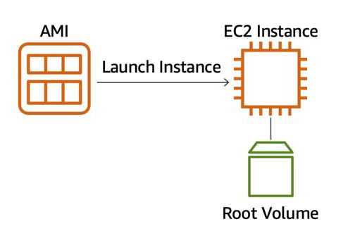
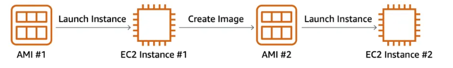
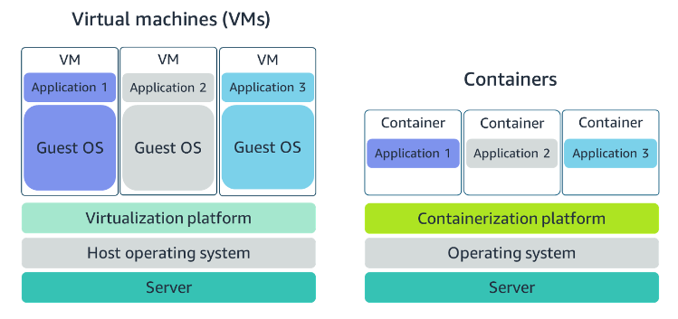
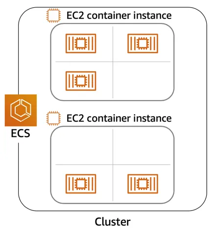
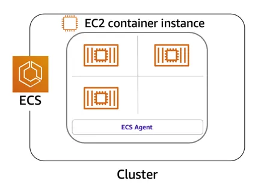
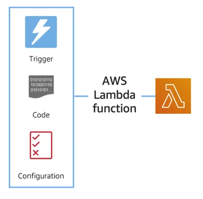
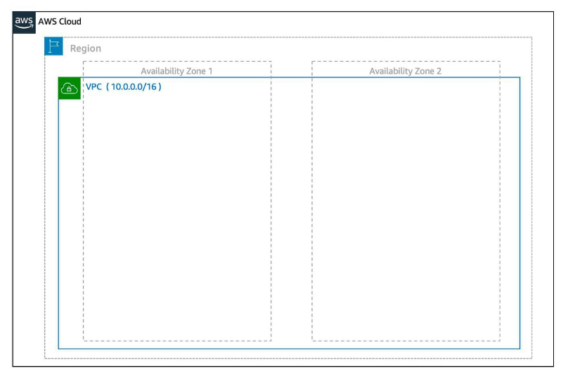
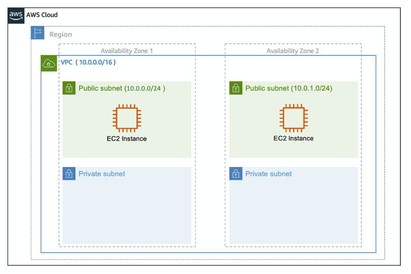
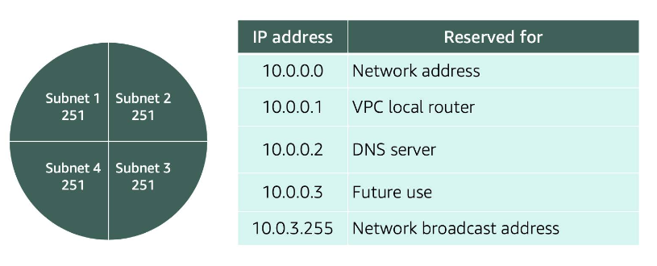
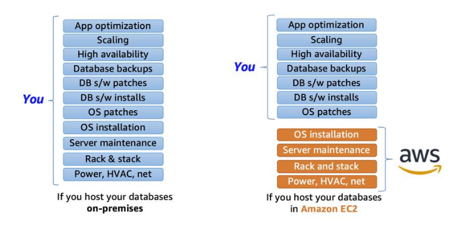

# AWS Cloud Technical Essentials

## Authentication and Authorization

- Authentication: Authentication ensures that the user is who they say they are. Usernames and passwords are the most common types of authentication, but you may also work with other forms, such as token-based authentication or biometric data like a fingerprint.

- Authorization: Authorization is the process of giving users permission to access AWS resources and services. Authorization determines whether the user can perform an action—whether it be to read, edit, delete, or create resources.

## AWS Root User

- Root User: When you first create an AWS account, you begin with a single sign-in identity that has complete access to all AWS services and resources in the account. The AWS root user has two sets of credentials associated with it

    - One set of credentials is the email address and password used to create the account. This allows you to access the AWS Management Console. 
    - The second set of credentials is called access keys, which allow you to make programmatic requests from the AWS Command Line Interface (AWS CLI) or AWS API

## AWS Identity and Access Management

- IAM is a web service that enables you to manage access to your AWS account and resources. It also provides a centralized view of who and what are allowed inside your AWS account (authentication), and who and what have permissions to use and work with your AWS resources (authorization).

- IAM is used to secure access to your AWS account and resources. It simply provides a way to create and manage users, groups, and roles to access resources within a single AWS account. IAM is not used for website authentication and authorization, such as providing users of a website with sign-in and sign-up functionality. IAM also does not support security controls for protecting operating systems and networks.

- IAM best practices

    - LOCK DOWN THE AWS ROOT USER

    - FOLLOW THE PRINCIPLE OF LEAST PRIVILEGE
    
    - USE IAM APPROPRIATELY

    - USE IAM ROLES WHEN POSSIBLE

    - CONSIDER USING AN IDENTITY PROVIDER: identity provider (IdP). Using an IdP, whether it be an AWS service such as AWS IAM Identity Center (Successor to AWS Single Sign-On) or a third-party identity provider, provides you a single source of truth for all identities in your organization.You no longer have to create separate IAM users in AWS. You can instead use IAM roles to provide permissions to identities that are federated from your IdP.

    - CONSIDER AWS IAM IDENTITY CENTER: AWS IAM Identity Center is an IdP that lets your users sign in to a user portal with a single set of credentials. It then provides them access to all their assigned accounts and applications in one central location.

## Compute as a Service on AWS

#### Understanding Servers

- The first building block you need to host an application is a server. Servers often times can handle Hypertext Transfer Protocol (HTTP) requests and send responses to clients following the client-server model, though any API based communication also falls under this model. A client being a person or computer that sends a request, and a server handling the requests is a computer, or collection of computers, connected to the internet serving websites to internet users.

#### Choose the Right Compute Option

- At a fundamental level, there are three types of compute options: virtual machines, container services, and serverless. 

## Amazon Elastic Compute Cloud

-  Amazon EC2 is a web service that provides secure, resizable compute capacity in the cloud. It allows you to provision virtual servers called EC2 instances.

- In order to create an EC2 instance, you need to define:

    - Hardware specifications, like CPU, memory, network, and storage.
    - Logical configurations, like networking location, firewall rules, authentication, and the operating system of your choice.

#### What Is an AMI?

- When launching an EC2 instance, the first setting you configure is which operating system you want by selecting an Amazon Machine Image (AMI). Not only does an AMI let you configure which operating system you want, you can also select storage mappings, the architecture type (such as 32-bit, 64-bit, or 64-bit ARM), and additional software installed.

- What Is the Relationship Between AMIs and EC2 Instances?: EC2 instances are live instantiations of what is defined in an AMI, much like a cake is a live instantiation of a cake recipe. If you are familiar with software development, you can also see this kind of relationship between a Class and an Object.

- A Class is something you model and define, while an object is something you interact with. In this case, the AMI is how you model and define your instance, while the EC2 instance is the entity you interact with, where you can install your web server, and serve your content to users.

- 

- One advantage of using AMIs is that they are reusable. 

- 

## Amazon EC2 Instance Lifecycle

- Now that you know how to select an operating system for your EC2 instance, it’s time to choose other configurations to create your EC2 instance, such as the instance type, network, and storage.

#### What Makes Up an EC2 Instance?

- EC2 instances are a combination of virtual processors (vCPUs), memory, network, and in some cases, instance storage and graphics processing units (GPUs). When you create an EC2 instance, you need to choose how much you need of each of these components.

-  AWS offers a variety of instances that differ based on performance. Instance types consist of a prefix identifying the type of workloads they’re optimized for, followed by a size. For example, the instance type c5.large can be broken down into the following elements. 
    - c5 determines the instance family and generation number. Here, the instance belongs to the fifth generation of instances in an instance family that’s optimized for generic computation.
    - large, which determines the amount of instance capacity.

#### Where Does Your EC2 Instance Live?

- By default, your EC2 instances are placed in a network called the default Amazon Virtual Private Cloud (VPC).

#### Architect for High Availability

- Inside this network, your instance resides in an Availability Zone of your choice. AWS services that are scoped at the Availability Zone level must be architected with high availability in mind. While EC2 instances are typically reliable, two is better than one, and three is better than two. Specifying the instance size gives you an advantage when designing your architecture because you can use more smaller instances instead of a few larger ones. If your frontend only has a single instance and that instance fails, your application goes down. On the other hand, if your workload is distributed across 10 instances and one fails, you lose only 10 percent of your fleet and your application availability is hardly affected. When architecting any application for high availability, consider using at least two EC2 instances in two separate Availability Zones. ­­ 

#### Explore the EC2 Instance Lifecycle

- pending state: When you launch an instance, it enters the pending state (1). When the instance is pending, billing has not started. At this stage, the instance is preparing to enter the running state. Pending is where AWS performs all actions needed to set up an instance, such as copying the AMI content to the root device and allocating the necessary networking components. 

- running state: When your instance is running (2), it's ready to use. This is also the stage where billing begins. As soon as an instance is running, you are then able to take other actions on the instance, such as reboot, terminate, stop, and stop-hibernate. 

- reboot state: When you reboot an instance (3), it’s different than performing a stop action and then a start action. Rebooting an instance is equivalent to rebooting an operating system. The instance remains on the same host computer and maintains its public and private IP address, and any data on its instance store. It typically takes a few minutes for the reboot to complete. 

- When you stop and start an instance (4), your instance may be placed on a new underlying physical server. Therefore, you lose any data on the instance store that were on the previous host computer. When you stop an instance, the instance gets a new public IP address but maintains the same private IP address.

- When you terminate an instance (5), the instance store are erased, and you lose both the public IP address and private IP address of the machine. Termination of an instance means you can no longer access the machine. 

#### What Is the Difference Between Stop and Stop-Hibernate?

- When you stop your instance, it enters the stopping state, and then the stopped state. AWS does not charge usage or data transfer fees for your instance after you stop it, but storage for any Amazon EBS volumes is still charged. While your instance is in the stopped state, you can modify some attributes, like the instance type. When you stop your instance, the data stored in memory (RAM) is lost.

- When you stop-hibernate your instance, AWS signals the operating system to perform hibernation (suspend-to-disk), which saves the contents from the instance memory (RAM) to the Amazon EBS root volume.

#### What Are the EC2 Pricing Options?

- There are three main purchasing options for EC2 instances: on-demand, reserved, and spot instances. 

    1. Pay As You Go with On-Demand Instances: 
    
    With On-Demand instances, you pay for compute capacity with no long-term commitments. Billing begins whenever the instance is running, and billing stops when the instance is in a stopped or terminated state. The price per second for a running On-Demand instance is fixed. For applications that require servers to be running all the time, you are less likely to benefit from the On-Demand pricing model, simply because there is no situation where you will need to turn servers off.

    2. Reserve Capacity with Reserved Instances (RIs)

    3. Save on Costs with Spot Instances

    Another way of paying for EC2 instances is by using Spot Instances. Amazon EC2 Spot Instances allow you to take advantage of unused EC2 capacity in the AWS Cloud.

    With Spot Instances, you set a limit on how much you would like to pay for the instance hour. This is compared against the current Spot price that AWS determines. If the amount you pay is more than the current Spot price and there is capacity, then you will receive an instance. While they are very promising from the billing perspective, there are some architectural considerations you will need to consider in order to use them effectively. One consideration is that your spot instance may be interrupted. For example, if AWS determines that capacity is no longer available for a particular spot instance or if the Spot price exceeds how much you are willing to pay, AWS will give you a 2-minute warning before it interrupts your instance. That means any application or workload that runs on a Spot instance must be able to be interrupted. Because of this unique consideration, inherently fault-tolerant workloads are typically good candidates to use with Spot instances. 

## Container Services on AWS

- AWS offers a broad spectrum of compute offerings that give you the flexibility to choose the right tool for the right job. The three main categories of compute are virtual machines, containers, and serverless. There is no one-size-fits-all service because it depends on your needs.

#### WHAT IS A CONTAINER?

- A container is a standardized unit that packages up your code and all of its dependencies. This package is designed to run reliably on any platform, because the container creates its own independent environment. This makes it easy to carry workloads from one place to another, such as from development to production or from on-premises to the cloud.

#### WHAT IS DOCKER?

- Docker is a popular container runtime that simplifies the management of the entire operating system stack needed for container isolation, including networking and storage. Docker makes it easy to create, package, deploy, and run containers.

#### WHAT IS THE DIFFERENCE BETWEEN CONTAINERS AND VMS?

- 

- Containers share the same operating system and kernel as the host they exist on, whereas virtual machines contain their operating system. Since each virtual machine has to maintain a copy of an operating system, there’s a degree of wasted space.A container is more lightweight. They spin up quicker, almost instantly. This difference in startup time becomes instrumental when designing applications that need to scale quickly during input/output (I/O) bursts.While containers can provide speed, virtual machines offer you the full strength of an operating system and offer more resources, like package installation, a dedicated kernel, and more.

#### ORCHESTRATE CONTAINERS

In AWS, containers run on EC2 instances. For example, you may have a large instance and run a few containers on that instance.While running one instance is easy to manage, it lacks high availability and scalability. Most companies and organizations run many containers on many EC2 instances across several Availability Zones.If you’re trying to manage your compute at a large scale, you need to know:

1. How to place your containers on your instances.
2. What happens if your container fails.
3. What happens if your instance fails.
4. How to monitor deployments of your containers.

This coordination is handled by a container orchestration service. AWS offers two container orchestration services: Amazon Elastic Container Service (ECS) and Amazon Elastic Kubernetes Service (EKS).

#### MANAGE CONTAINERS WITH AMAZON ELASTIC CONTAINER SERVICE (AMAZON ECS)

- 

- To run and manage your containers, you need to install the Amazon ECS Container Agent on your EC2 instances. This agent is open source and responsible for communicating back to the Amazon ECS service about cluster management details. An instance with the container agent installed is often called a container instance.

- 

## Serverless and AWS Lambda

#### REMOVE THE UNDIFFERENTIATED HEAVY LIFTING

- If you run your code on Amazon EC2, AWS is responsible for the physical hardware and you are responsible for the logical controls, such as guest operating system, security and patching, networking, security, and scaling.If you run your code in containers on Amazon ECS and Amazon EKS, AWS is responsible for more of the container management, such as deploying containers across EC2 instances and managing the container cluster. However, when running ECS and EKS on EC2, you are still responsible for maintaining the underlying EC2 instances.If you want to deploy your workloads and applications without having to manage any EC2 instances, you can do that on AWS with serverless compute.

#### GO SERVERLESS

Every definition of serverless mentions four aspects.

1. No servers to provision or manage.

2. Scales with usage.

3. You never pay for idle resources.

4. Availability and fault tolerance are built-in.

#### EXPLORE SERVERLESS CONTAINERS WITH AWS FARGATE

- AWS Fargate is a purpose-built serverless compute engine for containers. Fargate scales and manages the infrastructure, allowing developers to work on what they do best: application development.It achieves this by allocating the right amount of compute, eliminating the need to choose and handle EC2 Instances and cluster capacity and scaling. Fargate supports both Amazon ECS and Amazon EKS architecture and provides workload isolation and improved security by design.

#### RUN YOUR CODE ON AWS LAMBDA

- If you want to deploy your workloads and applications without having to manage any EC2 instances or containers, you can use AWS Lambda.AWS Lambda lets you run code without provisioning or managing servers or containers. You can run code for virtually any type of application or backend service, including data processing, real-time stream processing, machine learning, WebSockets, IoT backends, mobile backends, and web apps, like your corporate directory app!

- AWS Lambda requires zero administration from the user. You upload your source code and Lambda takes care of everything required to run and scale your code with high availability. There are no servers to manage, bringing you continuous scaling with subsecond metering and consistent performance.

#### HOW LAMBDA WORKS

There are three primary components of a Lambda function: the trigger, code, and configuration.The code is source code, that describes what the Lambda function should run.

- 

- When you create your Lambda function, you specify the runtime you want your code to run in. There are built-in runtimes such as Python, Node.js, Ruby, Go, Java, .NET Core, or you can implement your Lambda functions to run on a custom runtime.The configuration of a Lambda function consists of information that describes how the function should run. In the configuration, you specify network placement, environment variables, memory, invocation type, permission sets, and other configurations. To dive deeper into these configurations, check out the resources section of this unit.

- A trigger integrates your Lambda function with other AWS services, enabling you to run your Lambda function in response to certain API calls that occur in your AWS account. This makes you quicker to respond to events in your console without having to perform manual actions

## Introduction to Amazon VPC

- A VPC is an isolated network you create in the AWS cloud, similar to a traditional network in a data center. When you create a VPC, you need to choose three main things. 

    1. The name of your VPC.

    2. A Region for your VPC to live in. Each VPC spans multiple Availability Zones within the Region you choose.

    3. A IP range for your VPC in CIDR notation. This determines the size of your network. Each VPC can have up to four /16 IP ranges.

- 

- Create a Subnet After you create your VPC, you need to create subnets inside of this network. Think of subnets as smaller networks inside your base network—or virtual area networks (VLANs) in a traditional, on-premises network. In an on-premises network, the typical use case for subnets is to isolate or optimize network traffic. In AWS, subnets are used for high availability and providing different connectivity options for your resources. When you create a subnet, you need to choose three settings.

    1. The VPC you want your subnet to live in, in this case VPC (10.0.0.0/16).

    2. The Availability Zone you want your subnet to live in, in this case AZ1.

    3. A CIDR block for your subnet, which must be a subset of the VPC CIDR block, in this case 10.0.0.0/24.

- 

- High Availability with A VPC When you create your subnets, keep high availability in mind. In order to maintain redundancy and fault tolerance, create at least two subnets configured in two different Availability Zones.   

- 

- Reserved IPs: For AWS to configure your VPC appropriately, AWS reserves five IP addresses in each subnet. These IP addresses are used for routing, Domain Name System (DNS), and network management.  

- For example, consider a VPC with the IP range 10.0.0.0/22. The VPC includes 1,024 total IP addresses. This is divided into four equal-sized subnets, each with a /24 IP range with 256 IP addresses. Out of each of those IP ranges, there are only 251 IP addresses that can be used because AWS reserves five.  

- 

## Storage Types on AWS

- AWS storage services are grouped into three different categories: block storage, file storage, and object storage.

#### File Storage

- You may be familiar with file storage if you’ve interacted with file storage systems like Windows File Explorer or Finder on MacOS. You place your files in a tree-like hierarchy that consists of folders and subfolders. 

-  Each file has metadata such as file name, file size, and the date the file was created. The file also has a path, for example, computer/Application_files/Cat_photos/cats-03.png. When you need to retrieve a file, your system can use the path to find it in the file hierarchy.

#### Block Storage

- While file storage treats files as a singular unit, block storage splits files into fixed-size chunks of data called blocks that have their own addresses. Since each block is addressable, blocks can be retrieved efficiently.

- When data is requested, these addresses are used by the storage system to organize the blocks in the correct order to form a complete file to present back to the requestor. Outside of the address, there is no additional metadata associated with each block. So, when you want to change a character in a file, you just change the block, or the piece of the file, that contains the character. This ease of access is why block storage solutions are fast and use less bandwidth

- Since block storage is optimized for low-latency operations, it is a typical storage choice for high-performance enterprise workloads, such as databases or enterprise resource planning (ERP) systems, that require low-latency storage.

#### Object Storage

- Objects, much like files, are also treated as a single unit of data when stored. However, unlike file storage, these objects are stored in a flat structure instead of a hierarchy. Each object is a file with a unique identifier. This identifier, along with any additional metadata, is bundled with the data and stored.

- Changing just one character in an object is more difficult than with block storage. When you want to change one character in a file, the entire file must be updated.

- With object storage, you can store almost any type of data, and there is no limit to the number of objects stored, making it easy to scale. Object storage is generally useful when storing large data sets, unstructured files like media assets, and static assets, such as photos.

#### Relate Back to Traditional Storage Systems

- Block storage in the cloud is analogous to direct-attached storage (DAS) or a storage area network (SAN).

- File storage systems are often supported with a network attached storage (NAS) server.

## Amazon EC2 Instance Storage and Amazon Elastic Block Store

#### Amazon EC2 Instance Store 

- Amazon EC2 Instance Store provides temporary block-level storage for your instance. This storage is located on disks that are physically attached to the host computer. This ties the lifecycle of your data to the lifecycle of your EC2 instance. If you delete your instance, the instance store is deleted as well.

#### Amazon Elastic Block Storage (Amazon EBS) 

- As the name implies, Amazon EBS is a block-level storage device that you can attach to an Amazon EC2 instance. These storage devices are called Amazon EBS volumes. EBS volumes are essentially drives of a user-configured size attached to an EC2 instance, similar to how you might attach an external drive to your laptop. 

- There are two main categories of Amazon EBS volumes: solid-state drives (SSDs) and hard-disk drives (HDDs). SSDs provide strong performance for random input/output (I/O), while HDDs provide strong performance for sequential I/O. 

- Benefits of Using Amazon EBS. Here are the following benefits of using Amazon EBS (in case you need a quick cheat sheet).

    - High availability: When you create an EBS volume, it is automatically replicated within its Availability Zone to prevent data loss from single points of failure.

    - Data persistence: The storage persists even when your instance doesn’t.

    - Data encryption: All EBS volumes support encryption.

    - Flexibility: EBS volumes support on-the-fly changes. You can modify volume type, volume size, and input/output operations per second (IOPS) capacity without stopping your instance.

    - Backups: Amazon EBS provides you the ability to create backups of any EBS volume. 

#### EBS Snapshots

- Errors happen. One of those errors is not backing up data, and then, inevitably losing that data. To prevent this from happening to you, you should back up your data—even in AWS. Since your EBS volumes consist of the data from your Amazon EC2 instance, you’ll want to take backups of these volumes, called snapshots. 

- EBS snapshots are incremental backups that only save the blocks on the volume that have changed after your most recent snapshot. For example, if you have 10 GB of data on a volume, and only 2 GB of data have been modified since your last snapshot, only the 2 GB that have been changed are written to Amazon Simple Storage Service (Amazon S3). 

## Object Storage with Amazon S3

#### WHAT IS AMAZON S3?

- Unlike Amazon EBS, Amazon S3 is a standalone storage solution that isn’t tied to compute. It enables you to retrieve your data from anywhere on the web. If you’ve ever used an online storage service to back up the data from your local machine, then you most likely have used a service similar to Amazon S3. 

- Amazon S3 is an object storage service. Object storage stores data in a flat structure, using unique identifiers to look up objects when requested. An object is simply a file combined with metadata and that you can store as many of these objects as you’d like

#### UNDERSTAND AMAZON S3 CONCEPTS

In Amazon S3, you have to store your objects in containers called buckets. You can’t upload any object, not even a single photo, to S3 without creating a bucket first. When you create a bucket, you choose, at the very minimum, two things: the bucket name and the AWS Region you want the bucket to reside in. 

The first part is choosing the Region you want the bucket to reside in.Typically, this will be a Region that you’ve used for other resources,such as your compute. When you choose a Region for your bucket, allobjects you put inside that bucket are redundantly stored across multipledevices, across multiple Availability Zones. 

The second part is choosing a bucket name which must be unique across all AWS accounts.

AWS uses this name as part of the object identifier. In S3, each object is identified using a URL, which looks like this:

After the http://, you see the bucket name. In this example, the bucket is named doc. Then, the identifier uses the service name, s3 and specifies the service provider amazonaws. After that, you have an implied folder inside the bucket called 2006-03-01 and the object inside the folder that is named AmazonS3.html. The object name is often referred to as the key name.

Note, you can have folders inside of buckets to help you organize objects. However, remember that there’s no actual file hierarchy that supports this on the back end. It is instead a flat structure where all files and folders live at the same level. Using buckets and folders implies a hierarchy, which makes it easy to understand for the human eye.

#### S3 USE CASES

- Backup and storage: S3 is a natural place to back up files because it is highly redundant. As mentioned in the last unit, AWS stores your EBS snapshots in S3 to take advantage of its high availability.

- Media hosting: Because you can store unlimited objects, and each individual object can be up to 5 TBs, S3 is an ideal location to host video, photo, or music uploads.

- Software delivery: You can use S3 to host your software applications that customers can download.

- Data lakes: S3 is an optimal foundation for a data lake because of its virtually unlimited scalability. You can increase storage from gigabytes to petabytes of content, paying only for what you use.

- Static websites: You can configure your bucket to host a static website of HTML, CSS, and client-side scripts.

- Static content: Because of the limitless scaling, the support for large files, and the fact that you access any object over the web at any time, S3 is the perfect place to store static content.

#### CHOOSE THE RIGHT CONNECTIVITY OPTION FOR YOUR RESOURCES
Amazon S3 provides two main access management features: IAM policies and S3 bucket policies.

- UNDERSTAND IAM POLICIES

    - You have many buckets with different permission requirements. Instead of defining many different S3 bucket policies, you can use IAM policies instead.

    - You want all policies to be in a centralized location. Using IAM policies allows you to manage all policy information in one location.

- UNDERSTAND S3 BUCKET POLICIES

    - The difference is IAM policies are attached to users, groups, and roles, whereas S3 bucket policies are only attached to buckets. S3 bucket policies specify what actions are allowed or denied on the bucket.

## Explore Databases on AWS

#### CHOOSE BETWEEN UNMANAGED AND MANAGED DATABASES

- 

- If you host a database on Amazon EC2, AWS takes care of implementing and maintaining the physical infrastructure and hardware and installing the operating system of the EC2 instance. However, you’re still responsible for managing the EC2 instance, managing the database on that host, optimizing queries, and managing customer data.

- This is what is often referred to as the unmanaged database option on AWS. AWS is responsible for and has control over the hardware and underlying infrastructure, and you are responsible and have control over management of the host and database

- 

- If you want to shift even more of the work to AWS, you can use a managed database service. These services provide the setup of both the EC2 instance and the database, and they provide systems for high availability, scalability, patching, and backups. However, you’re still responsible for database tuning, query optimization, and of course, ensuring that your customer data is secure. This provides you ultimate convenience, but you have the least amount of control compared to the two previous options.

## Amazon Relational Database Service

#### What Is Amazon RDS?

- Amazon RDS enables you to create and manage relational databases in the cloud without the operational burden of traditional database management. 

- Here are the supported Amazon RDS engines. 

    Commercial: Oracle, SQL Server

    Open Source: MySQL, PostgreSQL, MariaDB

    Cloud Native: Amazon Aurora

#### Understand DB Instances

- The compute portion is called the DB (database) instance, which runs the database engine. Depending on the engine of the DB instance you choose, the engine will have different supported features and configurations.

-  DB instance can contain multiple databases with the same engine, and each database can contain multiple tables.  Underneath the DB instance is an EC2 instance. However, this instance is managed through the Amazon RDS console instead of the Amazon EC2 console. When you create your DB instance, you choose the instance type and size. 

- Amazon RDS supports three instance families.

    1. Standard, which include general-purpose instances

    2. Memory Optimized, which are optimized for memory-intensive applications

    3. Burstable Performance, which provides a baseline performance level, with the ability to burst to full CPU usage.

- The DB instance you choose affects how much processing power and memory it has.

#### Work with Amazon RDS in an Amazon Virtual Private Cloud

- When you create a DB instance, you select the Amazon Virtual Private Cloud (VPC) that your databases will live in. Then, you select the subnets that you want the DB instances to be placed in. This is referred to as a DB subnet group. 

- To create a DB subnet group, you specify:
    1. The Availability Zones (AZs) that include the subnets you want to add
    2. The subnets in that AZ where your DB instance are placed

- The subnets you add should be private so they don’t have a route to the internet gateway. This ensures your DB instance, and the cat data inside of it, can only be reached by the app backend. Access to the DB instance can be further restricted by using network access control lists (ACLs) and security groups. With these firewalls, you can control, at a granular level, what type of traffic you want to allow into your database.  

#### Back Up Your Data

- To take regular backups of your RDS instance, you can use: 
    1. Automatic backups: 

    Automated backups are turned on by default. This backs up your entire DB instance (not just individual databases on the instance), and your transaction logs. 

    When you create your DB instance, you set a backup window that is the period of time that automatic backups occur. Typically, you want to set these windows during a time when your database experiences little activity because it can cause increased latency and downtime

    You can retain your automated backups between 0 and 35 days. 

    2. Manual snapshots

    If you want to keep your automated backups longer than 35 days, use manual snapshots. Manual snapshots are similar to taking EBS snapshots, except you manage them in the RDS console.

#### Get Redundancy with Amazon RDS Multi-AZ

- When you enable Amazon RDS Multi-AZ, Amazon RDS creates a redundant copy of your database in another AZ. You end up with two copies of your database: a primary copy in a subnet in one AZ and a standby copy in a subnet in a second AZ. 

- The primary copy of your database provides access to your data so that applications can query and display that information.   

- The data in the primary copy is synchronously replicated to the standby copy. The standby copy is not considered an active database, and does not get queried by applications.  

- When you create a DB instance, a domain name system (DNS) name is provided. AWS uses that DNS name to failover to the standby database. In an automatic failover, the standby database is promoted to the primary role and queries are redirected to the new primary database.   

## Introduction to Amazon DynamoDB

#### What Is Amazon DynamoDB?

- Amazon DynamoDB is a fully managed NoSQL database service that provides fast and predictable performance with seamless scalability. DynamoDB lets you offload the administrative burdens of operating and scaling a distributed database so that you don't have to worry about hardware provisioning, setup and configuration, replication, software patching, or cluster scaling. 

- DynamoDB automatically spreads the data and traffic for your tables over a sufficient number of servers to handle your throughput and storage requirements, while maintaining consistent and fast performance. All of your data is stored on solid-state disks (SSDs) and is automatically replicated across multiple Availability Zones in an AWS Region, providing built-in high availability and data durability. 

#### Core Components of Amazon DynamoDB

- A table is a collection of items, and each item is a collection of attributes. DynamoDB uses primary keys to uniquely identify each item in a table and secondary indexes to provide more querying flexibility. 

- basic DynamoDB components:

    1. Tables – Similar to other database systems, DynamoDB stores data in tables. A table is a collection of data. For example, see the example table called People that you could use to store personal contact information about friends, family, or anyone else of interest. You could also have a Cars table to store information about vehicles that people drive.

    2. Items – Each table contains zero or more items. An item is a group of attributes that is uniquely identifiable among all of the other items. In a People table, each item represents a person. For a Cars table, each item represents one vehicle. Items in DynamoDB are similar in many ways to rows, records, or tuples in other database systems. In DynamoDB, there is no limit to the number of items you can store in a table.

    3. Attributes – Each item is composed of one or more attributes. An attribute is a fundamental data element, something that does not need to be broken down any further. For example, an item in a People table contains attributes called PersonID, LastName, FirstName, and so on. For a Department table, an item might have attributes such as DepartmentID, Name, Manager, and so on. Attributes in DynamoDB are similar in many ways to fields or columns in other database systems.

## Monitoring on AWS

- The act of collecting, analyzing, and using data to make decisions or answer questions about your IT resources and systems is called monitoring. 

#### Use Metrics to Solve Problems

- Generally speaking, if an EC2 instance has a high CPU utilization, it can mean a flood of requests. Or it can reflect a process that has encountered an error and is consuming too much of the CPU. When analyzing CPU utilization, take a process that exceeds a specific threshold for an unusual length of time. Use that abnormal event as a cue to either manually or automatically resolve the issue through actions like scaling the instance.  This is one example of a metric. Other examples of metrics EC2 instances have are network utilization, disk performance, memory utilization, and the logs created by the applications running on top of EC2.

#### Know the Different Types of Metrics

- An Amazon Simple Storage Service (S3) bucket would not have CPU utilization like an EC2 instance does. Instead, S3 creates metrics related to the objects stored in a bucket like the overall size, or the number of objects in a bucket. S3 also has metrics related to the requests made to the bucket such as reading or writing objects.  Amazon Relational Database Service (RDS) creates metrics such as database connections, CPU utilization of an instance, or disk space consumption. 

## Introduction to Amazon CloudWatch

- Many AWS services send metrics automatically for free to CloudWatch at a rate of one data point per metric per 5-minute interval, without you needing to do anything to turn on that data collection. This by itself gives you visibility into your systems without you needing to spend any extra money to do so. This is known as basic monitoring. 

- For applications running on EC2 instances, you can get more granularity by posting metrics every minute instead of every 5 minutes using a feature like detailed monitoring. Detailed monitoring has an extra fee associated.

## Optimizing Solutions on AWS

- To increase availability, you need redundancy. This typically means more infrastructure: more data centers, more servers, more databases, and more replication of data. You can imagine that adding more of this infrastructure means a higher cost.

#### Improve Application Availability

In the current application, there is only one EC2 instance used to host the application, the photos are served from Amazon Simple Storage Service (S3) and the structured data is stored in Amazon DynamoDB. That single EC2 instance is a single point of failure for the application. Even if the database and S3 are highly available, customers have no way to connect if the single instance becomes unavailable. One way to solve this single point of failure issue is by adding one more server.

#### Use a Second Availability Zone

The physical location of that server is important. On top of having software issues at the operating system or application level, there can be a hardware issue. It could be in the physical server, the rack, the data center or even the Availability Zone hosting the virtual machine. An easy way to fix the physical location issue is by deploying a second EC2 instance in a different Availability Zone.

## Route Traffic with Amazon Elastic Load Balancing

#### WHAT’S A LOAD BALANCER?

- Load balancing refers to the process of distributing tasks across a set of resources. In the case of the corporate directory application, the resources are EC2 instances that host the application, and the tasks are the different requests being sent. It’s time to distribute the requests across all the servers hosting the application using a load balancer.

- A typical request for the application would start from the browser of the client. It’s sent to a load balancer. Then, it’s sent to one of the EC2 instances that hosts the application. The return traffic would go back through the load balancer and back to the client browser. Thus, the load balancer is directly in the path of the traffic.

- Although it is possible to install your own software load balancing solution on EC2 instances, AWS provides a service for that called Elastic Load Balancing (ELB).

#### FEATURES OF ELB

