# Hadoop

## Hadoop Ecosystem

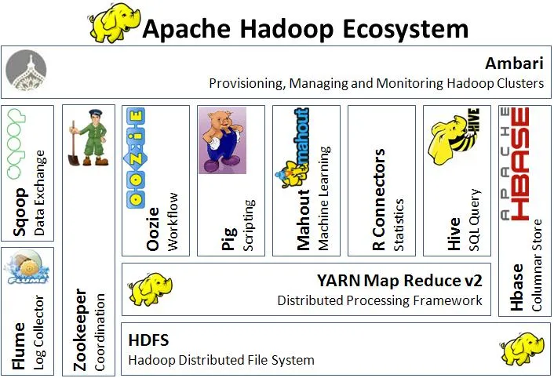

### 1. What is Hadoop, and what are its components?

Hadoop is an open-source framework designed for distributed storage and processing of large volumes of data. It is designed to handle big data, which refers to datasets that are too large to be processed by traditional databases and tools.

Hadoop has these 4 main components that work together to provide a powerful platform for big data processing.

- Hadoop Distributed File System (HDFS): 
    
    This is the primary storage system used by Hadoop. It is designed to store large volumes of data across a cluster of machines, providing high availability and fault tolerance.

    HDFS is a highly fault tolerant, distributed, reliable and scalable file system for data storage. HDFS is developed to handle huge volumes of data. The file size expected is in the range of GBs to TBs. A file is split up into blocks (default 128 MB) and stored distributedly across multiple machines. These blocks replicate as per the replication factor. After replication, it stored at different nodes. This handles the failure of a node in the cluster. 

    - master/slave architecture

    HDFS follows master/slave architecture. It consists of a single namenode and many datanodes. In the HDFS architecture, a file is divided into one or more blocks and stored in separate datanodes. Datanodes are responsible for operations such as block creation, deletion and replication according to namenode instructions. Apart from that, they are responsible to perform read-write operations on file systems.

    Namenode acts as the master server and the central controller for HDFS. It holds the file system metadata and maintains the file system namespace. Namenode oversees the condition of the datanode and coordinates access to data.

    - data replication in HDFS

    In HDFS, all blocks consist of the same size except for the last block. An application can specify the number of replicas for a file and the default is 3. The replication factor can be specified at the time of creation and can be changed later on too. Out of the three copies, two copies are stored in different nodes in the same local area network. The third copy will be stored in a different local area network. The namenode is responsible for all the decisions related to block replication. It periodically receives a signal which dictates the health of each node, whether it is functioning properly or not.

    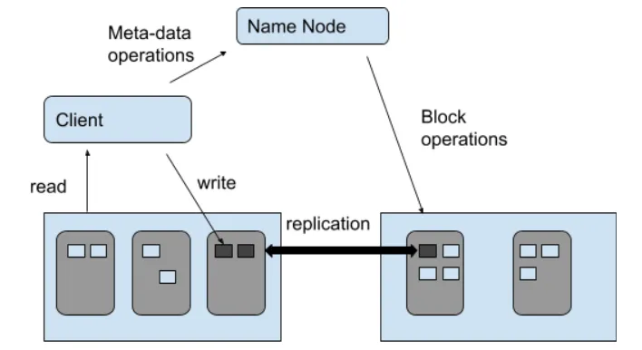

- Yet Another Resource Negotiator (YARN): 
    
    This component manages the resources (CPU, memory, and storage) of the cluster and allocates them to various applications running on the cluster.

    - Client: Submits map-reduce jobs

    - Resource manager: Responsible for resource assignment and management across the application. When a map-reduce task is received, it forwards the task to the respective node manager, and does the resource allocation accordingly. Resource manager consists of two main components namely scheduler and application manager.
        - Scheduler: Performs scheduling based on the allocated application and available resources.
        - Application manager: Responsible for negotiation of resources with the resource manager, monitoring the application progress and application status tracking.

    - Node manager: Takes care of an individual node on Hadoop cluster and its application workflow. Responsible for creating the container process and also killing as per the instructions given by the resource manager. In addition, it is also responsible for monitoring resource usage and performing log management.

    - Application master: Responsible for negotiating resources with the resource manager. This tracks the status and monitors the progress of a single application. Application master requests the container from the node manager by sending the relevant details to run the application and once it runs a time-to-time report about the health of the container to the resource manager.

    - Container: A collection of physical records such as RAM, CPU cores and disk on a single node.

    - On the master node, the ResourceManager daemon runs for the YARN then for all the slave nodes NodeManager daemon runs.

    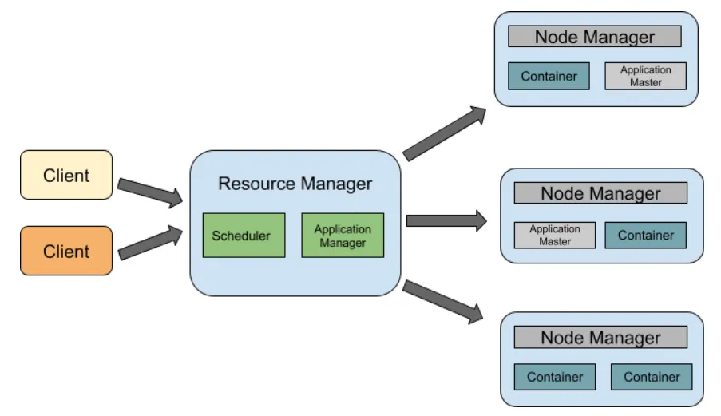

- MapReduce: 
    
    This is a programming model used for processing and analyzing large datasets. It is designed to break down large data processing tasks into smaller sub-tasks, which can be processed in parallel across multiple machines.

    Traditionally, data were processed on a single computer. However, with big data context, it has become a tedious and time consuming task. Therefore Hadoop has its own processing method called Map Reduce. Map Reduce has two tasks, namely Map and Reduce. Mapper is responsible for splitting and mapping the data while the reducer for shuffling and reducing the data.

    - Splitting phase: Input data is split into smaller chunks.

    - Mapping phase: Chunks are converted into <key, value> pairs with their occurrence frequency. Here if a word occurs multiple times, it will not state as an accumulated value, but as a single value.

    - Shuffling and sorting phase: The process by which the system performs the sort and sends the output to the reducer. Here the sorting is done based on key not value. Values passed to the reducer can be in any order.

    - Reducing phase: Once the shuffling and sorting is done, the reducer combines the result and outputs it which is stored in HDFS.

    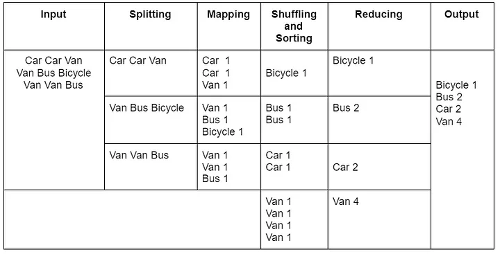

- Hadoop Common: 
    
    This is a set of utilities and libraries used by the other components of Hadoop. It includes tools for managing and monitoring the Hadoop cluster, as well as support for authentication, security, and networking.

### 2. Hadoop Daemons
Daemons are the processes that run in the background. There are mainly 4 daemons which run for Hadoop.

Hadoop Daemons

- Namenode — It runs on master node for HDFS

- Datanode — It runs on slave nodes for HDFS

- ResourceManager — It runs on master node for Yarn

- NodeManager — It runs on slave node for Yarn

These 4 demons run for Hadoop to be functional. Apart from this, there can be secondary NameNode, standby NameNode, Job HistoryServer, etc.

### 3. What are the different vendor-specific distributions of Hadoop?

The different vendor-specific distributions of Hadoop are Cloudera, MAPR, Amazon EMR, Microsoft Azure, IBM InfoSphere, and Hortonworks (Cloudera).

### 4. What are the different Hadoop configuration files?

The different Hadoop configuration files include:

- hadoop-env.sh
- mapred-site.xml
- core-site.xml
- yarn-site.xml
- hdfs-site.xml
- Master and Slaves

### 5. What are the three modes in which Hadoop can run?

- Standalone mode: By default, Hadoop is configured to run in a no distributed mode. It runs as a single Java process. Instead of HDFS, this mode utilizes the local file system. This mode useful for debugging and there isn’t any need to configure core-site.xml, hdfs-site.xml, mapred-site.xml, masters & slaves. Stand alone mode is usually the fastest mode in Hadoop.

- Pseudo-distributed mode: Hadoop can also run on a single node in a Pseudo Distributed mode. In this mode, each daemon runs on seperate java process. In this mode custom configuration is required( core-site.xml, hdfs-site.xml, mapred-site.xml ). Here HDFS is utilized for input and ouput. This mode of deployment is useful for testing and debugging purposes.

- Fully-distributed mode: This is the production mode of Hadoop. In this mode typically one machine in the cluster is designated as NameNode and another as Resource Manager exclusively. These are masters. All other nodes act as Data Node and Node Manager. These are the slaves. Configuration parameters and environment need to specified for Hadoop Daemons.
This mode offers fully distributed computing capability, reliability , fault tolerance and scalability.

### 6. What are the differences between regular FileSystem and HDFS?

- Regular FileSystem: In regular FileSystem, data is maintained in a single system. If the machine crashes, data recovery is challenging due to low fault tolerance. Seek time is more and hence it takes more time to process the data.

- HDFS: Data is distributed and maintained on multiple systems. If a DataNode crashes, data can still be recovered from other nodes in the cluster. Time taken to read data is comparatively more, as there is local data read to the disc and coordination of data from multiple systems.

### 7. Why is HDFS fault-tolerant?

HDFS is fault-tolerant because it replicates data on different DataNodes. By default, a block of data is replicated on three DataNodes. The data blocks are stored in different DataNodes. If one node crashes, the data can still be retrieved from other DataNodes

### 8. Explain the architecture of HDFS

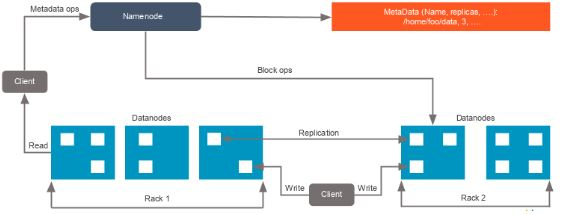

For an HDFS service, we have a NameNode that has the master process running on the one of the machines and DataNodes, which are the slave nodes.

- NameNode: NameNode is the master service that hosts metadata in disk and RAM. It holds information about the various DataNodes, their location, the size of each block, etc. 

- DataNode: DataNodes hold the actual data blocks and send block reports to the NameNode every 10 seconds. The DataNode stores and retrieves the blocks when the NameNode asks. It reads and writes the client’s request and performs block creation, deletion, and replication based on instructions from the NameNode.

    - Data that is written to HDFS is split into blocks, depending on its size. The blocks are randomly distributed across the nodes. With the auto-replication feature, these blocks are auto-replicated across multiple machines with the condition that no two identical blocks can sit on the same machine. 
    - As soon as the cluster comes up, the DataNodes start sending their heartbeats to the NameNodes every three seconds. The NameNode stores this information; in other words, it starts building metadata in RAM, which contains information about the DataNodes available in the beginning. This metadata is maintained in RAM, as well as in the disk.

### 9. What are the two types of metadata that a NameNode server holds?

The two types of metadata that a NameNode server holds are:

- Metadata in Disk - This contains the edit log and the FSImage

    FsImage is a file stored on the OS filesystem that contains the complete directory structure (namespace) of the HDFS with details about the location of the data on the Data Blocks and which blocks are stored on which node. This file is used by the NameNode when it is started.

    EditLogs is a transaction log that records the changes in the HDFS file system or any action performed on the HDFS cluster such as addition of a new block, replication, deletion etc. In short, it records the changes since the last FsImage was created.

    Every time the NameNode restarts, EditLogs are applied to FsImage to get the latest snapshot of the file system. But NameNode restarts are rare in production clusters. Because of this, you may encounter the following issues: .

    - EditLog grows unwieldy in size, particularly where the NameNode runs for a long period of time without a restart;
    - NameNode restart takes longer, as too many changes now have to be merged
    - If the NameNode fails to restart (i.e., crashes), there will be significant data loss, as the FsImage used at the time of the restart is very old

    Secondary Namenode helps to overcome the above issues by taking over the responsibility of merging EditLogs with FsImage from the NameNode.

    - The Secondary NameNode obtains the FsImage and EditLogs from the NameNode at regular intervals.
    - Secondary NameNoide loads both the FsImage and EditLogs to main memory and applies each operation from the EditLogs to the FsImage.
    - Once a new FsImage is created, Secondary NameNode copies the image back to the NameNode.
    - Namenode will use the new FsImage for the next restart, thus reducing startup time.

    However, this seemingly fail-proof process is not without issues. Delays in the aforesaid process can cause a NameNode to startup without the latest FsImage at its disposal. Such delays can occur if:

    - The Secondary NameNode takes too long to download the EditLogs from the NameNode;
    - The NameNode is slow in uploading FsImages to the Secondary NameNode and/or in downloading the updated FsImages from the Secondary NameNode

    To avoid such delays, administrators will have to closely monitor the communication between the NameNode and Secondary NameNode, proactively detect any slowness in the upload and/or download of FsImages / EditLogs, and promptly initiate measures to isolate and remove the source of the slowness. This is where the Hadoop FS Image EditLogs test helps!

    This test monitors the following:

    - How quickly the Secondary NameNode downloads EditLogs from the NameNode;
    - How quickly the NameNode uploads and downloads FsImages from the Secondary NameNode

- Metadata in RAM - This contains the information about DataNodes

### 10. What is the difference between a federation and high availability?

- HDFS Federation

    Hdfs federation basically enhances the existing architecture of HDFS. Earlier with Hadoop 1, entire cluster was using a single namespace. And there a single namenode was managing that namespace. Now if that namenode was failing, the Hadoop cluster used to be down.

    The Hadoop cluster used to be unavailable until that namenode was coming back to the cluster causing the loss of resources and time.

    Hdfs federation with Hadoop 2 comes over this limitation by allowing the uses of more than one namenode and thus more than one namespace.

    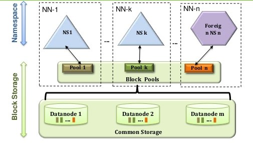

    there are multiple namenode (NN1, NN2…NNn) and their multiple associated namespaces (NS1, NS2…NSn)

    the HDFS federation overcame on the issue of single point failover of namenode in the Hadoop cluster. And at the bottom, those are the shared storage of datanodes which is the same as we had earlier.

    - Block Pool- Block pool is nothing but the set of blocks that belong to a single namespace. There are set of blocks in the HDFS federation and each block is managed independently.

    - Namespace Volume- Namespace along with its block pool is namespace volume. You can find many namespace volumes in HDFS federation. Again, all these namespace volumes work independently.

- High Availability

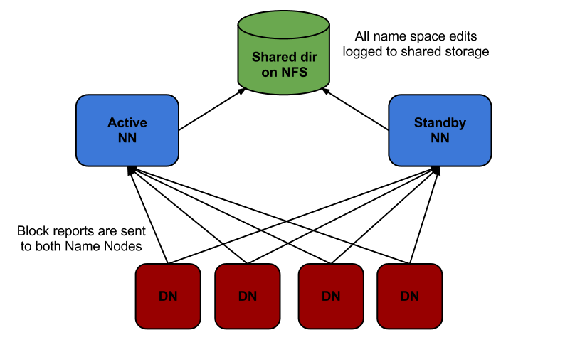

High availability simply means there should be more than one instance of any services or products. This is required because if one will go down also, there will be the backup available which can simply take that up.

With Hadoop 2 and above, we have now normally two namenode which are in active-passive fashion. That means, at a time the active namenode will be up and running and passive/standby namenode will be idle. When the active namenode will go down, the passive will be automatically up to keep the cluster up and running all the time. Thus, it provides the high availability for Hadoop cluster.

- HDFS federation vs high availability

The major difference between HDFS federation and high availability is, in HDFS federation, namenodes are not related to each other. Here all the machine shares a pool of metadata in which each namenode will have its dedicated own pool. And by this way, HDFS federation provides fault tolerance.

Here fault tolerance means if one namenode will go down also, that will not affect the data of other namenode. That means HDFS federation means, multiple namenodes which are not correlated.

In the case of HA, both active and standby namenode will work all the time. At a time, active namenode will be up and running while standby namenode will be idle and simply updating it’s metadata once in a while to keep it updated. Once primary namenode will go down, the standby will take up the place with the most recent metadata it has.

### 11. If you have an input file of 350 MB, how many input splits would HDFS create and what would be the size of each input split?

By default, each block in HDFS is divided into 128 MB. The size of all the blocks, except the last block, will be 128 MB. For an input file of 350 MB, there are three input splits in total. The size of each split is 128 MB, 128MB, and 94 MB.

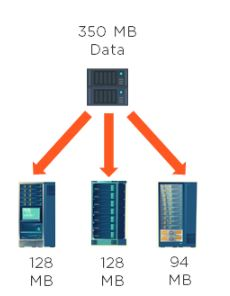

### 12. How does rack awareness work in HDFS?

HDFS Rack Awareness refers to the knowledge of different DataNodes and how it is distributed across the racks of a Hadoop Cluster.

By default, each block of data is replicated three times on various DataNodes present on different racks. Two identical blocks cannot be placed on the same DataNode. When a cluster is “rack-aware,” all the replicas of a block cannot be placed on the same rack. If a DataNode crashes, you can retrieve the data block from different DataNodes.   

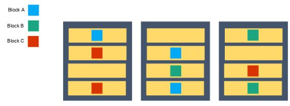

### 13. How can you restart NameNode and all the daemons in Hadoop?

stop namenode command: ./sbin/Hadoop-daemon.sh stop NameNode
start namenode command: ./sbin/Hadoop-daemon.sh start NameNode

stop daemons command: ./sbin/stop-all.sh
start daemons command: ./sbin/start-all.sh

### 14. Which command will help you find the status of blocks and FileSystem health?

The fsck command checks and interactively repairs inconsistent file systems. You should run this command before mounting any file system. You must be able to read the device file on which the file system resides (for example, the /dev/hd0 device). Normally, the file system is consistent, and the fsck command merely reports on the number of files, used blocks, and free blocks in the file system. If the file system is inconsistent, the fsck command displays information about the inconsistencies found and prompts you for permission to repair them.

The fsck command is conservative in its repair efforts and tries to avoid actions that might result in the loss of valid data. In certain cases, however, the fsck command recommends the destruction of a damaged file. If you do not allow the fsck command to perform the necessary repairs, an inconsistent file system may result. Mounting an inconsistent file system may result in a system crash.

### 15. What would happen if you store too many small files in a cluster on HDFS?

Storing several small files on HDFS generates a lot of metadata files. To store these metadata in the RAM is a challenge as each file, block, or directory takes 150 bytes for metadata. Thus, the cumulative size of all the metadata will be too large

### 16. How do you copy data from the local system onto HDFS? 

The following command will copy data from the local file system onto HDFS:

hadoop fs –copyFromLocal [source] [destination]

Example: hadoop fs –copyFromLocal /tmp/data.csv /user/test/data.csv

In the above syntax, the source is the local path and destination is the HDFS path. Copy from the local system using a -f option (flag option), which allows you to write the same file or a new file to HDFS. 

### 17.  When do you use the dfsadmin -refreshNodes and rmadmin -refreshNodes commands?

The commands below are used to refresh the node information while commissioning, or when the decommissioning of nodes is completed. 

dfsadmin -refreshNodes

This is used to run the HDFS client and it refreshes node configuration for the NameNode. 

rmadmin -refreshNodes

This is used to perform administrative tasks for ResourceManager.

### 18. Is there any way to change the replication of files on HDFS after they are already written to HDFS?           

You can use the below commands to set replication of an individual file to 4

hadoop dfs -setrep -w 4 /path of the file 

The below command will change for all the files under it recursively. To change replication of entire directory under HDFS to 4:

hadoop dfs -setrep -R -w 4 /Directory path

### 19. Who takes care of replication consistency in a Hadoop cluster and what do under/over replicated blocks mean?

In a cluster, it is always the NameNode that takes care of the replication consistency. The fsck command provides information regarding the over and under-replicated block. 

Under-replicated blocks:
These are the blocks that do not meet their target replication for the files they belong to. HDFS will automatically create new replicas of under-replicated blocks until they meet the target replication.

Consider a cluster with three nodes and replication set to three. At any point, if one of the NameNodes crashes, the blocks would be under-replicated. It means that there was a replication factor set, but there are not enough replicas as per the replication factor. If the NameNode does not get information about the replicas, it will wait for a limited amount of time and then start the re-replication of missing blocks from the available nodes. 

Over-replicated blocks:
These are the blocks that exceed their target replication for the files they belong to. Usually, over-replication is not a problem, and HDFS will automatically delete excess replicas.

Consider a case of three nodes running with the replication of three, and one of the nodes goes down due to a network failure. Within a few minutes, the NameNode re-replicates the data, and then the failed node is back with its set of blocks. This is an over-replication situation, and the NameNode will delete a set of blocks from one of the nodes. 

### 20. Distributed Cache in Hadoop 

The basis of Hadoop is the principle of distributed storage and distributed computing. It has a master-slave kind of architecture. Master gets configured on a high-end machine and slaves get configured on commodity hardware.

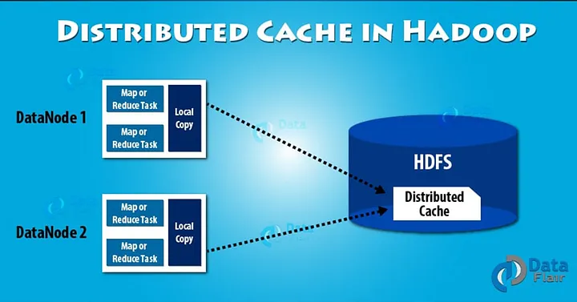

Distributed Cache in Hadoop is a facility provided by the MapReduce framework. Distributed Cache can cache files when needed by the applications. It can cache read only text files, archives, jar files etc.

Once we have cached a file for our job, Apache Hadoop will make it available on each datanodes where map/reduce tasks are running. Thus, we can access files from all the datanodes in our MapReduce job.

#### Size of Distributed Cache

By default, distributed cache size is 10 GB. If we want to adjust the size of distributed cache we can adjust by using local.cache.size.

#### Implementation

An application which is going to use distributed cache to distribute a file:

- Should first ensure that the file is available.
- After that, also make sure that the file can accessed via URLs. URLs can be either hdfs: // or https://.

After the above validation, if the file is present on the mentioned urls. The Hadoop user mentions it to be a cache file to the distributed cache. The Hadoop MapReduce job will copy the cache file on all the nodes before starting of tasks on those nodes.

- Copy the requisite file to the HDFS:
$ hdfs dfs-put/user/dataflair/lib/jar_file.jar

- Setup the application’s JobConf:
DistributedCache.addFileToClasspath(new Path (“/user/dataflair/lib/jar-file.jar”), conf).

- Add it in Driver class.

#### Advantages of Distributed Cache

- Single point of failure- As distributed cache run across many nodes. Hence, the failure of a single node does not result in a complete failure of the cache.

- Data Consistency- It tracks the modification timestamps of cache files. It then, notifies that the files should not change until a job is executing. Using hashing algorithm, the cache engine can always determine on which node a particular key-value resides. As we know, that there is always a single state of the cache cluster, so, it is never inconsistent.

- Store complex data – It distributes simple, read-only text file. It also stores complex types like jars, archives. These achieves are then un-archived at the slave node.

#### Disadvantage of Distributed Cache

- Object serialization– It must serialize objects. But the serialization mechanism has two main problems:

    - Very bulky– Serialization stores complete class name, cluster, and assembly details. It also stores references to other instances in member variables. All this makes the serialization very bulky.

    - Very slow– Serialization uses reflection to inspect the type of information at runtime. Reflection is a very slow process as compared to pre-compiled code.

### 21. What role do RecordReader, Combiner, and Partitioner play in a MapReduce operation?

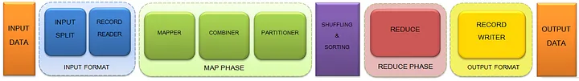

- Input Files: The data for a Map Reduce task is stored in input files and these input files are generally stored in HDFS.

- Input Format: Input Format defines how the input files are split and read. It selects the files or other objects that are used for input. Input Format creates InputSplit.

    - Input Split: It is the logical representation of data. It represents the data which is processed by an individual Mapper. When you save any file in Hadoop, the file is broken down into blocks of 128 MB (default configuration). HDFS is designed to have a Master — Slave configuration, so the blocks of data is stored in slaves (Data Nodes) and meta data of data is stored in Master(Name Node). We can control the block size by setting mapred.min.split.size parameter in mapred-site.xml. One map task is created for each Input Split. The split is divided into records and each record will be processed by the mapper.
    It is always beneficial to have multiple splits, because the time taken to process a split is small as compared to the time taken for processing of the whole input. When the splits are smaller, the processing is better load balanced since it will be processing the splits in parallel.

    - Record Reader: It communicates with InputSplit in and converts the data into key-value pairs suitable for reading by the mapper. By default, it uses TextInputFormat for converting data into a key-value pair. It assigns byte offset (unique number) to each line present in the file. Then, these key-value pairs are sent to the mapper for further processing.

    - Mapper: Mapper processes each input record and generates an intermediate key-value pair. These <key, value> pairs can be completely different from the input pair. In mapper task, the output is full collection of all these <key, value> pairs. The intermediate output is stored on the local disk as this is temporary data and writing on HDFS will create unnecessary copies. In the event of node failure before the map output is consumed by the reduce task, Hadoop reruns the map task on another node and re-creates the map output. No. of Mapper= {(total data size)/ (input split size)}

    - Combiner: The combiner is also known as ‘Mini-Reducer’. Combiner is optional and performs local aggregation on the mappers output, which helps to minimize the data transfer between Mapper and Reducer, thereby improving the overall performance of the Reducer. The output of Combiner is then passed to the Partitioner.

    - Partitioner: Partitioner comes into picture if we are working on more than one reducer. Partitioner takes the output from Combiners and performs partitioning. Partitioning of output takes place on the basis of the key and then sorted. Hash Partitioner is the default Partitioner in Map Reduce which computes a hash value for the key and assigns the partition based on this result. The total number of Partitioner that run in Hadoop is equal to the number of reducers which is set by JobConf.setNumReduceTasks() method. By hash function, key is used to derive the partition. According to the key-value, each mapper output is partitioned and records having the same key value go into the same partition (within each mapper), and then each partition is sent to a reducer

    - Shuffling and Sorting: The shuffling is the physical movement of the data which is done over the network. As shuffling can start even before the map phase has finished so this saves some time and completes the tasks in lesser time.The keys generated by the mapper are automatically sorted by Map Reduce. Sorting helps reducer to easily distinguish when a new reduce task should start. This saves time for the Reducer. Reducer starts a new reduce task when the next key in the sorted input data is different than the previous. Each reduce task takes key-value pairs as input and generates key-value pair as output. The Shuffling and Sorting will not be performed at all in case no Reducers are used. Then, the Map Reduce job stops at the map phase, and the map phase does not include any kind of sorting, thereby producing faster output.

    - Reducer: It takes the set of intermediate key-value pairs produced by the mappers as the input and then runs a reducer function on each of them to generate the output. The output of the reducer is the final output, which is stored in HDFS. Reducers run in parallel as they are independent of one another. The user decides the number of reducers. By default, the number of reducers is 1. Increasing the number of Reducers increases the overhead, increases load balancing and lowers the cost of failures.

    - Record Writer: It writes these output key-value pair from the Reducer phase to the output files. The implementation to be used to write the output files of the job is defined by Output Format

    - Output Format: The way these output key-value pairs are written in output files by RecordWriter is determined by the Output Format. The final output of reducer is written on HDFS by Output Format. Output Files are stored in a File System.

    - Output Files: The output is stored in these Output Files and these Output Files are generally stored in HDFS.

### 22. Why is MapReduce slower in processing data in comparison to other processing frameworks?

MapReduce is slower because:

- It is batch-oriented when it comes to processing data. Here, no matter what, you would have to provide the mapper and reducer functions to work on data. 

- During processing, whenever the mapper function delivers an output, it will be written to HDFS and the underlying disks. This data will be shuffled and sorted, and then be picked up for the reducing phase. The entire process of writing data to HDFS and retrieving it from HDFS makes MapReduce a lengthier process.

- In addition to the above reasons, MapReduce also uses Java language, which is difficult to program as it has multiple lines of code.

### 23. Is it possible to change the number of mappers to be created in a MapReduce job?

By default, you cannot change the number of mappers, because it is equal to the number of input splits. However, there are different ways in which you can either set a property or customize the code to change the number of mappers.

For example, if you have a 1GB file that is split into eight blocks (of 128MB each), there will only be only eight mappers running on the cluster. However, there are different ways in which you can either set a property or customize the code to change the number of mappers.

No, The number of map tasks for a given job is driven by the number of input splits. For each input split a map task is spawned. So, we cannot directly change the number of mappers using a config other than changing the number of input splits.

### 24. Writable in Hadoop

Now the question is whether Writables are necessary for Hadoop. Hadoop framework definitely needs Writable type of interface in order to perform the following tasks:

- Implement serialization

- Transfer data between clusters and networks

- Store the deserialized data in the local disk of the system

Implementation of writable is similar to implementation of interface in Java. It can be done by simply writing the keyword 'implements' and overriding the default writable method.

Writable is a strong interface in Hadoop which while serializing the data, reduces the data size enormously, so that data can be exchanged easily within the networks. It has separate read and write fields to read data from network and write data into local disk respectively. Every data inside Hadoop should accept writable and comparable interface properties.

The following are some Hadoop-specific data types that you could use in your MapReduce program: IntWritable, FloatWritable, LongWritable, DoubleWritable, BooleanWritable, ArrayWritable, MapWritable, ObjectWritable 

### 25. What is speculative execution in Hadoop?

If a DataNode is executing any task slowly, the master node can redundantly execute another instance of the same task on another node. The task that finishes first will be accepted, and the other task would be killed. Therefore, speculative execution is useful if you are working in an intensive workload kind of environment.

The following image depicts the speculative execution:

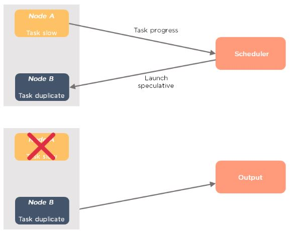

From the above example, you can see that node A has a slower task. A scheduler maintains the resources available, and with speculative execution turned on, a copy of the slower task runs on node B. If node A task is slower, then the output is accepted from node B.

### 26. How is identity mapper different from chain mapper?

- Identity Mapper

    - This is the default mapper that is chosen when no mapper is specified in the MapReduce driver class.

    - It implements identity function, which directly writes all its key-value pairs into output.

    - It is defined in old MapReduce API (MR1) in: org.apache.Hadoop.mapred.lib.package

- Chain Mapper

    - This class is used to run multiple mappers in a single map task.

    - The output of the first mapper becomes the input to the second mapper, second to third and so on.

    - It is defined in: org.apache.Hadoop.mapreduce.lib.chain.ChainMapperpackage

### 27. What are the major configuration parameters required in a MapReduce program?

We need to have the following configuration parameters:

- Input location of the job in HDFS
- Output location of the job in HDFS
- Input and output formats
- Classes containing a map and reduce functions
- JAR file for mapper, reducer and driver classes 

### 28. What do you mean by map-side join and reduce-side join in MapReduce?

- Map-Side Join

Assume that we have two tables of which one of them is a small table. When we submit a map reduce task, a Map Reduce local task will be created before the original join Map Reduce task which will read data of the small table from HDFS and store it into an in-memory hash table. After reading, it serializes the in-memory hash table into a hash table file.

In the next stage, when the original join Map Reduce task is running, it moves the data in the hash table file to the Hadoop distributed cache, which populates these files to each mapper’s local disk. So all the mappers can load this persistent hash table file back into the memory and do the join work as before. The execution flow of the optimized map join is shown in the figure below. After optimization, the small table needs to be read just once. Also if multiple mappers are running on the same machine, the distributed cache only needs to push one copy of the hash table file to this machine.

- Advantages of using map side join:

    - Map-side join helps in minimizing the cost that is incurred for sorting and merging in the shuffle and reduce stages.
    - Map-side join also helps in improving the performance of the task by decreasing the time to finish the task.

- Disadvantages of Map-side join:

    Map side join is adequate only when one of the tables on which you perform map-side join operation is small enough to fit into the memory.  Hence it is not suitable to perform map-side join on the tables which are huge data in both of them.

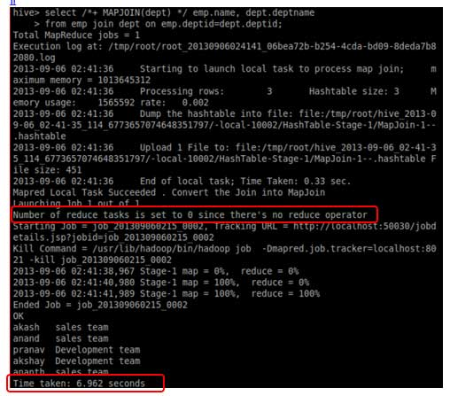

- Map Side Join Versus Reducer Side Join

    - Map-side join

        - The mapper performs the join
        - Each input data must be divided into the same number of partitions
        - Input to each map is in the form of a structured partition and is in sorted order

    - Reducer-side join

        - The reducer performs the join
        - Easier to implement than the map side join, as the sorting and shuffling phase sends the value with identical keys to the same reducer
        - No need to have the dataset in a structured form (or partitioned)

### 29. What is the role of the OutputCommitter class in a MapReduce job?

As the name indicates, OutputCommitter describes the commit of task output for a MapReduce job.

Example: org.apache.hadoop.mapreduce.OutputCommitter

public abstract class OutputCommitter extends OutputCommitter

The Map-Reduce framework relies on the OutputCommitter of the job to:

- Setup the job during initialization. For example, create the temporary output directory for the job during the initialization of the job.
- Cleanup the job after the job completion. For example, remove the temporary output directory after the job completion.
- Setup the task temporary output.
- Check whether a task needs a commit. This is to avoid the commit procedure if a task does not need commit.
- Commit of the task output.
- Discard the task commit.

### 30. Explain the process of spilling in MapReduce.

Spilling is a process of copying the data from memory buffer to disk when the buffer usage reaches a specific threshold size. This happens when there is not enough memory to fit all of the mapper output. By default, a background thread starts spilling the content from memory to disk after 80 percent of the buffer size is filled. 

For a 100 MB size buffer, the spilling will start after the content of the buffer reaches a size of 80 MB. 

### 31. How can you set the mappers and reducers for a MapReduce job?
The number of mappers and reducers can be set in the command line using:

-D mapred.map.tasks=5 –D mapred.reduce.tasks=2

In the code, one can configure JobConf variables:

job.setNumMapTasks(5); // 5 mappers

job.setNumReduceTasks(2); // 2 reducers

### 32. What happens when a node running a map task fails before sending the output to the reducer?

If this ever happens, map tasks will be assigned to a new node, and the entire task will be rerun to re-create the map output. In Hadoop v2, the YARN framework has a temporary daemon called application master, which takes care of the execution of the application. If a task on a particular node failed due to the unavailability of a node, it is the role of the application master to have this task scheduled on another node.

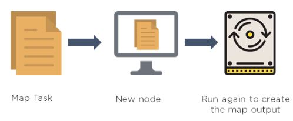

### 33. Can we write the output of MapReduce in different formats?

- TextOutputFormat - This is the default output format and it writes records as lines of text. 

- SequenceFileOutputFormat - This is used to write sequence files when the output files need to be fed into another MapReduce job as input files.

- MapFileOutputFormat - This is used to write the output as map files. 

- SequenceFileAsBinaryOutputFormat - This is another variant of SequenceFileInputFormat. It writes keys and values to a sequence file in binary format.

- DBOutputFormat - This is used for writing to relational databases and HBase. This format also sends the reduce output to a SQL table.

#### Sequence File

- In HDFS
    - SequenceFile is one of the solutions to small file problem in Hadoop.
    - Small file is significantly smaller than the HDFS block size(128MB).
    - Each file, directory, block in HDFS is represented as object and occupies 150 bytes.
    - 10 million files, would use about 3 gigabytes of memory of NameNode.
    - A billion files is not feasible.

- In MapReduce
    - Map tasks usually process a block of input at a time (using the default FileInputFormat).
    - The more the number of files is, the more number of Map task need and the job time can be much more slower

- Small file scenarios

    - The files are pieces of a larger logical file.
    - The files are inherently small, for example, images.

- These two cases require different solutions.

    - For first one, write a program to concatenate the small files together
    - For the second one, some kind of container is needed to group the files in some way.

- Solutions in Hadoop

    - HAR files
    
        HAR(Hadoop Archives) were introduced to alleviate the problem of lots of files putting pressure on the namenode’s memory.
    
        HARs are probably best used purely for archival purposes.

    - SequenceFile

        The concept of SequenceFile is to put each small file to a larger single file.

        For example, suppose there are 10,000 100KB files, then we can write a program to put them into a single SequenceFile like below, where you can use filename to be the key and content to be the value.

        

        - Some benefits:
        
            1. A smaller number of memory needed on NameNode. Continue with the 10,000 100KB files example, Before using SequenceFile, 10,000 objects occupy about 4.5MB of RAM in NameNode.After using SequenceFile, 1GB SequenceFile with 8 HDFS blocks, these objects occupy about 3.6KB of RAM in NameNode.
            
            2. SequenceFile is splittable, so is suitable for MapReduce.

            3. SequenceFile is compression supported.
        
        - Supported Compressions, the file structure depends on the compression type.

            1. Uncompressed

            2. Record-Compressed: Compresses each record as it’s added to the file.

            

            3. Block-Compressed: 

            - Waits until data reaches block size to compress.
            - Block compression provide better compression ratio than Record compression.
            - Block compression is generally the preferred option when using SequenceFile.
            - Block here is unrelated to HDFS or filesystem block.

            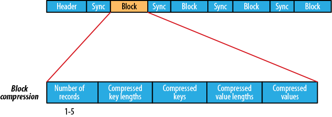