# HBase

## HBase column oriented storage

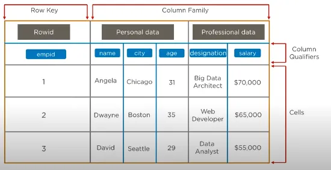

- Row Key : the reference of the row, it’s used to make the search of a record faster.
- Column Families : combination of a set of columns. Data belonging to the same column family can be accessed together in a single seek, allowing a faster process.
- Column Qualifiers: Each column’s name is known as its column qualifier.
- Cell: the storage area of data. Each cell is connected to a row key and a column qualifiers.

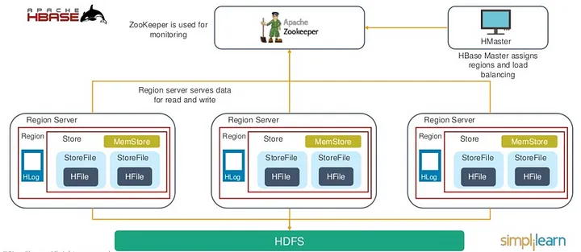

## HBase Architecture

Basically, there are 3 types of servers in a master-slave type of HBase Architecture. They are HBase HMaster, Region Server, and ZooKeeper.

Basically, there are 3 types of servers in a master-slave type of HBase Architecture. They are HBase HMaster, Region Server, and ZooKeeper.

In addition, the data which we manage by Region Server further stores in the Hadoop DataNode. And, all HBase data is stored in HDFS files. Then for the data served by the RegionServers, Region Servers are collocated with the HDFS DataNodes, which also enable data locality. Moreover, for all the physical data blocks the NameNode maintains Metadata information that comprise the files.

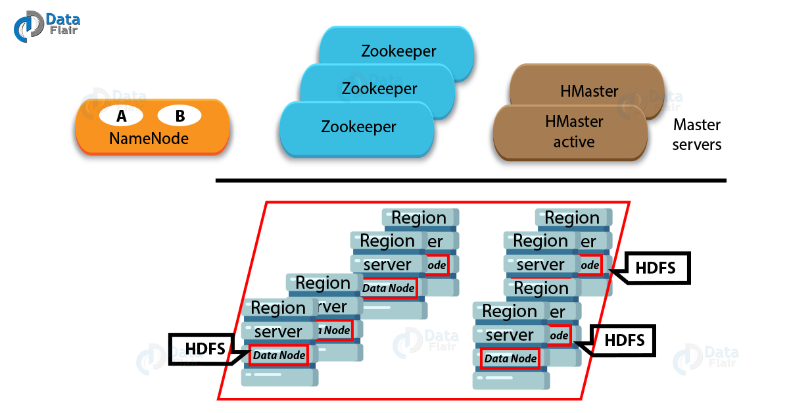

#### HBase Architecture – Regions

In HBase Architecture, a region consists of all the rows between the start key and the end key which are assigned to that Region. And, those Regions which we assign to the nodes in the HBase Cluster, is what we call “Region Servers”.

These Regions of a Region Server are responsible for several things, like handling, managing, executing as well as reads and writes HBase operations on that set of regions. The default size of a region is 256MB, which we can configure as per requirement.

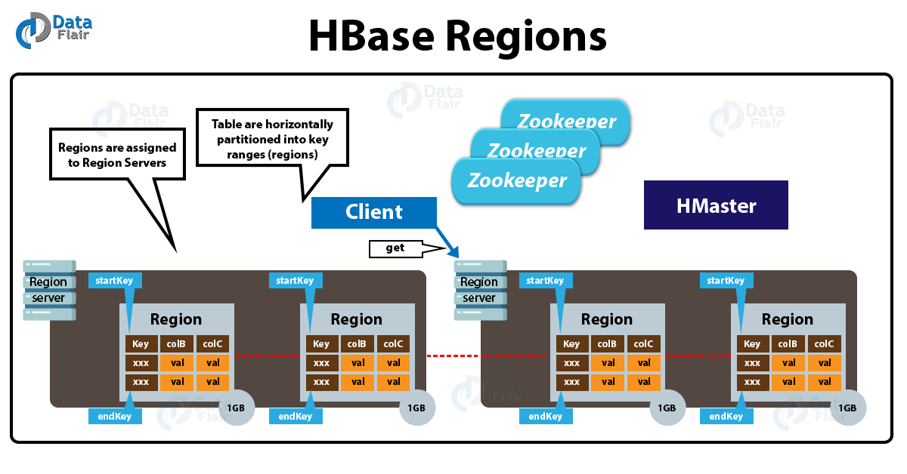

#### HBase Architecture – HMaster

HBase master in the architecture of HBase is responsible for region assignment as well as DDL (create, delete tables) operations.

There are two main responsibilities of a master in HBase architecture:

-  Coordinating the region servers

    Basically, a master assigns Regions on startup. Also for the purpose of recovery or load balancing, it re-assigns regions.
    Also, a master monitors all RegionServer instances in the HBase Cluster.

- Admin functions

    Moreover, it acts as an interface for creating, deleting and updating tables in HBase.

#### ZooKeeper in HBase Architecture

However, to maintain server state in the HBase Cluster, HBase uses ZooKeeper as a distributed coordination service.

Basically, which servers are alive and available is maintained by Zookeeper, and also it provides server failure notification. Moreover, in order to guarantee common shared state, Zookeeper uses consensus.

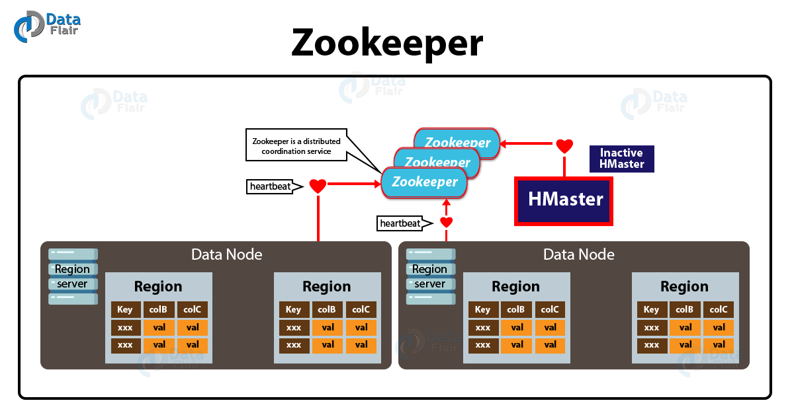

HBase has three crucial components:

- Zookeeper used for monitoring.

- HMaster Server assigns regions and load-balancing.

- Region Server serves data for write and read. it refers to different computers in the Hadoop cluster. Each Region Server have a region, HLog, a store memory store

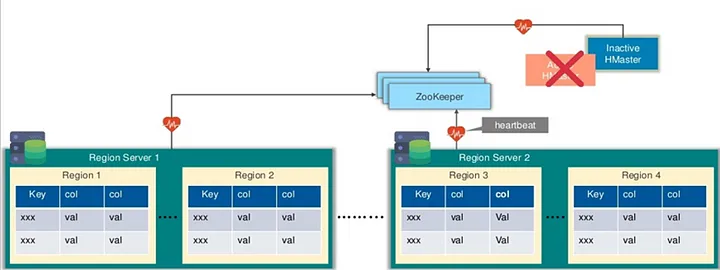

- To manage this system, Zookeeper and HMaster works together. Zookeeper verify the status of HMaster, if it’s active, it’ll send a heartbeat of the zookeeper (active HMaster), and to guarantee system tolerance, there is a Inactive HMaster that acts as a backup.

- Region servers send a heartbeat signal to Zookeeper to send their status (ready for write and read operations).

- Regions servers and HMaster are connected to Zookeeper via a session.

## How HBase Components Works?

As we know, to coordinate shared state information for members of distributed systems, HBase uses Zookeeper. Further, active HMaster, as well as Region servers, connect with a session to ZooKeeper. Then for active sessions, ZooKeeper maintains ephemeral nodes by using heartbeats.

Ephemeral nodes mean znodes which exist as long as the session which created the znode is active and then znode is deleted when the session ends

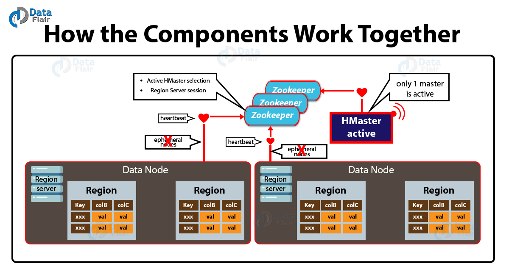

In addition, each Region Server in HBase Architecture produces an ephemeral node. Further, to discover available region servers, the HMaster monitors these nodes.

Also for server failures, it monitors these nodes. Moreover, to make sure that only one master is active, Zookeeper determines the first one and uses it.

As a process, the active HMaster sends heartbeats to Zookeeper, however, the one which is not active listens for notifications of the active HMaster failure.

Although, the session gets expired and the corresponding ephemeral node is also deleted if somehow a region server or the active HMaster fails to send a heartbeat. Then for updates, listeners will be notified of the deleted nodes.

Further, the active HMaster will recover region servers, as soon as it listens for region servers on failure. Also, when inactive one listens for the failure of active HMaster, the inactive HMaster becomes active, if an active HMaster fails.

## HBase : Read and Write mechanism

#### When the first time a client reads or writes to HBase:

- Basically, the client gets the Region server which helps to hosts the META Table from ZooKeeper.
- Moreover, in order to get the region server corresponding to the row key, the client will query the.META. server, it wants to access. However, along with the META Table location, the client caches this information.
- Also, from the corresponding Region Server, it will get the Row.

#### HBase meta table

There is a special Hbase catalog called the META table which holds the location of the regions in the cluster.

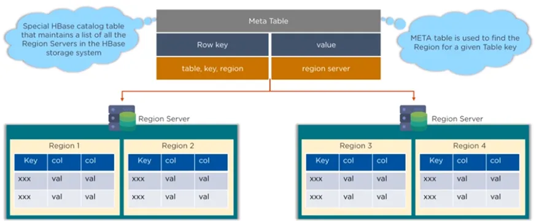

META Table is a special HBase Catalog Table. Basically, it holds the location of the regions in the HBase Cluster.

It keeps a list of all Regions in the system.
Structure of the .META. table is as follows:
    
- Key: region start key, region id

- Values: RegionServer

#### Region Server Components in HBase Architecture

- WAL

    It is a file on the distributed file system. Basically, to store new data that hasn’t yet been persisted to permanent storage, we use the WAL. Moreover, we also use it for recovery in the case of failure.

- BlockCache

    It is the read cache. The main role of BlockCache is to store the frequently read data in memory. And also, the data which is least recently used data gets evicted when full.

- MemStore

    It is the write cache. The main role of MemStore is to store new data which has not yet been written to disk. Also, before writing to disk, it gets sorted.

- Hfiles

    These files store the rows as sorted KeyValues on disk.

#### HBase : read mechanism

- The client sends a request to get the region server that hosts the META table from ZooKeeper.

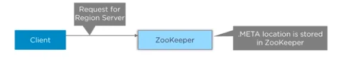

- The Zookeeper replies by sending the META table location

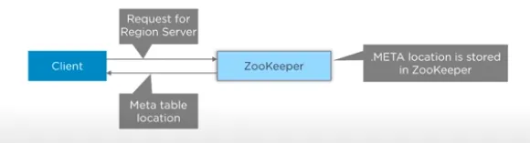

- The client will query the META server to get the region server corresponding to the row key it wants to access

- The client caches this information along side with the META table location

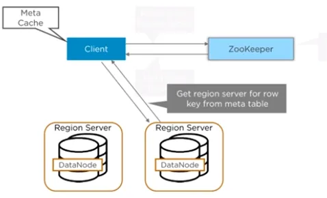

- Finally the region Server answer with the row key, so now it could get row or rows.

#### Hbase write Mechanism

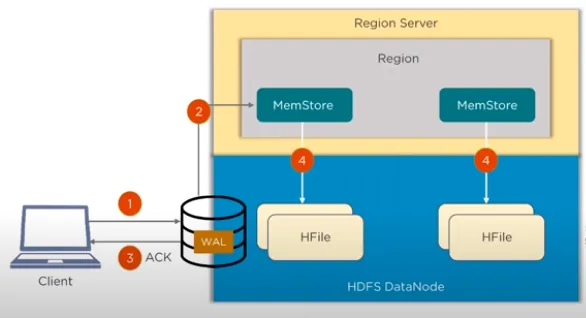

- write the data to the write-ahead-log (WAL), HBase always has WAL to look into, if any error occurs while writing data.

- Once the data is written to the WAL, it is then copied to the MemStore

- Once the data is placed in the MemStore, the client then receives the acknowledgement (ACK)

- When the MemStore reaches the threshold, it dumps or commit the data into HFile

## HBase MemStore

It updates in memory as sorted KeyValues, the same as it would be stored in an HFile. There is one MemStore per column family. The updates are sorted per column family.

## Compaction in HBase Architecture

In order to reduce the storage and reduce the number of disks seeks needed for a read, HBase combines HFiles. This entire process is what we call compaction. It selects few HFiles from a region and combines them. Compaction is of two types, such as:

- Minor Compaction
HBase picks smaller HFiles automatically and then recommits them to bigger HFiles. This process is what we call Minor Compaction. For committing smaller HFiles to bigger HFiles, it performs merge sort.

- Major Compaction
HBase merges and recommits the smaller HFiles of a region to a new HFile, in Major compaction. Here, in the new HFile, the same column families are placed together. In this process, it drops deleted as well as expired cell.

However, it is a possibility that input-output disks and network traffic might get congested during this process. Hence, generally during low peak load timings, it is scheduled.

## Region Split in HBase

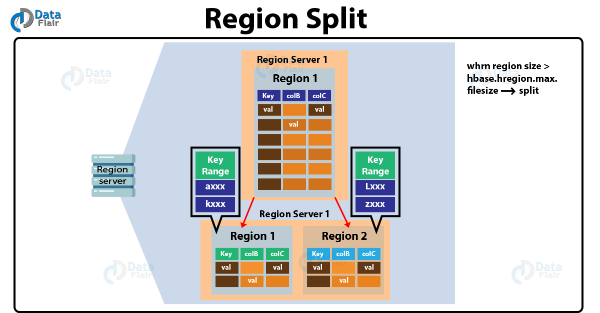

The region has two child regions in HBase Architecture, whenever a region becomes large. Here each region represents exactly a half of the parent region. Afterward, we report this split to the HMaster.

However, until the HMaster allocates them to a new Region Server for load balancing, we handle this by the same Region Server.

## HBase Crash Recovery

- ZooKeeper notifies to the HMaster about the failure, whenever a Region Server fails.
- Afterward, too many active Region Servers, HMaster distributes and allocates the regions of crashed Region Server. Also, the HMaster distributes the WAL to all the Region Servers, in order to recover the data of the MemStore of the failed Region Server.
- Furthermore, to build the MemStore for that failed region’s column family, each Region Server re-executes the WAL.
- However, Re-executing that WAL means updating all the change that was made and stored in the MemStore file because, in WAL, the data is written in timely order.
- Therefore, we recover the MemStore data for all column family just after all the Region Servers executes the WAL.

## Advantages of HBase Architecture

- Strong consistency model

    All readers will see same value, while a write returns.

- Scales automatically

    While data grows too large, Regions splits automatically.
    To spread and replicate data, it uses HDFS. 
- Built-in recovery

    It uses Write Ahead Log for recovery.

- Integrated with Hadoop

    On HBase MapReduce is straightforward.

## Limitations With Apache HBase

a. Business continuity reliability

– Write Ahead Log replay very slow.

– Also, a slow complex crash recovery.

– Major Compaction I/O storms.

## Summary

Hbase architecture follows the master server architecture. Region servers serve data for reading and writing. When accessing data, clients communicate with HBase region servers directly, and HBase Master handles region assignment, creation, and deletion of tables. Hbase uses a Hadoop-distributed file system (HDFS) and stores all data on top of the HDFS files. Also, HBase uses Zookeeper to maintain the distributed tasks and track the cluster's health. The Hadoop Data Nodes store the data of the Region servers, and region servers are collocated with the HDFS data nodes while preserving the data locality. HBase tables are divided horizontally by row key range into Regions, and a region contains all the rows in the table between the Region's start and end keys. Hbase maintains a unique catalog table called the META table, which tracks the location of the areas in the cluster of row keys, and the Zookeeper stores the location of the META table.

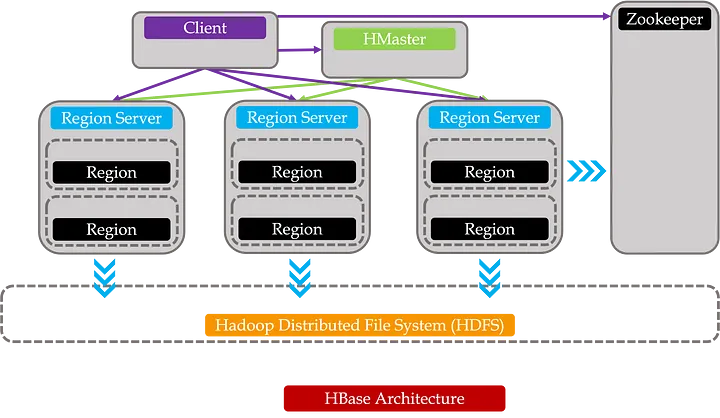

### 1. What are the key components of HBase?

- Region Server

    Region server contains HBase tables that are divided horizontally into “Regions” based on their key values. It runs on every node and decides the size of the region. Each region server is a worker node that handles read, writes, updates, and delete request from clients.

- HMaster

    This assigns regions to RegionServers for load balancing, and monitors and manages the Hadoop cluster. Whenever a client wants to change the schema and any of the metadata operations, HMaster is used.

- ZooKeeper

    This provides a distributed coordination service to maintain server state in the cluster. It looks into which servers are alive and available, and provides server failure notifications. Region servers send their statuses to ZooKeeper indicating if they are ready to reading and write operations.

### 2. Explain what row key and column families in HBase is.

The row key is a primary key for an HBase table. It also allows logical grouping of cells and ensures that all cells with the same row key are located on the same server.

Column families consist of a group of columns that are defined during table creation, and each column family has certain column qualifiers that a delimiter separates

### 3. Why do we need to disable a table in HBase and how do you do it?

The HBase table is disabled to allow modifications to its settings. When a table is disabled, it cannot be accessed through the scan command

To disable the employee table, use the command:

disable ‘employee_table’

To check if the table is disabled, use the command:

is_disabled ‘employee_table’s

### 4. Write the code needed to open a connection in HBase

The following code is used to open a connection in HBase:

Configuration myConf = HBaseConfiguration.create();

HTableInterface usersTable = new HTable(myConf, “users”);

### 5. What does replication mean in terms of HBase?

The replication feature in HBase provides a mechanism to copy data between clusters. This feature can be used as a disaster recovery solution that provides high availability for HBase.

The following commands alter the hbase1 table and set the replication_scope to 1. A replication_scope of 0 indicates that the table is not replicated.

disable ‘hbase1’

alter ‘hbase1’, {NAME => ‘family_name’, REPLICATION_SCOPE => ‘1’}

enable ‘hbase1’

### 6. Can you import/export in an HBase table?

Yes, it is possible to import and export tables from one HBase cluster to another. 

HBase export utility:
hbase org.apache.hadoop.hbase.mapreduce.Export “table name” “target export location”

Example: hbase org.apache.hadoop.hbase.mapreduce.Export “employee_table” “/export/employee_table”

HBase import utility:
create ‘emp_table_import’, {NAME => ‘myfam’, VERSIONS => 10}

hbase org.apache.hadoop.hbase.mapreduce.Import “table name” “target import location”

Example: create ‘emp_table_import’, {NAME => ‘myfam’, VERSIONS => 10}

hbase org.apache.hadoop.hbase.mapreduce.Import “emp_table_import” “/export/employee_table”

### 7. What is compaction in HBase?

Compaction is the process of merging HBase files into a single file. This is done to reduce the amount of memory required to store the files and the number of disk seeks needed

### 8. How does Bloom filter work?

The HBase Bloom filter is a mechanism to test whether an HFile contains a specific row or row-col cell. The Bloom filter is named after its creator, Burton Howard Bloom. It is a data structure that predicts whether a given element is a member of a set of data. These filters provide an in-memory index structure that reduces disk reads and determines the probability of finding a row in a particular file.

Bloom filters are the probabilistic data structure designed to tell us rapidly whether a value ‘probably’ exists in a data store. Moreover, it’s also quite memory efficient. We are giving up certainty at the cost of a faster answer. Bloom filters can give false positive answers(i.e. an element exists in datastore, but in fact, it doesn’t) but it never gives false negative answers (It never proclaims that a value is not in the datastore, even though it exists).

The base data structure employed by a Bloom filter is a Bit Vector of n bits. To demonstrate this here is a bit vector of 10 bits (with all elements as zero) 

Now each element we will pass through some m number of fast hash functions. 

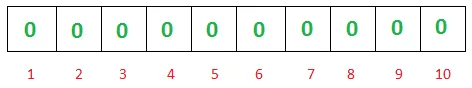

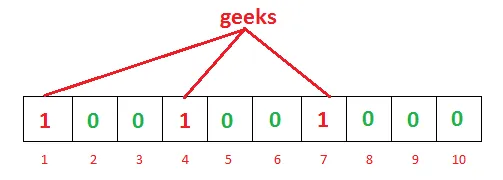

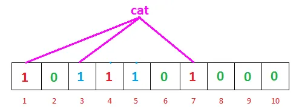

We check the bits at the index of 1, 3 and 7. Since all bits are set to 1, the bloom filter says ‘cat’ is ‘probably present’ in the data store (False positive result). Even though the cat was never added to datastore.

Instead of getting 1, 3 and 7 as the answer from hash function for ‘cat’, if we would have gotten 2, 3 and 7, then we would have answered with 100% certainty that cat doesn’t exist in the datastore(As bit is not set at index 2). This way bloom filters never gives false negative answers (Thus can be used to tell with certainty that element doesn’t exist in the data store)

Google Chrome web browser uses a Bloom filter to identify malicious URLs. Any URL is first checked against a local Bloom filter and only upon a hit, a full check of the URL is performed

Gmail uses bloom filters to check whether an username is already taken or not from list of billions of username. With a good bloom filter implementation Gmail reduces false positives to below 1%. Thus it prevents 99% networks calls to actual datastore

Gmail also employs bloom filters to check whether password provided by user is already there in the huge set of weak passwords.Thus, presents an error to user when user tries to set a weak password

Databases using LSM trees, like HBase, Cassandra, and BigTable uses bloom filters to reduce searching into different segments (on disks) for the non-existent rows or columns

### 9. Does HBase have any concept of the namespace?

A namespace is a logical grouping of tables, analogous to a database in RDBMS. You can create the HBase namespace to the schema of the RDBMS database.

To create a namespace, use the command:

create_namespace ‘namespace name’

To list all the tables that are members of the namespace, use the command: list_namespace_tables ‘default’

To list all the namespaces, use the command:

list_namespace

### 10. How does the Write Ahead Log (WAL) help when a RegionServer crashes?

If a RegionServer hosting a MemStore crash, the data that existed in memory, but not yet persisted, is lost. HBase recovers against that by writing to the WAL before the write completes. The HBase cluster keeps a WAL to record changes as they happen. If HBase goes down, replaying the WAL will recover data that was not yet flushed from the MemStore to the HFile.

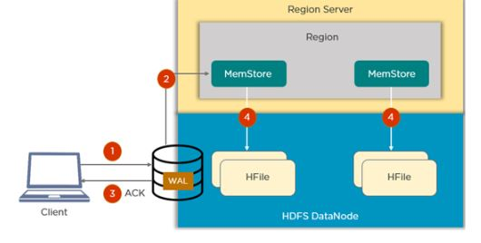

### 11. Write the HBase command to list the contents and update the column families of a table.

The following code is used to list the contents of an HBase table:

scan ‘table_name’

Example: scan ‘employee_table’

To update column families in the table, use the following command:

alter ‘table_name’, ‘column_family_name’

Example: alter ‘employee_table’, ‘emp_address’

### 12. What are catalog tables in HBase?

The catalog table hbase:meta exists as an HBase table and is filtered out of the HBase shell's list command, but is in fact a table just like any other.

The -ROOT- table was removed in HBase 0.96.0. The -ROOT- table kept track of the location of the .META table (the previous name for the table now called hbase:meta) prior to HBase 0.96. 

The hbase:meta table (previously called .META.) keeps a list of all regions in the system. The location of hbase:meta was previously tracked within the -ROOT- table, but is now stored in Zookeeper.

### 13. What is hotspotting in HBase and how can it be avoided?

Records in Hbase are stored as a sorted list of row keys according to the lexicographic order and allow fast access to an individual record by its key or fast fetching of a range of data between a given start and end row keys. We can refer to row keys with a natural sequence at data insertion time, which can cause region server hot-spotting. By default, HBase stores row with similar keys to the same Region. When records with sequential keys are written to HBase, all these data write hit one Region. So a large amount of client traffic is directed at one node, or only a few nodes, of a cluster. But this would be fine if multiple Region Servers served a Region since the writes hit multiple region servers even though they do as a single region.

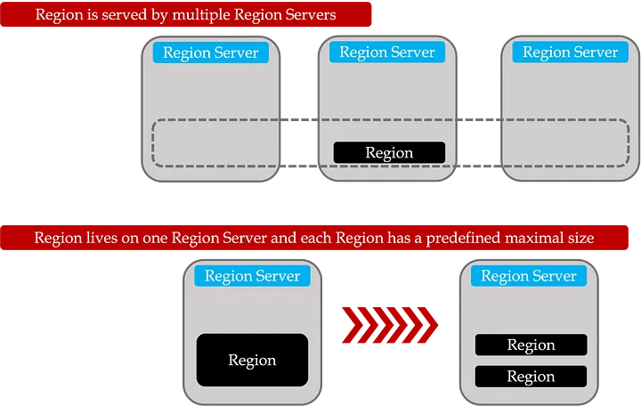

But the typical situation is that each Region lives on just one Region Server, and each Region has a predefined maximal size. If a Region reaches that maximal size, it is split into two smaller regions, becoming a hotspot victim because one of these new Regions takes all new records (Limits the write throughput to the capacity of a single server instead of making use of multiple/all nodes in the HBase cluster).

- Add salt to the Row Key

Include random data at the start of a row key (randomly assigned prefix) to cause it to sort differently than it otherwise would. Salting prefixes can correspond to the number of regions we want to spread the data.

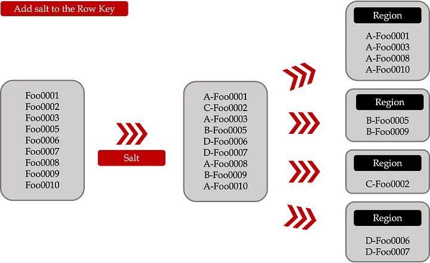

- Use of Hashed Row Key

This approach is suitable when an application reads a query record at a time, and records will spread between multiple Regions/Region servers according to the hash function. Using a deterministic hash allows the client to reconstruct the complete row key and use a Get operation to retrieve that row as usual.

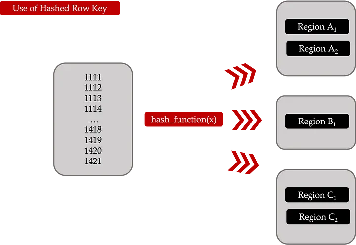

- Reverse the row key

Reverse a fixed-width or numeric row key so that the part that changes the most often (the least significant digit) is first. This effectively randomizes row keys but sacrifices row-ordering properties.

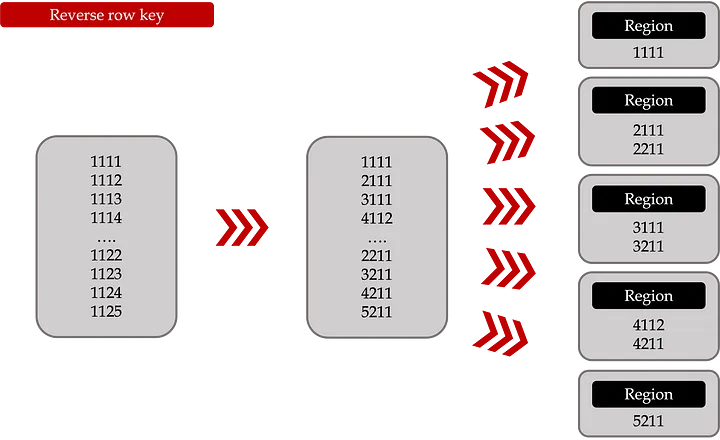

- Bucketing approach

row_key = (++index % BUCKETS_NUMBER) + "_" + original_key

- index — The numeric (or any sequential) part of the specific record.
- BUCKETS_NUMBER — the number of "buckets" we want our new row keys to be spread across.
- original_key — The original key of the record we want to write.

New row keys of bucketed records will no longer be in one sequence, but records in each bucket will preserve their original sequence. Since data is placed in multiple buckets during writes, we have to read from all of those buckets when doing scans based on "original" start and stop keys and merge data so that it preserves the "sorted" attribute. Scan per bucket can be parallelized so the performance won't be degraded.

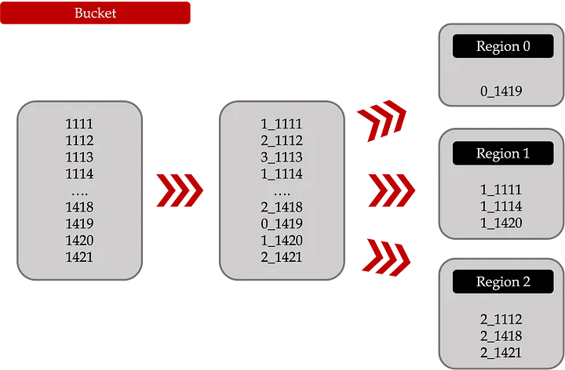

In conclusion, hot-spotting in HBase Region Server can be a significant issue when working with large amounts of data. This can result in slow write performance and limit the HBase cluster's capacity to a single server. Several solutions can be applied to avoid hot-spotting, such as adding salt to the Row Key, using Hashed Row Key, reversing the Row Key, and using the Bucketing approach. **_Each solution has its advantages and disadvantages, but they all aim to spread the data evenly across multiple Region Servers and improve the performance of the HBase cluster._**