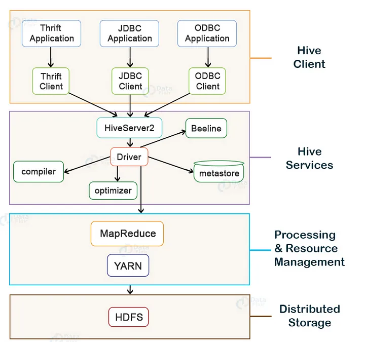
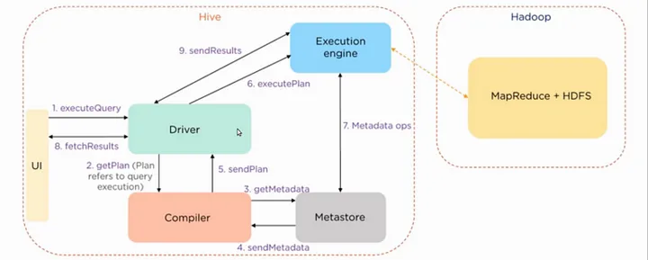
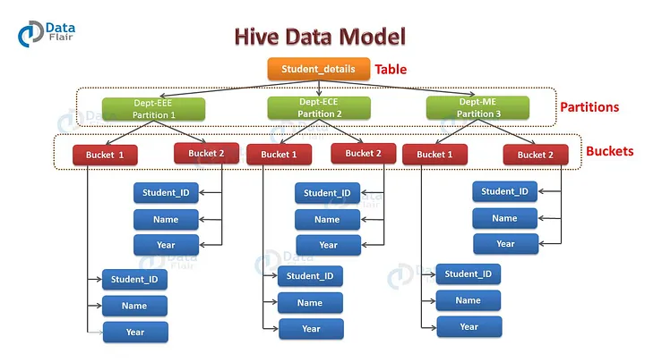
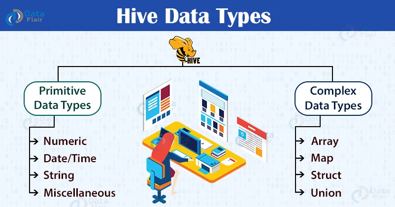
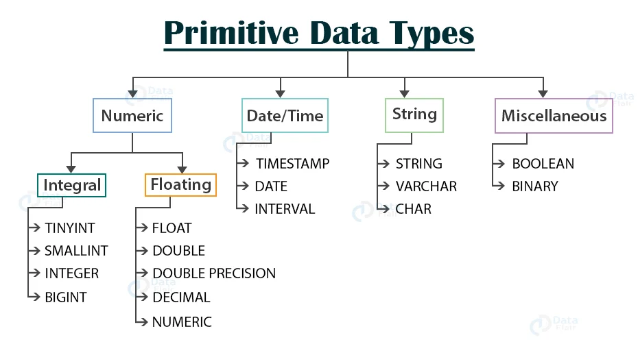
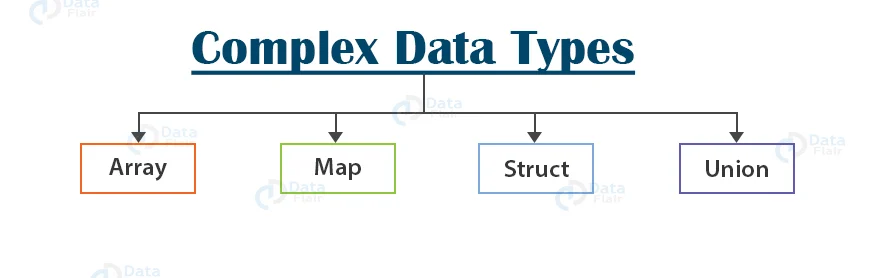
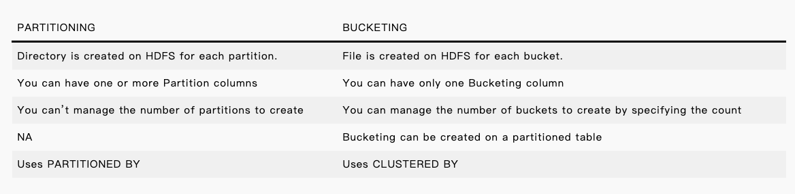
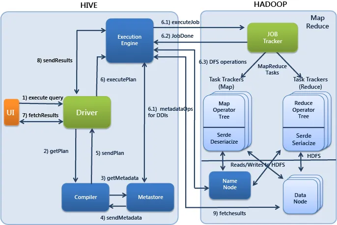

# Hive

## Hive Architecture

- Metastore: 
    
    stores metadata for Hive tables (like their schema and location) and partitions in a relational database(traditional RDBMS format).

- Driver: 

    acts like a controller which receives the HiveQL statements. It monitors the life cycle and the progress of the execution of the HiveQL statement. it stores the necessary metadata generated during the execution of a HiveQL statement. it does the compiling and optimizing and executing of the HiveQL statements.

- Compiler: 

    It performs the compilation of the HiveQL query. it converts the query to an execution plan which contains the tasks(of mapreduce).

- Optimizer: 

    It performs various transformations on the execution plan to provide optimized plan. It aggregates the transformations together, such as converting a pipeline of joins to a single join.

- Executor: 

    Once compilation and optimization complete, the executor executes the tasks.

- Thrift application: 

    is a software framework which allows external clients to interact with Hive over a network, similar to the JDBC or ODBC protocols.

- Beeline: 

    The Beeline is a command shell supported by HiveServer2, where the user can submit its queries and command to the system.

- Hive Server 2: 

    enhanced version of Hive Server 1 wich allows multiple clients to submit requests to Hive and retrieve the final results. It is basically designed to provide the best support for open API clients like JDBC and ODBC and Thrift.

## The steps to execute the HQL statement

1. executeQuery: The user interface calls the driver to excute the HQL statement(query).

2. getPlan: The driver accepts the query, creates a session handle for the query, and passes the query to the compiler for generating the execution plan.

3. getMetaData: The compiler sends the metadata request to the metastore.

4. sendMetaData: The metastore sends the metadata to the compiler.

    The compiler uses this metadata for performing type-checking and semantic analysis on the expressions in the query tree. The compiler then generates the execution plan (Directed acyclic Graph). For Map Reduce jobs, the plan contains map operator trees (operator trees which are executed on mapper) and reduce operator tree (operator trees which are executed on reducer).

5. sendPlan: The compiler then sends the generated execution plan to the driver.

6. executePlan: After receiving the execution plan from compiler, driver sends the execution plan to the execution engine for executing the plan.

7. submit job to MapReduce: The execution engine then sends these stages of DAG to appropriate components. For each task, either mapper or reducer, the deserializer associated with a table or intermediate output is used in order to read the rows from HDFS files. These are then passed through the associated operator tree.

    Once the output gets generated, it is then written to the HDFS temporary file through the serializer. These temporary HDFS files are then used to provide data to the subsequent mapreduce stages of the plan. For DML operations, the final temporary file is then moved to the table’s location.

8. sendResult: Now for queries, the execution engine reads the contents of the temporary files directly from HDFS as part of a fetch call from the driver. The driver then sends results to the Hive interface.

## Hive Data Model

- Table

    Hive tables are the same as the tables present in a Relational Database. In Hive when we create a table, Hive by default manage the data. It means that Hive moves the data into its warehouse directory(we talk about Managed Tables). we can also create an external table, it tells Hive to refer to the data that is at an existing location outside the warehouse directory(we talk about External Table).

- Partition

    Hive organizes tables into partitions for grouping same type of data together based on a column or one or more partition keys to identify a particular partition.

- Bucket

    Tables or partition are subdivided into buckets based on the hash function of a column in the table to give extra structure to the data that may be used for more efficient queries.

## Hive Data Types

- Primitive Data Types

    

    - Integral Data Type

        - TINYINT: 1-byte signed integer ranging from -128 to 127

        - SMALLINT: 2-byte signed integer ranging from -32,768 to 32,767

        - INT: 4-byte signed integer ranging from -2,147,483,648 to 2,147,483,647

        - BIGINT: 8-byte signed integer ranging from -9,223,372,036,854,775,808 to 9,223,372,036,854,775,807

    - Floating Data Type

        - FLOAT: 4-byte single-precision floating point number

        - DOUBLE / DOUBLE PRECISION: 8-byte double-precision floating point number

        - DECIMAL: DECIMAL(precision, scale): Precision is the number of digits in a number. Scale is the number of digits to the right of the decimal point in a number. If precision is not specified, then by default, it is equal to 10. If the scale is not specified, then by default, it is equal to 0.

        - NUMERIC: with HIVE 3.0, the NUMERIC data type is the same as the DECIMAL type.
    
    - Date/Time Data Type

        - TIMESTAMP: traditional UNIX timestamp with the optional nanosecond precision. The supported Timestamps format is yyyy-mm-dd hh:mm:ss[.f…] in the text files.

        - DATE: DATE value describes a particular year/month/day in the form of YYYY-MM-DD. For example- DATE ‘2020-02-04’

        - INTERVAL: Hive accepts the interval syntax with unit specifications. We have to specify the units along with the interval value. For example, INTERVAL ‘1’ DAY refers to the day time
    
    - String Data Type

        - STRING: In Hive, String literals are represented either with the single quotes(‘ ’) or with double-quotes(“ ”).

        - VARCHAR: VARCHAR data types are of different lengths, but we have to specify the maximum number of characters allowed in the character string. If the string value assigned to the varchar is less than the maximum length, then the remaining space will be freed out. Also, if the string value assigned is more than the maximum length, then the string is silently truncated. The length of the varchar is between(1 to 65535).

        - CHAR: CHAR data types are fixed-length. The values shorter than the specified length are padded with the spaces. Unlike VARCHAR, trailing spaces are not significant in CHAR types during comparisons.The maximum length of CHAR is fixed at 255.

    -  Miscellaneous Data Type

        - Boolean: Boolean types in Hive store either true or false.

        - BINARY: BINARY type in Hive is an array of bytes.

- Complex Data Type

    

    - ARRAYS
    
        Array in Hive is an ordered sequence of similar type elements that are indexable using the zero-based integers. Arrays in Hive are similar to the arrays in JAVA. 
        
        array<data_type> Example: array(‘Data’,’Flair’). The second element is accessed as array[1].
    
    - MAPS

        Map in Hive is a collection of key-value pairs, where the fields are accessed using array notations of keys (e.g., [‘key’]).

        map<primitive_type, data_type>. Example: ‘first’ -> ‘John’, ‘last’ -> ‘Deo’, represented as map(‘first’, ‘John’, ‘last’, ‘Deo’). Now ‘John’ can be accessed with map[‘first’].

    - STRUCTS

        STRUCT in Hive is similar to the STRUCT in C language. It is a record type that encapsulates a set of named fields, which can be any primitive data type. We can access the elements in STRUCT type using DOT (.) notation.

        STRUCT <col_name : data_type [ COMMENT col_comment], ...> Example: For a column c3 of type STRUCT {c1 INTEGER; c2 INTEGER}, the c1 field is accessed by the expression c3.c1.
    
    - UNION

        UNION type in Hive is similar to the UNION in C. UNION types at any point of time can hold exactly one data type from its specified data types.

- NULL Value

    In Hive data types, the missing values are represented by the special value NULL.   

## Partitioning versus Bucketing

## Hive & Hadoop

### 1. What are the different components of a Hive architecture?

The different components of the Hive are:

- User Interface: This calls the execute interface to the driver and creates a session for the query. Then, it sends the query to the compiler to generate an execution plan for it

- Metastore: This stores the metadata information and sends it to the compiler for the execution of a query

- Compiler: This generates the execution plan. It has a DAG of stages, where each stage is either a metadata operation, a map, or reduces a job or operation on HDFS

- Execution Engine: This acts as a bridge between the Hive and Hadoop to process the query. Execution Engine communicates bidirectionally with Metastore to perform operations, such as create or drop tables. 

### 2. What is the difference between an external table and a managed table in Hive?

- External Table

    External tables in Hive refer to the data that is at an existing location outside the warehouse directory

    Hive deletes the metadata information of a table and does not change the table data present in HDFS

- Managed Table

    Also known as the internal table, these types of tables  manage the data and move it into its warehouse directory by default 

    If one drops a managed table, the metadata information along with the table data is deleted from the Hive warehouse directory

### 3. What is a partition in Hive and why is partitioning required in Hive

Partition is a process for grouping similar types of data together based on columns or partition keys. Each table can have one or more partition keys to identify a particular partition. 

Partitioning provides granularity in a Hive table. It reduces the query latency by scanning only relevant partitioned data instead of the entire data set. We can partition the transaction data for a bank based on month — January, February, etc. Any operation regarding a particular month, say February, will only have to scan the February partition, rather than the entire table data.

### 4. Why does Hive not store metadata information in HDFS?

We know that the Hive’s data is stored in HDFS. However, the metadata is either stored locally or it is stored in RDBMS. The metadata is not stored in HDFS, because HDFS read/write operations are time-consuming. As such, Hive stores metadata information in the metastore using RDBMS instead of HDFS. This allows us to achieve low latency and is faster.

### 5. Suppose there are several small CSV files present in /user/input directory in HDFS and you want to create a single Hive table from these files. The data in these files have the following fields: {registration_no, name, email, address}. What will be your approach to solve this, and where will you create a single Hive table for multiple smaller files without degrading the performance of the system?

Using SequenceFile format and grouping these small files together to form a single sequence file can solve this problem.

### 6. Write a query to insert a new column(new_col INT) into a hive table (h_table) at a position before an existing column (x_col)

Yes it is possible to change the location of columns but only after adding it in the table using CHANGE COLUMN

In your case, first add the column user_id to the table with below command:

ALTER TABLE table_name ADD COLUMNS (user_id BIGINT);
Now to make user_id column as the first column in your table use change column with FIRST clause:

 ALTER TABLE table_name CHANGE COLUMN user_id user_id BIGINT first;
This will move the user_id column to the first position.

Similarly you can use After instead of first if you want to move the specified column after any other column. Like say, I want to move dob column after user_id column. Then my command would be:

ALTER TABLE table_name CHANGE COLUMN dob dob date AFTER user_id;

### 7. What are the key differences between Hive and Pig?

- Hive

    - It uses a declarative language, called HiveQL, which is similar to SQL for reporting.
    
    - Operates on the server-side of the cluster and allows structured data.

    - It does not support the Avro file format by default. This can be done using “Org.Apache.Hadoop.Hive.serde2.Avro”

    - Facebook developed it and it supports partition

- Pig

    - Uses a high-level procedural language called Pig Latin for programming

    - Operates on the client-side of the cluster and allows both structured and unstructured data
    
    - Supports Avro file format by default.

    - Yahoo developed it, and it does not support partition
