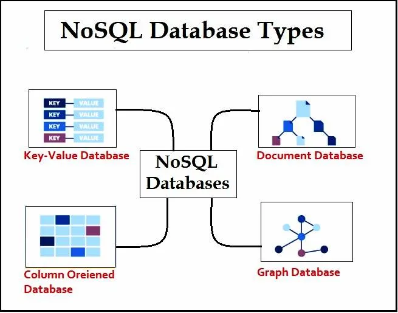
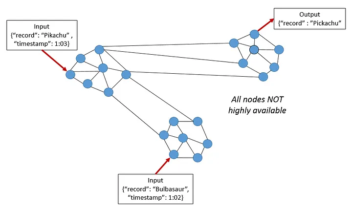
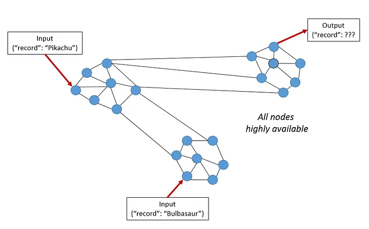
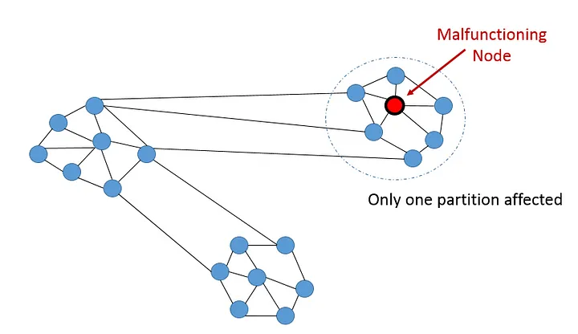
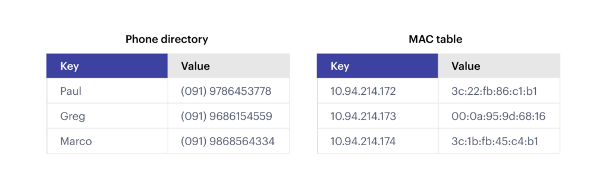
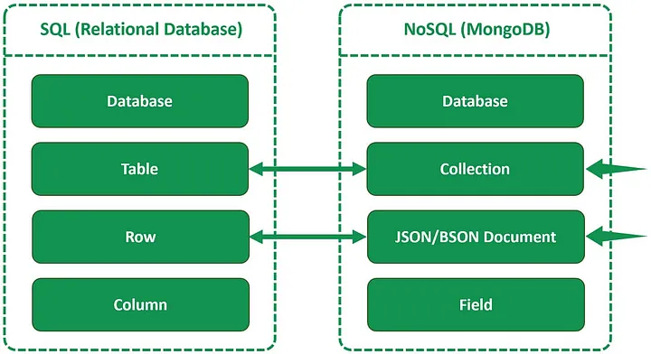

# NoSQL Databases

## Types of NoSQL Databases



- Key-Value Stores: 
    
    These databases store data as key-value pairs and are highly scalable and performant. Examples include **_Redis, Riak, and Amazon DynamoDB_**.

- Document Databases: 

    These databases store data in a document-oriented format, such as JSON or BSON. They are flexible and can store semi-structured data. Examples include **_MongoDB, Couchbase, Apache CouchDB, and Amazon DocumentDB_**.

- Column-Family Stores: 

    These databases store data in columns instead of rows and are optimized for managing large amounts of data. Examples include Apache Cassandra and HBase.

- Graph Databases: 

    These databases use graph structures to store and represent data, making them ideal for managing complex relationships and connections. Examples include Neo4j, OrientDB, and Amazon Neptune.

- Object Databases: 

    These databases store objects rather than data in tables, making them suitable for object-oriented programming. Examples include db4o and Objectivity/DB.

## Features of NoSQL Databases

- Flexible schemas: 

    Unlike relational databases, we don’t need to specify and declare a table’s schema before inserting data.

- Horizontal scaling: 

    NoSQL databases have a range of scaling choices available. Earlier, database scaling has been a major concern for big applications and choices have been either limited in number or costly to implement.

- Fast queries due to the data model: 

    Data model in NoSQL database offers quick execution of queries.

- Ease of use for developers: 

    Multiple surveys indicate that the NoSQL databases are simple and easy to use.

- Distribution Capabilities: 

    NoSQL databases can offer data distribution at a world-wide scale. This is accomplished through several cloud regions and data centers for read-and-write operations throughout several locations.

## Pros and cons of using NoSQL databases

- Flexibility and schema-less design

    One of the primary advantages of NoSQL databases is their schema-less design, which allows for greater flexibility in handling diverse and dynamic data models. 

- Horizontal scalability

    NoSQL databases are designed to scale horizontally, enabling the distribution of data across multiple servers, often with built-in support for data replication, sharding, and partitioning. This makes NoSQL databases well-suited for large-scale applications with high write loads or massive amounts of data

- Performance under specific workloads

    NoSQL databases can offer superior performance under specific workloads, such as high write loads, large-scale data storage and retrieval, and complex relationships.

- CAP theorem and trade-offs

    The CAP theorem states that a distributed data store can provide only two of the following three guarantees: Consistency, Availability, and Partition Tolerance. NoSQL databases often prioritize Availability and Partition Tolerance over Consistency, resulting in a trade-off known as “eventual consistency.” While this may be acceptable in some applications, it can lead to challenges in maintaining data integrity and reconciling conflicting updates in scenarios where strong consistency is required.

    - CAP Theorem

        a distributed database system can only have 2 of the 3: Consistency, Availability and Partition Tolerance.

        - Consistency

            

            This condition states that all nodes see the same data at the same time. Simply put, performing a read operation will return the value of the most recent write operation causing all nodes to return the same data. A system has consistency if a transaction starts with the system in a consistent state, and ends with the system in a consistent state. In this model, a system can (and does) shift into an inconsistent state during a transaction, but the entire transaction gets rolled back if there is an error during any stage in the process. In the image, we have 2 different records (“Bulbasaur” and “Pikachu”) at different timestamps. The output on the third partition is “Pikachu”, the latest input. However, the nodes will need time to update and will not be Available on the network as often.

            In a consistent system, **_all nodes see the same data simultaneously_**. If we perform a read operation on a consistent system, it should return the value of the most recent write operation. The read should cause all nodes to return the same data. All users see the same data at the same time, regardless of the node they connect to. When data is written to a single node, it is then replicated across the other nodes in the system.

        - Availability

            

            When availability is present in a distributed system, it means that **_the system remains operational all of the time_**. Every request will get a response regardless of the individual state of the nodes. This means that the system will operate even if there are multiple nodes down. Unlike a consistent system, there’s no guarantee that the response will be the most recent write operation.

        - Partition Tolerance

            

            This condition states that the system continues to run, despite the number of messages being delayed by the network between nodes. A system that is partition-tolerant can sustain any amount of network failure that doesn’t result in a failure of the entire network. Data records are sufficiently replicated across combinations of nodes and networks to keep the system up through intermittent outages. When dealing with modern distributed systems, Partition Tolerance is not an option. It’s a necessity. Hence, we have to trade between Consistency and Availability.

            When a distributed system encounters a partition, it means that there’s a **_break in communication between nodes_**. If a system is partition-tolerant, the system does not fail, regardless of whether messages are dropped or delayed between nodes within the system. To have partition tolerance, the system must replicate records across combinations of nodes and networks.
        
        - CP: Google Bigtable; AP: Amazon DynamoDB, Cassandra

- Query complexity and expressiveness

    While some NoSQL databases offer powerful query languages and capabilities, they may not be as expressive or versatile as SQL when it comes to complex data manipulation and analysis. This can be a limiting factor in applications that require sophisticated querying, joining, or aggregation of data.

## Factors to Consider When Choosing a Database

- Data model and structure

    One of the primary factors to consider when selecting a database is the data model and structure of the information you plan to store

    - Tabular data and well-defined relationships.

    - Hierarchical, dynamic, or unstructured data

-  Scalability requirements

    - Vertical scaling: SQL databases are generally more adept at scaling vertically by adding more resources (such as CPU, memory, and storage) to a single server.

    - Horizontal scaling: NoSQL databases are designed to scale horizontally, enabling the distribution of data across multiple servers, often with built-in support for data replication, sharding, and partitioning.

- Consistency and reliability

    - ACID properties and strong consistency: If strong consistency and ACID (Atomicity, Consistency, Isolation, Durability) properties are essential, an SQL database may be the better choice. 

    - Eventual consistency and trade-offs: NoSQL databases often prioritize Availability and Partition Tolerance over Consistency, resulting in a trade-off known as “eventual consistency.” 

- Query complexity and frequency

    - Complex querying: SQL databases are known for their powerful query capabilities, making them ideal for applications with complex querying requirements. 

    - Simple lookups or updates: If your application primarily performs simple lookups or updates, a NoSQL database may offer better performance.

-  Performance and latency

    - High performance and low latency: If you need high performance and low latency for specific workloads or data access patterns, choose a NoSQL database that is optimized for those scenarios. 

    - General-purpose performance: SQL databases can provide robust, general-purpose performance for a wide range of applications.

## NoSQL Databases in Action

- Social media platforms: 

    NoSQL databases, particularly graph databases, are ideal for managing complex relationships and interconnected data found in social media platforms. For example, Facebook uses a custom graph database called TAO to store user profiles, friend connections, and other social graph data. This allows Facebook to efficiently query and traverse the massive social graph, providing features like friend recommendations and newsfeed personalization.

- Big data analytics:

    NoSQL databases, such as Hadoop’s HBase and Apache Cassandra, are commonly used for big data analytics, where large-scale data storage and processing are required. These databases are designed to scale horizontally, enabling them to handle vast amounts of data and high write loads. For example, Netflix uses Apache Cassandra to manage its customer data and viewing history, which helps the streaming service to provide personalized content recommendations to its users.

- Internet of Things (IoT):

    IoT applications generate massive volumes of data from various devices and sensors, often with varying data structures and formats. NoSQL databases like MongoDB and Amazon DynamoDB are suitable for handling this diverse and dynamic data, providing flexible data modeling and high-performance storage capabilities. For example, Philips Hue, a smart lighting system, uses Amazon DynamoDB to store and manage data generated by its connected light bulbs and devices.

## Key-Value Database

A key-value database (sometimes called a key-value store) uses a simple key-value method to store data. These databases contain a simple string (the key) that is always unique and an arbitrary large data field (the value). They are easy to design and implement.



As the name suggests, this type of NoSQL database implements a hash table to store unique keys along with the pointers to the corresponding data values. The values can be of scalar data types such as integers or complex structures such as JSON, lists, BLOB, and so on. A value can be stored as an integer, a string, JSON document, or an array—with a key used to reference that value. It typically offers excellent performance and can be optimized to fit an organization’s needs. Key-value stores have no query language but they do provide a way to add and remove key-value pairs, some vendors being quite sophisticated. Values cannot be queried or searched upon. Only the key can be queried.

- When to use a key-value database

    - Handling Large Volume of Small and Continuous Reads and Writes

        Key-value databases are particularly suitable when your application requires handling a large volume of small and continuous reads and writes. These databases are designed for efficient and fast access to data stored as key-value pairs. Whether the data is volatile or frequently changing, key-value databases can provide high-performance in-memory access, making them ideal for use cases that demand quick retrieval and modification of data.
    
    - Storing Basic Information
        
        Key-value databases are well-suited for storing basic information, such as customer details, user profiles, or simple configurations. In these scenarios, each piece of information can be associated with a unique key, allowing for easy retrieval and updates based on the key value. For example, a key-value database can be used to store webpages with the URL as the key and the webpage content as the value. Similarly, storing shopping-cart contents, product categories, or e-commerce product details can be efficiently managed using key-value databases.

    - Applications with Infrequent Updates and Simple Queries

        Key-value databases are a good choice for applications that don’t require frequent updates or complex queries. If your application primarily focuses on data retrieval and simple CRUD operations, key-value databases provide an efficient and straightforward solution. These databases prioritize simplicity and high-performance data access, making them suitable for applications that require quick lookups and modifications without the need for complex query capabilities or extensive data manipulation
    
    - Key-Value Databases for Volatile Data

        When your application needs to handle lots of small continuous reads and writes, that may be volatile, key-value databases offer fast in-memory access.

- Use cases for key-value databases

    - Session Management on a Large Scale

        Key-value databases are well-suited for managing session data in applications that require handling a large number of concurrent users. These databases can efficiently store and retrieve session information, such as user authentication tokens, user preferences, or temporary data. With their fast in-memory access and ability to handle high volumes of small reads and writes, key-value databases provide an optimal solution for session management in applications with a large user base.

    - Using Cache to Accelerate Application Responses

        Key-value databases are often employed as cache layers to accelerate application responses. By caching frequently accessed data in a key-value store, applications can reduce the need for expensive and time-consuming operations, such as database queries or complex computations. This caching strategy allows for faster data retrieval, leading to improved application performance and responsiveness.
    
    - Storing Personal Data on Specific Users

        Key-value databases can efficiently store personal data on specific users. For example, they can be used to store user profile information, user preferences, or other user-specific data. With their simple key-value storage model, these databases allow for quick and efficient access to user data, making them suitable for applications that need to handle a large volume of user-specific data.

    - Product Recommendations and Personalized Lists

        Key-value databases can be used to generate and store product recommendations and personalized lists. They provide a quick and efficient way to store and retrieve user preferences and other user-specific data, which can be used to personalize product recommendations and lists. This can lead to a more engaging and personalized user experience, improving user satisfaction and potentially driving increased revenue for businesses.
    
    - Managing Player Sessions in Massive Multiplayer Online Games

        Key-value databases are excellent for managing player sessions in massive multiplayer online games (MMOGs). These games require real-time management of a large number of simultaneous player sessions, and key-value databases can provide the necessary performance and scalability to handle this challenge.

- Key-Value Databases vs. Other Database Types

    Key-value databases serve specific use-cases due to their unique features and capabilities. To understand them better, it’s vital to compare them with other database types, such as relational databases, graph databases, and document databases.

    - Relational Databases vs. Key-Value Databases

        Relational databases, also known as SQL databases, are based on the relational model and use tables to store data. They are well-suited for managing structured data and complex relationships between entities. Relational databases support advanced querying capabilities using SQL, and they allow complex operations such as JOINs to combine data from multiple tables.

        On the other hand, key-value databases are much simpler. They store data as pairs of unique keys and their associated values, with no inherent relationships between different data items. Key-value databases do not support SQL or similar querying languages, and data can only be accessed via the key. While they lack the complex querying capabilities of relational databases, key-value databases excel in scenarios where high performance, scalability, and simplicity are paramount.
    
    - Graph Databases vs. Key-Value Databases

        Graph databases are designed to handle highly connected data and relationships. They excel at traversing relationships and are used for applications like social networks, recommendation engines, and fraud detection. Graph databases store not only key-value pairs but also the relationships between them, which are expressed as edges in a graph.

        Key-value databases, in contrast, do not inherently support the concept of relationships between data items. Each key-value pair is independent, and there’s no built-in way to express relationships between different pairs. However, this simplicity can be an advantage in use-cases that require high-speed access to individual data items, without the need to consider relationships between items.

    - Document Databases vs. Key-Value Databases

        Document databases store and retrieve data in flexible, semi-structured formats like JSON or XML. They are suitable for managing unstructured or semi-structured data and provide flexibility in data modeling. Document databases offer more advanced querying capabilities and indexing options for searching within the document structure.

        Key-value databases, while similar in some ways to document databases, are even simpler. They don’t support the semi-structured data models or the advanced querying capabilities of document databases. Each item in a key-value database is a simple pair of a unique key and its associated value. This simplicity makes key-value databases extremely fast and efficient for reading and writing data, but less suited to complex querying or data modeling scenarios.

    - Scalability and High Availability with Key-Value Databases

        Scalability is a critical consideration when choosing a database for your application. Key-value databases are designed to scale horizontally, allowing you to distribute the data across multiple nodes or clusters. By adding more nodes, you can handle increasing data volumes and traffic without sacrificing performance. This scalability makes key-value databases an excellent choice for applications that need to handle large and growing datasets.

        In addition to scalability, key-value databases often provide features for ensuring high availability of data. They often offer replication mechanisms that can keep multiple copies of data across different nodes or data centers. This redundancy ensures that even if one node fails, the data remains accessible and the application continues to function. High availability is crucial for applications that require continuous operation and cannot afford significant downtime.

## Document Database

- What are documents?

    Documents store data in field-value pairs. The values can be a variety of types and structures, including strings, numbers, dates, arrays, or objects. Documents can be stored in formats like JSON, BSON, and XML.

```json
{
     "_id": 1,
     "first_name": "Tom",
     "email": "tom@example.com",
     "cell": "765-555-5555",
     "likes": [
        "fashion",
        "spas",
        "shopping"
     ],
     "businesses": [
        {
           "name": "Entertainment 1080",
           "partner": "Jean",
           "status": "Bankrupt",
           "date_founded": {
              "$date": "2012-05-19T04:00:00Z"
           }
        },
        {
           "name": "Swag for Tweens",
           "date_founded": {
              "$date": "2012-11-01T04:00:00Z"
           }
        }
     ]
  }
```

- Collections

    A collection is a group of documents. Collections typically store documents that have similar contents.

    Not all documents in a collection are required to have the same fields, because document databases have a flexible schema. Note that some document databases provide schema validation, so the schema can optionally be locked down when needed.

    

- JSON documents structure

    - Key value

    Key-value pairs are recorded within curly braces. The key is a string, and the value can be any data type like integer, decimal, or boolean. For example, a simple key-value is {"year": 2013}.

    - Array

    An array is an ordered collection of values defined within left ([) and right (]) brackets. Items in the array are comma separated. For example, {"fruit": ["apple","mango"]}.

    - Objects

    An object is a collection of key-value pairs. Essentially, JSON documents allow developers to embed objects and create nested pairs. For example, {"address": {"country": "USA","state": "Texas"}}.

- CRUD operations

    Document databases typically have an API or query language that allows developers to execute the CRUD (create, read, update, and delete) operations.

    - Create: Documents can be created in the database. Each document has a unique identifier.
    - Read: Documents can be read from the database. The API or query language allows developers to query for documents using their unique identifiers or field values. Indexes can be added to the database in order to increase read performance.
    - Update: Existing documents can be updated — either in whole or in part.
    - Delete: Documents can be deleted from the database.

- Strengths and weaknesses of document databases

    Document databases have many strengths:

    - The document model is ubiquitous, intuitive, and enables rapid software development.
    - The flexible schema allows for the data model to change as an application's requirements change.
    - Document databases have rich APIs and query languages that allow developers to easily interact with their data.
    - Document databases are distributed (allowing for horizontal scaling as well as global data distribution) and resilient.
    
    These strengths make document databases an excellent choice for a general-purpose database.

    A common weakness that people cite about document databases is that many do not support multi-document ACID transactions. We estimate that 80%-90% of applications that leverage the document model will not need to use multi-document transactions.

- Use cases of document databases

    - Content management

        A document database is an excellent choice for content management applications such as blogs and video platforms. With a document database, each entity the application tracks can be stored as a single document. The document database is a more intuitive way for a developer to update an application as the requirements evolve. In addition, if the data model needs to change, only the affected documents need to be updated. No schema update is required and no database downtime is necessary to make the changes.

    - Catalogs

        Document databases are efficient and effective for storing catalog information. For example, in an e-commerce application, different products usually have different numbers of attributes. Managing thousands of attributes in relational databases is inefficient, and the reading performance is affected. Using a document database, each product’s attributes can be described in a single document for easy management and faster reading speed. Changing the attributes of one product won’t affect others.
    
    - Sensor management

        The Internet of Things (IoT) has resulted in organizations regularly collecting data from smart devices like sensors and meters. Sensor data typically comes in as a continuous stream of variable values. Due to latency issues, some data objects might be incomplete, duplicated, or missing. Additionally, you must collect a large volume of data before you can filter or summarize it for analytics.

        Document stores are more convenient in this case. You can quickly store the sensor data as it is, without cleaning it or making it conform to pre-determined schemas. You can also scale it as required and delete entire documents once analytics is done.

## Columnar Database

In the realm of data analytics, **_speed, efficiency, and scalability_** are the knights of progress. The quest for optimal data storage and retrieval has led us to the realm of columnar storage databases like Amazon Redshift and Google BigQuery. 

- Benefits of Columnar Storage Databases

    - Blazing Speed

        Columnar databases excel in query performance. Because they store data column-wise, queries only need to access the columns relevant to the query, reducing I/O operations and boosting speed. This means faster insights and quicker decision-making.
    
    - Efficient Compression

        Columnar databases employ superior compression techniques. Since columns often contain similar data types, compression ratios are higher, reducing storage costs and enhancing data retrieval speed.

    - Scalability

        Scalability is a pillar of columnar databases. As your data grows, you can effortlessly scale your infrastructure to accommodate increasing volumes. This ensures your system remains responsive and cost-effective.

    -  Enhanced Analytics

        The columnar format is tailor-made for analytical queries. Aggregations, filtering, and complex analytical operations become more efficient, making it the ideal choice for data analysis and reporting.
    
    - Cost-Effective

        Thanks to compression and efficient storage, columnar databases offer excellent cost-efficiency. You pay only for the resources you use, which can result in significant cost savings.

- Use Cases of Amazon Redshift and Google BigQuery

    - Business Intelligence and Reporting

        Columnar databases are the backbone of business intelligence (BI) and reporting tools. They enable users to run complex queries on large datasets without compromising performance. Amazon Redshift and Google BigQuery are both popular choices for BI and reporting.

        Example: Imagine you’re a retail company analyzing sales data across multiple regions. With BigQuery’s high-speed querying capabilities, you can quickly identify trends, optimize inventory, and make informed decisions.

    - Data Warehousing

        When it comes to data warehousing, columnar databases shine. They provide a consolidated repository for structured and semi-structured data, making it easier to store, manage, and analyze large volumes of data.

        Example: Amazon Redshift serves as an excellent data warehousing solution. It allows you to store historical sales data, customer information, and product catalogs in a structured manner, facilitating efficient querying and analysis.

    - Log Analysis and Monitoring

        For organizations dealing with massive log files and telemetry data, columnar databases offer unparalleled efficiency in parsing and analyzing log data.

        Example: Suppose you run a tech company with millions of users. With BigQuery’s real-time log analysis, you can monitor user activity, troubleshoot issues, and improve system performance with ease.

    - Predictive Analytics and Machine Learning

        Machine learning and predictive analytics require fast access to large datasets. Columnar databases enable data scientists to run complex algorithms on massive datasets without bottlenecks.

        Example: Google BigQuery’s integration with machine learning tools like TensorFlow enables you to build and deploy predictive models seamlessly. You can harness historical data to make accurate predictions and enhance your products and services.