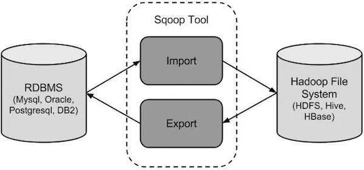
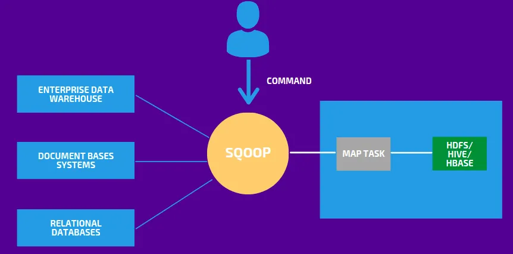
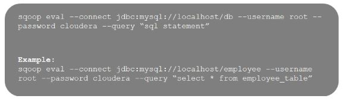
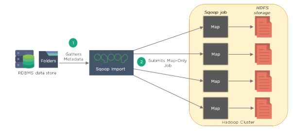
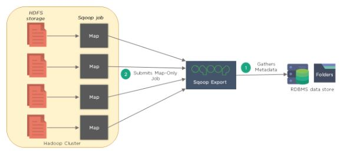

# Sqoop

Sqoop is a data ingestion tool that is designed to transfer data between RDBMS systems(such as Oracle, MySQL, SQL Server, Postgres, Teradata, etc) and Hadoop HDFS.

Sqoop stands for — “SQL to Hadoop & Hadoop to SQL”. 

## Sqoop Features

- It is a kind of data ingestion tool.
- It is not a complete ETL tool, it only performs extraction and loading.
- It performs full load as well as incremental load.
- It performs parallel import and export using the YARN framework.
- It can directly import the SQL query results to HDFS.
- It can integrate with Kerberos Security.
- It can directly load the data into HIVE and HBase.
- It can compress the data using deflate(gzip) algorithm.

### 1. How is Sqoop different from Flume?

Sqoop

- Sqoop works with RDBMS and NoSQL databases to import and export data
- Loading data in Sqoop is not event-driven
- Works with structured data sources and Sqoop connectors are used to fetch data from them
- It imports data from RDBMS into HDFS and exports it back to RDBMS

Flume

- Flume works with streaming data that is generated continuously in the Hadoop environment. Example: log files
- Loading data in Flume is completely event-driven
- Fetches streaming data, like tweets or log files, from web servers or application servers
- Data flows from multiple channels into HDFS

### 2. What are the default file formats to import data using Sqoop?

The default Hadoop file formats are Delimited Text File Format and SequenceFile Format. Let us understand each of them individually:

- Delimited Text File Format

This is the default import format and can be specified explicitly using the --as-textfile argument. This argument will write string-based representations of each record to the output files, with delimiter characters between individual columns and rows.

1,here is a message,2010-05-01

2,strive to learn,2010-01-01

3,third message,2009-11-12

- SequenceFile Format

SequenceFile is a binary format that stores individual records in custom record-specific data types. These data types are manifested as Java classes. Sqoop will automatically generate these data types for you. This format supports the exact storage of all data in binary representations and is appropriate for storing binary data.

### 3. What is the importance of the eval tool in Sqoop?

The Sqoop eval tool allows users to execute user-defined queries against respective database servers and preview the result in the console.

### 4. Explain how does Sqoop imports and exports data between RDBMS and HDFS with its architecture.

- Introspect database to gather metadata (primary key information)
- Sqoop divides the input dataset into splits and uses individual map tasks to push the splits to HDFS. 
- Sqoop will export Hadoop files back to RDBMS tables. 

