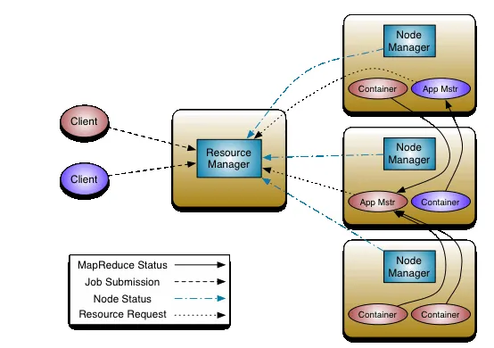
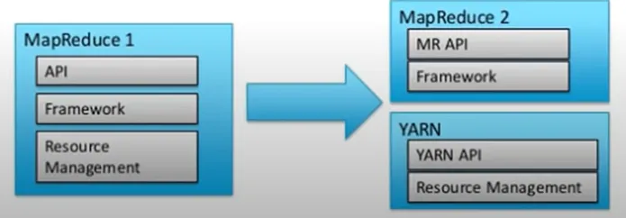
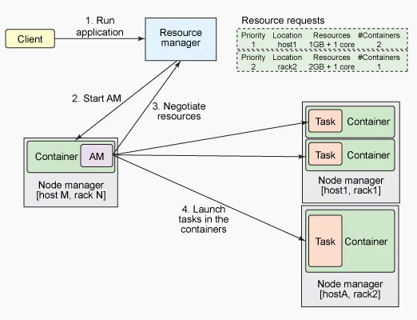
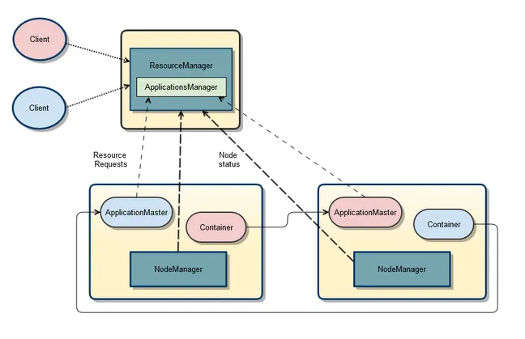
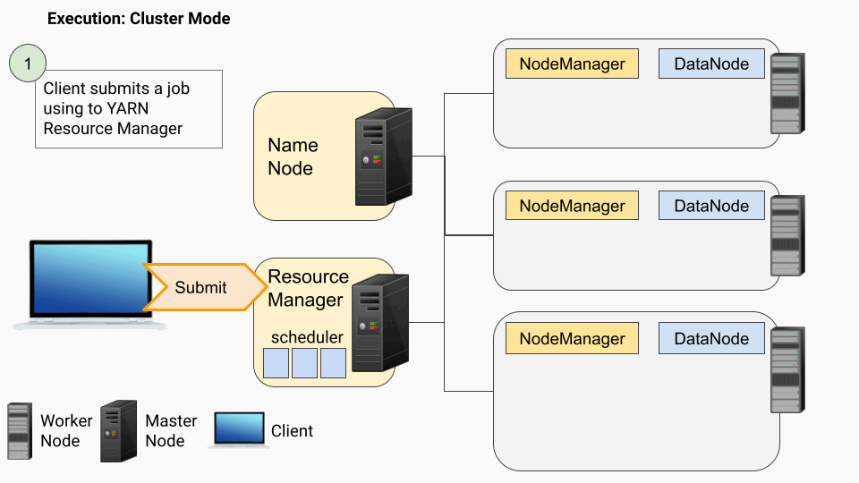
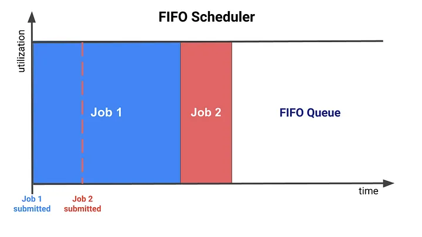
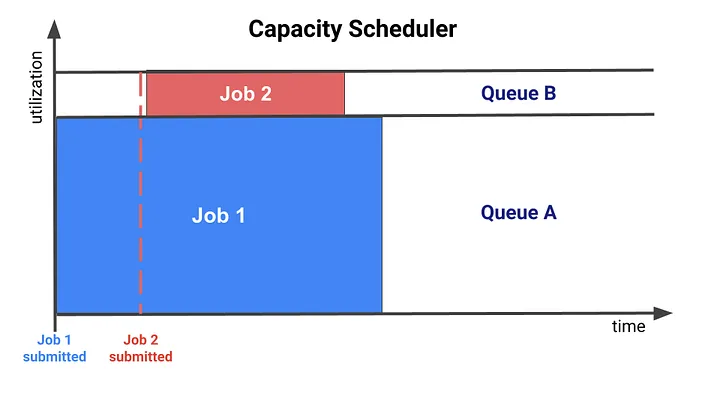
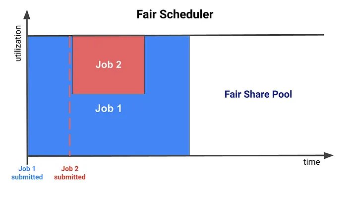
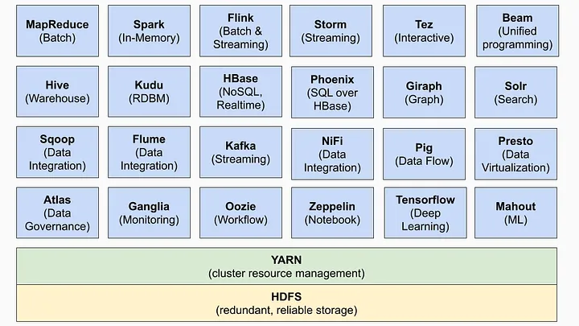

# YARN

Above is the basic architecture of Yarn, where Resource Manager is the core component of the entire architecture, which is responsible for the management of resources including RAMs, CPUs, and other resources throughout the cluster. Application Master is responsible for application scheduling throughout the life cycle, Node Manager is responsible for the supply and isolation of resources on this node.

## Why do We Need YARN

The primary goal of YARN is to decouple the functionalities of resource management and data processing into separate components. This allows a global resource manager that can support diverse data processing applications, such as MapReduce, Spark, Storm, Tez, and others, to run on a single cluster.

## Job Tracker

we had a resource manager before Hadoop 2.x and it was called Job Tracker.

JobTracker (JT) use to manage both cluster resources and perform MapR or MapReduce job execution which means Data processing. JT configures and monitors every running task. If a task fails, it reallocates a new slot for the task to start again. On completion of tasks, it releases resources and cleans up the memory.

Drawbacks of the above approach:

- It has a single component: JobTracker to perform many activities like Resource Management, Job Scheduling, Job Monitoring, Re-scheduling Jobs, etc, which puts lots of pressure on a single component.

- JobTracker is the single point of failure, which makes JT highly available resource, so if a JT fails then all tasks will be rebooted.

- Static Resource Allocation, since map and reduce slots are predefined and reserved, they cant be used for other applications even if slots are sitting idle.

##  YARN

YARN separates the Resource Management Layer and Data Processing components layer.

In MapR1 all the task of Resource Management and Processing was done by JobTracker but with the release of Hadoop 2.x, both of the layers have been divided and for Resource Management layer we have YARN. Now Hadoop 2.x says, for Data Processing use MapR, Spark, Tez, and other available Data Processing Framework, whereas YARN takes care of Resource negotiation.

Hadoop 2.x has decoupled the MapR component into different components and eventually increased the capabilities of the whole ecosystem, resulting in Higher Availablity, and Higher Scalability.

## Yarn Components

YARN comprises of two components: Resource Manager and Node Manager.

The three important elements of the YARN architecture are:

- Resource Manager (RM)
- Application Master (AM)
- Node Managers (NM)

- Resource Manager (RM)

    Spark works on Master-Slave architecture and Resource Manager is present at the Master Node. RM is the prime authority and helps in managing resources such as RAM, CPU usage, Network Bandwidth, etc. across different jobs. Resource Manager maintains the list of applications running and list of available resources.

    - Responsibilities

        1. Cluster resource tracking: It maintains a global view of the cluster and tracks the available resources on each node.

        2. Cluster health monitoring: It monitors the health of nodes in the cluster and manages the failover of resources in case of node failures.

        3. Cluster resource allocation: It receives resource requests from application masters and allocates the necessary resources to run the application.

        4. Job scheduling: (scheduler)

        5. Application master management: (application manager)

    Resource Manager has two components: Scheduler and Application Manager.

    - Scheduler:

        The scheduler takes care of the resource allocation part on behalf of the resource manager. It allocates resources to the various MapR or Spark applications subjected to the availability of resources.

        Scheduler purely takes care of Resource allocation and doesn’t involve in any other activity like monitoring or tracking status of job etc.

        allows different policies for managing constraints such as capacity, fairness, and service level agreements.

    - Application Manager:

        The ApplicationManager is an interface that maintains a list of applications that are submitted, running, or completed. 

        - Handling job submission: 

            Accepting job submissions to YARN,

        - Negotiating resources for the ApplicationMaster: 
        
            Negotiating the first container for executing the application-specific application master, and

        - Managing failover of the ApplicationMaster: 
        
            Restarting the application master container on failure.

        Application Manager launches application-specific Application Master in slave node. Note: Application Manager and Application master are different components. 
        
        Application Manager negotiates for the container to launch Application Master and helps in relaunching during failure.

- Node Manager

    is responsible for launching and managing containers on a node. Containers execute tasks as specified by the AppMaster.

    - Reporting node health:

        Each Node Manager announces itself to the ResourceManager and periodically sends a heartbeat to provide node status and information, including memory and virtual cores. In case of failure, the Node Manager reports any issues to the Resource Manager, diverting resource allocations to healthy nodes.

    - Launching Containers: 
    
        Node Managers take instructions from the ResourceManager, launch containers on their nodes, and set up the container environment with the specified resource constraints.

    - Container Management: 
    
        Node Managers manage container life cycle, dependencies, leases, resource usage, and log management.

    Before Hadoop 2.x, there use to be a fixed number of slots to execute Map and Reduce jobs, but after the Hadoop 2.x concept of slots is replaced by dynamic creation/allocation of resource containers.

    A container refers to the collection of resources such as CPU, RAM, DISK or Hard disk, and network IO, similar to a server.

    A Node Manager is the per-machine framework agent responsible to hold containers, monitor their resource usage (CPU, RAM, DISK, etc.) and reports it back to Scheduler present in Resource Manager. Node Manager is present on slave systems.

    Node Manager performs Health Check of resources on a scheduled basis, if any health check fails Node Manager marks that node as unhealthy and reports it back to Resource Manager.

    Resource Manager + Node Manager = Computation Framework

- Application Master

    The ApplicationMaster is a process that runs the main function/entry point of an application, such as the Spark driver.

    - Requesting resources: 
    
        Negotiating with the Resource Manager to obtain resources for launching containers to execute tasks.

    - Running the Master/Driver program: 
    
        It runs the Master/Driver program, such as Spark Driver, which devises the job execution plan, assigns tasks in the allocated containers, tracks task execution status, monitors progress, and handles task failures.

    Application master is application-specific or per-application and is launched by the Application manager.

    Application Master negotiates resources from Resource Manager and works with Node Manager to execute and monitor tasks. Application Master is responsible for the whole lifecycle of the application.

    Application Master sends a resource request to the Resource Manager and asks for containers to run application tasks. After receiving a request from the application master, the resource manager validates the resource requirements and checks for the availability of resources and grants a container to suffice the resource request.

    After the container is granted, the application master will request Node Manager to utilize the resources and launch the application-specific tasks.

    Application Master monitors the progress of an application and its tasks. If a failure happens then it asks for a new container to launch the task and reports the failure.

    After the execution of the application is completed, Application Master shuts itself down and releases its container. Hence marks the execution completion

- Container

    Containers are assigned to execute tasks from applications, such as MapReduce jobs or Spark tasks. Each container has a specific amount of resources allocated to it, such as CPU, memory, and disk space, allowing the task to run in a controlled and isolated environment.

    - ResourceManager: 
    
        The ResourceManager in YARN is responsible for allocating containers to Application Masters based on their resource requests. It provides the container launch context (CLC) that includes environment variables, dependencies, security tokens, and commands to create the application's launch process.

    - NodeManager: 
    
        The NodeManager in YARN is responsible for launching the containers with specified resource constraints (CLC).

    - ApplicationMasters: 
    
        The Application Masters manage the execution of tasks within these containers, monitor their progress, and handle any task failures or reassignments.

## Steps of executing Applications with YARN:

- A client submits an application to the YARN ResourceManager.

- The ApplicationsManager (in the ResourceManager) negotiates a container and bootstraps the ApplicationMaster instance for the application.

- The ApplicationMaster registers with the ResourceManager and requests containers(RAMs and CPUs).

- The ApplicationMaster communicates with NodeManagers to launch the containers it has been granted.

- The ApplicationMaster manages application execution. During execution, the application provides progress and status information to the ApplicationMaster. The client can monitor the application’s status by querying the ResourceManager or by communicating directly with the ApplicationMaster.

- The ApplicationMaster reports completion of the application to the ResourceManager.

- The ApplicationMaster un-registers with the ResourceManager, which then cleans up the ApplicationMaster container.

- Step 1: A client submits a job using “spark-submit” to the YARN Resource Manager.
- Step 2: The job enters a scheduler queue in the ResourceManager, waiting to be executed.
- Step 3: When it is time for the job to be executed, the ResourceManager finds a NodeManager capable of launching a container to run the ApplicationMaster.
- Step 4: The ApplicationMaster launches the Driver Program (the entry point of the program that creates the SparkSession/SparkContext).
- Step 5: The ApplicationMaster/Spark calculates the required resources (CPU, RAM, number of executors) for the job and sends a request to the Resource Manager to launch the executors.
    > The ApplicationMaster communicates with the NameNode to determine the file (block) locations within the cluster using the HDFS protocol.
- Step 6: The Driver Program assigns tasks to the executor containers and keeps track of the task status.
- Step 7: The executor containers execute the tasks and return the results to the Driver Program. The Driver Program aggregates the results and produces the final output.

## YARN Schedulers

- FIFO Scheduler

    As the name suggests, it schedules applications based on the order in which they are submitted to the queue, following a first-come-first-serve principle. Once an application starts running, it consumes all the resources until it completes, and then the next application in the queue gains access to the resources.

    

    pros:
        
    - Simple and easy-to-understand scheduling mechanism.

    cons:
    
    - Inefficient resource allocation
    - Lack of advanced features

- Capacity Scheduler

    The Capacity Scheduler is designed to support multi-tenant environments where multiple teams share the same cluster. It divides the cluster resources into multiple queues, each with its own reserved resources (CPUs, RAM) and guarantees (minimum capacity), while allowing for elasticity (maximum capacity) to dynamically utilize unused resources from other queues.

    

    features:

    - Hierarchical queues: 

        The Capacity Scheduler allows administrators to define hierarchical queues for organizing and managing resources. Each queue can have a pre-defined capacity (a percentage of the total cluster resources) allocated to it.

    - Elastic resource allocation:

        Queues can borrow resources from other queues if there are unused resources available. This allows for better resource utilization across the cluster.

    - Access control:

        The Capacity Scheduler provides access control mechanisms to manage which users or groups can submit applications to specific queues. This helps in maintaining security and resource management policies in multi-tenant clusters.

    - Preemption:

        The Capacity Scheduler supports preemption, allowing applications in high-priority queues or under-served queues to reclaim resources from lower-priority or over-served queues when necessary.
    
    pros:

    - Designed for multi-tenant clusters, allowing multiple organizations to share the same cluster.

    - Allows administrators to define hierarchical queues and assign capacities to them, ensuring minimum guaranteed resource allocation.

    - Supports features like access control, resource limits, and elastic resource allocation.

    cons:

    - Might require more complex configuration, management, and tuning compared to the FIFO scheduler.

    - Resource allocation is based on the pre-defined capacities of the queues, which might not be as dynamic as the Fair Scheduler.

- Fair Scheduler

    The Fair Scheduler is designed to provide fair resource allocation across all applications running in a Hadoop cluster, ensuring that no single application dominates the cluster resources, without requiring a set amount of reserved capacity. When a job starts — if it is the only job running — it gets all the resources of the cluster. When a second job starts, it gets resources as soon as some containers are freed (not utilized in some stages) from the first running job. After the smaller job finishes, the scheduler reassigns resources to the larger one. The Fair Scheduler enables short apps to finish in a reasonable time without stopping long-lived apps.

    

    features:

    - Dynamic fair allocation: 
    
        The Fair Scheduler continuously redistributes resources among applications based on their demand, ensuring that each application gets a fair share of the available resources.

    - Customizable resource allocation policies:

        The Fair Scheduler allows administrators to define custom resource allocation policies, such as weighted fair sharing, to control how resources are distributed among applications or queues. 

    pros:

    - Provides fair resource allocation across all applications in the cluster by dynamically adjusting resources based on demand.

    - Prevents any single application from dominating the cluster resources.

    cons:

    - More complex configuration and management compared to the FIFO scheduler.

    - In some cases, might lead to sub-optimal resource allocation if the fairness policies are not properly configured.

- Over time, the features of both the Capacity Scheduler and Fair Scheduler have become increasingly similar (please refer to the article here), including hierarchical queues, dynamic resource allocation, minimum resource guarantees, and preemption.

## Applications that run on YARN

### 1. What benefits did YARN bring in Hadoop 2.0 and how did it solve the issues of MapReduce v1?

In Hadoop v1,  MapReduce performed both data processing and resource management; there was only one master process for the processing layer known as JobTracker. JobTracker was responsible for resource tracking and job scheduling. 

Managing jobs using a single JobTracker and utilization of computational resources was inefficient in MapReduce 1. As a result, JobTracker was overburdened due to handling, job scheduling, and resource management. Some of the issues were scalability, availability issue, and resource utilization. In addition to these issues, the other problem was that non-MapReduce jobs couldn’t run in v1.

To overcome this issue, Hadoop 2 introduced YARN as the processing layer. In YARN, there is a processing master called ResourceManager. In Hadoop v2, you have ResourceManager running in high availability mode. There are node managers running on multiple machines, and a temporary daemon called application master. Here, the ResourceManager is only handling the client connections and taking care of tracking the resources. 

In Hadoop v2, the following features are available:

- Scalability - You can have a cluster size of more than 10,000 nodes and you can run more than 100,000 concurrent tasks. 

- Compatibility - The applications developed for Hadoop v1 run on YARN without any disruption or availability issues.

- Resource utilization - YARN allows the dynamic allocation of cluster resources to improve resource utilization.

- Multitenancy - YARN can use open-source and proprietary data access engines, as well as perform real-time analysis and run ad-hoc queries.

### 2. Which of the following has replaced JobTracker from MapReduce v1?

1. NodeManager
2. ApplicationManager
3. ResourceManager 
4. Scheduler

The answer is ResourceManager. It is the name of the master process in Hadoop v2.

### 3. Write the YARN commands to check the status of an application and kill an application.

The commands are as follows:

- To check the status of an application:

    yarn application -status ApplicationID

- To kill or terminate an application:

    yarn application -kill ApplicationID

### 4. Can we have more than one ResourceManager in a YARN-based cluster?

Yes, Hadoop v2 allows us to have more than one ResourceManager. You can have a high availability YARN cluster where you can have an active ResourceManager and a standby ResourceManager, where the ZooKeeper handles the coordination.

There can only be one active ResourceManager at a time. If an active ResourceManager fails, then the standby ResourceManager comes to the rescue.

### 5. What are the different schedulers available in YARN?

- FIFO scheduler -  This places applications in a queue and runs them in the order of submission (first in, first out). It is not desirable, as a long-running application might block the small running applications 

- Capacity scheduler  - A separate dedicated queue allows the small job to start as soon as it is submitted. The large job finishes later compared to using the FIFO scheduler 

- Fair scheduler  - There is no need to reserve a set amount of capacity since it will dynamically balance resources between all the running jobs

### 6. What happens if a ResourceManager fails while executing an application in a high availability cluster?

In a high availability cluster, there are two ResourceManagers: one active and the other standby. If a ResourceManager fails in the case of a high availability cluster, the standby will be elected as active and instructs the ApplicationMaster to abort. The ResourceManager recovers its running state by taking advantage of the container statuses sent from all node managers.

### 7. In a cluster of 10 DataNodes, each having 16 GB RAM and 10 cores, what would be the total processing capacity of the cluster?

Every node in a Hadoop cluster will have one or multiple processes running, which would need RAM. The machine itself, which has a Linux file system, would have its own processes that need a specific amount of RAM usage. Therefore, if you have 10 DataNodes, you need to allocate at least 20 to 30 percent towards the overheads, Cloudera-based services, etc. You could have 11 or 12 GB and six or seven cores available on every machine for processing. Multiply that by 10, and that's your processing capacity. 

### 8. What happens if requested memory or CPU cores go beyond the size of container allocation?

If an application starts demanding more memory or more CPU cores that cannot fit into a container allocation, your application will fail. This happens because the requested memory is more than the maximum container size.