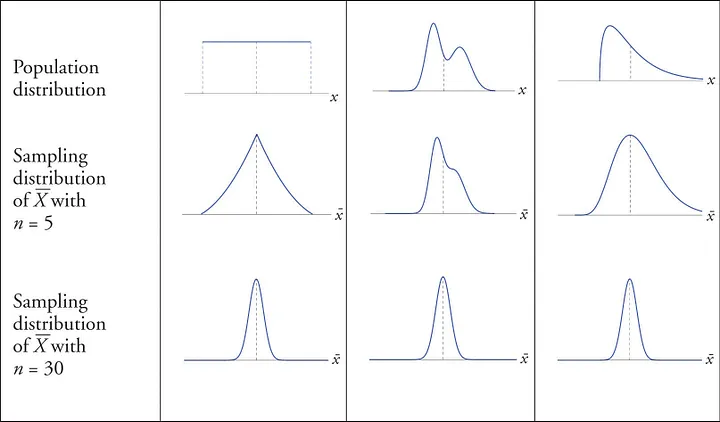
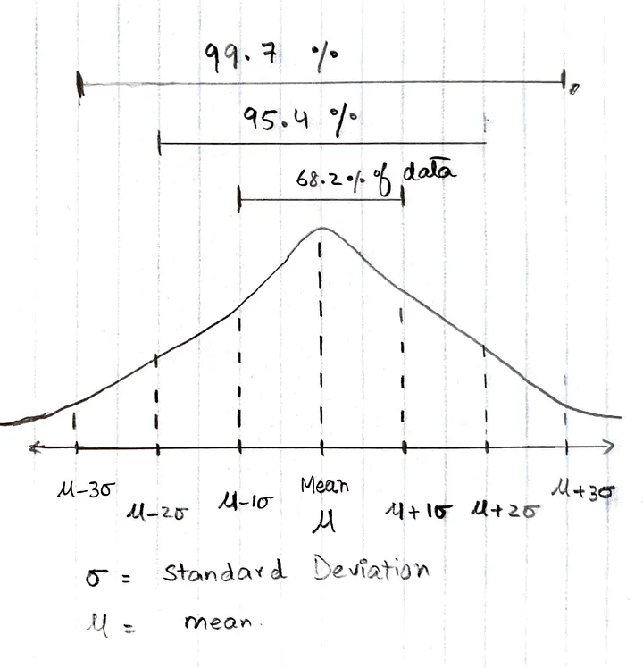
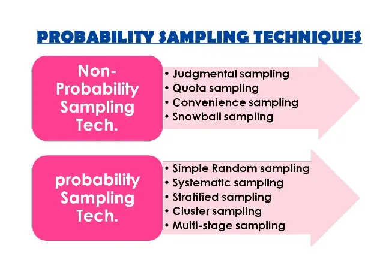
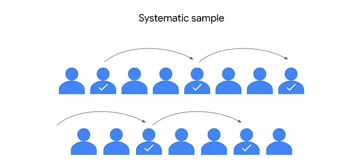
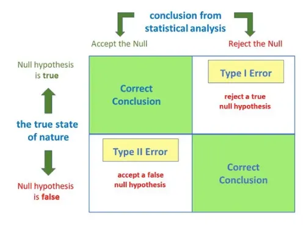
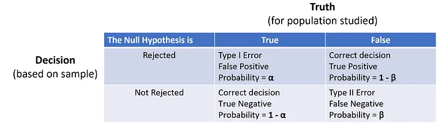
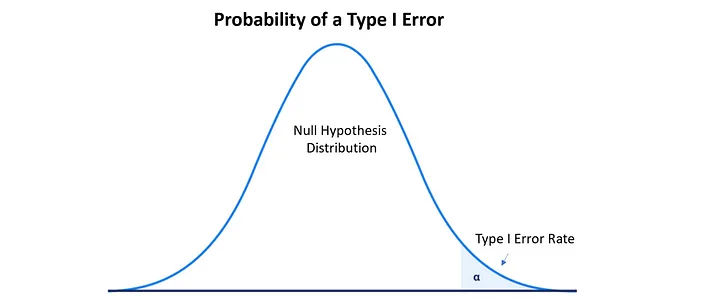
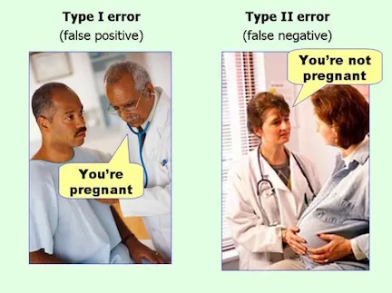
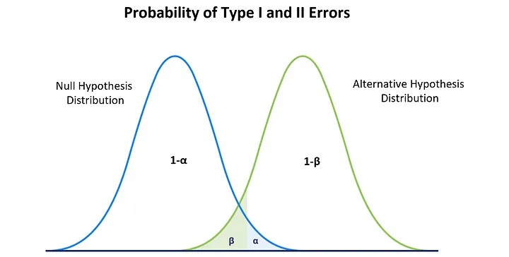

# Statistics

## Central Limit Theorem

### Definition

**_It states no matter how the population distribution is, as the sample size (n) of the samples derived(with replacement) from the population increases, the distribution of the sample mean or sum approaches a normal distribution._**

**_For large sample sizes, the sampling distribution of means will approximate to normal distribution even if the population distribution is not normal._**   

Numerically, means of random samples drawn from any population distribution with mean µ and standard deviation σ will have an approximately normal distribution with a mean equal to µ and standard deviation of σ /√n.

It says that the statistical and probabilistic methods that work for normal distribution can also be applied to many other problems which deal with different types of distributions. 

The CLT disappoints when a distribution has a non-limited variance. These cases are rare yet might be significant in certain fields.

### Why n ≥ 30 samples?

A sample of size 30 is considered large enough to see the effect and power of Central Limit Theorem. The closer the population distribution to normal distribution, fewer samples needed to demonstrate Central Limit Theorem. If the distribution of the population is highly skewed then we need large number of samples to demonstrate and understand Central Limit Theorem.

as the sample size increases, the estimation of population mean gets closer and closer to the actual population mean with decreasing dispersion/spread alongside a shape replicating a normal distribution (*of the sample estimated means).

### Why CLT is important?

The field of statistics is based on fact that it is highly impossible to collect the data of entire population. Instead of doing that we can gather a subset of data from a population and use the statistics of that sample to draw conclusions about the population.

In practice, the unexpected appearance of normal distribution from a population distribution is skewed (even heavily skewed). Many practices in statistics such as hypothesis testing make this assumption that the population on which they work is normally distributed.

This assumption basically simplifies matters and we overcome the problem of the data belonging to the population which is not normal.

**_Statistical inference_** depends on the possibility that it is conceivable to take a broad view of results from a sample to the population. How might we guarantee that relations seen in an example are not just because of the possibility?

**_Significance tests_** are intended to offer a target measure to inform decisions about the validity of the broad view. For instance, one can locate a negative relationship in a sample between education and income. However, added information is essential to show that the outcome isn’t just because of possibility, yet that it is statistically significant.

### CLT & Law of Large Numbers (LLN)

- In probability theory, the law of large numbers (LLN) is a mathematical theorem that states that the average of the results obtained from a large number of independent and identical converges to the true value. More formally, the LLN states that given a sample of independent and identically distributed values, the sample mean converges to the true mean.

The CLT is regularly mistaken for the law of large numbers (LLN) by beginners. They are non-identical, and the key differentiation between them is that the LLN relies upon the size of a single sample, though the CLT relies upon the number of samples.

LLN expresses that the sample means of independent and indistinguishably distributed observations perceptions joins to a certain value as far as possible CLT portrays the distribution of the distinction between the sample means and the value.

The CLT performs a significant part in statistical inference. It depicts precisely how much an increase in sample size diminishes sampling error, which tells us about the precision or margin of error for estimates of statistics, for example, percentages, from samples.

### Limitations of Central Limit Theorem

Central Limit Theorem is true regardless of what distribution the population sample follows. It works with all the population samples which have a finite standard deviation value. So, we can conclude that it won’t work for Cauchy Distribution. Because it has an infinite variance.

And also the central limit theorem applies only to independent distributed variables. That is, the value of one distribution should not depend on the value of another distribution.

##  Statistical Inference

### What is Statistical Inference?

By definition, it is the study of theory and methods used to form judgements regarding a “population” from the sample (data) that we observe, and measure the reliability of those judgements made from the sample data. In simple words, we can say that Inference is about generalizing something with a “certain degree of certainty” about a population by looking at a sample from that population.

### Basic Terminologies

- Population

    Complete set of Individuals/Objects under study is population. From the example above population is the all the people your age in this world.

- Parameter of Interest

    Parameter of Interest is the attribute you want to infer in regards to the population under study. Amount of water is the parameter of interest as you are inferring how much water people your age drink.

- Measuring the Parameter of Interest

    After deciding about the Parameter of Interest you need to decide on how would you quantify/measure the parameter of interest. In our case it is the number of glasses a person drink everyday.

- Population Parameter & Sample Statistic

    The measure for Parameter we talked about in the previous section can be measured w.r.t both the population and sample. When it is measured w.r.t population, it is called Population Parameter and when measured for a sample, it’s called Sample Statistic. For example — Average glass of water that a person of your age drinks (Population) is a population parameter, while the average glass of water you and the sample of your two friends drink is the sample statistic. Population parameter is what is unknown mostly all the time, while sample statistic is what we can measure from our sample and use it to make an inference about population parameter.

    This Variability in sample statistic due to difference in samples we collect is called Sampling Variability. We can use this variability and sample statistic to define the plausible range of values from which we can say the population parameter can lie with a certain degree of confidence.

### Sampling Distribution and Central Limit Theorem (CLT)

- Sampling Distribution
    
    It is the distribution of different (yet identical) values of sample statistic that can come from different samples of same size from a population. 

- CLT

    If we assume that the underlying population is normal in our case, and you had kept on sampling and were able to sample the entire population, the curve shown above would start approaching a normal distribution with mean “mu — μ” and standard deviation (Sampling Variability or sometimes called Standard Error) as “σ/√n” (where “μ” population mean (population parameter) and “σ” is the standard deviation of the population). This essentially means that the sampling distribution of sample mean (x̄) ~ N(μ,σ²/n), given that the underlying population is normal. Even if the underlying population is not normal (i.e Binomial, Uniform Distribution etc), the sampling distribution will still be normal given the sample size is large enough.

### Confidence Interval

Now we would agree on the fact that due to sampling variability we cannot infer by only using sample statistic, we need to cater for the sampling variability, and we do that by generating a plausible range of values in which the true population parameter would lie with a certain degree of confidence. 

Let’s say we have a normal distribution following ~ N(μ,σ²).

From the above picture we see that 68% of the data lies within +/-1σ of mean, while 95% of the data lies within +/-2σ of mean, and the percentage increases as we increase the range around the mean. Now, think of it in terms of sample statistic mean and it’s standard deviation (Sampling Variability or Standard Error).

Following this analogy we can say that p% confidence interval can be built using this formula:

x̄ +/- [critical_value(given p% confidence) * S.E]

Now let’s focus on how to build the confidence interval. We need three things to build C.I for any metric.

- Point Estimate (Metric of Interest — avg. revenue etc)
- Standard Error (Variance of Sampling Distribution) — Quantifies the variability around the point estimate (metric of interest)
- Alpha (Confidence) — Shows how confident we are in the range we provided

Thus, the complete equation look something like this:

**_Point Estimate ± α × Standard Error_**

Point estimate — relates to some metric you are trying to report/measure. It could be avg. revenue, avg. spend or even a proportion based metric like CVR (conversion rate — based on a binary metric).

Standard Error — as explained in the last article is the variability around the metric.

Alpha — quantifies the confidence you have in the range you produced using point estimate and standard error. Intuitively, this means that for a higher alpha (higher confidence), the range of C.I would be larger and you would have a higher confidence — Meaning you’d be more confident in saying that the range you calculated (using C.I) would contain the true population parameter, whereas for a lower alpha, the range of C.I would be smaller (As suggested by the formula above). 

## Sampling

Sampling is a process used in statistical analysis in which a predetermined number of observations are taken from a larger population.

#### Sampling Distribution

- Probability Distribution: With randomization every element gets equal chance to be picked up.

- Non-Probabilistic Distribution: Does not get equal chance to be selected.

#### Simple Random Sampling

Simple Random Sampling is mainly used when we dont have any prior knowledge about the target variable. In this type of sampling all the elements have equal chance of being selected. An example of a simple random sample would be the names of 50 employees being chosen out of a hat from a company of 500 employees.A simple random sample is meant to be an unbiased representation of a group.

#### Systematic Sampling

Here the elements for sample are chosen at regular intervals of population.First all the elements are put together in a sequence.Here the selection of elements is systematic and not random except first element. It is popular with researchers because of its simplicity. Researchers select items from an ordered population using a skip or sampling interval. For example,Saurabh can give a survey to every fourth customer that comes in to the movie theatre.

How you do systematic sampling?

- Calculate the sampling interval (the number of households in the population divided by the number of households needed for the sample)
- Select a random start between 1 and sampling interval.
- Repeatedly add sampling interval to select subsequent households.

#### Stratefied Sampling

In stratified sampling we divide the elements of population into strata(means small groups) based upon the similarity measure.All the elements are homogenous within one group and heterogenous from other.

How you do stratified sampling?

- Divide the population into smaller subgroups, or strata, based on the members’ shared attributes and characteristics.
- Take a random sample from each stratum in a number that is proportional to the size of the stratum.

#### Cluster Sampling

When you’re conducting a cluster random sample, you divide a population into clusters, randomly select certain clusters, and include all members from the chosen clusters in the sample.

Cluster sampling is similar to stratified random sampling, but in stratified sampling, you randomly choose some members from each group to be in the sample. In cluster sampling, you choose all members from a group to be in the sample. Clusters are divided using identifying details, such as age, gender, location, or whatever you want to study.

#### Convenience sampling

For convenience sampling, you choose members of a population that are easy to contact or reach. Conducting a convenience sample involves collecting a sample from somewhere convenient to you, such as your workplace, a local school, or a public park.

#### Voluntary response sampling

A voluntary response sample consists of members of a population who volunteer to participate in a study.

#### Snowball sampling

In a snowball sample,researchers recruit initial participants to be in a study and then ask them to recruit other people to participate in the study. Like a snowball, the sample size gets bigger and bigger as more participants join in. Researchers often use snowball sampling when the population they want to study is difficult to access.

#### Purposive sampling

In purposive sampling, researchers select participants based on the purpose of their study. Because participants are selected for the sample according to the needs of the study, applicants who do not fit the profile are rejected.

## Type I vs Type II Errors

#### Type I Errors:

A Type I error, also known as a false positive, occurs when a researcher rejects a null hypothesis that is actually true.

This can happen when the sample data appears to support the alternative hypothesis, but in reality, it is just a random fluctuation or chance event (i.e., the sampling error). In the population data, the null hypothesis is supported.

For example, consider a medical study that is testing a new drug to see if it is effective at lowering cholesterol levels. If the null hypothesis is that the drug has no effect, and the researcher rejects this hypothesis based on the data, but in reality, the drug has no effect, then a Type I error has occurred.

In hypothesis testing, the null hypothesis represents the default assumption that there is no difference or relationship between the variables being tested. The alternative hypothesis represents the opposite assumption.

The purpose of a hypothesis test is to determine if the sample data provide sufficient evidence to reject the null hypothesis for the entire population.

Making a statistical decision based on the sample data always involves uncertainties due to sampling error, which is unavoidable.

Therefore, before a hypothesis test, researchers need to set the Significant Level (α), the probability of making a Type I error when the null hypothesis is correct.

The typical significance levels are 0.1, 0.05, and 0.01. For example, α = 0.05 means if we repeat the hypothesis tests many times with different sets of sample data, we expect that 5% of the time we incorrectly reject the null hypothesis when it is true, and 95% of the time we won’t reject the null hypothesis.

#### Type II Errors:

A Type II error, also known as a false negative, occurs when a researcher fails to reject a null hypothesis that is actually false.

This can happen when the sample data does not appear to support the alternative hypothesis, but in reality, the population does.

Continuing with the example of the medical study, if the null hypothesis is that the drug has no effect and the researcher fails to reject this hypothesis based on the sample data, but in reality, the drug does have an effect, then a Type II error has occurred.

Making a Type II error means you fail to detect the effect when the effect actually exists. When that happens, your study or analysis doesn’t have enough Statistical Power.

Statistical power (1-β) is a measure of the ability of a statistical test to detect a true difference of a certain size between the null and alternative hypotheses if one exists. It is defined as the probability of correctly rejecting the null hypothesis when it is false.

Therefore, the relationship between Type II error rate (β) and statistical power (1-β) is that a high level of statistical power means a low probability of making a Type II error, and a low level of statistical power means a high probability of making a Type II error.

#### How to reduce Type I and Type II errors?

- Increase sample size: A large size can decrease the variance of the distribution of sample statistics.

- Increase effect size: If the effect size is large, this means that the difference between the null and alternative hypotheses is more pronounced

- Adjust Significance Level: If we lower the significance level, we have a stricter criterion (e.g., data must be more extreme) for rejecting the null hypothesis, therefore reducing the Type I error rate, but this also decreases the statistical power, therefore increases the Type II error rate.

If we increase the significance level, it means that the data does not have to be as extreme in order to reject the null hypothesis. Therefore, the Type I error rate increases, but the Type II error rate decreases.

For a certain effect size and a given sample data, the Type I and II errors have an inverse relationship.

#### Under what situations the Type I error is worse than the Type II error?

Imagine that a researcher is studying the effectiveness of a new security system at detecting intruders. The null hypothesis is that the security system is not effective, and the alternative hypothesis is that it is effective. If the researcher rejects the null hypothesis based on the data and implements the security system, but in reality the system is not effective, then a Type I error has occurred. In this case, the consequences of the Type I error (implementing an ineffective security system) may be worse than the consequences of a Type II error (failing to implement an effective security system). This is because the cost of implementing an ineffective security system (such as the cost of purchasing and installing the system, as well as the cost of any security breaches that occur) may be higher than the cost of not implementing an effective system.

#### Under what situations the Type II error is worse than the Type I error?

Imagine that a researcher is studying the effectiveness of a new drug at reducing the risk of heart attacks. The null hypothesis is that the drug has no effect, and the alternative hypothesis is that it is effective. If the researcher fails to reject the null hypothesis based on the data and does not prescribe the drug to patients, but in reality the drug is effective at reducing the risk of heart attacks, then a Type II error has occurred. In this case, the consequences of the Type II error (not prescribing an effective drug) may be worse than the consequences of a Type I error (prescribing an ineffective drug). This is because the cost of not prescribing an effective drug (such as the cost of additional medical treatment or lost productivity due to heart attacks) may be higher than the cost of prescribing an ineffective drug.

## Linear Regression

