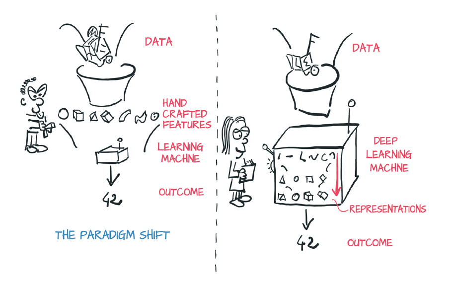
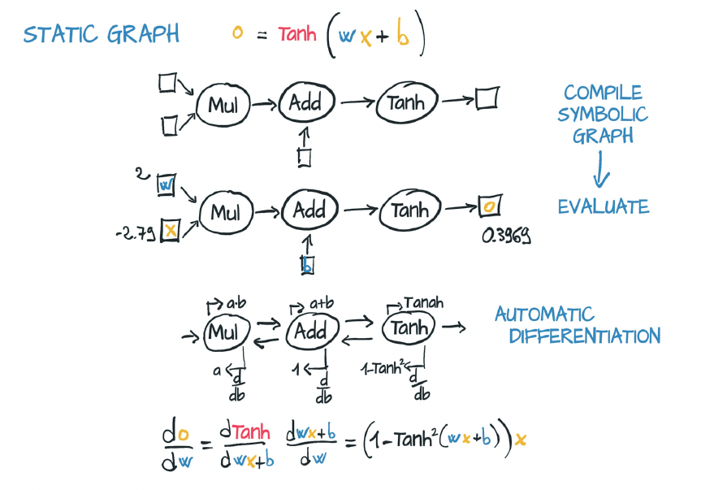
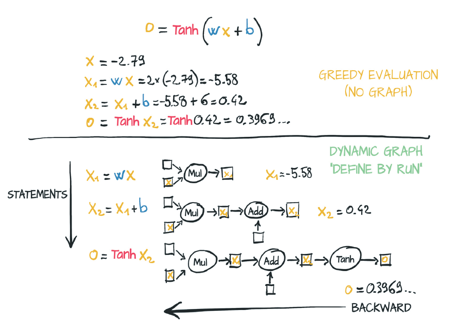
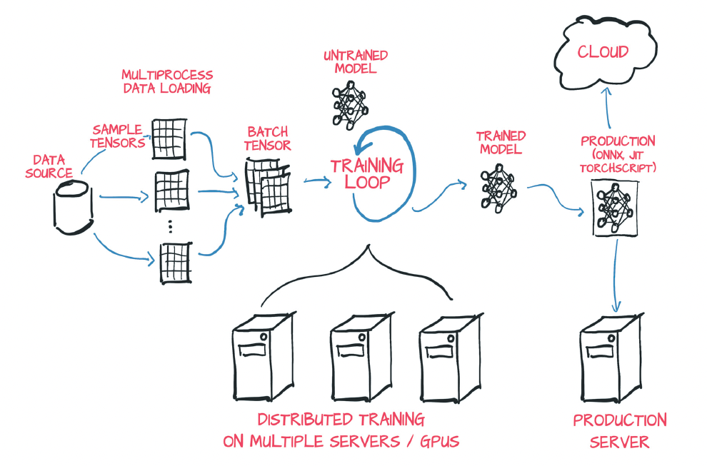

# Chapter 1. Introducing Deep Learning and the PyTorch Library

## What is PyTorch?

- PyTorch is a library for Python programs that facilitates building deep learning projects.

- PyTorch provides a core data structure, the Tensor, a multidimensional array that has many similarities with NumPy arrays.

- Tensors accelerate mathematical operations (assuming that the appropriate combination of hardware and software is present), and PyTorch has packages for distributed training, worker processes for efficient data loading, and an extensive library of common deep learning functions

## Why PyTorch?

- For users who are familiar with NumPy arrays, the PyTorch Tensor class will be immediately familiar. PyTorch feels like NumPy, but with GPU acceleration and automatic computation of gradients, which makes it suitable for calculating backward pass data automatically starting from a forward expression.

- PyTorch arguably offers one of the most seamless translations of ideas into Python code in the deep learning landscape

#### The deep learning revolution

- Until the late 2000s, the broader class of systems that fell into the category machine learningrelied heavily on feature engineering. Features are transformations of input data resulting in numerical features that facilitate a downstream algorithm, such as a classifier, to produce correct outcomes on new data. Feature engineering aims to take the original data and come up with representations of the same data that can be fed to an algorithm to solve a problem.

- Deep learning, on the other hand, deals with finding such representations automatically, from raw data, to perform a task successfully. In the ones-versus-zeros example, filters would be refined during training by iteratively looking at pairs of examples and target labels

- The ability of a neural network to ingest data and extract useful representations on the basis of examples, however, is what makes deep learning so powerful. The focus of deep learning practitioners is not so much on handcrafting those representations but on operating on a mathematical entity so that it discovers representations from the training data autonomously.

- 

#### Immediate versus deferred execution

- One key differentiator for deep learning libraries is immediate versus deferred execution.

- Immediate execution like this consumes inputs and produces an output value (c here). PyTorch, like Python in general, defaults to immediate execution (referred c to as **_eager mode_** in the PyTorch documentation)

```python
a = 3
b = 4
c = (a**2 + b**2) ** 0.5
c
```

- Alternatively, you could define the Pythagorean expression even before knowing what the inputs are and use that definition to produce the output when the inputs are available

```python
p = lambda a, b: (a**2 + b**2) ** 0.5
p(1, 2)
p(3, 4)
```

- In the second case, you defined a series of operations to perform, resulting in a output function (p in this case). You didn’t execute anything until later, when you passed in the inputs—an example of **_deferred execution_**.

- Things get tricky when specialized classes that have heavy operator overloading are used, allowing what looks like immediate execution to be deferred under the hood

```python
a = InputParameterPlaceholder()
b = InputParameterPlaceholder() 
c = (a**2 + b**2) ** 0.5
callable(c)
c(3, 4)
```

- Often in libraries that use this form of function definition, the operations of squaring a and b, adding, and taking the square root aren’t recorded as high-level Python byte code. Instead, the point usually is to compile the expression into a **_static computation graph_** (a graph of basic operations) that has some advantage over pure Python

- The fact that the computation graph is built in one place and used in another makes debugging more difficult, because exceptions often lack specificity about what went wrong and Python debugging tools don’t have any visibility into the intermediate states of the data.

- The fundamental building block of a neural network is a neuron. Neurons are strung together in large numbers to form the network. You see a typical mathematical expression for a single neuron in the first row of figure 1.2: o = tanh(w * x + b).

    - x is the input to the single-neuron computation.
    - w and b are the parameters or weights of the neuron and can be changed as needed.
    - To update the parameters (to produce output that more closely matches what we desire), we assign error to each of the weights via backpropagation and then tweak the weights accordingly.
    - Backpropagation requires computing the gradient of the output with respect to the weights (among other things).
    - We use automatic differentiation to compute the gradient automatically, saving us the trouble of writing the calculations by hand.

- 

- the neuron gets compiled into a symbolic graph in which each node represents individual operations (second row), using placeholders for inputs and outputs. Then the graph is evaluated numerically (third row) when concrete numbers are plugged into the placeholders

- The gradient of the output with respect to the weights is constructed symbolically by automatic differentiation, which traverses the graph backward and multiplies the gradients at individual nodes (fourth row)

- One of the major competing deep learning frameworks is TensorFlow, which has a graph mode that uses a similar kind of deferred execution. Graph mode is the default mode of operation in TensorFlow 1.0. By contrast, PyTorch sports a define-by-run dynamic graph engine in which the computation graph is built node by node as the code is eagerly evaluated.

- 

- The computation is broken into individual expressions, which are greedily evaluated as they are encountered.

- The expression is still broken into individual operations, but here those operations are eagerly evaluated, and the graph is built incrementally.

- Automatic differentiation is achieved by traversing the resulting graph backward, similar to static computation graphs

- it is often easier to accomplish looping or conditional behavior with dynamic graphs. Dynamic graphs can change during successive forward passes. Different nodes can be invoked according to conditions on the outputs of the preceding nodes, for example, without a need for such conditions to be represented in the graph itselfa distinct advantage over static graph approaches.

#### The deep learning competitive landscape

- In the roughly two years that followed, the landscape changed dramatically. The community has largely consolidated behind PyTorch or TensorFlow

## PyTorch has the batteries included

- First, PyTorch has the Py from Python, but there’s a lot of non-Python code in it. For performance reasons, most of PyTorch is written in C++ and CUDA3, a C++-like language from NVIDIA that can be compiled to run with massive parallelism on NVIDIA GPUs.

- you will interact with PyTorch from Python, building models, training them, and using the trained models to solve problems

- At its core, PyTorch is a library that provides multidimensional arrays, called **_tensors_** in PyTorch parlance

- Both tensors and related operations can run on the CPU or GPU. Running on the GPU results in massive speedups compared with CPU

- The second core thing that PyTorch provides allows tensors to keep track of the operations performed on them and to compute derivatives of an output with respect to any of its inputs analytically via backpropagation. This capability is provided natively by tensors and further refined in torch.autograd

- Figure 1.4 shows a standard setup that loads data, trains a model, and then deploys that model to production

- 

- The core PyTorch modules for building neural networks are located in torch.nn, which provides common neural network layers and other architectural components. Fully connected layers, convolutional layers, activation functions, and loss functions can all be found here.

- a source of training data, an optimizer to adapt the model to the training data, and a way to get the model and data to the hardware that will be performing the calculations needed for training the model.

- Utilities for data loading and handling can be found in torch.util.data. The two main classes you’ll work with are Dataset, which acts as the bridge between your custom data (in whatever format it might be in), and a standardized PyTorch Tensor. The other class you’ll see a lot of is DataLoader, which can spawn child processes to load data from a Dataset in the background so that it’s ready and waiting for the training loop as soon as the loop can use it.

- to want to use specialized hardware such as multiple GPUs or to have multiple machines contribute their resources to training the model. In those cases, **_torch.nn.DataParallel_** and **_torch.distributed_** can be employed to leverage the additional hardware available.

- When you have results from running your model on the training data, **_torch.optim_** provides standard ways of updating the model so that the output starts to more closely resemble the answers specified in the training data.

- As mentioned earlier, PyTorch defaults to an immediate execution model (eager mode). Whenever an instruction involving PyTorch is executed by the Python interpreter, the corresponding operation is immediately carried out by the underlying C++ or CUDA implementation. 

- To bypass the cost of the Python interpreter and offer the opportunity to run models independently from a Python runtime, PyTorch also provides a deferred execution model named TorchScript. Using TorchScript, PyTorch can serialize a set of instructions that can be invoked independently from Python. You can think of this model as being a virtual machine with a limited instruction set specific to tensor operations. Besides not incurring the costs of calling into Python, this execution mode gives PyTorch the opportunity to Just in Time (JIT) transform sequences of known operations into more efficient fused operations.

## Summary

- Deep learning models automatically learn to associate inputs and desired outputs from examples.

- Libraries like PyTorch allow you to build and train neural network models efficiently.

- PyTorch minimizes cognitive overhead while focusing on flexibility and speed. It also defaults to immediate execution for operations.

- TorchScript is a precompiled deferred-execution mode that can be invoked
from C++. Since the release of PyTorch in early 2017, the deep learning tooling ecosystem has consolidated significantly.

- PyTorch provides several utility libraries to facilitate deep learning projects.