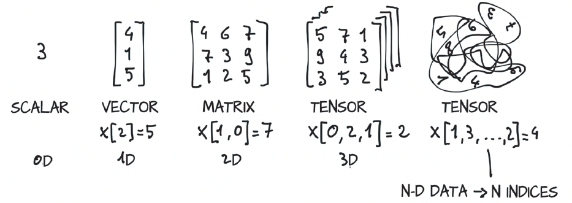
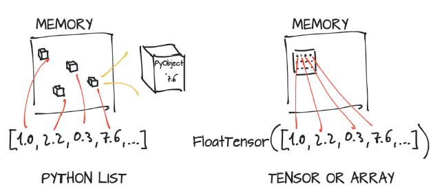
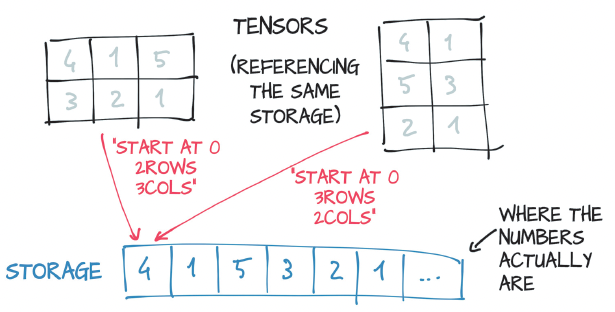
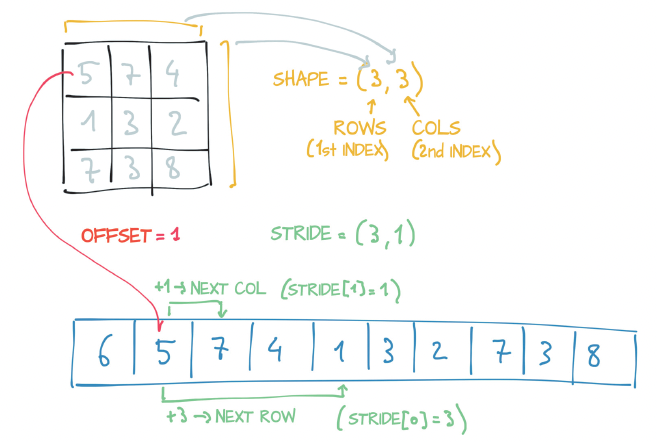
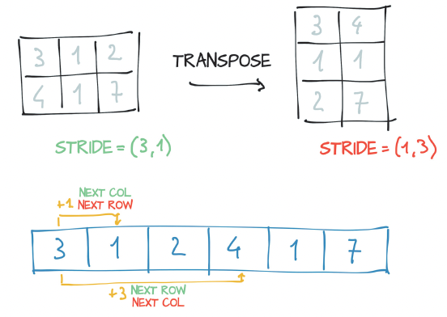
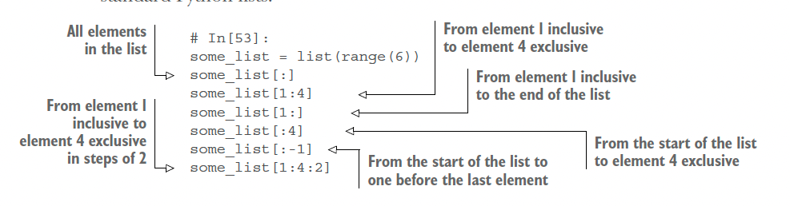
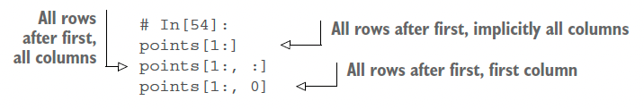

# Chapter 2: It Starts with a Tensor

- Deep learning enables many applications, which invariably consist of taking data in some form, such as images or text, and producing data in another form, such as labels, numbers, or more text. Taken from this angle, deep learning consists of building a system that can transform data from one representation to another.

- This transformation is driven by extracting commonalities from a series of examples that demonstrate the desired mapping.

- The first step of this process is converting the input into floating-point numbers. Because a network uses floating-point numbers to deal with information, you need a way to encode real-world data of the kind you want to process into something that is digestible by a network and then decode the output back to something you can understand and use for a purpose.

- The transformation from one form of data to another is typically learned by a deep neural network in stages, which means that you can think of the partially transformed data between stages as being a sequence of intermediate representations. For image recognition, early representations can be things (like edge detection) or textures (like fur). Deeper representations can capture more-complex structures (like ears, noses, or eyes).

- In general, such intermediate representations are collections of floating-point numbers that characterize the input and capture the structure in the data, in a way that’s instrumental for describing how inputs are mapped to the outputs of the neural network.

- These collections of floating-point numbers and their manipulation are at the heart of modern AI

- 

- Before you can begin the process of converting data to floating-point input, you must have a solid understanding of how PyTorch handles and stores data: as input, as intermediate representations, and as output. This chapter is devoted to providing precisely that understanding.

- PyTorch introduces a fundamental data structure: the tensor. For everyone else, tensor refers to the generalization of vectors and matrices to an arbitrary number of dimensions

- 

- Another name for the same concept is multidimensional arrays. The dimensionality of a tensor coincides with the number of indexes used to refer to scalar values within the tensor.

- PyTorch isn’t not the only library that deals with multidimensional arrays. NumPy is by far the most popular multidimensional-array library, to the point that it has arguably become the lingua franca of data science

- Compared with NumPy arrays, PyTorch tensors have a few superpowers, such as the ability to perform fast operations on graphical processing units (GPUs), to distribute perations on multiple devices or machines, and to keep track of the graph of computations that created them. All these features are important in implementing a modern deep learning library.

## Tensor Fundamentals

- A tensor is an arraythat is, a data structure storing collection of numbers that are accessible individually by means of an index and that can be indexed with multiple indices.

- Numbers in Python are full-fledged objects. Whereas a floating-point number might take only 32 bits to be represented on a computer, Python boxes them in a fullfledged Python object with reference counting and so on. This situation isn’t a problem if you need to store a small number of numbers, but allocating millions of such numbers gets inefficient.

- Lists in Python are meant for sequential collections of objects. No operations are defined for, say, efficiently taking the dot product of two vectors or summing vectors. Also, Python lists have no way of optimizing the layout of their content in memory, as they’re indexable collections of pointers to Python objects (of any kind, not numbers alone). Finally, Python lists are one-dimensional, and although you can create lists of lists, again, this practice is inefficient.

- The Python interpreter is slow compared with optimized, compiled code

- For these reasons, data science libraries rely on NumPy or introduce dedicated data structures such as PyTorch tensors that provide efficient low-level implementations of Tensor numerical data structures and related operations on them, wrapped in a convenient high-level API.

- Many types of data—from images to time series, audio, and even sentences—can be represented by tensors.

- Although on the surface, this example does not differ much from a list of number objects, under the hood, things are completely different. Python lists or tuples of numbers are collections of Python objects that are individually allocated in memory. PyTorch tensors or NumPy arrays, on the other hand, are views over (typically) contiguous memory blocks containing unboxed C numeric types, not Python objects. In this case, 32 bits (4 bytes) float, as you see on the right side of figure 2.3. So a 1D tensor of 1 million float numbers requires 4 million contiguous bytes to be stored, plus a small overhead for the metadata (dimensions, numeric type, and so on).

- 

```python
# In[16]:
points[0]
# Out[16]:
tensor([1., 4.])
```

- Note that what you get as the output is another tensor, but a 1D tensor of size 2 containing the values in the first row of the points tensor. Does this output mean that a new chunk of memory was allocated, values were copied into it, and the new memory was returned wrapped in a new tensor object? No, because that process would be inefficient, especially if you had millions of points. What you got back instead was a different view of the same underlying data, limited to the first row.

## Tensors and storages

- Values are allocated in contiguous chunks of memory, managed by torch.Storage instances. A storage is a one-dimensional array of numerical data, such as a contiguous block of memory containing numbers of a given type, perhaps a float or int32. A PyTorch Tensor is a view over such a Storage that’s capable of indexing into that storage by using an offset and per-dimension strides.

- Multiple tensors can index the same storage even if they index into the data differently. when you requested points[0] in the last snippet, what you got back was another tensor that indexes the same storage as the points tensor, but not all of it and with different dimensionality (1D versus 2D). The underlying memory is allocated only once, however, so creating alternative tensor views on the data can be done quickly, regardless of the size of the data managed by the Storage instance.

- 

```python
# In[17]:
points = torch.tensor([[1.0, 4.0], [2.0, 1.0], [3.0, 5.0]])
points.storage()
# Out[17]:
1.0
4.0
2.0
1.0
3.0
5.0
[torch.FloatStorage of size 6]
```

- Even though the tensor reports itself as having three rows and two columns, the storage under the hood is a contiguous array of size 6. You can’t index a storage of a 2D tensor by using two indices. The layout of a storage is always one-dimensional, irrespective of the dimensionality of any tensors that may refer to it.

- At this point, it shouldn’t come as a surprise that changing the value of a storage changes the content of its referring tensor:

```python
# In[20]:
points = torch.tensor([[1.0, 4.0], [2.0, 1.0], [3.0, 5.0]])
points_storage = points.storage()
points_storage[0] = 2.0
points
# Out[20]:
tensor([[2., 4.],
[2., 1.],
[3., 5.]])
```

- You’ll seldom, if ever, use storage instances directly, but understanding the relationship between a tensor and the underlying storage is useful for understanding the cost (or lack thereof) of certain operations later. This mental model is a good one to keep in mind when you want to write effective PyTorch code.

## Size, storage offset, and strides

- The size (or shape, in NumPy parlance) is a tuple indicating how many elements across each dimension the tensor represents

- The storage offset is the index in the storage that corresponds to the first element in the tensor. 

- The stride is the number of elements in the storage that need to be skipped to obtain the next element along each dimension

- 

```python
# In[21]:
points = torch.tensor([[1.0, 4.0], [2.0, 1.0], [3.0, 5.0]])
second_point = points[1]
second_point.storage_offset()
# Out[21]:
2
# In[22]:
second_point.size()
# Out[22]:
torch.Size([2])
```

- Accessing an element i, j in a 2D tensor results in accessing the storage_offset + stride[0] * i + stride[1] * j element in the storage. The offset will usually be zero; if this tensor is a view into a storage created to hold a larger tensor the offset might be a positive value

- This indirection between Tensor and Storage leads some operations, such as transposing a tensor or extracting a subtensor, to be inexpensive, as they don't lead to memory reallocations; instead, they consist of allocating a new tensor object with a different value for size, storage offset, or stride.

```python
# In[25]:
points = torch.tensor([[1.0, 4.0], [2.0, 1.0], [3.0, 5.0]])
second_point = points[1]
second_point.size()
# Out[25]:
torch.Size([2])
# In[26]:
second_point.storage_offset()
# Out[26]:
2
# In[27]:
second_point.stride()
# Out[27]:
(1,)
```

- Bottom line, the subtensor has one fewer dimension (as you’d expect) while still indexing the same storage as the original points tensor. Changing the subtensor has a side effect on the original tensor too

```python
# In[28]:
points = torch.tensor([[1.0, 4.0], [2.0, 1.0], [3.0, 5.0]])
second_point = points[1]
second_point[0] = 10.0
points
# Out[28]:
tensor([[ 1., 4.],
[10., 1.],
[ 3., 5.]])
```

- This effect may not always be desirable, so you can eventually clone the subtensor into a new tensor:

```python
# In[29]:
points = torch.tensor([[1.0, 4.0], [2.0, 1.0], [3.0, 5.0]])
second_point = points[1].clone()
second_point[0] = 10.0
points
# Out[29]:
tensor([[1., 4.],
[2., 1.],
[3., 5.]])
```

- Try transposing now. Take your points tensor, which has individual points in the rows and x and y coordinates in the columns, and turn it around so that individual points are along the columns

```python
# In[30]:
points = torch.tensor([[1.0, 4.0], [2.0, 1.0], [3.0, 5.0]])
points
# Out[30]:
tensor([[1., 4.],
[2., 1.],
[3., 5.]])
# In[31]:
points_t = points.t()
points_t
# Out[31]:
tensor([[1., 2., 3.],
[4., 1., 5.]])

# You can easily verify that the two tensors share storage

# In[32]:
id(points.storage()) == id(points_t.storage())
# Out[32]:
True

# and that they differ only in shape and stride:
# In[33]:
points.stride()
# Out[33]:
(2, 1)
# In[34]:
points_t.stride()
# Out[34]:
(1, 2)
```

- 

- No new memory is allocated: transposing is obtained only by creating a new Tensor instance with different stride ordering from the original.

- Transposing in PyTorch isn’t limited to matrices. You can transpose a multidimensional array by specifying the two dimensions along which transposing (such as flipping shape and stride) should occur:

```python
# In[35]:
some_tensor = torch.ones(3, 4, 5)
some_tensor_t = some_tensor.transpose(0, 2)
some_tensor.shape
# Out[35]:
torch.Size([3, 4, 5])
# In[36]:
some_tensor_t.shape
# Out[36]:
torch.Size([5, 4, 3])
# In[37]:
some_tensor.stride()
# Out[37]:
(20, 5, 1)
# In[38]:
some_tensor_t.stride()
# Out[38]:
(1, 5, 20)
```

- A tensor whose values are laid out in the storage starting from the rightmost dimension onward (moving along rows for a 2D tensor, for example) is defined as being contiguous. Contiguous tensors are convenient because you can visit them efficiently and in order without jumping around in the storage.

- In this case, points is contiguous but its transpose is not:

```python
# In[39]:
points.is_contiguous()
# Out[39]:
True
# In[40]:
points_t.is_contiguous()
# Out[40]:
False
```

- You can obtain a new contiguous tensor from a noncontiguous one by using the contiguous method. The content of the tensor stays the same, but the stride changes, as does the storage:

```python
# In[41]:
points = torch.tensor([[1.0, 4.0], [2.0, 1.0], [3.0, 5.0]])
points_t = points.t()
points_t
# Out[41]:
tensor([[1., 2., 3.],
[4., 1., 5.]])
# In[42]:
points_t.storage()
# Out[42]:
1.0
4.0
2.0
1.0
3.0
5.0
[torch.FloatStorage of size 6]
# In[43]:
points_t.stride()
# Out[43]:
(1, 2)
# In[44]:
points_t_cont = points_t.contiguous()
points_t_cont
# Out[44]:
tensor([[1., 2., 3.],
[4., 1., 5.]])
# In[45]:
points_t_cont.stride()
# Out[45]:
(3, 1)
# In[46]:
points_t_cont.storage()
# Out[46]:
1.0
2.0
3.0
4.0
1.0
5.0
[torch.FloatStorage of size 6]
```

- Notice that the storage has been reshuffled for elements to be laid out row by row in the new storage. The stride has been changed to reflect the new layout

## Numeric types

- The data type specifies the possible values that the tensor can hold (integers versus floating-point numbers) and the number of bytes per value

    - torch.float32 or torch.float—32-bit floating-point
    - torch.float64 or torch.double—64-bit, double-precision floating-point
    - torch.float16 or torch.half—16-bit, half-precision floating-point
    - torch.int8—Signed 8-bit integers
    - torch.uint8—Unsigned 8-bit integers
    - torch.int16 or torch.short—Signed 16-bit integers
    - torch.int32 or torch.int—Signed 32-bit integers
    - torch.int64 or torch.long—Signed 64-bit integers

- Each of torch.float, torch.double, and so on has a corresponding concrete class of torch.FloatTensor, torch.DoubleTensor, and so on. The class for torch.int8 is torch.CharTensor, and the class for torch.uint8 is torch.ByteTensor. torch.Tensor is an alias for torch.FloatTensor. The default data type is 32-bit floating-point.

```python
double_points = torch.ones(10, 2, dtype = torch.double)
short_points = torch.tensor([[1, 2], [3, 4]], dtype = torch.short)

double_points2 = torch.ones(10, 2).double()

double_points3 = torch.ones(10, 2).to(dtype = torch.double)
```

- You can always cast a tensor of one type as a tensor of another type by using the type method:

```python
points = torch.randn(10, 2)
short_points = points.type(torch.short)
```

## Indexing tensors

- 

- 

- In addition to using ranges, PyTorch features a powerful form of indexing called advanced indexing.

## NumPy interoperability

- PyTorch tensors can be converted to NumPy arrays and vice versa efficiently.

- this zero-copy interoperability with NumPy arrays is due to the storage system that works with the Python buffer protocol

```python
points = torch.ones(3,4)
points_np = points.numpy()
points_np
```

- the returned array shares an underlying buffer with the tensor storage. As a result, the numpy method can be executed effectively at essentially no cost as long as the data sits in CPU RAM, and modifying the NumPy array leads to a change in the originating tensor.

- If the tensor is allocated on the GPU, PyTorch makes a copy of the content of the tensor into a NumPy array allocated on the CPU.

- you can obtain a PyTorch tensor from a NumPy array this way

```python
points = torch.from_numpy(points_np)
```

## Serializing tensors

- Creating a tensor on the fly is all well and good, but if the data inside it is of any value to you, you want to save it to a file and load it back at some point.

- PyTorch uses pickle under the hood to serialize the tensor object, as well as dedicated serialization code for the storage

```python
torch.save(points, "points.t")

with open("points2.t", "wb") as f:
    torch.save(points, f)

points = torch.load("points.t") 

with open("point2.t", "rb") as f:
    points = torch.load(f)
```

- This technique allows you to save tensors quickly in case you only want to load them with PyTorch, but the file format itself isn’t interoperable. You can’t read the tensor with software other than PyTorch.

- to save tensors interoperably, you can use the HDF5 format and library.6 HDF5 is a portable, widely supported format for representing serialized multidimensional arrays, organized in a nested key-value dictionary. Python supports HDF5 through the h5py library, which accepts and returns data under the form of NumPy arrays.

- At this point, you can save your tensor by converting it to a NumPy array (at no points cost, as noted earlier) and passing it to the create_dataset function:

```python
import h5py

f = h5py.File("../points.hdf5", "w")
dset = f.create_dataset("coords", data = points.numpy())
f.close()

# 'coords' is a key into the HDF5 file.

f = h5py.File("../points.hdf5", "r")
dset = f["coords"]
last_points = dset[1:]
```

- One interesting thing in HDF5 is that you can index the data set while on disk and access only the elements you are interested in.

- Here, data wasn’t loaded when the file was opened or the data set was required. Rather, data stayed on disk until you requested the second and last rows in the data set. At that point, h5py accessed those two columns and returned a NumPy array-like object encapsulating that region in that data set that behaves like a NumPy array and has the same API.

## Moving tensors to the GPU

- Every Torch tensor can be transferred to a GPUs to perform fast, massively parallel computations.

- create a tensor on the GPU by specifying the corresponding argument to the constructor.

- You could instead copy a tensor created on the CPU to the GPU by using the to method:

```python
points_gpu = torch.tensor([[1, 4], [2, 1], [3, 4]], device = 'cuda')

points_gpu = points.to(device = "cuda")
```

- This code returns a new tensor that has the same numerical data but is stored in the RAM of the GPU rather than in regular system RAM. 

- the class of this new GPU-backed tensor changes to torch.cuda.FloatTensor.

- In case your machine has more than one GPU, you can decide which GPU to allocate the tensor to by passing a zero-based integer identifying the GPU on the machine

```python
points_gpu = points.to(device = "cuda:0")

points = 2 * points # multiplication performed on cpu
points_gpu = 2 * points.to(device = 'cuda') # multiplication performed on gpu
```
- Note that the points_gpu tensor isn’t brought back to the CPU when the result has been computed. Here’s what happened:
    1. the points tensor was copied to the GPU.
    2. A new tensor was allocated on the GPU and used to store the result of the multiplication.
    3. A handle to that GPU tensor was returned.

- To move the tensor back to the CPU, you need to provide a cpu argument to the to method:

```python
points_cpu = points_gpu.to(device = 'cpu')

# shorthand methods cpu and cuda
points_gpu = points.cuda()
points_gpu = points.cuda(0)
points_cpu = points_gpu.cpu()
```

## The tensor API

- First, the vast majority of operations on and between tensors are available under the torch module and can also be called as methods of a tensor object.

```python
a = torch.ones(3,2)
a_t = torch.transpose(a, 0, 1)

a = torch.ones(3, 2)
a_t = a.transpose(0, 1)
```
- A caveat, though: a small number of operations exist only as methods of the tensor object. They are recognizable by the trailing underscore in their name, such as zero_, which indicates that the method operates in-place by modifying the input instead of creating a new output tensor and returning it.

- The zero_ method, for example, zeros out all the elements of the input. Any method without the trailing underscore leaves the source tensor unchanged and returns a new tensor:

```python
a = torch.ones(3, 2)
a.zero_()
```

- tensor operations

    - Creation ops—Functions for constructing a tensor, such as ones and from_numpy

    - Indexing, slicing, joining, and mutating ops—Functions for changing the shape, stride, or content of a tensor, such as transpose

    - Math ops—Functions for manipulating the content of the tensor through computations:

        - Pointwise ops—Functions for obtaining a new tensor by applying a function to each element independently, such as abs and cos

        - Reduction ops—Functions for computing aggregate values by iterating through tensors, such as mean, std, and norm

        – Comparison ops—Functions for evaluating numerical predicates over tensors, such as equal and max

        – Spectral ops—Functions for transforming in and operating in the frequency domain, such as stft and hamming_window

        – Other ops—Special functions operating on vectors, such as cross, or matrices, such as trace
        
        – BLAS and LAPACK ops—Functions that follow the BLAS (Basic Linear Algebra Subprograms) specification for scalar, vector-vector, matrix-vector, and matrix-matrix operations

    - Random sampling ops—Functions for generating values by drawing randomly from probability distributions, such as randn and normal

    - Serialization ops—Functions for saving and loading tensors, such as load and save

    - Parallelism ops—Functions for controlling the number of threads for parallel CPU execution, such as set_num_threads


## Summary

- Neural networks transform floating-point representations into other floating-point representations, with the starting and ending representations typically being human-interpretable. The intermediate representations are less so.

- These floating-point representations are stored in tensors.

- Tensors are multidimensional arrays and the basic data structure in PyTorch. 

- PyTorch has a comprehensive standard library for tensor creation and manipulation and for mathematical operations.

- Tensors can be serialized to disk and loaded back.

- All tensor operations in PyTorch can execute on the CPU as well as on the GPU with no change in the code.

- PyTorch uses a trailing underscore to indicate that a function operates in-place on a tensor (such as Tensor.sqrt_).