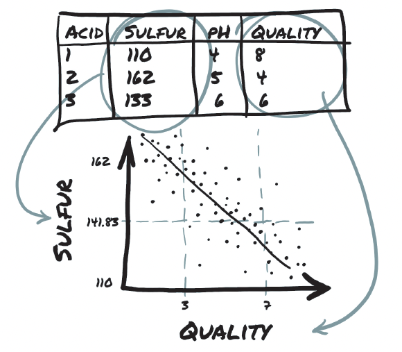
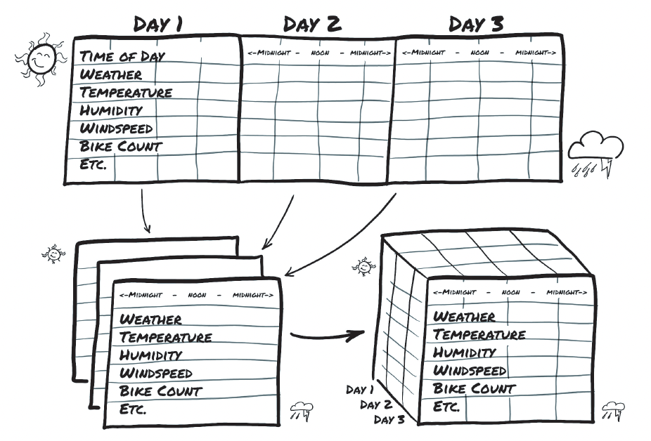
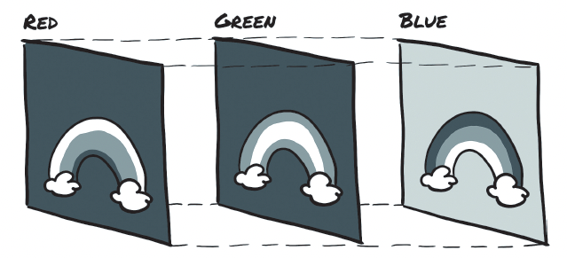
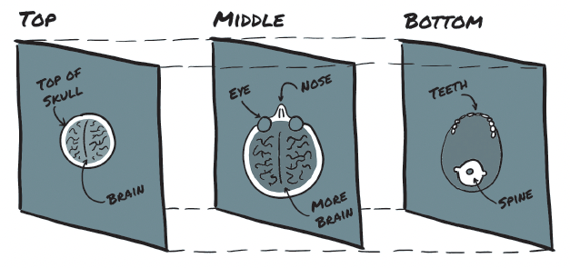

# Chapter 3. Real-world data representation with tensors

- In fact, all operations within a neural network and during optimization are operations between tensors, and all parameters (such as weights and biases) in a neural network are tensors.

- Having a good sense of how to perform operations on tensors and index them effectively is central to using tools like PyTorch successfully.

- how do you take a piece of data, a video, or text, and represent it with a tensor, and do that in a way that are appropriate for training a deep learning model.

- We start with tabular data of data about wines, as you would find in a spreadsheet. Next, we move to ordered tabular data, with a time-series data set from a bike-sharing program. After that, we show you how to work with text data from Jane Austen. Text data retains the ordered aspect but introduces the problem of representing words as arrays of numbers. Because a picture is worth a thousand words, we demonstrate how to work with image data. Finally, we dip into medical data with a 3D array that represents a volume containing patient anatomy.

## Tabular data

- tabular data typically isn’t homogeneous; different columns don’t have the same type. PyTorch tensors, on the other hand, are homogeneous. Other data science packages, such as Pandas, have the concept of the data frame, an object representing a dataset with named, heterogenous columns. By contrast, information in PyTorch is encoded as a number, typically floating-point (though integer types are supported as well). Numeric encoding is deliberate, because neural networks are mathematical entities that take real numbers as inputs and produce real numbers as output through successive application of matrix multiplications and nonlinear functions.

- Your first job as a deep learning practitioner, therefore, is to encode heterogenous, real-world data in a tensor of floating-point numbers, ready for consumption by a neural network.

- 

- wine quality example

- The two approaches have marked differences. Keeping wine-quality scores in an integer vector of scores induces an ordering of the scores, which may be appropriate in this case because a score of 1 is lower than a score of 4. It also induces some distance between scores. (The distance between 1 and 3 is the same as the distance between 2 and 4, for example.) If this holds for your quantity, great. If, on the other hand, scores are purely qualitative, such as color, one-hot encoding is a much better fit, as no implied ordering or distance is involved. One-hot encoding is appropriate for quantitative scores when fractional values between integer scores (such as 2.4) make no sense for the application (when score is either this or that).

- You can achieve one-hot encoding by using the scatter_ method. First, notice that its name ends with an underscore. This convention in PyTorch indicates that the method won’t return a new tensor but modify the tensor in place.

    ```python
    target_onehot = torch.zeros(target.shape[0], 10)
    target_onehot.scatter_(1, target.unsqueeze(1), 1.0)
    # Out[8]:
    tensor([[0., 0., ..., 0., 0.],
    [0., 0., ..., 0., 0.],
    ...,
    [0., 0., ..., 0., 0.],
    [0., 0., ..., 0., 0.]])
    ```

    - The dimension along which the following two arguments are specified
    - A column tensor indicating the indices of the elements to scatter
    - A tensor containing the elements to scatter or a single scalar to scatter (1, in this case)

- In other words, the preceding invocation reads this way: For each row, take the index of the target label (which coincides with the score in this case), and use it as the column index to set the value 1.0

- The second argument of scatter_, the index tensor, is required to have the same number of dimensions as the tensor you scatter into. Because target_onehot has two dimensions (4898x10), you need to add an extra dummy dimension to target by using unsqueeze:

```python
target_unsqueezed = target.unsqueeze(1)
target_unsqueezed

tensor([[6],
[6],
...,
[7],
[6]])
```

- The call to unsqueeze adds a singleton dimension, from a 1D tensor of 4898 elements to a 2D tensor of size (4898x1), without changing its contents. No elements were added; you decided to use an extra index to access the elements. That is, you accessed the first element of target as target[0] and the first element of its unsqueezed counterpart as target_unsqueezed[0,0]

- dim=0 indicates that the reduction is performed **_along dimension 0_**. At this point, you can normalize the data by subtracting the mean and dividing by the standard deviation, which helps with the learning process.

## Time Series

- data from a Washing ton, D.C., bike sharing system reporting the hourly count of rental bikes between 2011 and 2012 in the Capital bike-share system with the corresponding weather and seasonal information

- The goal is to take a flat 2D data set and transform it into a 3D one,

- 

- We want to change the row-per hour organization so that you have one axis that increases at a rate of one day per index increment and another axis that represents hour of day (independent of the date). The third axis is different columns of data (weather, temperature, and so on).

- In a time-series data set such as this one, rows represent successive time points: a dimension along which they are ordered. This existence of an ordering, however, gives you the opportunity to exploit causal relationships across time. You can predict bike rides at one time based on the fact that it was raining at an earlier time

- This neural network model needs to see sequences of values for each quantity, such as ride count, time of day, temperature, and weather conditions. so N parallel sequences of size C. C stands for channel, in neural network parlance, and is the same as column for 1D data like you have here. The N dimension represents the time axis here, one entry per hour.

- You may want to break up the 2-year data set in wider observation periods, such as days. This way, you’ll have N (for number of samples) collections of C sequences of length L. In other words, your time-series data set is a tensor of dimension 3 and shape N x C x L. The C remains your 17 channels, and L would be 24, one per hour of the day.

- Now reshape the data to have three axes (day, hour, and then your 17 columns)

```python
# In[4]:
daily_bikes = bikes.view(-1, 24, bikes.shape[1])
daily_bikes.shape, daily_bikes.stride()
# Out[4]:
(torch.Size([730, 24, 17]), (408, 17, 1))
```

- First, the bikes.shape[1] is 17, which is the number of columns in the bikes tensor. But the real crux of the code is the call to view, which is important: it changes the way that the tensor looks at the same data as contained in storage.

- Calling view on a tensor returns a new tensor that changes the number of dimensions and the striding information without changing the storage.

- Use the -1 as a placeholder for however many indexes are left, given the other dimensions and the original number of elements.

- Remember that Storage is a contiguous, linear container for numbers—floating point, in this case. Your bikes tensor has rows stored one after the other in corresponding storage, as confirmed by the output from the call to bikes.stride() earlier.

- In other words, you now have N sequences of L hours in a day for C channels. To get to your desired NxCxL ordering, you need to transpose the tensor:

```python
daily_bikes = daily_bikes.transpose(1,2)
daily_bikes.shape, daily_bikes.stride()
# Out[5]:
(torch.Size([730, 17, 24]), (408, 1, 17))
```

## Text

- Networks operate on text at two levels: at character level, by processing one character at a time, and at word level, in which individual words are the finest-grained entities seen by the network.

#### One hoting encoding

- Encoding: Every written character is represented by a code, a sequence of bits of appropriate length that allow each character to be uniquely identified.

- You could also make all characters lowercase to reduce the number of characters in your encoding. Similarly, you could screen out punctuation, numbers, and other characters that are not relevant to the expected kinds of text, which may or may not make a practical difference to your neural network, depending on the task at hand.

- Each character will be represented by a vector of length equal to the number of characters in the encoding. is vector will contain all zeros except for a 1 at the index corresponding to the location of the character in the encoding.

#### Text embeddings

- Well, instead of using vectors of many zeros and a single 1, you could use vectors of floating-point numbers. A vector of, say, 100 floating-point numbers can indeed represent a large number of words. The trick is to find an effective way to map individual words to this 100-dimensional space in a way that facilitates downstream learning. This technique is called embedding.

- An ideal solution would be to generate the embedding in such a way that words used in similar contexts map to nearby regions of the embedding.

## Image

- The introduction of convolutional neural networks revolutionized computer vision

- An image is represented as a collection of scalars arranged in a regular grid, having a height and a width (in pixels). You might have a single scalar per grid point (the pixel), which would be represented as a grayscale image, or multiple scalars per grid point, which typically represent different colors or different features, such as depth from a depth camera.

- You have several ways of encoding numbers into colors. The most common is RGB, which defines a color with three numbers that represent the intensity of red, green and blue.

- 

- At this point, img is a NumPy array-like object with three dimensions: two spatial dimensions (width and height) and a third dimension corresponding to the channels red, green, and blue.

- The only thing to watch out for is the layout of dimensions. PyTorch modules that deal with image data require tensors to be laid out as C x H x W (channels, height, and width, respectively).

- to create a data set of multiple images to use as an input for your neural networks, you store the images in a batch along the first dimension to obtain a tensor. N x C x H x W

```python

batch_size = 4
batch = torch.zeros(4, 3, 1080, 1920, dtype = torch.uint8)

import os
data_dir = "data/cats/"
filenames = [name for name in os.listdir(data_dir) if os.path.splitext(name)[-1] == '.jpg']

for i, filename in enumerate(filenames):
    img_arr = imageio.imread(data_dir + filename)
    batch[i] = torch.transpose(torch.from_numpy(img_arr), 0, 2)

```

- neural networks exhibit the best training performance when input data ranges from roughly 0 to 1 or 1 to 1 (an effect of how their building blocks are defined)

- Casting to floating-point is easy, but normalization is trickier, as it depends on what range of the input you decide should lie between 0 and 1 (or –1 and 1). One possibility is to divide the values of pixels by 255 (the maximum representable number in 8-bit unsigned):

```python
batch = batch.float()
batch /= 255
```

- Another possibility is to compute mean and standard deviation of the input data and scale it so that the output has zero mean and unit standard deviation across each channel:

```python
n_channels = batch.shape[1]
for c in range(n_channels):
    mean = torch.mean(batch[:, c])
    std = torch.std(batch[:, c])
    batch[:, c] = (batch[:, c] - mean)/std
```

## Volumetric data

- In contexts such as medical imaging applications involving, say, CT (Computed Tomography) scans, you typically deal with sequences of images stacked along the head-to-feet direction, each corresponding to a slice across the body.

- By stacking individual 2D slices into a 3D tensor, you can build volumetric data representing the 3D anatomy of a subject.

- 

- it suffices to say that no fundamental difference exists between a tensor that stores volumetric data and one that stores image data. You have an extra dimension, depth, after the channel dimension, leading to a 5D tensor of shape N x C x D x H x W.

```python
import imageio

dir_path = "../data/p1ch4/volumetric-dicom/2-LUNG 3.0 B70f-04083"
vol_arr = imageio.volread(dir_path, "DICOM")
vol_arr.shape

# Out[2]:
(99, 512, 512)

# due to the lack of channel information. You’ll have to make room for the channel dimension by using unsqueeze:

vol = torch.from_numpy(vol_arr)
vol = torch.transpose(vol, 0, 2)
vol = torch.unsqueeze(vol, 0)

vol.shape
# Out[3]:
torch.Size([1, 512, 512, 99])
```

## Summary

- Neural networks require data to be represented as multidimensional numerical tensors, often 32-bit floating-point.

- Thanks to how the PyTorch libraries interact with the Python standard library and surrounding ecosystem, loading the most common types of data and converting them to PyTorch tensors is convenient.

- In general, PyTorch expects data to be laid out along specific dimensions, according to the model architecture (such as convolutional versus recurrent). Data reshaping can be achieved effectively with the PyTorch tensor API.

- Spreadsheets can be straightforward to convert to tensors. Categorical- and ordinal- valued columns should be handled differently from interval-valued columns.

- Text or categorical data can be encoded to a one-hot representation through the use of dictionaries.

- Images can have one or many channels. The most common are the red, green, and blue channels of typical digital photos.

- Single-channel data formats sometimes omit an explicit channel dimension.

- Volumetric data is similar to 2D image data, with the exception of adding a third dimension: depth.

- Many images have a per-channel bit depth of 8, though 12 and 16 bits per channel are not uncommon. These bit-depths can be stored in a 32-bit floating-point number without loss of precision.