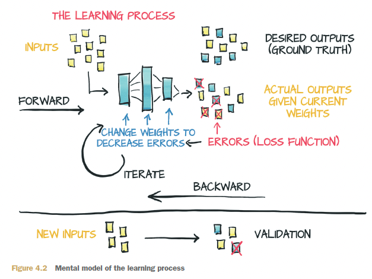
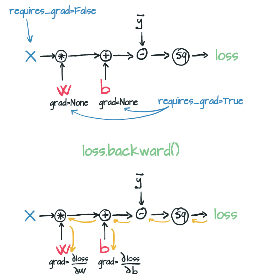
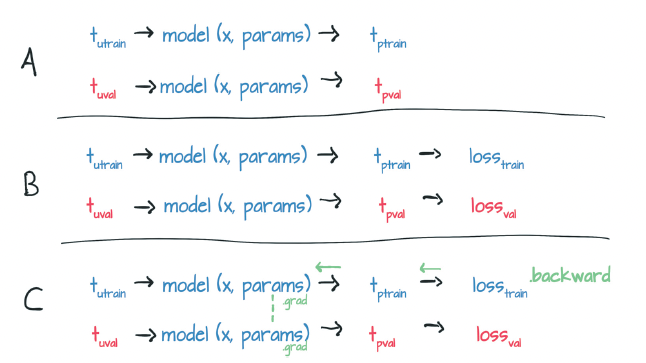

# Chapter 4: The mechanics of learning

- learning from data: The process always involves a function with unknown parameters whose values are estimated from datain short, a model.

- In particular, PyTorch is designed to make it easy to create models for which the derivatives of the fitting error, with respect to the parameters, can be expressed analytically

## Learning is parameter estimation

- Given input data and the corresponding desired outputs (ground truth), as well as initial values for the weights, the model is fed input data (forward pass), and a measure of the error is evaluated by comparing the resulting outputs with the ground truth. To optimize the parameter of the model, its weightsthe change in the error following a unit change in weights (the gradient of the error with respect to the parameters)is computed by using the chain rule for the derivative of a composite function (backward pass). Then the value of the weights is updated in the direction that leads to a decrease in the error. The procedure is repeated until the error, evaluated on unseen data, falls below an acceptable level.

- 

- Your optimization process, therefore, should aim at finding w and b so that the loss function is at a minimum level.

- A loss function (or cost function) is a function that computes a single numerical value that the learning process attempts to minimize.

- The calculation of loss typically involves taking the difference between the desired outputs for some training samples and those produced by the model when fed those samples

- Gradient descent is not too different. The idea is to compute the rate of change of the loss with respect to each parameter and apply a change to each parameter in the direction of decreasing loss.

- In a model with two or more parameters, you compute the individual derivatives of the loss with respect to each parameter and put them in a vector of derivatives: the gradient.

- you can apply the chain rule and compute the derivative of the loss with respect to its input (which is the output of the model) times the derivative of the model with respect to the parameter:

    - d loss_fn / d w = (d loss_fn / d t_p) * (d t_p / d w)

- A training iteration during which you update the parameters for all your training samples is called an epoch.


## PyTorch’s autograd: Backpropagate all things

- This situation is where PyTorch tensors come to the rescue, with a PyTorch component called autograd. PyTorch tensors can remember where they come from in terms of the operations and parent tensors that originated them, and they can provide the chain of derivatives of such operations with respect to their inputs automatically. You will not need to derive your model by hand;

```python
params = torch.tensor([1.0, 0.0], requires_grad = True)
```

-  Notice the requires_grad=True argument to the tensor constructor? That argument is telling PyTorch to track the entire family tree of tensors resulting from operations on params.

- the grad attribute of params contains the derivatives of the loss with respect to each element of params

- PyTorch would compute derivatives of the loss throughout the chain of functions (the computation graph) and accumulate their values in the grad attribute of those tensors (the leaf nodes of the graph).

- 

- Calling backward leads derivatives to accumulate at leaf nodes. You need to zero the gradient explicitly after using it for parameter updates.

```python
def training_loop(n_epochs, learning_rate, params, t_u, t_c):
    for epoch in range(1, n_epochs + 1):
        if params.grad is not None:
            params.grad.zero_()
        t_p = model(t_u, *params)
        loss = loss_fn(t_p, t_c)
        loss.backward()
        params = (params - learning_rate *
        params.grad).detach().requires_grad_()
        if epoch % 500 == 0:
            print('Epoch %d, Loss %f' % (epoch, float(loss)))
    return params

```

- Notice that when you updated params, you also did an odd .detach().requires_grad_() dance. To understand why, think about the computation graph that you’ve built. Reformulate your params update line a little so that you’re not reusing variable names: p1 = (p0 * lr * p0.grad) Here, p0 is the random weights with which you initialized the model. p0.grad is computed from a combination of p0 and your training data via the loss function.

- So far, so good. Now you need to look at the second iteration of the loop: p2 = (p1* lr * p1.grad). As you’ve seen, the computation graph for p1 goes back to p0, which is problematic because (a) you have to keep p0 in memory (until you’re done with training), and (b) it confuses the matter of where you should be assigning error via backpropagation.

- Instead, detach the new tensor from the computation graph associated
params with its update expression by calling .detatch(). This way, params effectively loses the memory of the operations that generated it. Then you can reenable tracking by calling .requires_grad_(), an in_place operation (see the trailing _) that reactivates autograd for the tensor.

#### Training, validation, and overfitting

- So here is rule one: if the training loss is not decreasing, chances are that the model is too simple for the data. The other possibility is that your data does not contain meaningful information for it to explain the output.

- Here is rule two: if the training loss and the validation loss
diverge, you are overfitting

    - First, you should make sure that you get enough data for the process.

    - Assuming that you have enough data points, you should make sure that the model that is capable of fitting the training data is as regular as possible between the data points. One way is to add so-called penalization terms to the loss function to make it cheaper for the model to behave more smoothly and change more slowly (up to a point). Another way is to add noise to the input samples, to artificially create new data points between training data samples and force the model to try to fit them too.

    - But the best favor you can do for yourself, at least as a first move, is to make your model simpler. From an intuitive standpoint, a simpler model may not fit the training data as perfectly as a more complicated model would do, but it will likely behave more regularly between data points

- Therefore, the process for choosing the right size of a neural network model, in terms of parameters, is based on two steps: increase the size until it fits and then scale it down until it stops overfitting.

#### Nits in autograd and switching it off

- From the training loop, you can appreciate that you only ever call backward on the train_loss. Therefore, errors only ever backpropagate based on the training set. The validation set is used to provide an independent evaluation of the accuracy of the model's output on data that was not used for training.

- The curious reader will have an embryo of a question at this point. The model is evaluated twice—once on train_t_u and then on val_t_u—after which backward is called. Won’t this confuse the hell out of autograd? Won’t backward be influenced by the values generated during the pass on the validation set?

- Luckily, this isn’t the case. The first line in the training loop evaluates model on train_t_u to produce train_t_p. Then train_loss is evaluated from train_t_p, creating a computation graph that links train_t_u to train_t_p to train_loss. When model is evaluated again on val_t_u, it produces val_t_p and val_loss. In this case, a separate computation graph is created that links val_t_u to val_t_p to val_loss. Separate tensors have been run through the same functions, model and loss_fn, generating separate computation graphs.

- 

- The only tensors that these two graphs have in common are the parameters. When you call backward on train_loss, you run the backward on the first graph. In other words, you accumulate the derivatives of the train_loss with respect to the parameters based on the computation generated from train_t_u.

- Here’s another element for discussion: because you’re never calling backward on val_loss, why are you building the graph in the first place? You could in fact call model and loss_fn as plain functions without tracking history. However optimized, tracking history comes with additional costs that you could forgo during the validation pass, especially when the model has millions of parameters. To address this situation, PyTorch allows you to switch off autograd when you don’t need it by using the torch.no_grad context manager.

```python
def training_loop(n_epochs, optimizer, params, train_t_u, val_t_u, train_t_c, val_t_c):
    for epoch in range(1, n_epochs+1):
        train_t_p = model(train_t_u, *params)
        train_loss = loss_fn(train_t_p, train_t_c)
        
        with torch.no_grad():
            val_t_p = model(val_t_u, *params)
            val_loss = loss_fn(val_t_p, val_t_c)
            assert val_loss.requires_grad == False
        
        optimizer.zero_grad()
        train_loss.backward()
        optimizer.step()
```

- Using the related set_grad_enabled context, you can also condition code to run with autograd enabled or disabled

```python
def calc_forward(t_u, t_c, is_train):
    with torch.set_grad_enabled(is_train): 
        t_p = model(t_u, *params)
        loss = loss_fn(t_p, t_c)
    return loss
```

## Summary

- Linear models are the simplest reasonable model to use to fit data.

- Convex optimization techniques can be used for linear models, but they don’t generalize to neural networks, so this chapter focuses on parameter estimation.

- Deep learning can be used for generic models that aren’t engineered to solve a specific task but can be adapted automatically to specialize in the problem at hand.

- Learning algorithms amount to optimizing parameters of models based on observations. Loss function is a measure of the error in carrying out a task, such as the error between predicted outputs and measured values. The goal is to get loss function as low as possible.

- The rate of change of the loss function with respect to model parameters can be used to update the same parameters in the direction of decreasing loss.

-  The optim module in PyTorch provides a collection of ready-to-use optimizers for updating parameters and minimizing loss functions.

- Optimizers use the autograd feature of PyTorch to compute the gradient for each parameter, depending on how that parameter contributed to the final output. This feature allows users to rely on the dynamic computation graph during complex forward passes.

- Context managers such as with torch.no_grad(): can be used to control autograd behavior.

- Data is often split into separate sets of training samples and validation samples, allowing a model to be evaluated on data it wasn’t trained on.

- Overfitting a model happens when the model’s performance continues to improve on the training set but degrades on the validation set. This situation usually occurs when the model doesn’t generalize and instead memorizes the desired outputs for the training set.