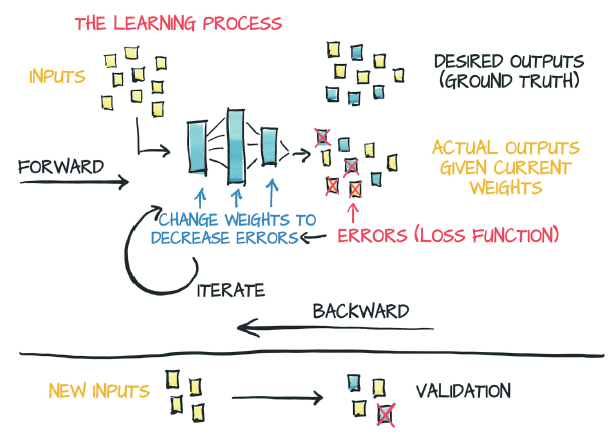
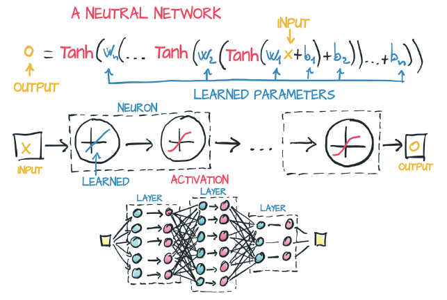
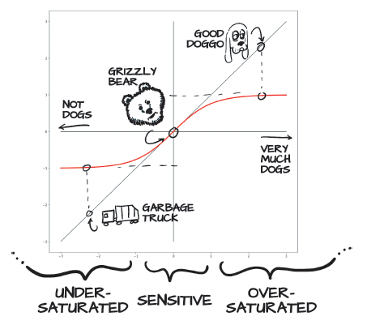
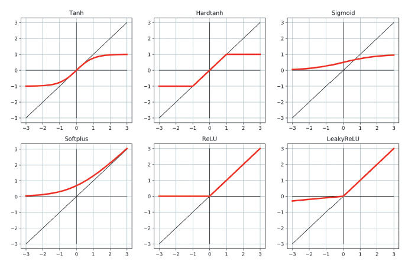

# Chapter 5: Using a neural network to fit your data

- 

## Artificial neurons

- At the core of deep learning are neural networks, mathematical entities capable of representing complicated functions through a composition of simpler functions

- The basic building block of these complicated functions is the neuron。 At its core, a neuron is nothing but a linear transformation of the input (such as multiplication of the input by a number [the weight] and the addition of a constant [the bias]) followed by the application of a fixed nonlinear function (referred to as the activation function).

- 

- Mathematically, you can write this as o = f(w * x + b), with x as the input, w as the weight or scaling factor, and b as the bias or offset. f is the activation function, set to the hyperbolic tangent or tanh function here

- In general, x and hence o can be simple scalars, or vector-valued (holding many scalar values). Similarly, w can be a single scalar, or a matrix, whereas b is a scalar or vector (the dimensionality of the inputs and weights must match, however). In the latter case, the expression is referred to as a layer of neurons because it represents many neurons via the multidimensional weights and biases.

- A multilayer neural network, as represented in figure 5.3, is a composition of the preceding functions:

    - x_1 = f(w_0 * x + b_0)
    - x_2 = f(w_1 * x_1 + b_1)
    - ...
    - y = f(w_n * x_n + b_n)

- where the output of a layer of neurons is used as an input for the following layer. Remember that w_0 here is a matrix, and x is a vector! Using a vector here allows w_0 to hold an entire layer of neurons, not just a single weight



- An important difference between the earlier linear model and what you’ll be using for deep learning is the shape of the error function. The linear model and error-squared loss function had a convex error curve with a singular, clearly defined minimum

- Neural networks don’t have that same property of a convex error surface, even when using the same error-squared loss function. There’s no single right answer for each parameter that you’re attempting to approximate. Instead, you’re trying to get all the parameters, when acting in concert, to produce useful output. Since that useful output is only going to approximate the truth, there will be some level of imperfection.

- A big part of the reason why neural networks have nonconvex error surfaces is due to the activation function.

#### All you need is activation

- The simplest unit in (deep) neural networks is a linear operation (scaling + offset) followed by an activation function. You had a linear operation in your latest model; the linear operation was the entire model. The activation function has the role of concentrating the outputs of the preceding linear operation into a given range.

- Because you’ve got the entire range of float32 to work with, you can go pretty high. Even if you say “It’s a ten point scale,” sometimes your model is going to produce a score of 11 out of 10. Remember that under the hood, it’s all sum of w*x+b matrix multiplications, which won’t naturally limit themselves to a specific range of outputs.

- What you want to do is firmly constrain the output of your linear operation to a specific range so that the consumer of this output isn’t having to handle numerical inputs of puppies at 12/10, bears at -10, and garbage trucks at -1000.

- One possibility is to cap the output values. Anything below zero is set to zero, and anything above 10 is set to 10. You use a simple activation function called torch.nn.Hardtanh.

- Another family of functions that works well is torch.nn.Sigmoid, which is 1 / (1+ e ** -x), torch.tanh, and others that you’ll see in a moment. These functions have a curve that asymptotically approaches zero or negative one as x goes to negative infinity, approaches one as x increases, and has a mostly constant slope at x == 0.Conceptually, functions shaped this way work well, because it means that your neuron (which, again, is a linear function followed by an activation) will be sensitive to an area in the middle of your linear function’s output

- 

```python
>>> import math
>>> math.tanh(-2.2)
-0.9757431300314515
>>> math.tanh(0.1)
0.09966799462495582
>>> math.tanh(2.5)
0.9866142981514303
```
- With the bear in the sensitive range, small changes to the bear result in a noticeable change in the result

- 

- ReLU (Rectified Linear Unit) deserves special note, as it is currently considered to be one of the best-performing general activation functions, as many state-of-the-art results have used it.

- Finally, the LeakyReLU function modifies the standard ReLU to have a small positive slope rather than being strictly zero for negative inputs. (Typically, this slope is 0.01)

- by definition, activation functions
    
    - Are nonlinear: Repeated applications of w*x+b without an activation function results in a polynomial. The nonlinearity allows the overall network to approximate more complex functions.

    - Are differentiable: They’re differentiable so that gradients can be computed through them. Point discontinuities, as you see in Hardtanh or ReLU, are fine. 

    - Have at least one sensitive range, where no-trivial changes to the input result in a corresponding nontrivial change in the output.
    - Have at least one insensitive (or saturated) range, where changes to the input result in little to no change in the output.
    
- Without those functions, the network either falls back to being a complicated polynomial or becomes difficult to train.

- Often (but far from universally so), the activation function has at least one of the following:
    - A lower bound that is approached (or met) as the input goes to negative infinity
    - A similar-but-inverse upper bound for positive infinity

- Thinking about what you know about how backpropagation works, you can figure out that the errors will propagate backward through the activation more effectively when the inputs are in the response range, whereas errors won’t greatly affect neurons for which the input is saturated (because the gradient will be close to zero due to the flat area around the output).

- deep neural networks allow you to approximate highly nonlinear phenomena without having an explicit model for them. Instead, starting from a generic, untrained model, you specialize it on a task by providing it a set of inputs and outputs and a loss function to backpropagate from. Specializing a generic model to a task by using examples is what we refer to as learning, because the model was not built with that specific task in mind; no rules describing how that task worked were encoded in the model.

- Deep neural networks, at the other end, are families of functions that can approximate a wide range of input/output relationships without necessarily requiring one to come up with an explanatory model of a phenomenon. In a way, you’re renouncing an explanation in exchange for the possibility of tackling increasingly complicated problems.

## The PyTorch nn module

- PyTorch has a whole submodule dedicated to neural networks: torch.
nn. This submodule contains the building blocks needed to create all sorts of neural network

- A PyTorch module is a Python class deriving from the nn.Module base class. A Module can have one or more Parameter instances as attributes, which are tensors whose values are optimized during the training process. A Module can also have one or more submodules (subclasses of nn.Module) as attributes, and it can track their Parameters as well.

- Any module in nn is written to produce outputs for a batch of multiple inputs at the same time. Thus, assuming that you need to run nn.Linear on 10 samples, you can create an input tensor of size B x Nin, where B is the size of the batch and Nin is the number of input features, and run it once through the model. the output is a tensor of size B x Nout, where Nout is the number of output features.

- The reason we want to do this batching is multi-faceted. GPUs in particular are highly parallelized, so a single input on a small model will leave most of the computing units idle. Another benefit is that some advanced models will use statistical information from the entire batch, and those statistics get better with larger batch sizes

```python
def training_loop(n_epochs, optimizer, model, loss_fn, t_u_train, t_u_val, t_c_train, t_c_val):
    for epoch in range(1, n_epochs+1):
        t_p_train = model(t_u_train)
        loss_train = loss_fn(t_p_train, t_c_train)
        
        t_p_val = model(t_u_val)
        loss_val = loss_fn(t_p_val, t_c_val)
        
        optimizer.zero_grad()
        loss_train.backward()
        optimizer.step()
        
        if epoch == 1 or epoch % 1000 == 0:
            print(f"epoch {epoch}, training loss {loss_train.item():.4f},"
                 f"validation loss {loss_val.item():.4f}")
```

- When optimizer.step() is called, it iterates through each Parameter and changes it by an amount proportional to what is stored in its grad attribute.

- The training loop has not changed practically except that now you do not pass params explicitly to model because the model itself holds its Parameters internally.

- You can use one last bit from torch.nn: the loss. Indeed, nn comes with several common loss functions, among which nn.MSELoss

```python
linear_model = nn.Linear(1, 1)
optimizer = optim.SGD(linear_model.parameters(), lr = 1e-2)

training_loop(
    n_epochs = 3000,
    optimizer = optimizer,
    model = linear_model,
    loss_fn = nn.MSELoss(),
    t_u_train = t_un_train,
    t_u_val = t_un_val,
    t_c_train = t_c_train,
    t_c_val = t_c_val
)
```

- nn provides a simple way to concatenate modules through the container nn.Sequential

```python
seq_model = nn.Sequential(
    nn.Linear(1, 13),
    nn.Tanh(),
    nn.Linear(13, 1)
)
```

- The model fans out from 1 input feature to 13 hidden features, passes them through a tanh activation, and linearly combines the resulting 13 numbers into 1 output feature.

```python
# In[17]:
[param.shape for param in seq_model.parameters()]
# Out[17]:
[torch.Size([13, 1]), torch.Size([13]), torch.Size([1, 13]), torch.Size([1])]
```

- Again, after model.backward() is called, all parameters are populated with their grad, and then the optimizer updates their values accordingly during the optimizer.step() call

```python
for name, param in seq_model.named_parameters():
    print(name, param.shape)
# Out[18]:
0.weight torch.Size([13, 1])
0.bias torch.Size([13])
2.weight torch.Size([1, 13])
2.bias torch.Size([1])
```

- Interestingly, Sequential also accepts an OrderedDict in which you can name each module passed to Sequential:

```python
# In[19]:
from collections import OrderedDict
seq_model = nn.Sequential(OrderedDict([
('hidden_linear', nn.Linear(1, 8)),
('hidden_activation', nn.Tanh()),
('output_linear', nn.Linear(8, 1))
]))
seq_model
# Out[19]:
Sequential(
(hidden_linear): Linear(in_features=1, out_features=8, bias=True)
(hidden_activation): Tanh()
(output_linear): Linear(in_features=8, out_features=1, bias=True)
)

# In[20]:
for name, param in seq_model.named_parameters():
    print(name, param.shape)
# Out[20]:
hidden_linear.weight torch.Size([8, 1])
hidden_linear.bias torch.Size([8])
output_linear.weight torch.Size([1, 8])
output_linear.bias torch.Size([1])

# In[21]:
seq_model.output_linear.bias
# Out[21]:
Parameter containing:
tensor([-0.2194], requires_grad=True)
```

## Subclassing nn.Module

- For larger and more complex projects, you need to leave nn.Sequential behind in favor of something that gives you more flexibility: subclassing nn.Module. 

```python 
class SubclassModel(nn.Module):
    def __init__(self):
        super().__init__()
        self.hidden_linear = nn.Linear(1, 13)
        self.hidden_activation = nn.Tanh()
        self.output_linear = nn.Linear(13, 1)
    
    def forward(self,input):
        hidden_t = self.hidden_linear(input)
        activated_t = self.hidden_activation(hidden_t)
        output_t = self.output_linear(activated_t)
        return output_t

subclass_model = SubclassModel()
subclass_model
# Out[4]:
SubclassModel(
(hidden_linear): Linear(in_features=1, out_features=13, bias=True)
(hidden_activation): Tanh()
(output_linear): Linear(in_features=13, out_features=1, bias=True)
)
```

- This code ends up being somewhat more verbose, because you have to define the layers you want to have and then define how and in what order they should be applied in the function. That repetition grants you an incredible amount of flexibility in the forward sequential models, however, as you are now free to do all sorts of interesting things inside the forward function

- PyTorch has functional counterparts of every nn module. By functional, we mean having no internal stateor whose output value is solely and fully determined by the value input arguments.

```python
class SubclassFunctionalModel(nn.Module):
    def __init__(self):
        super().__init__()
        
        self.hidden_linear = nn.Linear(1, 14)  
                                                # <1>
        self.output_linear = nn.Linear(14, 1)
        
    def forward(self, input):
        hidden_t = self.hidden_linear(input)
        activated_t = torch.tanh(hidden_t) # <2>
        output_t = self.output_linear(activated_t)
        
        return output_t
    
func_model = SubclassFunctionalModel()
func_model
```